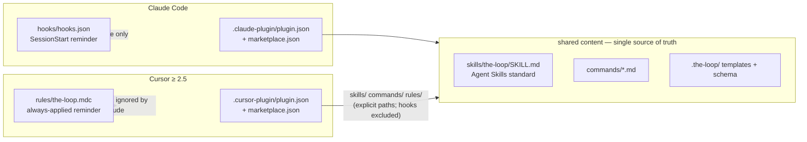

# Design: the-loop should be compatible with Cursor

> Phase 2 of 3. Derives from the approved requirements in `requirements.md`.

## Overview

Research (R1) found that Cursor 2.4/2.5 (early 2026) ships a plugin system that mirrors
Claude Code's: a `.cursor-plugin/plugin.json` manifest, a repo-root
`.cursor-plugin/marketplace.json`, and auto-discovered component directories —
`skills/` (Agent Skills open standard, the same `SKILL.md` format Claude Code uses),
`commands/` (markdown slash commands), `rules/` (`.mdc`), `agents/`, `hooks/hooks.json`
and MCP. the-loop's repo layout already matches those defaults, so Cursor support is
two thin manifests plus one Cursor-native replacement for the Claude-format hook.
Recorded as `decision-015`.

## Architecture

## Components & interfaces

- `.cursor-plugin/plugin.json` — Cursor manifest mirroring the Claude one; points
  explicitly at `./skills/`, `./commands/`, `./rules/`. **Deliberately omits `hooks`**
  so Cursor never parses the Claude-format `hooks/hooks.json`.
- `.cursor-plugin/marketplace.json` — root marketplace manifest (single plugin,
  `source: "./"`), mirroring `.claude-plugin/marketplace.json`.
- `rules/the-loop.mdc` — always-applied Cursor rule carrying the SessionStart
  reminder, self-guarded on the existence of `.the-loop/config.yaml` (R3). Claude Code
  plugins do not read `rules/`, so nothing duplicates for Claude users.
- `commands/*.md` — shared verbatim; prose referencing `${CLAUDE_PLUGIN_ROOT}` gains a
  parenthetical that it means the installed plugin's root in either harness.
- Docs: README install/layout, skill + `reference/automation.md` +
  `reference/workflow.md`, `docs/architecture/architecture.md`, `docs/roadmap.md`,
  `decision-015` (R4).
- CI: the two new JSON manifests join the parse-validation list in `ci.yml`.

## Data models

Manifest fields follow the observed Cursor spec (official `cursor/plugins` repo):
`name` (kebab-case, required), `displayName`, `version`, `description`, `author`,
`homepage`, `repository`, `license`, `category`, `keywords`, plus component path keys.

## Error handling

If a Cursor version predates plugins (< 2.5), the manifests are inert files; nothing
breaks. If Cursor were to auto-discover `hooks/hooks.json` anyway, the unknown
`SessionStart` event is ignored — degraded (no reminder) but not broken; the rule still
delivers the reminder.

## Testing strategy

No Cursor runtime exists in CI, so verification is structural: CI parses both
`.cursor-plugin/*.json` manifests; markdownlint covers the new/edited markdown; the
existing gates (ruff, pyright, pytest, schema validation) confirm no regression.
Behavioural verification in a live Cursor install is out of scope (R-out-of-scope) and
falls to dogfooding.

## Trade-offs & decisions

Same-repo dual manifests over a fork; shared `commands/` over skills-as-commands; an
always-applied rule over a ported hook. Rationale and alternatives in
`docs/decisions/decision-015.md`.

## Open questions

- Whether to ship Cursor-format hooks (e.g. `beforeShellExecution` running the
  configured quality gates) and `agents/` critic personas as Cursor-only surface.
  Deferred to the roadmap.
