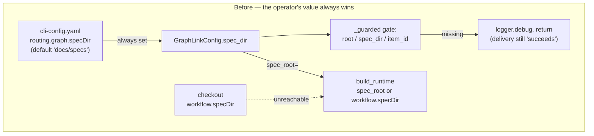
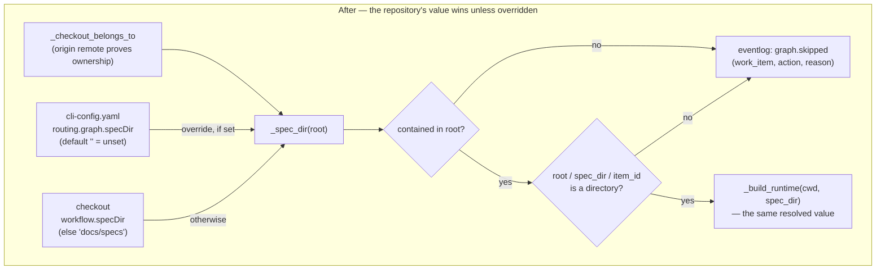

# Design: the checkout declares where its specs are; the CLI key becomes an override

> Phase 2 of 3 (requirements → design → tasks). Derived from the approved
> `requirements.md`. MUST be reviewed/approved before the tasks breakdown.

## Architecture

The fix is a **default change plus a reordering**, not a new mechanism. `build_runtime`
already has the correct fall-through (`spec_root or workflow.get("specDir", …)`); it is
unreachable only because `GraphLinkConfig` guarantees a non-empty `spec_root`. Making the
CLI key genuinely optional makes the existing code do the right thing.





## Components and interfaces

### C1. `GraphLinkConfig.spec_dir` defaults to unset

```python
@dataclass
class GraphLinkConfig:
    enabled: bool = True
    spec_dir: str = ""          # was: "docs/specs"

    @classmethod
    def from_mapping(cls, data):
        data = data or {}
        return cls(
            enabled=bool(data.get("enabled", True)),
            spec_dir=str(data.get("specDir") or ""),   # was: str(data.get("specDir", "docs/specs"))
        )
```

`or ""` rather than `.get("specDir", "")` so an explicit `specDir: null` (or `""`) reads
as "unset" instead of as the string `"None"`. Empty means *the repository decides*; a
non-empty value is the operator overriding every watched repository on purpose (R1.3).

### C2. `GraphLink._spec_dir(root)` — one resolution, used twice

```python
def _spec_dir(self, root: Path) -> str:
    """Where this work item's specs live: the repository's answer, unless overridden."""
    return self.config.spec_dir or harness_config.spec_dir(harness_config.load(root))
```

It returns the declared value **whether or not it is usable** — containment (C4) is a
separate gate in `_guarded`, not folded in here — so a refused value can still be named in
the warning and in the `graph.skipped` record. A refusal whose value the operator cannot
see is a refusal they cannot fix.

`_guarded` calls it **once** and threads the result into both the gate and
`_build_runtime` (R2.1), so the two cannot drift:

```python
spec_dir = self._spec_dir(root)
if not _is_contained(root, spec_dir): ...refuse (R4.3)...
if not (root / spec_dir / item_id).is_dir(): ...skip...
call(self._build_runtime(str(root), spec_dir), item_id)
```

`_build_runtime` gains the parameter and passes it as `spec_root=`, which is now always
the already-resolved value rather than a raw CLI default:

```python
def _build_runtime(self, cwd: str, spec_dir: str) -> Any:
    return build_runtime(Path(cwd), spec_root=spec_dir, authorized_users=self.authorized_users)
```

### C3. `harness_config.spec_dir(harness)` — the default expressed once

`bootstrap.build_runtime` and `graphlink` must agree on what an absent `workflow.specDir`
means. Rather than two copies of `workflow.get("specDir", "docs/specs")`, the shared
reader — already the single place the harness config is read (decision-044) — gains:

```python
DEFAULT_SPEC_DIR = "docs/specs"

def spec_dir(harness: Mapping[str, Any]) -> str:
    """``workflow.specDir`` from an already-loaded harness config, or the default."""
    workflow = harness.get("workflow") or {}
    return str(workflow.get("specDir") or DEFAULT_SPEC_DIR)
```

It takes an already-loaded mapping rather than a root, so `build_runtime` — which has
already loaded the config for `phaseLabelPrefix` and `notifications` — does not read the
file twice. This adds no key to `harness_config.READS`: `workflow.specDir` is already
declared there, read by "check, graph, and the daemon via graphlink". The declaration was
accurate about the *intent*; this change makes it accurate about the *behaviour*.

`build_runtime`'s docstring is corrected too. Its current justification for the override —
"the daemon has already parsed its own CLI config, so re-reading the default path could
disagree" — is true of `authorized_users` and false of `spec_root`, and stating one reason
for two parameters of different provenance is what let the defect in. The two are
documented separately.

### C4. Containment (`_is_contained`)

```python
def _is_contained(root: Path, spec_dir: str) -> bool:
    """Whether ``root / spec_dir`` stays inside ``root``."""
    candidate = Path(spec_dir)
    if candidate.is_absolute():
        return False
    try:
        resolved = (root / candidate).resolve()
    except OSError:
        return False
    return resolved == root.resolve() or root.resolve() in resolved.parents
```

Written with `resolve()` + `parents` rather than `Path.is_relative_to` because the CLI
supports Python 3.9 (`is_relative_to` exists there, but is deprecated-adjacent in the
`PurePath` API and reads less obviously as a *filesystem* containment check after symlink
resolution). Fails closed on an `OSError` — an unresolvable path is not a contained one.

Deliberately **daemon-path only**. `the-loop check` and `the-loop graph` resolve the same
key from the same file and are not changed: they run inside the repository at the user's
own invocation, where the value is already the user's own. The daemon is the one caller
that reads a repository it does not own.

### C5. Ordering: prove ownership before reading the checkout

`_guarded`'s gates are reordered so `_checkout_belongs_to` runs **before** anything reads
the checkout's harness config (R4.1) — the invariant `harness_config.py`'s docstring
already states ("only after `_checkout_belongs_to` has proved … that the directory really
is that repository's") and which resolving `specDir` from the checkout would otherwise
break.

| # | Gate | Before | After |
|---|---|---|---|
| 1 | `config.enabled` | ✓ | ✓ |
| 2 | `spec_id_for` | ✓ | ✓ |
| 3 | `_awaiting_start` | ✓ | ✓ |
| 4 | `_checkout_belongs_to` | 5th | **4th** |
| 5 | spec directory exists | 4th | **5th** |

No skip decision changes as a result: both gates are pure predicates over disjoint inputs,
so the *set* of skipped work items is identical — only which reason is reported when both
would fire, and the foreign-checkout reason is the more important of the two. The
foreign-checkout warning loses its `spec_dir` interpolation, which it can no longer know
at that point and which was never the useful part of the message.

The one real cost: `_checkout_belongs_to` spawns `git config --get remote.origin.url`, and
it now runs for a work item whose spec directory is absent, where the cheap `is_dir()`
used to short-circuit it. Accepted — it is one subprocess per *delivery* (already gated
behind `_awaiting_start`, which drops the common noise), on a path that is about to spawn
or resume a whole harness session, and the alternative is reading a checkout the daemon
has not proved is the work item's.

### C6. `graph.skipped` — the skip becomes an event-log record

```python
eventlog.emit(
    "graph.skipped",
    work_item=work_item.ref,
    action=action,          # "start" | "advance"
    reason=reason,          # "no-spec-dir" | "spec-dir-outside-checkout"
    spec_dir=spec_dir,
)
```

registered in `EVENT_TYPES` (a unit test already fails a build that emits an unregistered
type) at the default `info` level, so `the-loop events` shows it without a flag.

Only these two reasons emit. The other skip paths deliberately do not:

| Skip | Why no record |
|---|---|
| `graph.enabled: false` | the operator turned the whole coupling off; a record per delivery says nothing they do not know |
| non-GitHub ref | not a work item the graph can name at all |
| `_awaiting_start` | already recorded by the dispatcher as `dispatch.dropped` with `reason: awaiting-start` |
| foreign checkout | already a `logger.warning` — visible at default log level, unlike the `debug` this work item is about |

`logger.debug` is kept alongside the record for the local daemon log; the event record is
the addition, not a replacement, and it is what R3.1 is about.

## Data models

No new persisted state. `GraphState` still lands at `<resolved spec dir>/<id>/graph-state.json`
— the point of R2.2 is that "resolved" now means the same thing to the gate and the
runtime.

## Error handling

Unchanged and best-effort throughout. `_spec_dir` reads through `harness_config.load`,
which already degrades a missing/unparseable/non-mapping file to `{}` — so a repository
mid-edit falls back to `docs/specs` rather than raising. Everything inside `_guarded`'s
`try` still swallows to `graph.link_failed`. The new resolution runs *outside* that try,
so it must not raise: `load` cannot, `spec_dir` cannot (both are total functions over
`dict`), and `_is_contained` catches `OSError`.

## Testing strategy

Extending `cli/tests/test_graphlink.py` (unit) and `cli/tests/test_graphlink_integration.py`
(end-to-end, Gherkin docstrings per `testing.gherkinDocstrings`).

| Test | Asserts | AC |
|---|---|---|
| `test_the_repositorys_spec_dir_is_honoured` | a checkout with `workflow.specDir: specs` starts its graph under `specs/` | R1.1 |
| `test_a_checkout_with_no_harness_config_uses_the_default` | no config ⇒ `docs/specs` | R1.2 |
| `test_the_cli_key_overrides_the_repositorys_value` | `GraphLinkConfig(spec_dir="ops-specs")` wins | R1.3 |
| `test_two_repositories_with_different_spec_dirs` (integration) | one dispatcher, two checkouts, both graphs advance | R1.4 |
| `test_routing_config_leaves_spec_dir_unset_by_default` | `from_mapping({})` ⇒ `""` | R1.3 |
| `test_the_gate_and_the_runtime_get_the_same_spec_dir` | the value passed to `_build_runtime` equals the gated directory | R2.1 |
| `test_graph_state_lands_under_the_repositorys_spec_dir` (integration) | `graph-state.json` under `specs/issue-113/` | R2.2 |
| `test_a_skipped_work_item_is_recorded_in_the_event_log` | one `graph.skipped` record, `reason: no-spec-dir` | R3.1, R3.3 |
| `test_graph_skipped_is_registered` | the existing `EVENT_TYPES` parity test covers it | R3.2 |
| `test_a_foreign_checkouts_harness_config_is_never_read` | monkeypatched `harness_config.load` is never called for a foreign checkout | R4.1, R4.2 |
| `test_a_spec_dir_that_escapes_the_checkout_is_refused` | `../../elsewhere` and `/etc` ⇒ skip + `spec-dir-outside-checkout` | R4.3 |

Existing `test_graphlink.py` stubs `link._build_runtime = lambda cwd: runtime`; they gain
the second parameter. That is a deliberate edit of pre-existing tests — unlike issue-121,
this work item *is* a behavioural change, and the seam it stubs has changed shape.

## Security design

Enforcing the requirements' trust boundaries:

- **The ⟵ direction stays closed.** No CLI-config value gains a checkout fallback. The
  change is entirely within the ⟶ direction decision-044 declares allowed, and it narrows
  blast radius rather than widening it: `workflow.specDir` now governs the repository that
  declared it instead of one operator value governing all of them.
- **The ownership proof gates the read (C5).** The reorder is what makes reading a
  checkout's harness config for `specDir` safe, and it is the *first* thing this design
  does, not an afterthought — the reordering is not a tidy-up, it is the mitigation.
- **Containment bounds the value (C4).** An absolute or escaping `specDir` is refused
  before it reaches `is_dir()` or the runtime, so a value read from a repository cannot
  select a write target elsewhere on the operator's machine.
- **Fail closed everywhere it can.** Unreadable config ⇒ default; unresolvable path ⇒
  refused; foreign checkout ⇒ nothing read and nothing driven. Every failure is a skip, and
  a skip leaves the graph exactly where it was — the asymmetry issue-113 relies on is
  untouched: **no input can move a work item forward.**
- **The new record leaks nothing.** `graph.skipped` carries the work-item ref, the action,
  a fixed reason string and the resolved spec directory (a repo-relative path the
  repository itself published). No comment text, no payload, no absolute paths.
- **Human sign-off:** not required — risk tier 3 < `security.review.humanSignOffMinTier: 4`.

## Minimalism

Per `reference/minimalism.md`: no new dependency, no new module, no new abstraction. One
dataclass default, one helper method, one 6-line shared function replacing a duplicated
literal, one reordering, one event type. The alternative shapes considered and rejected:

- **Read `workflow.specDir` inside `build_runtime` only, and have `_guarded` call
  `build_runtime` to find out where to look** — rejected: it builds a whole `Runtime`
  (and parses `pdlc.yaml`) just to answer a directory question, on every delivery,
  including the ones that then skip.
- **Keep `spec_dir` non-empty and add a separate `specDirOverride` key** — rejected: two
  keys where one suffices, and it strands the existing key's meaning.
- **Drop `routing.graph.specDir` entirely** — rejected: a breaking change to a published
  config key, and it removes the one legitimate use (a checkout with no harness config
  whose specs are not in `docs/specs`).
