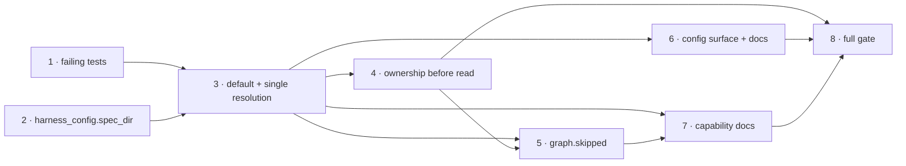

# Tasks: the checkout declares where its specs are

> Phase 3 of 3 (requirements → design → tasks). A DAG of implementation tasks derived
> from the approved design. MUST be reviewed/approved before implementation begins.

## Task list

TDD invariant (`tdd.mode: standard`): **T1 writes the failing tests first.** They cannot
pass while `GraphLinkConfig.spec_dir` defaults to `docs/specs`, because that default is
precisely what makes the repository's value unreachable — so the red is the defect itself,
observed.

- [x] 1. **The failing tests.** Extend `cli/tests/test_graphlink.py` with the unit cases
      from the design's testing strategy (repo value honoured, no-config default, CLI
      override, unset default, one resolution, event record, containment, foreign-checkout
      read) and `cli/tests/test_graphlink_integration.py` with the two end-to-end cases
      (two repositories with different `specDir`; `graph-state.json` under the
      repository's own directory). Update the `_build_runtime` stubs to the new arity.
  - **Depends on:** none
  - **Requirements:** R1.1–R1.5, R2.1, R2.2, R3.1, R3.3, R4.1–R4.3
  - **Test:** `uv run --project cli python -m pytest cli/tests/test_graphlink.py cli/tests/test_graphlink_integration.py`
    — **red**: the repository's `specDir` is never honoured

- [x] 2. **`harness_config.spec_dir`.** Add `DEFAULT_SPEC_DIR` and
      `spec_dir(harness)` to `cli/the_loop/harness_config.py`; point
      `graph/bootstrap.py::build_runtime` at it and split its docstring's justification so
      `spec_root` and `authorized_users` are each explained by their own provenance.
  - **Depends on:** none
  - **Requirements:** R1.2, R2.1
  - **Test:** `test_harness_config.py` and `test_graph_*.py` green, unmodified

- [x] 3. **The default change and the single resolution.** `GraphLinkConfig.spec_dir`
      defaults to `""`; `from_mapping` reads `str(data.get("specDir") or "")`;
      `GraphLink._spec_dir` + `_is_contained`; `_build_runtime` takes the resolved value;
      `_guarded` resolves once and threads it into both the gate and the runtime.
  - **Depends on:** 1, 2
  - **Requirements:** R1.1–R1.5, R2.1, R2.2, R4.3
  - **Test:** T1's resolution/override/containment cases green

- [x] 4. **Prove ownership before reading the checkout.** Move `_checkout_belongs_to`
      ahead of the spec-directory gate in `_guarded`; reword its warning, which can no
      longer name a spec directory.
  - **Depends on:** 3
  - **Requirements:** R4.1, R4.2
  - **Test:** `test_a_foreign_checkouts_harness_config_is_never_read` green; the existing
    A6 cases (`test_a_checkout_of_another_repo_is_never_coupled` and friends) still pass

- [x] 5. **`graph.skipped`.** Register the type in `eventlog.EVENT_TYPES` and emit it from
      the two refusing gates with `work_item`, `action`, `reason`, `spec_dir`.
  - **Depends on:** 3, 4
  - **Requirements:** R3.1, R3.2, R3.3
  - **Test:** T1's event-log case green; `test_every_emitted_event_type_is_documented`
    green

- [x] 6. **Config surface + docs.** `.the-loop/cli-config.schema.json`
      (`routing.graph.specDir` default `""` + corrected description),
      `skills/the-loop/templates/cli-config.yaml` (no default-overriding value),
      `docs/config/cli/routing-options.md` (documented as an override; Type/Default block
      kept for the parity test).
  - **Depends on:** 3
  - **Requirements:** R5.1, R5.2, R5.3
  - **Test:** `make validate` VALID; `test_docs_parity.py` green; `markdownlint` green

- [x] 7. **Capability docs + decision trail.** `docs/capabilities/process-graph.md` and
      `docs/capabilities/webhook-triggers.md`: where the daemon takes the spec directory
      from, the new skip record, and an issue-123 history row each.
  - **Depends on:** 3, 5
  - **Requirements:** R5.4
  - **Test:** `markdownlint` green

- [x] 8. **Full gate.** `make check` (ruff, ruff format, pyright, markdownlint,
      validate_config, pytest) and `uv run the-loop check issue-123 --recompute`.
  - **Depends on:** 1–7
  - **Requirements:** all
  - **Test:** all green; evidence recorded in `execution-log.md`

## DAG

## Non-goals

- Changing how `the-loop check` / `the-loop graph` resolve `workflow.specDir` — they
  already read it from the checkout, which is the behaviour this work item brings the
  daemon into line with.
- Adding a per-repository map to `cli-config.yaml`. Decision-044 rejected exactly that
  shape; the fix is to stop needing one.
- Recording an event for every skip path. Only the two that are otherwise invisible emit
  (design C6).
