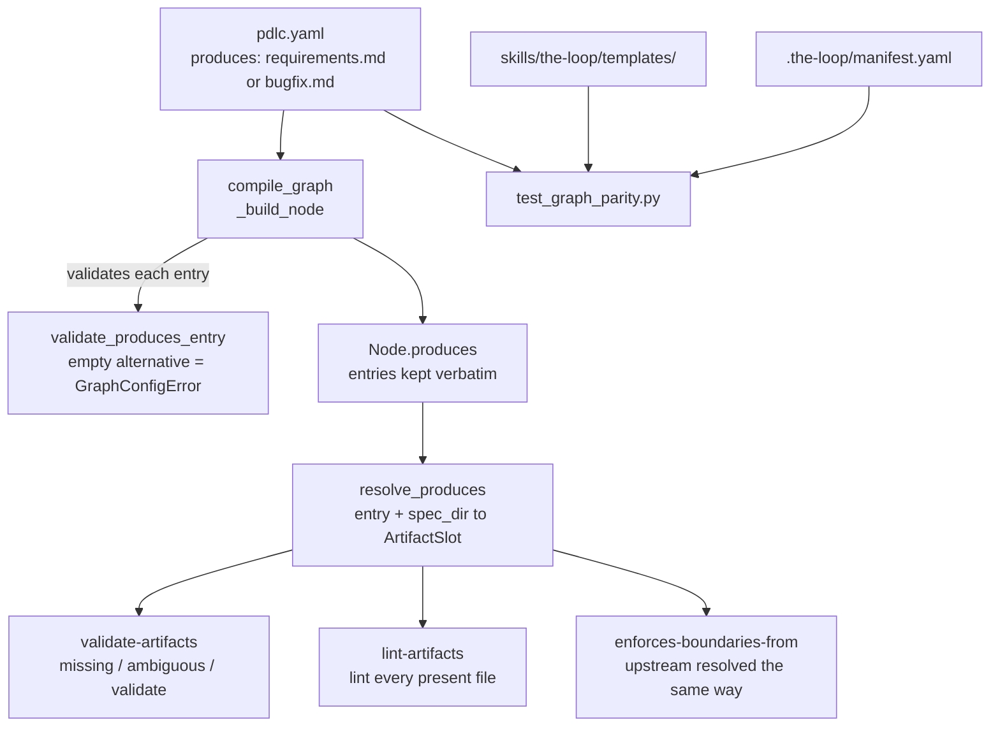

# Design: one artifact, several accepted names — and a test that keeps the names honest

> Phase 2 of 3. Derived from the approved `bugfix.md`.

## Overview

Three defects, one shape: a name written in two places that nothing compares. The fix is
correspondingly two-part —

1. **Make the graph able to say it.** A `produces` entry learns an alternation syntax, so
   one artifact can have several accepted names. `validate-artifacts`,
   `lint-artifacts` and `enforces-boundaries-from` all resolve through one shared
   function, so there is no second place for the two names to disagree again.
2. **Make the disagreement impossible to reintroduce.** A parity test compares the three
   sources that have to agree — the shipped **graph**, the `.the-loop/manifest.yaml`
   inventory, and the bundled **templates** an agent actually authors from — in both
   directions, on names *and* on required sections.

Part 2 is the load-bearing half. Part 1 fixes today's mismatch; part 2 is why the next
one is a red build instead of a merged PR.

## Architecture



### A1. `resolve_produces` — the one resolver

Both `hooks/artifacts.py` and `hooks/lint.py` today carry a byte-identical private
`_artifact_paths`. That duplication is itself a small instance of this ticket's defect, so
the fix collapses them rather than adding a third copy.

The resolver lives in `graph/model.py`. `model.py` already owns the `produces` contract —
it parses the entries and is where a structural fault becomes a startup failure — and the
minimalism ladder says not to mint a module for twenty lines when the concept already has
a home. The import direction stays acyclic: `hooks/* → model → registry → contract`, and
`model`'s own import of `hooks` is deferred inside `load_graph`, as it already is.

```python
#: Separates the names one ``produces`` entry accepts: "requirements.md|bugfix.md".
ALTERNATIVE_SEPARATOR = "|"


@dataclass(frozen=True)
class ArtifactSlot:
    """One ``produces`` entry, resolved against a work item's spec folder.

    A *slot* is one artifact the node must produce, under any one of the names the
    entry accepts. ``present`` is the subset that exists, in declaration order.
    """

    names: Tuple[str, ...]
    candidates: Tuple[Path, ...]
    present: Tuple[Path, ...]

    @property
    def alternatives(self) -> bool: ...
    def label(self) -> str: ...      # "requirements.md or bugfix.md", for a message


def artifact_names(entry: object) -> Tuple[str, ...]: ...
def validate_produces_entry(node_id: str, entry: object) -> None: ...   # compile time
def resolve_produces(produces, spec_dir: Path) -> List[ArtifactSlot]: ...
```

`Node.produces` keeps the entries **verbatim** (`("requirements.md|bugfix.md",)`), so
`as_mapping()` and therefore `the-loop graph show --format json` report exactly what the
graph declares. Splitting at parse time would have made the JSON claim two artifacts where
the graph means one.

### A2. Compile-time validation

`_build_node` calls `validate_produces_entry` for every entry. An empty alternative —
`"a||b"`, `"|a"`, `"a|"`, or an entry that is nothing but separators — raises
`GraphConfigError` naming the node and the entry. This is not defensive padding: the
graph's stated thesis is that *every structural failure is a startup failure*, and
`the-loop graph show --format json` is a CI step precisely so a malformed graph cannot
reach a traversal.

### A3. `validate-artifacts` — three outcomes per slot

| Slot state | Outcome |
| --- | --- |
| exactly one name present | validate it exactly as today (`locked`, `frontMatter`, `sections`, `checkmarks`) |
| no name present | `block` — the message names **every** accepted name |
| more than one present | `block` — ambiguous; keep one |

Messages, chosen so the single-name case is unchanged byte for byte (Requirement 1.3):

- single name missing → `required artifact is missing (docs/specs/<id>/requirements.md)`
  — the existing string, untouched.
- alternatives missing → `required artifact is missing — write one of: requirements.md,
  bugfix.md (docs/specs/<id>)`.
- ambiguous → `two phase-1 artifacts where one is expected — keep one of: requirements.md,
  bugfix.md (docs/specs/<id>)`, worded generically as `N artifacts present where one is
  expected`.

The optional-node early return (`brainstorming` produced nothing, so it was never entered)
becomes `not any(slot.present for slot in slots)` — same meaning, resolved shape.

**Ambiguity blocks rather than picking.** A folder holding both a live `requirements.md`
and a stale `bugfix.md` has no defined source of truth; a resolver that quietly prefers the
first declared name would approve a gate against whichever file the graph happened to list
first. The block costs one `git rm` and buys a guarantee.

### A4. `enforces-boundaries-from` — the silent skip (RC2)

`upstream` is resolved through the same function. When several accepted names are present
their bodies are **joined** before the marker scan, rather than one being chosen: a
boundary named in *either* file must still be answered downstream. That is the
conservative direction, and it means this hook never has to make the choice A3 refuses to
make.

`pdlc.yaml`'s `design` node changes to `upstream: "requirements.md|bugfix.md"`, which is
what turns the hook from skipping to running on every bug work item.

### A5. RC3 — the template that could not satisfy its own node

`skills/the-loop/templates/bugfix.md` gets a `## Requirements` section (with the
EARS acceptance criteria nested under it, mirroring `templates/requirements.md`) in place
of its top-level `## Acceptance criteria (EARS)`. Reproduction, expected-vs-actual and
root-cause stay exactly where they are — they are the whole reason a separate bug template
exists.

The alternative was teaching `sections:` its own alternation so the node could accept
either heading. Rejected: it is a second mechanism for one occurrence, and it would leave
the-loop with two names for the same section as well as two for the same file. One
vocabulary, one gate.

### A6. `cli/tests/test_graph_parity.py` — the actual fix

Three sources have to agree about a work-item artifact, and until now nothing compared
them:

| Source | What it asserts |
| --- | --- |
| `cli/the_loop/graph/pdlc.yaml` | which names **gate**, and which sections they must carry |
| `.the-loop/manifest.yaml` | which names the-loop **tracks** in a project, and at which phase |
| `skills/the-loop/templates/` | which names an agent actually **authors** from |

Three tests, both directions:

- **P1 (manifest → graph).** Every `workItemArtifact` with a `phase` and a file
  `pathPattern` names a file accepted by the `produces` of a node with that phase.
  Directory patterns (`docs/specs/<id>/design/`) and entries with no `phase`
  (`execution-log.md`) are out of the node-artifact contract and are skipped — the manifest
  says so itself by omitting the key, so the exclusion is data-driven, not a hard-coded
  allow-list.
- **P2 (graph → manifest).** Every name any node's `produces` accepts appears as a
  manifest `workItemArtifact`. Catches a graph that starts gating a file the project
  inventory does not track.
- **P3 (graph → templates).** For every accepted name there is a bundled template of that
  name; its front-matter `phase` matches a node that produces it; and every section that
  node's `validate-artifacts` requires exists as a heading in it.

**Both P1 and P3 go red before the fix, in that order.** P1 fails on the untouched tree:
no node accepts `bugfix.md`. P3 cannot fail yet — it has no gated `bugfix.md` to look for a
template for — and fires the moment the graph accepts the name, because
`templates/bugfix.md` offers no `## Requirements`. That sequence is the point: it is the
test, not a person, discovering that fixing the filename moves the block one line down. A
parity test green on the broken tree would have proved nothing.

The test reads the graph through `load_graph()` rather than re-parsing the YAML, so it
exercises the compiled contract the runtime actually uses. It is pure filesystem work — no
network, no subprocess — and skips when `skills/` is absent, matching how
`test_docs_parity.py` handles a source distribution that ships `cli/` alone.

## Components & interfaces

| File | Change |
| --- | --- |
| `cli/the_loop/graph/model.py` | `ALTERNATIVE_SEPARATOR`, `ArtifactSlot`, `artifact_names`, `validate_produces_entry`, `resolve_produces`; `_build_node` validates each entry |
| `cli/the_loop/graph/hooks/artifacts.py` | `_artifact_paths` → `resolve_produces`; missing/ambiguous outcomes; `enforces-boundaries-from` resolves `upstream` the same way |
| `cli/the_loop/graph/hooks/lint.py` | local `_artifact_paths` deleted; lints every present file |
| `cli/the_loop/graph/pdlc.yaml` | `requirements-definition.produces`; `design`'s `upstream` |
| `skills/the-loop/templates/bugfix.md` | `## Requirements` (RC3) |
| `cli/tests/test_graph_parity.py` | new — P1/P2/P3 |
| `cli/tests/test_graph_model.py`, `test_graph_hooks.py` | alternation unit + regression tests |
| docs, manifest, skill, commands, decision | see *Documentation* |

## Data models

`ArtifactSlot` is the only new type, and it is a frozen dataclass local to the graph
package — nothing serialises it, nothing persists it. Graph state (`GraphState`) is
untouched: node verdicts are still `pass`/`block`/`wait`/`skip`, so no state migration
exists to write and no on-disk format changes.

## Error handling

- **Malformed alternation** → `GraphConfigError` at compile, naming node and entry. Fails
  the `the-loop graph show --format json` CI step before any traversal.
- **No accepted name present** → `block`, listing every accepted name.
- **Several present** → `block`, ambiguous.
- **Unreadable file** → unchanged: the existing per-path `OSError`/`UnicodeDecodeError`
  finding, now raised against the resolved path.

Aggregation is preserved: every finding still comes back in **one** result so an agent
repairs them in a single round (R3.5). Alternation adds findings to that list; it does not
introduce an early return.

## Testing strategy

Red-then-green, per `tdd.mode: standard`. Every test below is written to fail on the
current tree first.

| # | Test | Guards |
| --- | --- | --- |
| 1 | `bugfix.md` alone satisfies `requirements-definition` | RC1, the headline defect |
| 2 | `requirements.md` alone behaves exactly as today | no regression on the common path |
| 3 | neither present → block, message names both | R2.3 |
| 4 | both present → block, ambiguous | R2.4, the fail-closed choice |
| 5 | a single-name node's missing-message is unchanged | R1.3 |
| 6 | `"a\|\|b"`, `"\|a"`, `"a\|"` → `GraphConfigError` | R1.2 |
| 7 | `enforces-boundaries-from` blocks on a `bugfix.md` boundary the design ignores | RC2 |
| 8 | `lint-artifacts` lints a `bugfix.md` | RC1 in the second hook |
| 9 | P1 / P2 / P3 parity | R5 — and RC3 |
| 10 | this spec folder itself clears the gate in CI | end-to-end, via the-loop's own gate |

Test 10 is not a written test but a property of how the work item is filed: this spec's
phase-1 artifact **is** `docs/specs/issue-124/bugfix.md`, and `.github/workflows/the-loop-gate.yml`
runs `the-loop check <item> --recompute --fail-on block` on every spec folder the PR
touches. The PR cannot be green unless the defect is fixed.

## Security design

The `bugfix.md` threat-model-lite raised one trust boundary and one abuse case; both are
enforced here.

- **Trust boundary — the graph is not user input.** `pdlc.yaml` ships with the CLI and a
  repo-supplied graph is ignored with a warning (R1.4), so every alternation entry is
  authored by the-loop's maintainers and reviewed as code. `resolve_produces` joins names
  to `work_item.spec_dir` exactly as the single-name path does today, and the name set is
  fixed at compile time — so the resolver cannot be steered to a path outside the spec
  folder, and no new input reaches it. `Message.text` continues to be composed only from
  the-loop's own vocabulary plus paths and hook names, never from payload text (R3.6);
  the new messages interpolate artifact names that came from the shipped graph.
- **Abuse case — weakening a gate to get green.** "Any one of N names" is easier to
  satisfy than "this exact name", so two properties hold the line. **Ambiguity fails
  closed** (A3): both present is a block, never a lucky pick, so no one clears a gate
  against a stale artifact sitting beside the live one. And every alternative runs the
  **full** validation — `locked`, `frontMatter`, `sections`, `checkmarks` — unchanged. The
  name became flexible; the standard did not move.
- **Net direction: stricter.** RC2's fix means the trust-boundary check that has been
  silently skipping for every bug work item now runs and blocks. A bug spec naming a
  boundary its design ignores will fail where it used to pass. "No new attack surface" is
  the accurate claim, and one previously inert gate becomes enforced.
- Risk tier 3 < `security.review.humanSignOffMinTier: 4` → no named security sign-off;
  the ready-to-ship security review still runs.

## Trade-offs & decisions

- **`|` alternation over list-of-lists.** `produces: [[requirements.md, bugfix.md]]` needs
  no parsing, but it reads as nesting rather than choice, makes the common single-name case
  irregular, and changes the JSON shape of `graph show` for every existing node. The
  separator keeps `produces` a flat list of strings and puts the alternation where a reader
  looks for it.
- **Resolver in `model.py`, not a new module.** Minimalism ladder: the concept already has
  an owner. A `graph/artifacts.py` would also sit confusingly beside `graph/hooks/artifacts.py`.
- **Ambiguity blocks.** Argued in A3. The cost is a repo mid-migration seeing a block it
  did not before; the message says exactly what to do, and the alternative is a gate that
  can approve a stale spec.
- **Existing bug specs untouched.** Maintainer's call (#124). They stay `bugfix.md` with
  their original `## Acceptance criteria (EARS)` headings — after this change the *name*
  gates fine, and their *sections* are not re-gated because nothing re-runs a closed work
  item.
- **#125 split out, not folded in.** Six review nodes declare `sections:` with no
  `produces:` and so skip silently. Same family, different blast radius; fixing it here
  would bury this fix in an unrelated contract change.

## Documentation

`bugfix.md` stays a first-class name everywhere it is already blessed — Option 1 retires
nothing. What changes is that the alternation is now written down:

- `.the-loop/manifest.yaml` — the `spec-bugfix` entry gains a note that the graph accepts
  either name at `requirements-definition`.
- `skills/the-loop/SKILL.md`, `skills/the-loop/reference/workflow.md` — the parenthetical
  "(or `bugfix.md` for bugs)" gains the fact that the gate accepts either, and that only
  one may be present.
- `docs/capabilities/process-graph.md` — the `produces` contract, including alternation.
- `docs/capabilities/spec-workflow.md` — current behaviour of the phase-1 artifact.
- `docs/decisions/decision-045.md` — the durable decision: one artifact, several accepted
  names, ambiguity fails closed.

## UI/UX artifacts

None. the-loop ships a CLI and docs; this change has no user-facing visual surface
(`design.uiArtifacts` applies to work items that do).

## Open questions

None.
