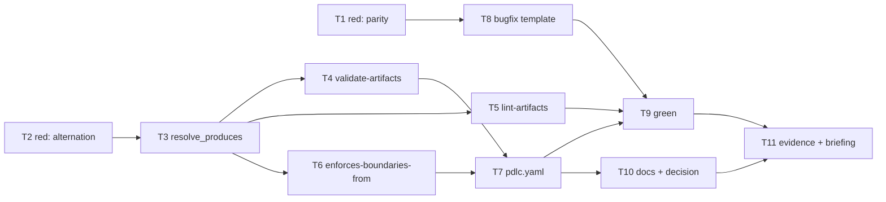

# Tasks: one artifact, several accepted names (issue-124)

> Phase 3 of 3. Derived from the approved `bugfix.md` and `design.md`.

## Task list

- [x] **T1 — Red: the parity test.** New `cli/tests/test_graph_parity.py` with P1/P2/P3
  (design A6). Written first and confirmed **failing**: P1 on the untouched tree, because
  no node accepted `bugfix.md`; P3 the moment T7 fixed the name, because
  `templates/bugfix.md` offered no `## Requirements`. The two reds arrive in that order by
  construction — P3 cannot see a template for a name the graph does not yet gate — and
  together they are the "fixing the filename moves the block one line down" story, caught
  by the test rather than by a person. Depends on: nothing. Requirements: R5.1–R5.4.
- [x] **T2 — Red: the alternation and regression tests.** Extend
  `cli/tests/test_graph_model.py` (compile-time validation, entries kept verbatim) and
  `cli/tests/test_graph_hooks.py` (tests 1–8 of design § Testing strategy). Confirmed
  failing. Depends on: nothing. Requirements: R1.1–R1.3, R2.1–R2.4, R3.1–R3.2, R6.1.
- [x] **T3 — `resolve_produces` in `model.py`.** `ALTERNATIVE_SEPARATOR`, `ArtifactSlot`,
  `artifact_names`, `validate_produces_entry`, `resolve_produces`; `_build_node` validates
  every entry. Depends on: T2. Requirements: R1.1, R1.2.
- [x] **T4 — `validate-artifacts` resolves slots.** Missing / ambiguous / validate, with
  the single-name message unchanged. Depends on: T3. Requirements: R2.1–R2.4, R1.3.
- [x] **T5 — `lint-artifacts` uses the shared resolver.** Delete the duplicated private
  `_artifact_paths`. Depends on: T3. Requirements: R1.1.
- [x] **T6 — `enforces-boundaries-from` resolves `upstream`.** Joined bodies when several
  are present (design A4). Depends on: T3. Requirements: R3.1, R3.2.
- [x] **T7 — `pdlc.yaml`.** `requirements-definition.produces: ["requirements.md|bugfix.md"]`
  and the `design` node's `upstream`. Depends on: T4, T6. Requirements: R2.1, R3.2.
- [x] **T8 — The bugfix template (RC3).** `## Requirements` with EARS criteria nested,
  keeping reproduction / expected-vs-actual / root-cause. Depends on: T1 (P3 defines the
  target). Requirements: R4.1, R4.2.
- [x] **T9 — Green.** Full suite, ruff, pyright, markdownlint; `the-loop graph show` and
  `the-loop check` on a real `bugfix.md` work item. Depends on: T3–T8.
- [x] **T10 — Documentation and the decision record.** Manifest note, `SKILL.md`,
  `reference/workflow.md`, `commands/work-on.md`, `commands/work-status.md`,
  `docs/capabilities/process-graph.md`, `docs/capabilities/spec-workflow.md`,
  `docs/decisions/decision-045.md` + index row. Depends on: T7. Requirements: R6.2, R6.3.
- [x] **T11 — Evidence and reviewer briefing.** Execution log sections, capability-doc
  history rows, the PR briefing. Depends on: T9, T10.

## Dependency graph (DAG)

## Checkpoints

- After **T2**: both red suites fail for the documented reasons, not for a typo. This is
  the red half of the red-green record.
- After **T7**: `the-loop check issue-104 --recompute` resolves `bugfix.md` instead of
  demanding a `requirements.md` — the original reproduction, inverted. That closed spec
  still blocks, now on the `## Acceptance criteria (EARS)` heading it was written with in
  the pre-graph era; per the maintainer's call the five historical bug specs are not
  retro-fitted (see § Out of scope, and the note in `execution-log.md`).
- After **T9**: `uv run pre-commit run --all-files` is clean.
- After **T11**: the-loop's own gate passes on `docs/specs/issue-124/`, whose phase-1
  artifact is a `bugfix.md`.

## Out of scope

Tracked in `bugfix.md` § Out of scope: retiring `bugfix.md` (declined), renaming the five
existing bug specs (declined), and the six review nodes whose `sections:` never run
(**#125**).
