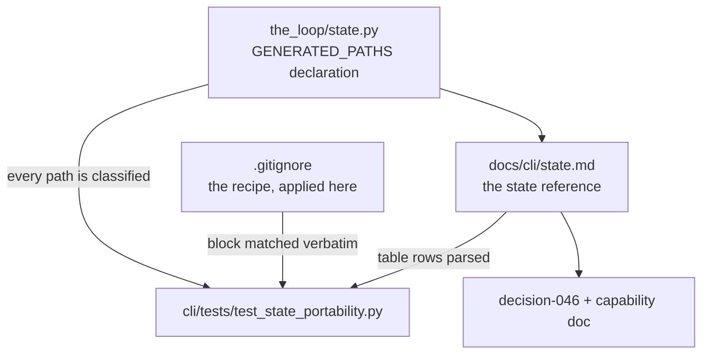

# Design: portable state — what travels with the work, what belongs to the machine

> Phase 2 of 3. Derived from an **approved** `requirements.md`. Reviewed/approved
> before tasks-breakdown.

## 1. Shape of the change

Four reinforcing pieces, none of which changes a byte of runtime behaviour:



The declaration is the source of truth for *what exists*; the page is the source of
truth for *what it means*; the test is what stops the two from drifting apart; the
decision record is why the split is what it is.

## 2. The declaration (`the_loop/state.py`)

`StateLayout` already derives every generated path from one root (issue-106). It gains a
sibling declaration — data, not behaviour — in the shape issue-121 established for the
harness-config read surface:

```python
@dataclass(frozen=True)
class GeneratedPath:
    name: str        # human label, used in test failures and prose
    attr: str        # the StateLayout property this derives from
    default: str     # the documented path, e.g. "<root>/sessions/<slug>.json"
    portable: bool   # does this mean anything on another machine?
    holds: str       # what is in it
    why: str         # why it is (not) portable — the argument, not a restatement

GENERATED_PATHS: Tuple[GeneratedPath, ...] = (...)
```

Five entries: session record, control record, poll state, event log, pidfile. Two carry
`portable=True`.

`attr` is what makes the declaration checkable rather than decorative. Adding a sixth
generated path means adding a property to `StateLayout`, and the coverage test fails
until an entry names it — so the question *"does this travel?"* is asked at the moment
the path is invented, which is the only moment it is cheap to answer.

`why` is load-bearing for the same reason it is in `HarnessConfigRead`: an entry whose
author cannot state why it is local probably wrote something portable and put a machine
handle in it.

Nothing imports this at runtime. It is read by the test suite and by anyone opening the
module; `state.py` is where a reader is already standing when they ask the question.

## 3. The state reference page (`docs/cli/state.md`)

New page in the CLI section, between *Concepts* and *Commands* in the sidebar. Structure:

1. **Where state lives** — `state.root`, the four generated paths derived from it, and
   the resolution rule (a configured path wins verbatim).
2. **Two kinds of state** — facts about the world vs handles to this machine, the
   framing that answers every question below.
3. **The classification table** — one row per generated path: path, writer, what it
   holds, and `portable` / `local`. **This table is parsed by the test**, so its first
   column carries the exact `default` string from the declaration.
4. **One section per file** — a real JSON example, a field table, the lifecycle (created,
   updated, pruned, deleted) and *what is lost if you delete it*.
5. **Carrying state to another machine** — the `.gitignore` block, the hand-off
   procedure, the `~/.the-loop` case, and the two costs (a dirty working tree while the
   daemon runs; hand-resolved JSON conflicts if two machines run at once).
6. **What must never be carried** — the session registry, with the concrete failure:
   `find_by_work_item` counts a foreign record as live, so the duplicate guard refuses
   the spawn the new machine needs and events are routed to a conversation that does not
   exist there.
7. **Security** — what the tracked files disclose (nothing the ticket does not),
   what tracking them makes possible (a proposable arming record), and the three bounds
   on it.

### 3.1 The `.gitignore` block

One block, written once, on the page and in this repository's `.gitignore` byte for byte:

```gitignore
# the-loop: generated state under state.root (default .the-loop) — see
# https://madarauchiha-314.github.io/the-loop/cli/state
# Local handles (session records, event log, pidfile) never leave the machine.
.the-loop/sessions/*
.the-loop/logs/
.the-loop/*.pid
# Portable: what an authorized user armed, and which comments have been seen.
!.the-loop/sessions/control/
!.the-loop/sessions/poll-state.json
.the-loop/sessions/control/*.tmp
```

Three details that are easy to get wrong and are therefore fixed here:

- `sessions/*`, **not** `sessions/`. Git does not descend into an excluded *directory*,
  so a `!` re-include beneath one has no effect. Excluding the directory's *contents*
  leaves `sessions/` itself visible, which is what makes `!sessions/control/` work.
- `!sessions/control/` re-includes the **directory**; the files inside it are then not
  matched by `sessions/*` at all (a `*` does not cross `/`).
- `control/*.tmp` re-excludes the atomic writers' temporaries. `ControlStore.record`
  and `PollState.save` both write `tempfile.mkstemp(dir=…, suffix=".tmp")` then
  `os.replace`; a crash between the two leaves a `tmp*.tmp` file behind, and the poll
  state's temporaries are already covered by `sessions/*`.

The pre-issue-106 poll state (`.the-loop/poll-state.json`) is the same file in its old
location and is equally portable, so its blanket ignore line goes away with the rest —
the page says so, and says the fix is to move it.

## 4. The drift test (`cli/tests/test_state_portability.py`)

Pure filesystem reads. No network, no subprocess, no fixtures — the same posture as
`test_docs_parity.py`, including its module-level skip when `docs/` is absent (the
declaration-coverage assertion runs regardless: it needs no documentation).

| Id | Assertion | Catches |
|----|-----------|---------|
| S1 | every public path property of `StateLayout` is named by some entry's `attr` | a generated path added without classifying it |
| S2 | every entry's `attr` is a real `StateLayout` property, and `default` matches what it resolves to under the default root | a declaration that has drifted from the code |
| S3 | every entry appears as a row of the page's classification table with a matching `portable`/`local` word | a path documented wrongly, or not at all |
| S4 | the page's `gitignore` block appears verbatim in the repository's `.gitignore` | the recipe and the dogfood disagreeing |
| S5 | every `portable=True` entry's default path is **not** ignored by the block, and every `portable=False` one **is** | a recipe that says one thing and matches another |

S5 is the one that earns its keep: S4 only proves two files agree, while S5 evaluates the
patterns. It is implemented against the block text with a small matcher rather than by
shelling out to `git check-ignore`, so it stays a pure unit test — the ordering rules it
must model (last match wins, a `!` cannot rescue a file under an excluded directory) are
exactly the two the block depends on.

## 5. Data model — the two portable files

Unchanged; documented for the first time. Reproduced here so the page and the code can be
checked against one source.

**Control record** (`<root>/sessions/control/<slug>.json`, one per work item):

| Field | Type | Meaning |
|---|---|---|
| `ref` | string | `github:OWNER/REPO#N` |
| `command` | `start`\|`stop`\|`pause`\|`resume` | the last command recorded |
| `source` | string | `comment` or `cli` |
| `actor` | string | GitHub login that asked |
| `requestedAt` | ISO-8601 UTC | when |
| `note` | string | optional free text |

**Poll state** (`<root>/sessions/poll-state.json`, one file, `{"items": {ref: …}}`):

| Field | Type | Meaning |
|---|---|---|
| `seenComments` | string[] | comment ids already baselined or delivered (capped, pruned to the live thread each cycle) |
| `commentAttempts` | {id: int} | in-flight delivery attempts, against `polling.maxRetries` |
| `spawn` | {attempts, gaveUp, deliveryId} | the presence/spawn retry ledger |
| `lastPolledAt` | ISO-8601 UTC | last cycle that saw the item |

The attempt ledgers are local bookkeeping inside an otherwise portable file. They are
carried anyway: they are small, they self-heal (a delivered comment is resolved, a
successful spawn resets), and splitting the file to separate them would trade a real cost
(two files, two write paths, a migration) for a cosmetic gain.

## 6. Alternatives considered

| Option | Why not |
|---|---|
| `the-loop state export/import` (a bundle command) | The state is already plain JSON in one directory, and git is already how everything else in the-loop moves. A command would be a second, weaker transport to maintain — YAGNI (`minimalism`), and it answers none of the four questions the issue actually asks. |
| Track `sessions/` too, and teach the registry to ignore foreign records (a `machine` field) | Makes the registry machine-aware to solve a problem better solved by not copying the file. It touches the duplicate-session invariant — the one guard that stops two agents working one item — for no gain: the new machine must spawn its own session regardless. |
| Track nothing; document only | Answers question 4 and leaves 1–3 as prose nobody can execute. The `.gitignore` block *is* the answer, and a repository that ignores its own recipe is the drift this work item exists to prevent. |
| Commit state automatically from the daemon | A daemon that writes commits into the operator's repository is a surprise with a blast radius (dirty trees, force-pushes, secrets in a wrong repo). Hand-off is a human moment; it stays one. |

## 7. Testing strategy

- **Unit:** S1–S5 above (`test_state_portability.py`).
- **Regression:** the existing suite must pass untouched — the declaration adds no
  behaviour and no writer changes. `test_state.py` continues to own layout resolution.
- **Manual evidence:** `git check-ignore -v` against the five default paths, and
  `git status --porcelain` in a scratch checkout with a control record and a session
  record present, showing exactly one of them staged for tracking.

## 8. Security design

Enforcing the requirements' boundaries:

- **Nothing new is read.** The declaration is inert data; no code path consumes it. The
  daemon's inputs are unchanged.
- **The disclosure boundary is drawn by the classification itself.** The two portable
  files carry only what is already on the ticket; the file that carries an operator's
  absolute paths and a resumable conversation id is on the local side of the line, and
  the page states that as a reason rather than leaving it implicit.
- **The tampering path is named and bounded on the page** (requirements § abuse cases):
  a tracked control record is an input to `start_requested`, so a merged forgery is an
  arming attempt — insufficient on its own because the auto-execute label still gates the
  spawn, visible because a `.the-loop/sessions/` diff is reviewable, and avoidable
  because the recommendation is a repository only the operator can push to.
- **Fail-closed behaviour is untouched.** Missing or unreadable state still reads as
  "nothing recorded".
