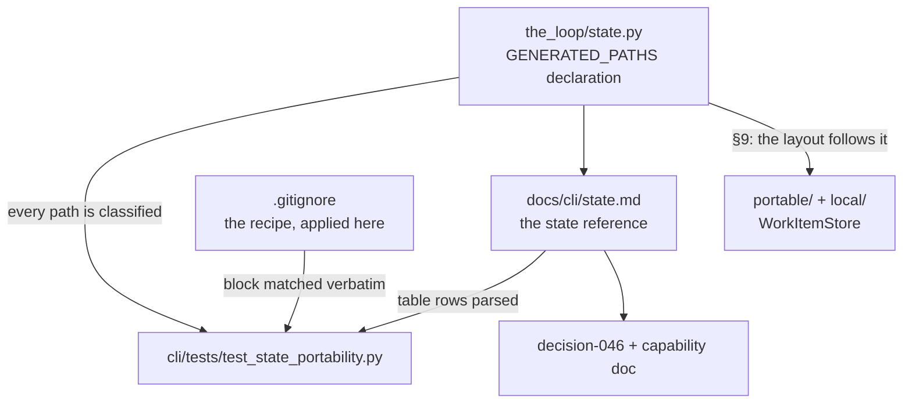
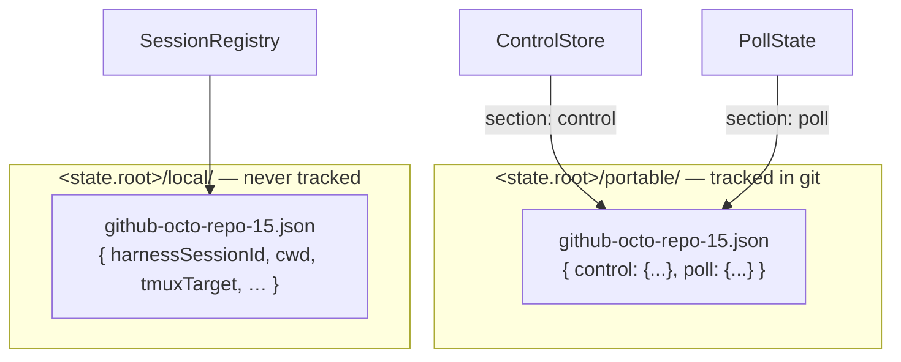

# Design: portable state — what travels with the work, what belongs to the machine

> Phase 2 of 3. Derived from an **approved** `requirements.md`. Reviewed/approved
> before tasks-breakdown.

## 1. Shape of the change

Four reinforcing pieces — the first three inert, the fourth (§9, added in review) the
layout those three describe:



The declaration is the source of truth for *what exists*; the page is the source of
truth for *what it means*; the test is what stops the two from drifting apart; the
decision record is why the split is what it is.

## 2. The declaration (`the_loop/state.py`)

`StateLayout` already derives every generated path from one root (issue-106). It gains a
sibling declaration — data, not behaviour — in the shape issue-121 established for the
harness-config read surface:

```python
@dataclass(frozen=True)
class GeneratedPath:
    name: str        # human label, used in test failures and prose
    attr: str        # the StateLayout property this derives from
    default: str     # the documented path, e.g. "<root>/local/<slug>.json"
    portable: bool   # does this mean anything on another machine?
    holds: str       # what is in it
    why: str         # why it is (not) portable — the argument, not a restatement

GENERATED_PATHS: Tuple[GeneratedPath, ...] = (...)
```

Four entries after §9 collapsed control and poll state into one record: work-item record
(`portable=True`), session record, event log, pidfile.

`attr` is what makes the declaration checkable rather than decorative. Adding a sixth
generated path means adding a property to `StateLayout`, and the coverage test fails
until an entry names it — so the question *"does this travel?"* is asked at the moment
the path is invented, which is the only moment it is cheap to answer.

`why` is load-bearing for the same reason it is in `HarnessConfigRead`: an entry whose
author cannot state why it is local probably wrote something portable and put a machine
handle in it.

Nothing imports this at runtime. It is read by the test suite and by anyone opening the
module; `state.py` is where a reader is already standing when they ask the question.

## 3. The state reference page (`docs/cli/state.md`)

New page in the CLI section, between *Concepts* and *Commands* in the sidebar. Structure:

1. **Where state lives** — `state.root`, the four generated paths derived from it, and
   the resolution rule (a configured path wins verbatim).
2. **Two kinds of state** — facts about the world vs handles to this machine, the
   framing that answers every question below.
3. **The classification table** — one row per generated path: path, writer, what it
   holds, and `portable` / `local`. **This table is parsed by the test**, so its first
   column carries the exact `default` string from the declaration.
4. **One section per file** — a real JSON example, a field table, the lifecycle (created,
   updated, pruned, deleted) and *what is lost if you delete it*.
5. **Carrying state to another machine** — the `.gitignore` block, the hand-off
   procedure, the `~/.the-loop` case, and the two costs (a dirty working tree while the
   daemon runs; hand-resolved JSON conflicts if two machines run at once).
6. **What must never be carried** — the session registry (`local/`), with the concrete
   failure:
   `find_by_work_item` counts a foreign record as live, so the duplicate guard refuses
   the spawn the new machine needs and events are routed to a conversation that does not
   exist there.
7. **Security** — what the tracked files disclose (nothing the ticket does not),
   what tracking them makes possible (a proposable arming record), and the three bounds
   on it.

### 3.1 The `.gitignore` block

One block, written once, on the page and in this repository's `.gitignore` byte for byte
(§9.5 is why it is this short — the first draft needed two negation patterns and an
ancestor rule to express the same thing against the pre-issue-128 layout):

```gitignore
# the-loop: generated state under state.root (default .the-loop) — see
# https://madarauchiha-314.github.io/the-loop/cli/state
# Local handles (session records, event log, pidfile) never leave the machine.
# .the-loop/portable/ is the half that travels with the work, so it is tracked.
.the-loop/local/
.the-loop/logs/
.the-loop/*.pid
.the-loop/portable/*.tmp
```

The one non-obvious line is the last: `portable/*.tmp` re-excludes the atomic writer's
temporaries — `WorkItemStore.write_section` writes `tempfile.mkstemp(dir=…, suffix=".tmp")`
then `os.replace`, and a crash between the two leaves a `tmp*.tmp` behind.

The pre-issue-128 tree (`.the-loop/sessions/`) and the pre-issue-106 poll state stay
ignored: they are read until each work item is written forward, then deleted by hand.

## 4. The drift test (`cli/tests/test_state_portability.py`)

Pure filesystem reads. No network, no subprocess, no fixtures — the same posture as
`test_docs_parity.py`, including its module-level skip when `docs/` is absent (the
declaration-coverage assertion runs regardless: it needs no documentation).

| Id | Assertion | Catches |
|----|-----------|---------|
| S1 | every public path property of `StateLayout` is named by some entry's `attr` | a generated path added without classifying it |
| S2 | every entry's `attr` is a real `StateLayout` property, and `default` matches what it resolves to under the default root | a declaration that has drifted from the code |
| S3 | every entry appears as a row of the page's classification table with a matching `portable`/`local` word | a path documented wrongly, or not at all |
| S4 | the page's `gitignore` block appears verbatim in the repository's `.gitignore` | the recipe and the dogfood disagreeing |
| S5 | every `portable=True` entry's default path is **not** ignored by the block, and every `portable=False` one **is** | a recipe that says one thing and matches another |

S5 is the one that earns its keep: S4 only proves two files agree, while S5 evaluates the
patterns. It is implemented against the block text with a small matcher rather than by
shelling out to `git check-ignore`, so it stays a pure unit test — the ordering rules it
must model (last match wins, a `!` cannot rescue a file under an excluded directory) are
exactly the two the block depends on.

## 5. Data model — the two portable sections

Field for field unchanged, and documented for the first time. Reproduced here so the page
and the code can be checked against one source. §9 moved them into one record per work
item; the fields did not move.

**`control`** (`<root>/portable/<slug>.json` § `control`, one per work item):

| Field | Type | Meaning |
|---|---|---|
| `ref` | string | `github:OWNER/REPO#N` |
| `command` | `start`\|`stop`\|`pause`\|`resume` | the last command recorded |
| `source` | string | `comment` or `cli` |
| `actor` | string | GitHub login that asked |
| `requestedAt` | ISO-8601 UTC | when |
| `note` | string | optional free text |

**`poll`** (`<root>/portable/<slug>.json` § `poll` — one *shared* `poll-state.json` before
§9):

| Field | Type | Meaning |
|---|---|---|
| `seenComments` | string[] | comment ids already baselined or delivered (capped, pruned to the live thread each cycle) |
| `commentAttempts` | {id: int} | in-flight delivery attempts, against `polling.maxRetries` |
| `spawn` | {attempts, gaveUp, deliveryId} | the presence/spawn retry ledger |
| `lastPolledAt` | ISO-8601 UTC | last cycle that saw the item |

The attempt ledgers are local bookkeeping inside an otherwise portable section. They are
carried anyway: they are small, they self-heal (a delivered comment is resolved, a
successful spawn resets), and splitting them out would trade a real cost (another file,
another write path) for a cosmetic gain.

## 6. Alternatives considered

| Option | Why not |
|---|---|
| `the-loop state export/import` (a bundle command) | The state is already plain JSON in one directory, and git is already how everything else in the-loop moves. A command would be a second, weaker transport to maintain — YAGNI (`minimalism`), and it answers none of the four questions the issue actually asks. |
| Track `sessions/` too, and teach the registry to ignore foreign records (a `machine` field) | Makes the registry machine-aware to solve a problem better solved by not copying the file. It touches the duplicate-session invariant — the one guard that stops two agents working one item — for no gain: the new machine must spawn its own session regardless. |
| One file per work item holding **both** halves (session handle included) — §9's obvious simplification | Puts an absolute `cwd` and a resume handle inside the file that is tracked in git, and makes the portability boundary a per-field rule instead of a directory. Two files per work item is the smallest split that keeps the boundary mechanical. |
| Move the old state on disk (a `migrate-state` command) | A destructive startup move is the wrong default for state a daemon is mid-flight on, and a new command needs its own page, flags and parity tests. Reading the old location until each item is written forward achieves the same thing with no command and no risk (§9.3). |
| Track nothing; document only | Answers question 4 and leaves 1–3 as prose nobody can execute. The `.gitignore` block *is* the answer, and a repository that ignores its own recipe is the drift this work item exists to prevent. |
| Commit state automatically from the daemon | A daemon that writes commits into the operator's repository is a surprise with a blast radius (dirty trees, force-pushes, secrets in a wrong repo). Hand-off is a human moment; it stays one. |

## 7. Testing strategy

- **Unit:** S1–S5 above (`test_state_portability.py`); the work-item store
  (`test_workitem.py`): sections independent, the read-modify-write rule from the
  direction that hurts, empty-record removal, corrupt-record fail-closed, and every
  upgrade-shim path (control, poll, pre-issue-106 poll, write-forward, new-wins);
  the retired config key (`test_migrations.py`).
- **Regression:** the whole suite must pass. Tests asserting the *old* paths are updated
  deliberately (§9 is a behaviour change) — none has its intent weakened.
- **Manual evidence:** `git check-ignore -v` against every default path, and
  `git status --porcelain` in a scratch checkout with both halves present, showing only
  the portable one offered for tracking.

## 8. Security design

Enforcing the requirements' boundaries:

- **Nothing new is read.** The declaration is inert data; no code path consumes it. The
  daemon's inputs are unchanged.
- **The disclosure boundary is drawn by the classification itself.** The two portable
  files carry only what is already on the ticket; the file that carries an operator's
  absolute paths and a resumable conversation id is on the local side of the line, and
  the page states that as a reason rather than leaving it implicit.
- **The tampering path is named and bounded on the page** (requirements § abuse cases):
  a tracked control record is an input to `start_requested`, so a merged forgery is an
  arming attempt — insufficient on its own because the auto-execute label still gates the
  spawn, visible because a `.the-loop/sessions/` diff is reviewable, and avoidable
  because the recommendation is a repository only the operator can push to.
- **Fail-closed behaviour is untouched.** Missing or unreadable state still reads as
  "nothing recorded".

## 9. The consolidated layout (added in review)

> Derived from R6/R7, added after the [PR #129
> review](https://github.com/MadaraUchiha-314/the-loop/pull/129#issuecomment-5139488802).
> Sections 1–8 above describe the classification; this one describes the layout that
> classification now dictates.

### 9.1 Two directories, one file per work item



`the_loop.workitem.WorkItemStore` owns the portable file. Its whole job is that two
components write one record:

| Method | Contract |
|---|---|
| `section(ref, name)` | the section, or the pre-issue-128 location's contents, or `None` |
| `write_section(ref, name, data)` | **read-modify-write**: replace that section only, atomically; `None` removes it |
| `drop(ref)` / auto-drop | a record with neither section is deleted, not kept as a husk |

`ControlStore` keeps its public API and delegates storage. `PollState` becomes
directory-backed: entries load lazily, mutations mark the ref dirty, and `save()` flushes
only what the cycle touched. `forget()` writes through immediately — a work item that
ended must not be resurrected by a later flush.

### 9.2 Why read-modify-write, specifically

The two writers are concurrent in the daemon: the receiver records a control keyword while
a poll cycle is mid-flight. A whole-file write from either side would clobber the other's
section — and the direction that hurts is the poller erasing a `start`, which silently
disarms a work item that a human just asked to run. Sections are disjoint, so
last-writer-wins **per section** is the correct semantic and needs no locking.

### 9.3 The upgrade shim

Read-forward, never a destructive move (R7):

| New section absent | Read instead |
|---|---|
| `control` | `<root>/sessions/control/<slug>.json` |
| `poll` | `<root>/sessions/poll-state.json` → `items[ref]`, then the pre-issue-106 `.the-loop/poll-state.json` |

The next write puts it in the new layout, so each work item converges on first touch, and
a section recorded here always wins over the old tree.

**Removal needs a tombstone.** Ending a work item clears its control section; if "absent"
meant "ask the old tree", the stale `start` would come straight back and re-arm an item
that just finished. So a cleared section is written as an explicit `null`, and a record
whose sections have all gone is left behind as `{"ref": …, "sealed": true}` — but *only*
while the old tree still holds something for that work item, so the normal case still
deletes the file. The check is per **section**, not per record: during an upgrade the poll
cycle usually writes first, and the old control record must still be adopted afterwards,
or an armed item silently disarms. Both directions are pinned by tests.

The shim is one module (`workitem.py`) and is deletable when no old roots remain.

### 9.4 Config surface

- `routing.registryDir` — kept; its default moves `<root>/sessions` → `<root>/local`.
- `polling.stateFile` — **removed**. It named a file, and the ledger is a directory of
  records now. Retired through the existing version-gated mechanism
  (`migrations.py`, schema `0.2.0` → `0.3.0`): a config still declaring it is refused with
  the replacement named, and `the-loop migrate-config` removes it.
- `sessions` gains `--portable-dir`, symmetrical with `--registry-dir`, so an invocation
  can be pointed at either half.
- `poll` gains `--state-dir`, replacing `--state-file`.

### 9.5 The recipe, after

```gitignore
.the-loop/local/
.the-loop/logs/
.the-loop/*.pid
.the-loop/portable/*.tmp
```

No negations, no ancestor rule — which is the point of §9 as a whole.
