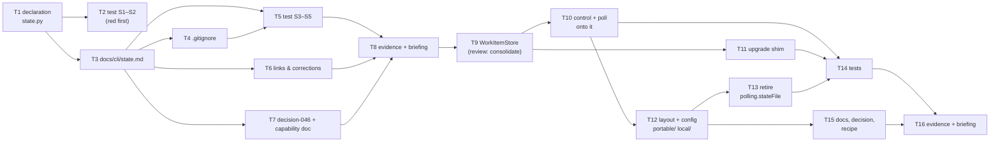

# Tasks: portable state — what travels with the work, what belongs to the machine

> Phase 3 of 3. A DAG of small, verifiable tasks, each referencing the requirements it
> satisfies.

## Tasks

- [x] **T1 — declare the generated paths.** `GeneratedPath` + `GENERATED_PATHS` in
  `cli/the_loop/state.py`: five entries (session record, control record, poll state,
  event log, pidfile), each with `attr`, `default`, `portable`, `holds`, `why`. No
  runtime consumer. *(R3.1)*
- [x] **T2 — pin the declaration against the layout (red first).**
  `cli/tests/test_state_portability.py` S1–S2: every public path property of
  `StateLayout` is claimed by an entry, and every entry's `attr`/`default` resolves.
  Written before T1 is complete; verified red by removing an entry. *(R3.2, R5.2)*
- [x] **T3 — write the state reference.** `docs/cli/state.md`: the two kinds of state,
  the classification table (first column = the declaration's `default`), a section per
  file with a JSON example, field table and lifecycle, the hand-off procedure, the
  `~/.the-loop` case, the costs, what must never be carried, and the security note.
  *(R1.1–R1.3, R2.1, R2.3, R2.4)*
- [x] **T4 — apply the recipe here.** Replace this repository's three the-loop state
  blocks in `.gitignore` with the documented block, byte for byte, including dropping
  the blanket ignore of the pre-issue-106 poll state. *(R2.2)*
- [x] **T5 — pin the docs and the recipe.** S3–S5: every declared path documented with a
  matching classification; the block verbatim in `.gitignore`; the block's patterns
  actually ignore the local paths and spare the portable ones. *(R3.3, R3.4, R3.5)*
- [x] **T6 — links and corrections.** Sidebar entry in `docs/.vitepress/config.mts`;
  pointers from `docs/cli/concepts.md`, `docs/cli/index.md` and the `state.root` option;
  delete *"All of it is git-ignored runtime state"* from `docs/config/cli/index.md`.
  *(R1.4)*
- [x] **T7 — record the decision.** `docs/decisions/decision-046.md` + a row in
  `docs/decisions/decisions.md`; behaviour bullet and history row in
  `docs/capabilities/cli.md`. *(R4.1–R4.3)*
- [x] **T8 — evidence and reviewer briefing.** Full suite green, `git check-ignore -v`
  evidence for all five paths, execution log updated, PR briefing posted. *(R5.1, R5.2)*

## Tasks added in review (PR #129)

> The owner asked whether the stores could be consolidated, and chose to do it in this
> PR. R6/R7 and design §9 are the result; these are their tasks. The phase returned to
> tasks-breakdown and then implementation before re-requesting review.

- [x] **T9 — the shared record.** `cli/the_loop/workitem.py`: `WorkItemStore` over
  `<state.root>/portable/<slug>.json` with `section`/`write_section`/`drop`,
  read-modify-write per section, atomic writes, empty-record removal. *(R6.1–R6.3)*
- [x] **T10 — move both writers onto it.** `ControlStore` delegates storage (public API
  unchanged); `PollState` becomes directory-backed with lazy loads, a dirty set, and
  write-through `forget`. *(R6.1, R6.2, R6.5)*
- [x] **T11 — the upgrade shim.** Read the pre-issue-128 control record, the
  pre-issue-128 poll state and the pre-issue-106 poll state when a section is absent;
  write forward on the next write; new record wins. *(R7.1–R7.3)*
- [x] **T12 — the layout.** `StateLayout.portable_dir`/`local_dir` replacing
  `sessions_dir`/`control_dir`/`poll_state`; `LegacyLayout` beside it; `GENERATED_PATHS`
  down to four entries; dispatcher, poll and sessions commands rewired;
  `sessions --portable-dir`, `poll --state-dir`. *(R6.1, R6.4)*
- [x] **T13 — retire `polling.stateFile`.** `migrations.py` refuses it with the
  replacement named and removes it on migration; schema + template + this repo's config
  updated; CLI config version `0.2.0` → `0.3.0`. *(R7.4)*
- [x] **T14 — tests.** `test_workitem.py` (11 cases: independence, the clobber direction,
  fail-closed, every shim path); `test_state.py` rewritten for the two-tree layout; the
  poller/control/CLI suites moved to the new paths; four migration cases for the retired
  key. *(R3, R6, R7)*
- [x] **T15 — docs and decision.** `docs/cli/state.md` rewritten around the new layout
  (including the three-line recipe and the upgrade section); decision-046 extended with
  the layout decision and the "why each store exists" answer; capability docs, config
  pages, concepts, `upgrade-the-loop`. *(R1, R2, R4)*
- [x] **T16 — evidence and re-review.** Full gate green, `git check-ignore -v` re-run on
  the new paths, execution log and PR briefing updated. *(R5)*
