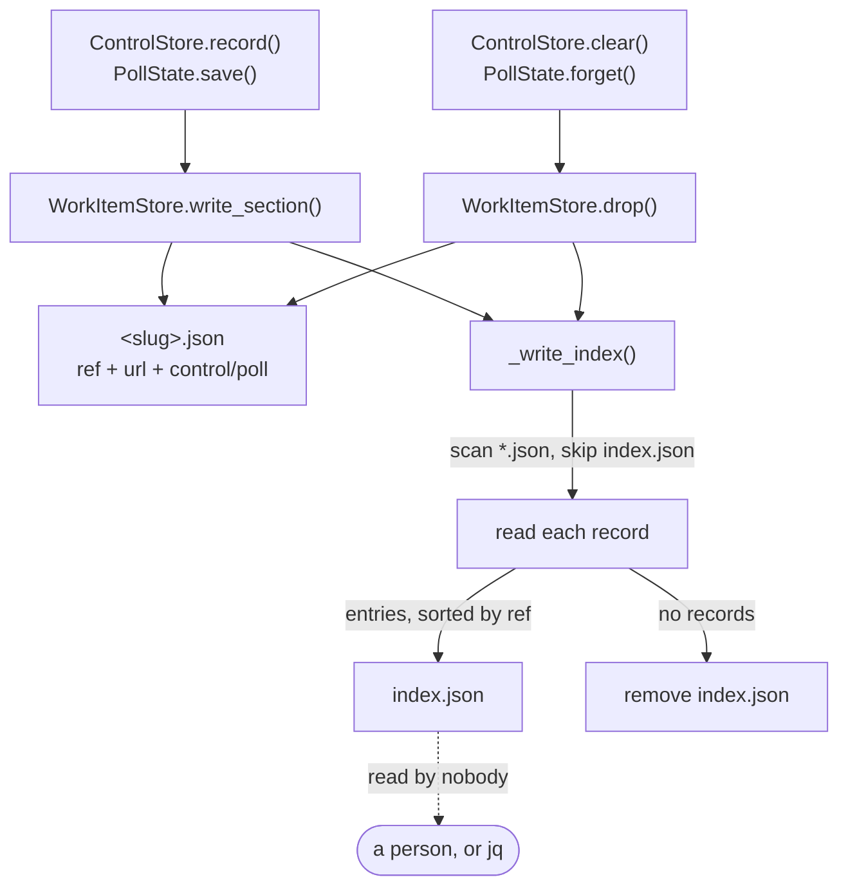
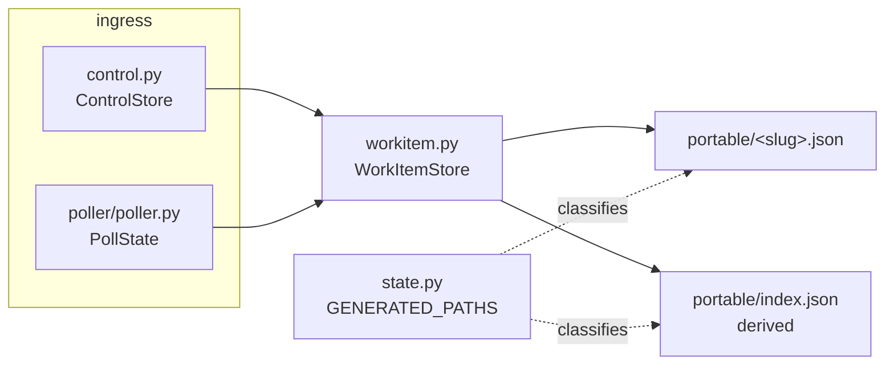

# Design: an index for `portable/`, and a ref you can click

> Phase 2 of 3 (requirements → design → tasks). Derives from the approved
> requirements. MUST be reviewed and approved before moving to tasks breakdown.

## Overview

Three small pieces, one of which is a property on a dataclass:

1. **`WorkItemRef.url`** — the ref's browser form, or `""` when one cannot be derived.
   One property, no I/O, no config. (R3)
2. **`WorkItemStore` maintains `index.json`** — after every record write and every drop,
   the directory is rescanned and the index rewritten atomically; an empty directory has
   its index removed. Nothing reads it. (R1, R2)
3. **`StateLayout.portable_index` + a `GENERATED_PATHS` entry** — the index goes through
   the same "does this travel?" gate as every other generated path, which drags the
   documentation and the `.gitignore` parity tests along with it. (R4)

The `url` field on the record itself falls out of (1): `write_section` already stamps
`ref` on every write, and now stamps `url` beside it.



The dotted edge is the design. The index has exactly one consumer and it is not the-loop
(R1.6) — which is what makes a stale index a cosmetic problem rather than a behavioural
one, and what lets the write be best-effort.

## Architecture

Nothing new joins the architecture: this is one module (`the_loop.workitem`) gaining a
private helper, one dataclass (`WorkItemRef`) gaining a property, and one layout
declaration (`the_loop.state`) gaining an entry.

The **write path is the only integration point**, and it is already the single funnel
every writer goes through — `ControlStore` and `PollState` both reach the disk through
`WorkItemStore.write_section` / `.drop` ([issue-128 design §9](../issue-128/design.md)).
Maintaining the index there means no writer has to know it exists, and no future writer
can forget it.



## Components & interfaces

### `WorkItemRef.url` (`the_loop/sessions/registry.py`)

```python
@property
def url(self) -> str:
    """The work item's browser URL, or "" when one cannot be derived."""
```

- **Input:** the ref's own fields. No config, no network.
- **Output:** `https://github.com/<owner>/<repo>/issues/<number>` when `provider ==
  "github"` and both names match `[A-Za-z0-9._-]+`; `""` otherwise.
- **Why a property, not a function:** every caller that has a ref wants it in the same
  breath as `.slug`, and `.slug` is already a property with the same "derive a
  presentation of the identity" job.
- **`/issues/<n>` for a pull request:** GitHub redirects `…/issues/<n>` to `…/pull/<n>`
  when the number is a PR, so one form serves both. A ref carries no issue/PR
  discriminator, so no other form is derivable anyway.

### `WorkItemStore` index maintenance (`the_loop/workitem.py`)

```python
INDEX_FILE = "index.json"     # module constant, exported

def _write_json(self, path: Path, payload: dict) -> None:   # extracted from write_section
def _index_entries(self) -> List[dict]:                     # scan → entries, sorted by ref
def _write_index(self) -> None:                             # write or remove; never raises
```

- `write_section()` and `drop()` call `_write_index()` as their last act.
- `_index_entries()` reads every `*.json` except `INDEX_FILE` with the existing tolerant
  `_read_json`, skips anything that is not a mapping carrying a non-empty `ref`, and
  returns entries sorted by `ref`.
- `refs()` skips `INDEX_FILE` explicitly. It would already skip it (the index has no
  top-level `ref`), but "the index is not a record" is a rule worth stating once in code
  rather than relying on the shape of a different file.
- `_write_json` is the atomic writer already inline in `write_section` (`tempfile` +
  `os.replace`), lifted so the index gets the same guarantee. No new dependency, no new
  behaviour — the same bytes-on-disk contract for both files.

### `StateLayout.portable_index` (`the_loop/state.py`)

```python
@property
def portable_index(self) -> str:
    return str(self.root_path / "portable" / "index.json")
```

Plus a `GENERATED_PATHS` entry, `portable=True`. The declaration is inert data; adding it
is what makes `test_state_portability.py` require the documentation row and the
`.gitignore` verdict, so the docs cannot silently fall behind (R4.4).

## UI/UX design

N/A — a CLI/daemon work item with no user-facing surface. The rendered artifact, such as
it is, is a JSON file read in a terminal or a pull-request diff.

## Data models

### `<state.root>/portable/index.json`

```json
{
  "workItems": [
    {
      "ref": "github:octo/repo#15",
      "url": "https://github.com/octo/repo/issues/15",
      "file": "github-octo-repo-15.json",
      "sections": ["control", "poll"]
    },
    {
      "ref": "github:octo/repo#16",
      "url": "https://github.com/octo/repo/issues/16",
      "file": "github-octo-repo-16.json",
      "sections": [],
      "sealed": true
    }
  ]
}
```

| Field | Meaning |
|---|---|
| `workItems` | every record in the directory, ordered by `ref` |
| `ref` | the work item's identity, read from the record |
| `url` | the work item's page; **omitted** when it cannot be derived (R3.3) |
| `file` | the record's name inside `portable/` |
| `sections` | which of `control`/`poll` the record actually holds, in that order |
| `sealed` | present and `true` only for an upgrade tombstone |

An object at the top level rather than a bare array: it leaves room to add a sibling key
without changing the type of the file, at the cost of one line.

Omitted-when-empty (`url`, `sealed`) rather than `null`-when-empty, so the common entry
carries no noise and a reader never has to distinguish "absent" from "null".

### `<state.root>/portable/<slug>.json` — one new field

```json
{
  "ref": "github:octo/repo#15",
  "url": "https://github.com/octo/repo/issues/15",
  "control": { "…": "…" },
  "poll": { "…": "…" }
}
```

`url` is written on every write, immediately after `ref`, and omitted when it cannot be
derived. Records written by an earlier version gain it the next time they are written
(R3.4) — no migration, because there is nothing to lose by not having it.

Key order is normalised on write (`ref`, `url`, then the sections) so a record's shape
does not depend on the order its sections happened to be written in. This is cosmetic and
serves the same goal as the rest of the work item: a file a human reads.

## Error handling

| Failure | Behaviour | Why |
|---|---|---|
| A file in `portable/` is corrupt or not a record | Omitted from the index; a warning is already logged by `_read_json` | A stray file may not fail an arming write (R2.4) |
| The index cannot be written (read-only mount, full disk, races) | `OSError` caught, logged at warning, the record write still succeeds | The record is a fact; the index is a convenience. Losing the convenience must never lose the fact (R1.6) |
| The index cannot be removed when the last record goes | Same — logged, swallowed | Identical reasoning; a stale index is cosmetic |
| A crash between the record write and the index write | Index is stale until the next write | Nothing reads it; an active daemon rewrites it every poll cycle |
| Two machines write the index concurrently (git conflict) | Take either side; the next write rebuilds it from the directory | The reason a derived index is acceptable at all — see requirements § "The cost this reintroduces" |

Observability is the module's existing logger (`the-loop.workitem`) at the level the
module already uses for advisory failures — identical at dev-time and runtime.

## Security design

- **AuthN/AuthZ:** unchanged. Nothing here reads or writes a credential, and the index
  gates nothing. `start_requested` — the one state-driven authorization input — is
  untouched.
- **Input validation & injection surfaces:**
  - *Directory scan.* Every file is read through the existing tolerant `_read_json`;
    a non-mapping, an unparseable file, or a record with no `ref` is skipped. The scan
    is non-recursive and matches `*.json`, so a nested directory or a `.tmp` from the
    atomic writer is not read.
  - *Ref → URL interpolation.* The only string built from attacker-influenced data.
    Owner and repo must match `^[A-Za-z0-9._-]+$` before a URL is emitted — no `/`, so
    no path segment can be injected; no `:` or `@`, so no host or credentials can be
    smuggled; no `..`, since it is rejected as a whole name (`.` and `..` are not valid
    GitHub owner/repo names). Anything else yields `""` and the field is omitted.
  - *No shell, no subprocess, no network* anywhere in this change.
- **Secrets handling:** none present. The index carries refs, URLs, file names and section
  names — the same class of data as the records it indexes, all of it already on the
  ticket. The fields that would disclose something new (`cwd`, `harnessSessionId`) are in
  `local/`, and stay there.
- **Least privilege:** the store writes inside its own root only; paths are built with
  `Path` joins from a slug that is already regex-sanitised.
- **Fail-closed behaviour:** a URL that cannot be derived is omitted, not guessed; a
  record that cannot be read is omitted, not described from its filename.
- **Abuse-case coverage:**

  | Abuse case | Mechanism | Negative test |
  |---|---|---|
  | Forged index merged into a tracked repo | Nothing reads it; the next write rebuilds it | `test_the_index_is_rebuilt_not_trusted` |
  | Crafted owner/repo yields a link elsewhere | `^[A-Za-z0-9._-]+$` on both names, else no URL | `test_a_ref_that_is_not_github_shaped_gets_no_url` |
  | A corrupt neighbour file breaks arming | Tolerant read, entry skipped | `test_a_corrupt_neighbour_is_left_out_of_the_index` |
  | An unwritable index fails a `stop` | `OSError` caught and logged | `test_an_unwritable_index_does_not_fail_the_record_write` |

## Testing strategy

New unit tests in `cli/tests/test_portable_index.py` (the index and the URL), plus edits
to two existing files whose assertions this work item deliberately changes:

| Requirement | Test |
|---|---|
| R1.1, R1.2, R2.1, R2.2 | `test_the_index_lists_every_record_with_its_url` |
| R1.3 | `test_the_index_goes_when_the_last_record_goes` |
| R1.4, abuse 1 | `test_the_index_is_rebuilt_not_trusted` |
| R1.5 | `test_entries_are_ordered_by_ref` |
| R1.6, abuse 4 | `test_an_unwritable_index_does_not_fail_the_record_write` |
| R1.7 | `test_the_index_is_not_read_as_a_work_item_record` |
| R2.3 | `test_a_sealed_record_is_indexed_as_sealed` |
| R2.4, abuse 3 | `test_a_corrupt_neighbour_is_left_out_of_the_index` |
| R3.1, R3.4 | `test_a_record_carries_the_work_items_url` |
| R3.2 | asserted alongside R3.1 (the ref keeps its form) |
| R3.3, abuse 2 | `test_a_ref_that_is_not_github_shaped_gets_no_url` |
| R4.1–R4.4 | the existing `cli/tests/test_state_portability.py` (S1–S5), extended for the new portable path |

`cli/tests/test_workitem.py` has one assertion that the index deliberately invalidates
(`portable/` contains exactly the record files); it is updated to say what it meant —
exactly one *record*, beside the index.

No integration test: `testing.integrationTestGlobs` scopes those to webhook→session
routing scenarios, and nothing here is on that path. The end-to-end shape (both ingresses
writing, the index reflecting both) is covered as a unit test through the real
`ControlStore` and `PollState`, which is how `test_workitem.py` already exercises the
store.

Evidence: `make check` (ruff, ruff format, pyright, config validation, pytest) plus the
before/after of a real `portable/` directory in the pull-request briefing.

## Trade-offs & decisions

1. **Derived on every write, not incrementally maintained.** A scan is O(number of work
   items) tiny JSON reads per write, on a directory that holds one file per *actively
   tracked* work item. Incremental maintenance would be faster and would be able to drift.
   Recorded as [decision-047](../../decisions/decision-047.md).
2. **One shared file returns.** Accepted, bounded, and explained above and in the
   decision: derived means either side of a conflict is safe.
3. **`url` added, `ref` unchanged.** The alternative — redefining `ref` — is an in-place
   format break for a navigation aid (requirements § Analysis).
4. **JSON, not markdown.** Matches the directory it indexes and the tooling the state docs
   already assume (`jq`). Noted as reconsiderable in the requirements' out-of-scope.
5. **No `reindex` command.** The file self-repairs on the next write; a command would be a
   second producer of the same file.

## Open questions

- **Would a rendered (markdown) index serve the "easily navigable" ask better?** JSON is
  shipped for the reasons above; raised on the ticket, and a markdown rendering remains a
  small, additive follow-up if the answer is yes.
- **GitHub Enterprise.** The ref syntax carries no host, so `url` assumes `github.com`. If
  GHE support ever lands it will need a host on the ref, not a special case here.

## Review comments

<!-- appended by record-feedback when a human gate approves with comments -->
