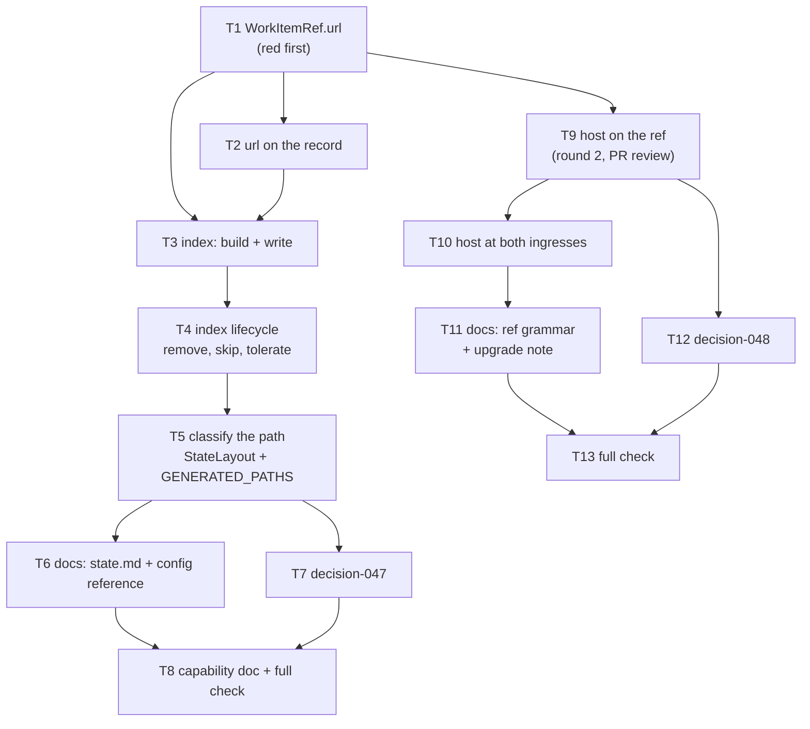

# Tasks: an index for `portable/`, and a ref you can click

> Phase 3 of 3 (requirements → design → tasks). A DAG of implementation tasks derived
> from the approved design. MUST be reviewed/approved before implementation begins.

## Task list

- [x] 1. `WorkItemRef.url` — the ref's browser form, fail-closed
  - Property on the dataclass in `the_loop/sessions/registry.py`; `""` for a non-`github`
    provider or an owner/repo that is not `^[A-Za-z0-9._-]+$`.
  - _Depends on:_ none
  - _Requirements:_ R3.3
  - _Test:_ `pytest cli/tests/test_portable_index.py::test_a_ref_that_is_not_github_shaped_gets_no_url`
    and `…::test_a_record_carries_the_work_items_url` (red→green)

- [x] 2. Stamp `url` on the record, normalise key order
  - `WorkItemStore.write_section` writes `ref`, then `url` (when non-empty), then the
    sections; a record written by an older version gains the field on its next write.
  - _Depends on:_ 1
  - _Requirements:_ R3.1, R3.2, R3.4
  - _Test:_ `…::test_a_record_carries_the_work_items_url` (red→green)

- [x] 3. Build and write the index
  - Extract the atomic writer (`_write_json`), add `_index_entries()` (scan, skip the
    index itself, skip unreadable/ref-less files, sort by `ref`) and `_write_index()`;
    call it at the end of `write_section` and `drop`.
  - _Depends on:_ 1, 2
  - _Requirements:_ R1.1, R1.2, R1.4, R1.5, R2.1, R2.2, R2.3
  - _Test:_ `…::test_the_index_lists_every_record_with_its_url`,
    `…::test_entries_are_ordered_by_ref`, `…::test_a_sealed_record_is_indexed_as_sealed`
    (red→green)

- [x] 4. Lifecycle and tolerance: removal, exclusion, best-effort write
  - Remove the index with the last record; `refs()` skips `index.json`; an `OSError`
    while writing or removing the index is logged, not raised.
  - _Depends on:_ 3
  - _Requirements:_ R1.3, R1.6, R1.7, R2.4
  - _Test:_ `…::test_the_index_goes_when_the_last_record_goes`,
    `…::test_the_index_is_not_read_as_a_work_item_record`,
    `…::test_an_unwritable_index_does_not_fail_the_record_write`,
    `…::test_a_corrupt_neighbour_is_left_out_of_the_index`,
    `…::test_the_index_is_rebuilt_not_trusted` (red→green)

- [x] 5. Classify the new generated path
  - `StateLayout.portable_index` + a `GENERATED_PATHS` entry (`portable=True`); update the
    "exactly the world facts are portable" pin in `cli/tests/test_state_portability.py`,
    and the `portable/` glob assertion in `cli/tests/test_workitem.py`.
  - _Depends on:_ 4
  - _Requirements:_ R4.1, R4.4
  - _Test:_ `pytest cli/tests/test_state_portability.py` (S1–S5 red until the docs row of
    T6 lands, which is the point of the gate)

- [x] 6. Documentation: the state page and the config reference
  - `docs/cli/state.md`: the tree, the classification row, a section for the index
    (shape, lifecycle, what is lost, conflict resolution), the `url` field in the record
    shape; `docs/config/cli/index.md`: the `state.root` table row.
  - _Depends on:_ 5
  - _Requirements:_ R4.2, R4.3
  - _Test:_ `pytest cli/tests/test_state_portability.py cli/tests/test_docs_parity.py`
    (green: declaration, docs and recipe agree)

- [x] 7. `decision-047` — a derived index, and the shared file it reintroduces
  - The decision and its row in `docs/decisions/decisions.md`.
  - _Depends on:_ 5
  - _Requirements:_ R1.4, R1.6
  - _Test:_ `make lint` (markdownlint over the new page)

- [x] 8. Capability doc + the full gate
  - Update `docs/capabilities/cli.md` (the living view of current behaviour) with the
    index and the `url` field, then run the whole gate.
  - _Depends on:_ 6, 7
  - _Requirements:_ all
  - _Test:_ `make check` (lint, format-check, typecheck, validate, test)

## Round 2 — PR #131 review: the host is knowable, so it is in scope

- [x] 9. The host on the ref (PR review, R5)
  - `DEFAULT_GITHUB_HOST`, `host_from_url`, `WorkItemRef.host` (normalised),
    `default_host`/`path`, `parse` accepting `[<host>/]<owner>/<repo>` and rejecting
    everything else, `slug` and `url` derived from `path`/`host`.
  - _Depends on:_ 1
  - _Requirements:_ R5.1, R5.4, R5.5
  - _Test:_ `pytest cli/tests/test_portable_index.py::test_a_work_item_on_another_host_links_to_that_host`,
    `…::test_a_ref_with_an_unreadable_path_is_rejected_outright` (red→green)

- [x] 10. Identify the host at both ingresses
  - Router: `_host(payload)` from `repository.html_url`, falling back to the issue/PR URL;
    poller: `WorkItem.host` from the item's own URL, and `WorkItem.ref` built through
    `WorkItemRef` so the two derivations cannot drift.
  - _Depends on:_ 9
  - _Requirements:_ R5.2, R5.3, R5.6
  - _Test:_ `pytest cli/tests/test_routing.py -k host`,
    `cli/tests/test_poller.py::test_a_polled_item_is_identified_with_the_host_it_lives_on`
    (red→green)

- [x] 11. Documentation for the host, including the upgrade note
  - `docs/cli/concepts.md` (the ref grammar), `docs/cli/state.md` (the GHE tip and the
    re-identification warning), `docs/capabilities/cli.md`.
  - _Depends on:_ 10
  - _Requirements:_ R5.1–R5.6
  - _Test:_ `make lint` + `pytest cli/tests/test_docs_parity.py`

- [x] 12. `decision-048` — a ref names its host when it is not the default one
  - The decision, its row in `docs/decisions/decisions.md`, and the requirements/design
    corrections it follows from.
  - _Depends on:_ 9
  - _Requirements:_ R5
  - _Test:_ `make lint`

- [x] 13. The full gate, again
  - _Depends on:_ 11, 12
  - _Requirements:_ all
  - _Test:_ `make check`
