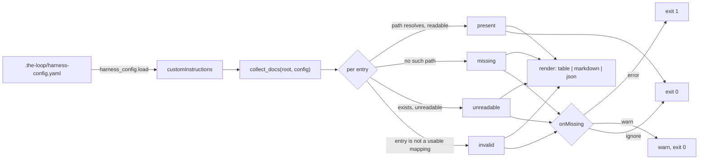

# Design: verifiable custom instructions — make `customInstructions` findable and checkable

> Phase 2 of 3 (requirements → design → tasks). Derives from the approved
> requirements. MUST be reviewed and approved before moving to tasks breakdown.

## Overview

One new read-only CLI command, `the-loop instructions`, plus documentation that makes the
existing `customInstructions` feature visible from the front door.

The command is deliberately the **same shape as `the-loop scenarios`**. That command
exists for exactly this class of problem: an obligation the loop places on the agent
(Gherkin docstrings) that nothing could observe until a command made it queryable. Custom
instructions are the same obligation in a different territory, so they get the same answer
rather than a new mechanism (`reference/minimalism.md`: reuse before invention).

Two files carry the logic, mirroring how `scenarios` is split:

| Layer | File | Responsibility |
|-------|------|----------------|
| Domain | `cli/the_loop/instructions.py` | resolve config entries → `InstructionDoc` records; no I/O policy, no rendering |
| Command | `cli/the_loop/commands/instructions_cmd.py` | argparse surface, rendering, `onMissing` → exit code |

Why the split, given it is a small command: the domain half is what the *hook layer or a
future graph gate* would call, and it is the half worth testing without argparse in the
way. `scenarios.py` / `commands/scenarios.py` already establish the seam, so following it
costs nothing and diverging would.



## Architecture

The command sits alongside the other pure, CI-safe reporters (`check`, `scenarios`,
`graph status`). It touches none of the daemon surface, and it adds the **sixth** entry to
`harness_config.READS` — the enumerable list of keys the CLI reads from a repository,
pinned by `test_harness_config.py` against both the schema and the docs (decision-044).

`customInstructions` qualifies under decision-044's directional rule without strain: which
conventions govern work on *this* repository is a fact about this repository, and a daemon
watching N repos cannot know it for each of them. It configures work done **on** the
repository, never the daemon itself.

Nothing in the process graph changes. The obligation `customInstructions` creates is
per-work-item ("read every configured doc when starting work on an item"), not per-node,
so a `pdlc.yaml` hook would attach a per-node gate to a non-per-node duty — and, because
`the-loop check` only ever runs **exit** chains (`Runtime.evaluate`), an entry-chain hook
would be invisible to CI anyway. The command is the mechanism; the skill and the granular
commands tell the agent to run it.

## Components & interfaces

### `the_loop.instructions` (domain)

```python
STATES = ("present", "missing", "unreadable", "invalid")

@dataclass(frozen=True)
class InstructionDoc:
    path: str            # exactly as configured ("" when the entry had no usable path)
    resolved: str        # absolute path, or "" when there was nothing to resolve
    state: str           # one of STATES
    notes: str = ""
    detail: str = ""     # why an invalid/unreadable entry is what it is
    size: int = -1       # bytes, present docs only; -1 otherwise

    @property
    def resolved_ok(self) -> bool:  # counts toward onMissing
        return self.state == "present"

    def as_dict(self) -> dict: ...

def collect_docs(root: Path, config: Mapping[str, Any]) -> list[InstructionDoc]
def on_missing(config: Mapping[str, Any]) -> str          # warn | error | ignore
def unresolved(docs: Sequence[InstructionDoc]) -> list[InstructionDoc]
```

`collect_docs` takes an **already-loaded** config mapping rather than a root alone. Two
reasons: H2 in `test_harness_config.py` requires that only `harness_config.py` opens a
harness config file, and taking the mapping keeps this module trivially testable without
a fixture directory.

Resolution rules, in order, per entry:

1. entry is not a mapping, or `path` is absent/blank/not a string → `invalid`, `detail`
   naming the shape found. It counts as unresolved, because a registration the-loop
   could not understand is a registration whose guidance is not reaching the agent —
   and silence there is the defect this work item removes.
2. `Path(path).is_absolute()` → used as given (per-machine docs, decision-029);
   otherwise resolved against `root`.
3. nothing resolves at the path (`exists()` is false — including a **broken symlink**,
   since `exists()` follows links) → `missing`.
4. something resolves but is not a regular file (directory, device node) → `unreadable`,
   `detail` `"not a regular file"`. Deliberately **not** `missing`: the operator's path
   is not wrong, the target is, and telling them "missing" would send them looking in
   the wrong place.
5. readable as UTF-8 text → `present`, with `size` in bytes.
6. `OSError` / `UnicodeDecodeError` (permission denied, binary content) → `unreadable`,
   `detail` carrying the error class and message.

### `the_loop.commands.instructions_cmd` (surface)

```
the-loop instructions [--root PATH] [--format table|markdown|json]
```

Columns: `#`, `State`, `Path`, `Resolved`, `Notes`. Renderers are the same three
functions `scenarios` uses, kept local to the module because they are twelve lines each
and a shared "render any list of dataclasses as a table" abstraction would be the bloat
`reference/minimalism.md` warns about — the ladder stops at *inline* here, deliberately.

Exit code is a function of `onMissing` and the unresolved set only (R2), never of the
output format.

## UI/UX design

N/A — CLI and documentation only, no user-facing product surface (`design.uiArtifacts`).

## Data models

No persisted model. `InstructionDoc` is an in-memory record; the JSON rendering is its
`as_dict()`, and it is the command's public contract for a harness that shells out to it.

The `customInstructions` **schema is unchanged** — this work item observes the existing
shape, it does not extend it.

## Error handling

| Failure | Behaviour | Why |
|---------|-----------|-----|
| No harness config / unparseable / not a mapping | zero docs, exit 0 | `harness_config.load` is best-effort by contract; a half-edited config must not fail a build for an unrelated reason (R2.5) |
| `customInstructions` absent, or `docs` empty/null | zero docs, exit 0 | configuring nothing is not an error (R1.6) |
| `docs` is not a list | treated as zero docs, warning logged | fail closed to "nothing registered" rather than crash |
| One entry unusable | that entry is `invalid`; the others still report | aggregate the whole picture in one run, like `validate-artifacts` does (R3.5 of issue-109) |
| Doc missing / unreadable | state recorded; exit code per `onMissing` | R2 |

Logging follows `observability.md`: the warning under `onMissing: warn` goes through the
`the-loop.instructions` logger, identical at dev-time and runtime.

## Security design

- **AuthN/AuthZ:** none introduced. The command runs with the invoking operator's own
  privileges and performs no privileged action; it grants no access the caller did not
  already have to their own filesystem.
- **Input validation & injection surfaces:** the untrusted-ish ingress is the harness
  config, which a PR may edit.
  - **Path traversal is not a boundary here — it is the feature.** Absolute and
    out-of-repo paths are supported by decision-029 (per-machine, company-wide docs), so
    the design does **not** confine paths to the repository. What it does instead is make
    the *read* inert.
  - **The enforced trust boundary is output, not access.** The command reports facts
    *about* a doc — configured path, resolved path, state, byte count — and never its
    contents. A hostile doc body therefore has no channel into the output at all, which
    is the mechanism defeating abuse case 1.
  - **Rendering neutralises metacharacters.** `--format json` goes through
    `json.dumps`, which escapes control characters by construction; `--format markdown`
    escapes `|` exactly as `scenarios` does, so a crafted `notes` cannot forge table
    structure (abuse case 3). Terminal control sequences in a path are inert as data in
    both machine formats; the table renderer prints them as the bytes they are, and this
    is accepted — it is the operator's own config file, at the same trust level as the
    config that already configures executable critics.
  - **The command never reads a doc as instruction.** It is a reporter; it does not feed
    doc content to a model, evaluate it, or act on it. That distinction is the whole
    reason `size` is reported instead of a preview.
- **Secrets handling:** none read, none written, none logged. A doc's contents never
  enter the output, so a doc that happens to contain a secret is not leaked by running
  this command.
- **Least privilege:** filesystem reads only. No network, no subprocess, no mutation —
  the same purity contract `the-loop check` holds, and the reason both are CI-safe.
- **Fail-closed behaviour:** every state the command cannot positively confirm as
  `present` counts as unresolved for `onMissing`. `invalid` counts too. A config the
  command cannot parse at all yields zero docs — nothing is claimed to have been read.
- **Abuse-case coverage:**

  | Abuse case (requirements) | Mechanism | Negative test |
  |---------------------------|-----------|---------------|
  | 1 — path outside the repository | contents are never rendered; only path/state/size | `test_doc_contents_never_reach_the_report`, `test_a_hostile_doc_body_never_reaches_the_report` |
  | 2 — directory / broken symlink / binary / unpermitted file | `exists()` then `is_file()` gate, then `OSError`/`UnicodeDecodeError` caught → `missing` or `unreadable`, never an unhandled raise | `test_a_directory_is_unreadable_not_a_crash`, `test_a_broken_symlink_is_missing`, `test_a_binary_file_is_unreadable`, `test_an_unpermitted_file_is_unreadable` |
  | 3 — metacharacters in `notes`/`path` | `json.dumps` encoding; `\|` escaped in markdown | `test_markdown_escapes_pipes_in_notes` |
  | 4 — malformed harness config | `harness_config.load` degrades to `{}` → zero docs, exit 0 | `test_unparseable_config_reports_nothing_and_succeeds` |

## Testing strategy

Unit tests in `cli/tests/test_instructions.py` cover resolution (R1.1–R1.6), the exit-code
matrix (R2.1–R2.5) and the abuse cases above — pure `tmp_path` filesystem work, no
fixtures, in the idiom of `test_harness_config.py`.

One **integration** test, `cli/tests/test_instructions_integration.py`, drives the command
end-to-end through the registered CLI entry point against a real repository layout, with
the Gherkin docstring `config.testing` requires and a `Requirement:` link back to this
spec. It is matched by `testing.integrationTestGlobs` (`cli/tests/test_*_integration.py`),
so `the-loop scenarios` picks it up — this work item's own obligation, honoured.

Three existing suites gate the surrounding contract and must stay green without being
weakened:

- `test_harness_config.py` H1/H3/H4 — the new `READS` entry resolves in the schema and is
  documented in both directions.
- `test_harness_config.py` H2 — the new module must not open a config file itself.
- `test_docs_parity.py` P1/P2 — the new command needs a page under `docs/cli/commands/`.

Evidence: red→green per task, plus `the-loop instructions` run against this repository
(which registers zero docs, exercising R1.6) and against a fixture that registers a
missing one under each `onMissing` value.

## Trade-offs & decisions

- **A command, not a graph hook.** Considered attaching `validate-instructions` to
  `pdlc.yaml`. Rejected on two grounds: the obligation is per-work-item rather than
  per-node, and `check` runs only exit chains, so an entry-chain hook — the semantically
  correct place — would never be reported by CI. Recorded as
  [decision-049](../../decisions/decision-049.md).
- **Report `size`, not a content preview.** A preview would be more informative and would
  hand a hostile doc a channel into the operator's terminal. The requirement is
  "did it resolve", and `size` answers it without opening that channel.
- **`invalid` counts as unresolved.** The alternative — ignoring malformed entries — is
  precisely the silence #132 is about.
- **No schema change.** Globs and phase-scoping were considered and deferred to a future
  work item (requirements § Out of scope); they are now cheap to add against a shape that
  is finally observable.

## Open questions

None. Scope was agreed with the requester before phase 1
([#132 comment](https://github.com/MadaraUchiha-314/the-loop/issues/132#issuecomment-5170995297)).

## Review comments

> Appended by the-loop's `record-feedback` hook when a human gate approves with
> comments (issue-109). Append-only and attributed: an approval never silently
> discards a reviewer's suggestions, and the feedback travels with the document
> it concerns rather than living in a side-channel tracker.
