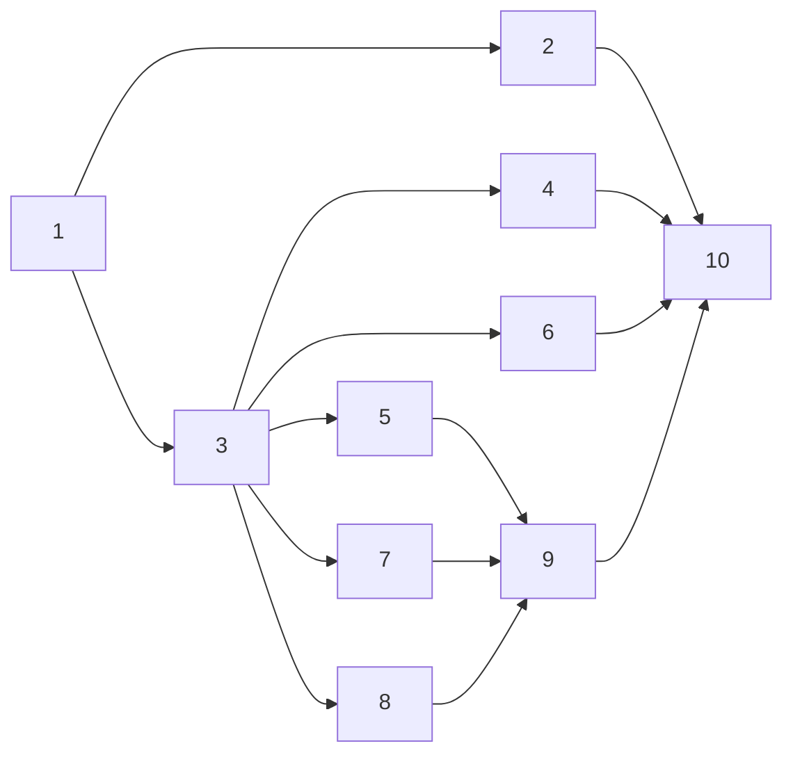

# Tasks: verifiable custom instructions — make `customInstructions` findable and checkable

> Phase 3 of 3 (requirements → design → tasks). A DAG of implementation tasks derived
> from the approved design. MUST be reviewed/approved before implementation begins.
> Once approved, the-loop executes these end-to-end with minimal/no intervention.

## Task list

- [x] 1. Resolve registered docs into `InstructionDoc` records
  - New `cli/the_loop/instructions.py`: `InstructionDoc`, `STATES`, `collect_docs`,
    `on_missing`, `unresolved`.
  - Resolution ladder from the design: `invalid` → absolute-vs-root → `missing` →
    `present` (+ `size`) → `unreadable`.
  - Takes an already-loaded config mapping, so H2 holds and no fixture dir is needed.
  - _Depends on:_ none
  - _Requirements:_ R1.1–R1.6
  - _Test:_ `pytest cli/tests/test_instructions.py -k resolve` (red→green)

- [x] 2. Cover the abuse cases as negative tests
  - Directory → `unreadable`; broken symlink → `missing`; binary file → `unreadable`;
    absolute out-of-repo path reported without contents; malformed entry → `invalid`.
  - Security-relevant: proves the §Security design boundary "contents never reach the
    output" and the fail-closed rule.
  - _Depends on:_ 1
  - _Requirements:_ R1.3, R1.4, R1.5, Security abuse cases 1–2
  - _Test:_ `pytest cli/tests/test_instructions.py -k "abuse or unreadable or directory"` (red→green)

- [x] 3. Register the `instructions` command with rendering and exit codes
  - New `cli/the_loop/commands/instructions_cmd.py`: `--root`, `--format
    table|markdown|json`; the three renderers in the `scenarios` idiom.
  - Exit code from `onMissing` × unresolved set; warning through the
    `the-loop.instructions` logger under `warn`.
  - _Depends on:_ 1
  - _Requirements:_ R1.1, R1.7, R2.1–R2.5
  - _Test:_ `pytest cli/tests/test_instructions.py -k "format or exit or onmissing"` (red→green)

- [x] 4. Markdown/JSON rendering neutralises metacharacters
  - `|` escaped in markdown; `json.dumps` for JSON. Security-relevant (abuse case 3).
  - _Depends on:_ 3
  - _Requirements:_ R1.7, Security abuse case 3
  - _Test:_ `pytest cli/tests/test_instructions.py -k escape` (red→green)

- [x] 5. Declare and document the new harness-config read
  - `harness_config.READS` gains `customInstructions` (command `instructions`, with its
    _why_); add the row to the CLI-read table in `docs/config/harness-config.md`.
  - _Depends on:_ 3
  - _Requirements:_ R3.1, R3.2, R3.4
  - _Test:_ `pytest cli/tests/test_harness_config.py -k "h1 or h2 or h3 or h4"` (red→green)

- [x] 6. Integration test with a Gherkin scenario
  - `cli/tests/test_instructions_integration.py` drives the registered command end-to-end
    against a real repo layout; Gherkin docstring + `Requirement:` link to this spec, so
    `the-loop scenarios` reports it.
  - _Depends on:_ 3
  - _Requirements:_ R1.1, R2.1–R2.3
  - _Test:_ `pytest cli/tests/test_instructions_integration.py` (red→green)

- [x] 7. Command page + site navigation
  - `docs/cli/commands/instructions.md`, listed in `docs/cli/commands/index.md` and the
    VitePress nav/sidebar.
  - _Depends on:_ 3
  - _Requirements:_ R3.3
  - _Test:_ `pytest cli/tests/test_docs_parity.py -k "p1 or p2"` (red→green)

- [x] 8. Close the front-door discoverability gap
  - README: state that the-loop reads the project's own registered instruction docs, link
    the reference, complete the reference-doc enumeration, list the new CLI command.
  - `reference/instructions.md`: a "Verifying a registration" section naming the command.
  - _Depends on:_ 3
  - _Requirements:_ R4.1–R4.3
  - _Test:_ `make lint` (markdownlint) + manual read-through

- [x] 9. Fold in the capability docs and the decision record
  - Update the affected capability doc(s) with the new behaviour + history row; add
    `docs/decisions/decision-049.md` (command, not graph hook) and index it.
  - _Depends on:_ 5, 7, 8
  - _Requirements:_ all (ready-to-ship gate)
  - _Test:_ `make lint` + review

- [x] 10. Gates, evidence, reviews
  - `ruff`, `pyright`, `pytest`, `markdownlint`; record evidence in the execution log;
    run the self-review rounds and the security review gate.
  - _Depends on:_ 1–9
  - _Requirements:_ all
  - _Test:_ full `make` gate run

## Dependency graph (DAG)

## Checkpoints

- After task 2: the domain layer is complete and adversarially tested — the point at
  which the security boundary is proven rather than asserted.
- After task 4: the command is behaviourally complete; the rest is contract and prose.
- After task 9: the ready-to-ship gate's capability-docs item is satisfied.
- After task 10: evidence recorded, reviews run, reviewer briefing posted.

## Review comments

> Appended by the-loop's `record-feedback` hook when a human gate approves with
> comments (issue-109). Append-only and attributed: an approval never silently
> discards a reviewer's suggestions, and the feedback travels with the document
> it concerns rather than living in a side-channel tracker.
