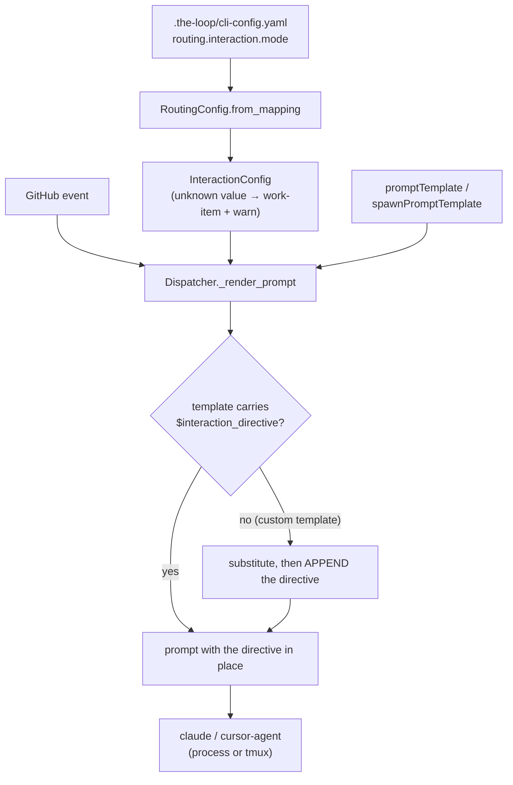

# Design: say where a spawned session takes its answers from — CLI or the work item

> Phase 2 of 3 (requirements → design → tasks). Derives from the approved
> requirements. MUST be reviewed and approved before moving to tasks breakdown.

## Overview

One new config block, one new placeholder, one new module:

| Piece | Where | Responsibility |
|-------|-------|----------------|
| `routing.interaction.mode` | `.the-loop/cli-config.schema.json` | the operator's declaration: `work-item` \| `cli` |
| `cli/the_loop/interaction.py` | new module | resolve the mode, own the directive text |
| `$interaction_directive` | both prompt templates + both built-in fallbacks | the channel the directive travels on |
| the artifact rule | `SKILL.md`, `reference/collaboration.md` | binds every session, daemon-driven or not |

The shape follows the modules that already sit beside it — `trust.py`, `announce.py`,
`authz.py` are each one small domain module the dispatcher composes. Nothing here needs a
new mechanism: the dispatcher already renders a `string.Template` at exactly one place, so
a placeholder is the whole delivery system.

## Architecture



The resolution is deliberately boring: the mode is read once when `RoutingConfig` is built
(and rebuilt on hot-reload, like every other soft routing setting), and the directive is a
pure function of it.

## Components & interfaces

### `cli/the_loop/interaction.py`

```python
MODES: tuple[str, ...] = ("work-item", "cli")
DEFAULT_MODE = "work-item"
PLACEHOLDER = "interaction_directive"

@dataclass(frozen=True)
class InteractionConfig:
    mode: str = DEFAULT_MODE

    @classmethod
    def from_mapping(cls, data: dict) -> "InteractionConfig": ...

    @property
    def directive(self) -> str: ...          # constant text per mode

def apply_directive(rendered: str, template_text: str, directive: str) -> str: ...
```

Three properties are worth stating, because each one is a test:

1. **`from_mapping` never raises and never returns an undeclared mode.** A missing block,
   `None`, a non-string, or `"CLI "` with stray case/whitespace all resolve — the last by
   normalising (`strip().lower()`), the rest by falling back to `work-item` with a warning
   on the `the-loop.interaction` logger. The schema `enum` is the *authoring*-time gate;
   this is the runtime one, and the daemon does not validate against the schema at load.
2. **The one unworkable combination warns.** `from_mapping` takes the resolved
   `routing.runner` alongside the mapping purely to say so: `cli` under the headless
   `process` runner is a session told to ask a human with no terminal to answer in. It
   warns rather than refusing or overriding — the operator's declaration stands.
3. **`directive` is a constant per mode.** No interpolation at all — not even the work-item
   ref (which the templates already carry in `$work_item`). That is what makes the security
   argument short: there is no path from payload data into this string.
4. **`apply_directive` is where the fail-safe lives.** `Template.safe_substitute` silently
   ignores a placeholder the template never declared, which is exactly how a custom
   template would drop the rule without anyone noticing. So the rendered prompt is only
   trusted to carry the directive when the template text actually declares
   `$interaction_directive` / `${interaction_directive}`; otherwise the directive is
   appended after the body.

### The directive text

Both modes share a closing paragraph — the artifact rule (R3.4) — and differ in the
channel:

- **`work-item`**: do not assume a human is watching this terminal (it may be a headless
  pipe, or a tmux pane nobody has attached to); ask on the work item / its PR, mark the
  comment as the-loop's own (loop-prevention marker), then stop and wait for the reply to
  arrive as a new event. Never block on an interactive prompt; never read silence as
  consent — log the conflict and escalate once, per the-loop's rules.
- **`cli`**: a human is attached to this session; ask here, interactively. The paper-trail
  rule still holds — the *outcome* of every decision is recorded on the work item.

### Dispatcher wiring

```python
# RoutingConfig
interaction: InteractionConfig = field(default_factory=InteractionConfig)
# …from_mapping
interaction=InteractionConfig.from_mapping(data.get("interaction") or {}),

# _render_prompt
rendered = template.safe_substitute(..., interaction_directive=directive)
return apply_directive(rendered, template.template, directive)
```

`_render_prompt` is the single choke point for both the resume path (line ~1065) and the
spawn path (line ~1153), and the poller reuses the same dispatcher — so one edit covers
both ingresses and both runners. `reload()` needs no change: it reassigns `self.config`,
and `_render_prompt` reads `self.config.interaction` at dispatch time.

The resolved mode is added to both `session.spawned` emits (process and tmux), which is
the R1.5 observability requirement and costs one keyword argument.

## Data models

`.the-loop/cli-config.schema.json`, under `webhooks.ghWebhook.routing`:

```json
"interaction": {
  "type": "object",
  "additionalProperties": false,
  "properties": {
    "mode": { "type": "string", "enum": ["work-item", "cli"], "default": "work-item" }
  }
}
```

Additive: no key removed, no key moved, so `CURRENT_CONFIG_VERSION` stays `0.3.0` and
`migrations.py` is untouched. An operator on an older config gets the default.

## Error handling

| Failure | Behaviour |
|---------|-----------|
| `interaction` absent / `null` / not a mapping | `work-item`, silently (nothing was declared, so nothing is wrong) |
| `mode` unknown or not a string | `work-item` + `logger.warning` naming the value and the valid set |
| `mode: cli` with `runner: process` | honoured + `logger.warning` — the declaration stands, the mismatch is said out loud |
| custom template without the placeholder | directive appended; `logger.debug` |
| template file missing | unchanged — the built-in fallback already carries the placeholder |

Nothing here can fail the dispatch: an interaction directive is guidance the prompt
carries, so a wrong config degrades to the safe mode rather than dropping an event.

## Security design

Enforces every boundary from `requirements.md` § Security considerations.

- **The directive is trusted text on the trusted side of the existing boundary.** It is
  selected by a closed enum from a local file the operator owns, and it is emitted
  **before** the `$payload_excerpt` block that both templates already label as untrusted.
  No payload field reaches it.
- **Fail closed on ambiguity** (abuse case 2): an unrecognised mode resolves to
  `work-item`, never `cli`. Asymmetry is the point — a `work-item` mistake leaves a visible
  comment awaiting a reply, a `cli` mistake leaves a question in a pipe nobody reads.
- **The rule cannot be stripped by a template edit** (abuse case 3): `apply_directive`
  appends when the placeholder is absent. This is the one place the design chooses
  belt-and-braces over minimalism, because `safe_substitute`'s silence is precisely the
  failure mode.
- **No new attack surface otherwise**, written rather than implied: no network, no
  subprocess, no filesystem access, no credential, no new dependency, no change to the
  authorized-actor guard or the loop-prevention marker.
- **Sensitive path.** `.the-loop/cli-config.schema.json` matches
  `autonomy.sensitivePaths` (`**/*schema*`), which raises the effective risk tier to 4 →
  `human-approves-pr` **and** a named human security sign-off
  (`security.review.humanSignOffMinTier: 4`). Requested on the PR; see the execution log.

## Testing strategy

`tdd.mode: standard` — a failing test motivates each unit.

| Level | File | Covers |
|-------|------|--------|
| unit | `cli/tests/test_interaction.py` | resolution ladder, the fallback, directive content per mode, `apply_directive` |
| integration | `cli/tests/test_interaction_integration.py` | end-to-end through `Dispatcher._render_prompt` for both modes, both templates, and a custom template with no placeholder — Gherkin docstrings (`testing.gherkinDocstrings: required`) |
| parity | `cli/tests/test_interaction.py` | bundled templates ≡ built-in fallbacks, and both declare the placeholder (R2.5) |
| docs parity | existing `cli/tests/test_docs_parity.py` | P4/P5 force the new schema leaf to be documented with Type/Default |

The parity test is new leverage, not just coverage: `dispatcher.py` has carried a "Kept in
sync with skills/…" comment since issue-36 with nothing enforcing it. This change edits
both copies, so it is the moment to make the claim mechanical.

## Trade-offs & decisions

Recorded in [decision-051](../../decisions/decision-051.md):

1. **Two values, no `auto`.** An `auto` that derives the mode from `routing.runner` sounds
   helpful, but `runner` is *receiver-global* — so `auto` would be a static alias for a
   fixed mapping, i.e. a third name for two behaviours. Rejected as dead weight
   (`reference/minimalism.md`).
2. **Default `work-item`, not "whatever the runner suggests".** A tmux session is
   *attachable*, not *attended*; the-loop even announces the attach command precisely
   because nobody is there yet. The default must be the channel that reaches a human who
   was not watching.
3. **The artifact rule is an invariant, not a third setting.** The issue states it
   absolutely, and it holds in both modes: a checked-in file's review surface is the PR
   that carries it. Making it configurable would invite a configuration in which generated
   artifacts get reviewed nowhere. Its home is the skill (so it binds human-started
   sessions too), with a one-line restatement in the daemon prompt.
4. **Directive text lives in code, not in a template file.** A file could be edited to say
   the opposite of what the config declares; the constant cannot. Templates keep the
   *slot*, code keeps the *content*.

## Open questions

None.

## Review comments

> Appended by the-loop's `record-feedback` hook when a human gate approves with comments.
