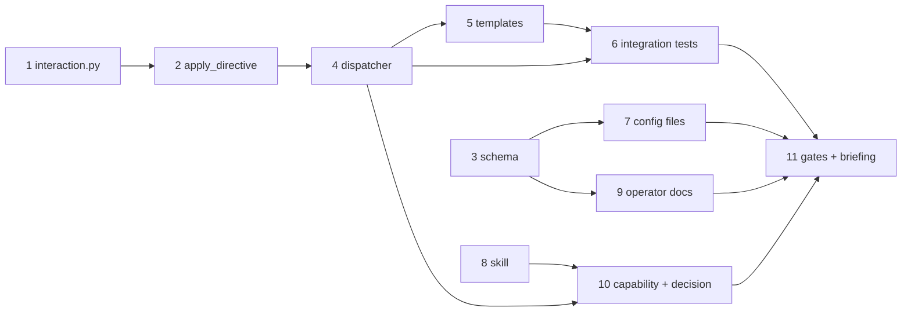

# Tasks: say where a spawned session takes its answers from — CLI or the work item

> Phase 3 of 3 (requirements → design → tasks). A DAG of implementation tasks derived
> from the approved design. MUST be reviewed/approved before implementation begins.

## Task list

- [x] 1. `interaction.py` — resolve the mode and own the directive text
  - New `cli/the_loop/interaction.py`: `MODES`, `DEFAULT_MODE`, `PLACEHOLDER`,
    `InteractionConfig.from_mapping`, `InteractionConfig.directive`, `apply_directive`.
  - Resolution ladder: absent/`None`/non-mapping → default silently; unknown or
    non-string `mode` → default **+ warning**; case/whitespace normalised.
  - _Depends on:_ none
  - _Requirements:_ R1.1, R1.2, R1.3, R2.2, R2.3
  - _Test:_ `pytest cli/tests/test_interaction.py -k "resolve or fallback or directive"` (red→green)

- [x] 2. `apply_directive` — a custom template cannot drop the rule
  - Appends the directive when the template text declares neither
    `$interaction_directive` nor `${interaction_directive}`; no-ops when it does.
  - _Depends on:_ 1
  - _Requirements:_ R2.4, Security abuse case 3
  - _Test:_ `pytest cli/tests/test_interaction.py -k apply` (red→green)

- [x] 3. Schema: the `interaction` block
  - `.the-loop/cli-config.schema.json` gains `routing.interaction` (`additionalProperties:
    false`) with the `mode` enum and its default; no version bump, no migration.
  - _Depends on:_ none
  - _Requirements:_ R1.4
  - _Test:_ `uv run python scripts/validate_config.py` + a schema test that an undeclared
    value is rejected

- [x] 4. Wire it into the dispatcher
  - `RoutingConfig.interaction` + `from_mapping`; `_render_prompt` substitutes and then
    calls `apply_directive`; the resolved mode joins both `session.spawned` emits.
  - _Depends on:_ 1, 2
  - _Requirements:_ R1.1, R1.5, R2.1
  - _Test:_ `pytest cli/tests/test_interaction_integration.py` (red→green)

- [x] 5. Templates carry the placeholder (both copies)
  - `skills/the-loop/templates/webhook-event-prompt.md`,
    `skills/the-loop/templates/webhook-autoexecute-prompt.md`, and the
    `DEFAULT_PROMPT_TEMPLATE` / `DEFAULT_SPAWN_TEMPLATE` constants — directive placed
    **above** the untrusted payload block.
  - _Depends on:_ 4
  - _Requirements:_ R2.1, R2.5, Security abuse case 1
  - _Test:_ parity test in `cli/tests/test_interaction.py`

- [x] 6. Integration tests with Gherkin docstrings
  - `cli/tests/test_interaction_integration.py`: both modes × both prompt paths, the
    custom-template fallback, and the hostile-comment abuse case.
  - _Depends on:_ 4, 5
  - _Requirements:_ R2.1–R2.5, abuse cases 1–3
  - _Test:_ `pytest cli/tests/test_interaction_integration.py`

- [x] 7. Config files: this repo's own + the `/init` template
  - `.the-loop/cli-config.yaml` and `skills/the-loop/templates/cli-config.yaml` gain the
    block, commented in the house style (what it is, why the default).
  - _Depends on:_ 3
  - _Requirements:_ R1.1, R4.1
  - _Test:_ `uv run python scripts/validate_config.py`

- [x] 8. The skill: the artifact-iteration rule and the channel rule
  - `skills/the-loop/reference/collaboration.md` — the full rule (§ Where questions go);
    `SKILL.md` — one operating principle; `reference/automation.md` — name the knob.
  - _Depends on:_ none
  - _Requirements:_ R3.1, R3.2, R3.3
  - _Test:_ `markdownlint-cli2 "**/*.md"`

- [x] 9. Operator docs
  - `docs/config/cli/routing-options.md` — `### interaction.mode` with Type/Default.
  - _Depends on:_ 3
  - _Requirements:_ R4.1
  - _Test:_ `pytest cli/tests/test_docs_parity.py` (red→green: P4 fails first)

- [x] 10. Capability doc + decision + spec index
  - `docs/capabilities/webhook-triggers.md` (behaviour + history row),
    `docs/decisions/decision-051.md` + `decisions.md`, `docs/specs/index.md`.
  - _Depends on:_ 4, 8
  - _Requirements:_ R4.2, R4.3
  - _Test:_ `markdownlint-cli2 "**/*.md"`

- [x] 11. Full gates + reviewer briefing
  - `make check` (lint, format, typecheck, validate, test), 3 self-reviews, security
    review, PR briefing from the internal template, security sign-off requested (tier 4).
  - _Depends on:_ all
  - _Requirements:_ all
  - _Test:_ `make check`

## Dependency graph (DAG)

## Checkpoints

- After 2: unit suite green, dispatcher untouched — the domain module stands alone.
- After 6: `uv run --project cli python -m pytest -q cli` green end-to-end.
- After 11: `make check` clean; briefing posted; sign-off requested.

## Review comments

> Appended by the-loop's `record-feedback` hook when a human gate approves with comments.
