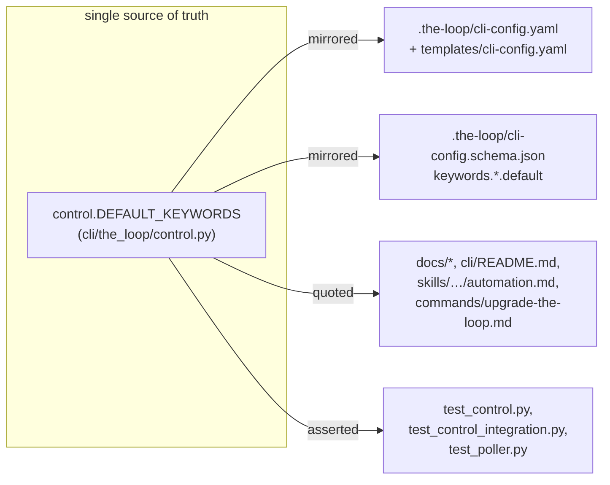

# Design: change the default session-control comment keywords

> Phase 2 of 3 (requirements → design → tasks). Derives from `requirements.md`.

## Overview

One value change, propagated to every place it is declared or quoted. No new
module, no parser change: `control.parse_command`'s whole-token boundary regex
(`_BOUNDARY_BEFORE`/`_BOUNDARY_AFTER` — anything but `\w`, `-` or `:`) already
treats a space as a valid boundary character, so a two-word default matches
under the exact same rule a one-word, colon-joined default did.



`DEFAULT_KEYWORDS` in `cli/the_loop/control.py` is the runtime source of truth
(`ControlConfig.from_mapping` falls back to it); everything else is a mirror or
a citation of that value, so the design is "change it in one place, then update
every mirror/citation to match" rather than a new mechanism.

## 1. Runtime default (`cli/the_loop/control.py`)

```python
DEFAULT_KEYWORDS: Dict[str, str] = {
    START: "the-loop start",
    STOP: "the-loop stop",
    PAUSE: "the-loop pause",
    RESUME: "the-loop resume",
}
```

The module docstring's two example strings (illustrating the boundary regex)
move to the new format too, so the comment stays accurate about what it
demonstrates. `parse_command`, `_BOUNDARY_BEFORE`/`_BOUNDARY_AFTER`,
`ControlConfig`, `command_comment` and `ControlStore` are untouched — none of
them special-case the keyword's shape, by design (issue-106 R1.3/R1.5 — a
configured string, matched literally).

## 2. Config mirrors

- `.the-loop/cli-config.yaml` (this repo's own checked-in CLI config) —
  `webhooks.ghWebhook.routing.control.keywords.*`.
- `skills/the-loop/templates/cli-config.yaml` (the template `/the-loop:init`
  scaffolds into a *new* installation) — same block.
- `.the-loop/cli-config.schema.json` — the four `default` values under
  `properties.webhooks.properties.ghWebhook.properties.routing.properties.control
  .properties.keywords.properties.{start,stop,pause,resume}`. `additionalProperties`
  and the property `type`s are untouched; only the literal default strings move.

None of these three files carry logic — they either supply the value a fresh
config starts with, or document it — so the change is textual in all three.

## 3. Documentation

Every doc that quotes a default keyword (found via a full-repo grep for
`start-execution`/`stop-execution`/`pause-execution`/`resume-execution`) falls
into one of two buckets:

- **Living docs — updated in this PR** (Requirement 2.1): `docs/config/cli/routing-options.md`,
  `docs/capabilities/webhook-triggers.md`, `docs/cli/concepts.md`,
  `docs/cli/getting-started.md` (prose **and** its mermaid sequence diagram's
  comment label), `docs/cli/commands/sessions.md`, `cli/README.md`,
  `skills/the-loop/reference/automation.md`, `commands/upgrade-the-loop.md`.
- **Historical records — left as-is** (Requirement 2.2): `docs/specs/issue-106/`,
  `docs/specs/issue-117/`, `docs/specs/issue-119/`, `docs/decisions/decision-040.md`,
  and every already-published `CHANGELOG.md` entry. These describe what the
  defaults *were* when those work items shipped; rewriting them would falsify
  the historical record for no reader benefit (the living docs above are where a
  reader looks for *current* behaviour — `SKILL.md`'s "reference, don't
  duplicate" rule).

`docs/capabilities/webhook-triggers.md` additionally gets a new history-table
row for issue-135 (Requirement 2.3), alongside its existing issue-106 row —
the capability's *current* behaviour section is updated in place, the history
column is append-only. `CHANGELOG.md` is generated by CI at release time from
Conventional Commit messages (never hand-edited — `.cz.toml`), so there is no
file to edit for it; the implementing commit's trailer carries `BREAKING
CHANGE: …` instead. No new `docs/decisions/` entry: this changes a value, not
a durable architectural rule — the trust-boundary decision it operates under
is still decision-040, and the risk trade-off is recorded once, in this
work item's own `requirements.md`.

## 4. Tests

`cli/tests/test_control.py` is the only file whose test *cases* change shape,
not just their literal values, because the boundary-violation parametrizations
were written against a one-word keyword:

| Old case (glued word char) | New case | Still exercises |
|---|---|---|
| `xthe-loop:start-executionx` | `xthe-loop start` | a word char immediately before the keyword fails the leading boundary |
| `the-loop:start-execution-later` | `the-loop startx` | a word char immediately after the keyword fails the trailing boundary |
| `athe-loop:start-execution` | *(covered by the case above)* | — |
| `the-loop:start-execution:now` | `the-loop start:now` | `:` immediately after still fails the boundary (unchanged exclusion set) |

The valid-match parametrization (`the-loop start`, trailing `.`, wrapped in
`**…**`, alone on a line, mid-body punctuation, upper-cased) carries over
one-for-one with the new literal. `cli/tests/test_control_integration.py` and
`cli/tests/test_poller.py` only need their four/two module-level
`*_KEYWORD` constants updated — every scenario in both files already
references the constant, never a hardcoded literal (verified by grep), so nothing
else in either file changes.

## Security design

Unchanged from issue-106/decision-040 — see this work item's requirements
`Security considerations`. No new code path is introduced, so there is nothing
new to enforce; the only security-relevant note is the accidental-self-match
observation already recorded there, which is a documentation/config-override
answer (Requirement 1.4), not a code change.

## Testing strategy

- **Unit** (`cli/tests/test_control.py`) — updated per §4 above; run to green
  before touching any other file (this is the fast, deterministic proof the
  parser needs no change).
- **Integration** (`cli/tests/test_control_integration.py`,
  `cli/tests/test_poller.py`) — constant-only update, full suite re-run.
- **Regression** — `pytest` (full `cli/` suite) and `ruff` both green with no
  other file requiring a change; `markdownlint` over the touched docs.
