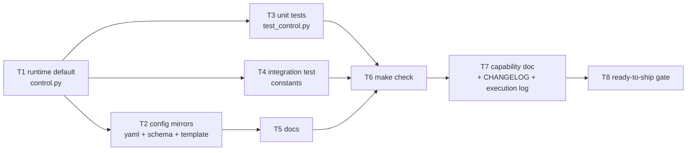

# Tasks: change the default session-control comment keywords

> Phase 3 of 3. Derived from [`requirements.md`](requirements.md) and
> [`design.md`](design.md) (both locked). `tdd.mode: standard` — the test files
> are updated alongside the value they assert, since this is a pure default-value
> change with no new behaviour to red/green.

## Dependency graph (DAG)

## Task list

- [x] **T1 — Runtime default.** `cli/the_loop/control.py`: `DEFAULT_KEYWORDS` →
  `the-loop start`/`stop`/`pause`/`resume`; update the module docstring's two
  boundary-regex examples to match. *Requirements: 1.1, 1.3.*
- [x] **T2 — Config mirrors.** `.the-loop/cli-config.yaml`,
  `skills/the-loop/templates/cli-config.yaml`,
  `.the-loop/cli-config.schema.json` (`keywords.*.default`). *Requirements: 1.2.*
- [x] **T3 — Unit tests.** `cli/tests/test_control.py`: default assertions +
  reshape the boundary-violation parametrization per `design.md` §4.
  *Requirements: 3.1.*
- [x] **T4 — Integration test constants.** `cli/tests/test_control_integration.py`,
  `cli/tests/test_poller.py`: update the four/two `*_KEYWORD` module constants.
  *Requirements: 3.2.*
- [x] **T5 — Docs.** `docs/config/cli/routing-options.md`,
  `docs/capabilities/webhook-triggers.md` (current-behaviour prose),
  `docs/cli/concepts.md`, `docs/cli/getting-started.md` (prose + diagram label),
  `docs/cli/commands/sessions.md`, `cli/README.md`,
  `skills/the-loop/reference/automation.md`, `commands/upgrade-the-loop.md`.
  Historical specs/decisions/changelog entries left untouched.
  *Requirements: 2.1, 2.2.*
- [x] **T6 — `make check`.** ruff, ruff format, pyright, markdownlint, config
  validation, `pytest` (full `cli/` suite) green. *Requirements: 3.3.*
- [x] **T7 — Capability doc + execution log.** New history row in
  `docs/capabilities/webhook-triggers.md`; keep `execution-log.md` current.
  `CHANGELOG.md` is CI-generated (never hand-edited) — the implementing
  commit carries the `BREAKING CHANGE:` footer instead (Requirement 2.3). No
  new decision doc: the value changes, not the decision-040 trust boundary.
  *Requirements: 2.3.*
- [x] **T8 — Ready-to-ship gate.** Security checklist recorded (no new surface);
  reviewer briefing posted on the PR. *Requirements: all.*
