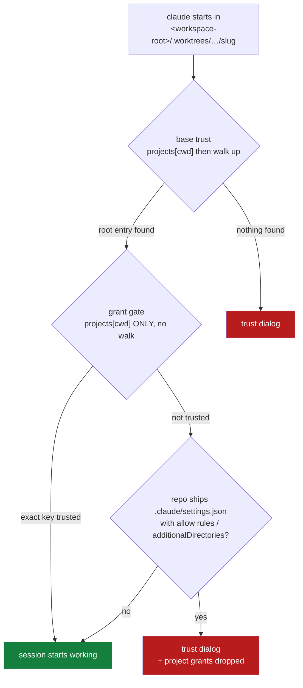

# Design: trust the spawn directory itself, not only its root

> Phase 2 of 3 (bugfix → design → tasks). Derived from the locked
> [`bugfix.md`](./bugfix.md).

## Overview

One behaviour changes: `ClaudeTrustStore.trust()` stops treating "trust the root" and
"trust the directory" as alternatives and writes **both** when a usable root is supplied.
Everything else — the config-file layout, the atomic non-destructive write, the guard
rails on a bad root, the adapter/dispatcher plumbing, the event log — is already correct
and stays untouched.

## The two readers of one key

The whole bug is that `hasTrustDialogAccepted` has two readers in Claude Code with
different scoping rules, and issue-90 only satisfied the first.



Today's `scope: workspace-root` lands on the `D2` path for any repository that ships
project-scoped grants — which is the common case, and includes the-loop's own repo. The
`hasCompletedProjectOnboarding` key already had this shape (exact key, no walk) and is
already written per directory; the fix gives `hasTrustDialogAccepted` the same treatment
while keeping the root entry that `scope: workspace-root` exists to provide.

## Change

`cli/the_loop/trust.py`, `ClaudeTrustStore.trust()` — replace the either/or selection
with a union:

```python
# before
if root and str(root).strip() and is_within(root, cwd):
    trust_keys = self.project_keys(str(root))
else:
    trust_keys = onboarding_keys

# after
trust_keys = list(onboarding_keys)                       # always the exact cwd
if root and str(root).strip() and is_within(root, cwd):
    trust_keys += [k for k in self.project_keys(str(root)) if k not in trust_keys]
```

Consequences, all of them already-supported behaviour of the surrounding code:

- **`scope: directory` is unchanged** — no root reaches the store, so `trust_keys` is
  exactly `onboarding_keys`, as before. (AC3)
- **A root that does not contain the cwd** is still ignored by the same `is_within`
  guard, and a too-broad root is still filtered out one level up in
  `Dispatcher._trust_root()`. (AC3)
- **Idempotence** is unchanged: `_set_flag` returns `False` when the flag already holds,
  and `_update_json` writes nothing when no key changed — so the second checkout under a
  root writes only its own new entry, and a re-spawn into the same checkout writes
  nothing at all. (AC4)
- **The dedupe** matters when `root == cwd` (a workspace root that *is* the spawn
  directory): without it the same key would be listed twice, which `_set_flag` tolerates
  but which would misreport in the applied-notes summary.

## Reporting the applied scope

`trust()` currently collapses its note to a single string chosen by whether the root was
used:

```python
scope = f"{trust_keys[0]} (and everything under it)" if trust_keys is not onboarding_keys else trust_keys[0]
```

That identity check (`is not`) stops being meaningful once `trust_keys` always starts
from the cwd, and the note must now name both entries so `workspace.trusted` still
records the real scope (AC5). The note becomes an explicit render of what was written:

- root supplied and used → `trusted <cwd> and <root> (and everything under it) in <file>`
- otherwise → `trusted <cwd> in <file>`

The realpath alias keys stay out of the note, exactly as today — they are the same
directory under another name, and listing them would make the audit line noise.

## What is deliberately not changed

- **No new config key.** A `scope: root-only` would be the only way to get today's
  behaviour back, and today's behaviour is the bug — nobody wants a scope that leaves the
  dialog up. `enabled: false` remains the opt-out, and `scope: directory` remains the
  least-privilege choice. (`reference/minimalism.md`: no option nobody would set.)
- **No re-read/verify step after the write.** Confirming the key survived would mean
  racing another process's cached-config save; the write is atomic and non-destructive
  and the failure mode is a visible dialog, not silent breakage.
- **No change to the adapter or dispatcher.** `ClaudeCodeAdapter.prepare_environment`
  already passes the root through under `roots_allowed`, and `_trust_root()` already
  applies the breadth guard. The seam is exactly one function.

## Security design

The trust boundary enforced here is *"which directories may pre-approve tool permissions
for a spawned harness"*. It moves as follows:

| | before | after |
|---|---|---|
| `scope: directory` | cwd trusted | cwd trusted (identical) |
| `scope: workspace-root` | root trusted; cwd's own grants **inert** | root **and** cwd trusted |

Under `workspace-root` the operator has already declared the whole subtree trusted, and
the ancestor walk already made every checkout beneath it pass base trust. The added entry
does not extend trust to a directory that was outside that declaration — it makes the
declared trust take effect for the one directory the daemon created and is about to run
in. The effective new capability is that a cloned repository's `.claude/settings.json`
allow-rules and `additionalDirectories` now load, which is precisely what accepting the
dialog by hand does today and what `scope: directory` already does.

Fail-closed properties are preserved end to end:

- `is_within` still refuses a root that does not contain the cwd (no unrelated tree).
- `is_too_broad` still degrades `/` and `$HOME` to per-directory trust with a warning.
- An unparseable config file is still reported and never overwritten.
- A write failure still warns, emits `workspace.trust_failed`, and lets the spawn proceed
  — degrading to the dialog (narrower), never to a wider grant.
- Nothing new is read from the event payload; the cwd comes from the-loop's own workspace
  machinery.

Because the boundary is now *effective* rather than merely declared, the schema and
capability docs must say out loud that pre-trusting a checkout means honouring grants
authored by whoever can push to that repository (AC8). Risk tier 4 (the change touches
`.the-loop/cli-config.schema.json`, an `autonomy.sensitivePaths` match) → human approval
at the PR plus a named security sign-off (`security.review.humanSignOffMinTier: 4`).

## Testing strategy

| Level | What it proves | Where |
|---|---|---|
| unit | under `scope: workspace-root` the **cwd** carries `hasTrustDialogAccepted` alongside the root | `cli/tests/test_trust.py` |
| unit | sibling checkouts each get their own trust entry; the root entry is written once | `cli/tests/test_trust.py` |
| unit | `scope: directory` and the ignored-root fallback are byte-for-byte unchanged | `cli/tests/test_trust.py` |
| unit | the applied note names both keys | `cli/tests/test_trust.py` |
| integration | the dispatcher's pre-spawn pre-flight lands the cwd trust key **before** the harness starts | `cli/tests/test_trust_integration.py` (Gherkin docstring, per `testing.gherkinDocstrings`) |

The existing tests that assert `"hasTrustDialogAccepted" not in projects[str(workdir)]`
are the ones that encode the bug; they are inverted rather than deleted, so the regression
is pinned from both directions.

## Docs to update in the same PR

- `.the-loop/cli-config.schema.json` — `harnessTrust` and `harnessTrust.scope`
  descriptions (the schema is user-facing documentation here).
- `docs/config/` — the generated/mirrored config reference, kept in parity by
  `cli/tests/test_docs_parity.py`.
- `docs/capabilities/interactive-sessions.md` — the living behaviour + a history row.
- `docs/decisions/` — a decision record for "trust the spawn directory under every
  scope", since it revises decision-037's scoping choice.
