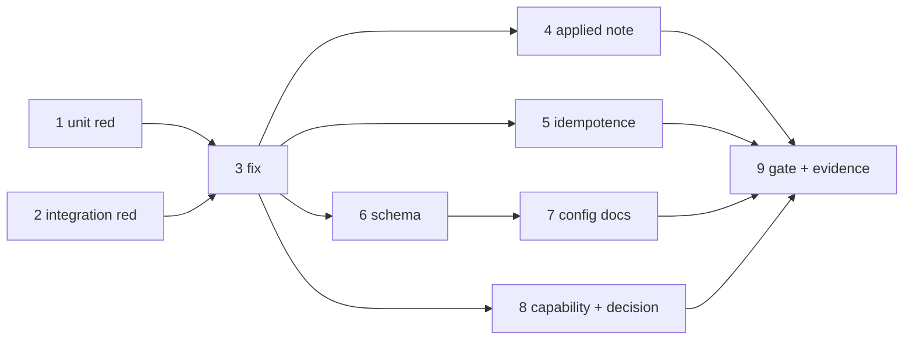

# Tasks: trust the spawn directory itself, not only its root

> Phase 3 of 3 (bugfix → design → tasks). Derived from the locked
> [`design.md`](./design.md).

## Task list

- [x] 1. Pin the bug in unit tests (red)
  - Invert the two assertions in `cli/tests/test_trust.py` that currently encode it:
    `test_root_scope_trusts_the_root_and_onboards_the_checkout` and
    `test_root_scope_is_idempotent_across_sibling_checkouts` assert
    `"hasTrustDialogAccepted" not in projects[str(workdir)]`.
  - Add a test asserting the trust key lands on **both** the root and the checkout under
    `scope: workspace-root`, and one for `root == cwd` (no duplicate key in the note).
  - _Depends on:_ none
  - _Requirements:_ AC1, AC2, AC6
  - _Test:_ `uv run pytest cli/tests/test_trust.py -k root_scope` (red)

- [x] 2. Pin the bug in an integration test (red)
  - Extend `test_workspace_root_scope_trusts_the_root_covering_every_checkout` in
    `cli/tests/test_trust_integration.py` to assert the spawn directory carries
    `hasTrustDialogAccepted` when the harness starts, keeping its Gherkin docstring
    (`testing.gherkinDocstrings: required`) and `Requirement:` link.
  - _Depends on:_ none
  - _Requirements:_ AC1, AC7
  - _Test:_ `uv run pytest cli/tests/test_trust_integration.py -k workspace_root` (red)

- [x] 3. Write trust on the spawn directory under every scope (green)
  - `cli/the_loop/trust.py` — `ClaudeTrustStore.trust()`: `trust_keys` starts from the
    cwd keys and gains the root's keys (deduplicated) when a usable root is supplied.
  - Update the module docstring: the trust key has a second reader that does **not** walk
    ancestors, so it is per-directory under both scopes.
  - _Depends on:_ 1, 2
  - _Requirements:_ AC1, AC2, AC3
  - _Test:_ tasks 1 & 2 go green

- [x] 4. Report the real applied scope
  - Replace the `is not` identity check with an explicit render naming every top-level
    key written, so `workspace.trusted` records both entries.
  - _Depends on:_ 3
  - _Requirements:_ AC5
  - _Test:_ `uv run pytest cli/tests/test_trust.py -k applied` (red→green)

- [x] 5. Confirm idempotence and the unchanged paths
  - No write on a repeat spawn into the same checkout; `scope: directory` and the
    ignored-root / too-broad-root fallbacks byte-for-byte unchanged.
  - _Depends on:_ 3
  - _Requirements:_ AC3, AC4
  - _Test:_ `uv run pytest cli/tests/test_trust.py cli/tests/test_trust_integration.py`

- [x] 6. Update the schema (user-facing documentation)
  - `.the-loop/cli-config.schema.json` — `harnessTrust` and `harnessTrust.scope`
    descriptions: the exact-directory entry is mandatory and why; state the trust
    boundary plainly (a pre-trusted checkout's own `.claude/settings.json` grants load).
  - _Depends on:_ 3
  - _Requirements:_ AC8
  - _Test:_ `uv run pytest cli/tests/test_cli_config.py cli/tests/test_docs_parity.py`

- [x] 7. Update the config reference
  - `docs/config/cli/routing-options.md` — `harnessTrust.enabled` / `.scope`.
  - _Depends on:_ 6
  - _Requirements:_ AC8
  - _Test:_ `uv run pytest cli/tests/test_docs_parity.py`

- [x] 8. Update the capability doc + decision record
  - `docs/capabilities/interactive-sessions.md` — current behaviour and a history row.
  - `docs/decisions/decision-052.md` + index — revising decision-037's scoping choice.
  - _Depends on:_ 3
  - _Requirements:_ AC8
  - _Test:_ `make lint` (markdownlint over all markdown)

- [x] 9. Full gate + evidence
  - `make lint typecheck test`; record the red→green transition and the end-to-end
    reproduction against the real `claude` binary in `execution-log.md`.
  - _Depends on:_ 1–8
  - _Requirements:_ all
  - _Test:_ `make lint typecheck test`

## Dependency graph (DAG)

## Checkpoints

- After task 2: both suites red for the right reason (the checkout's trust key missing).
- After task 5: both suites green; `scope: directory` untouched.
- After task 9: `make lint typecheck test` green, security review gate recorded in
  `execution-log.md`, reviewer briefing posted on the PR.

## Review comments

> Appended by the-loop's `record-feedback` hook when a human gate approves with
> comments (issue-109).
