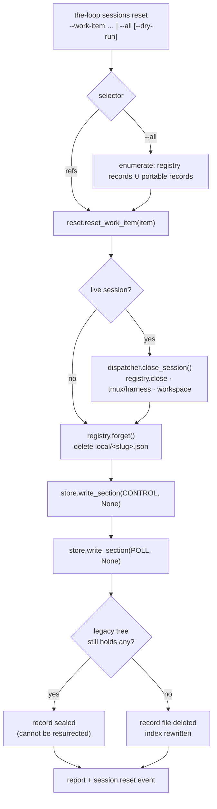

# Design: reset the-loop CLI's state for a work item

> Phase 2 of 3 (requirements → design → tasks). Derived from the approved
> `requirements.md`. MUST be reviewed/approved before the tasks breakdown.

## Overview

`the-loop sessions reset` is a **fourth kind of `sessions` action**. The registry actions
(`register`/`list`/`attach`) read and write session records; the control actions
(`start`/`pause`/`resume`/`stop`) express an authorized user's intent; `close` ends a
session. Reset is the only one that says *"forget this ever happened here"*.

Two design commitments follow from the requirements and shape everything below.

1. **Reset composes; it does not reimplement.** Ending a live session is the dispatcher's
   `close_session` — the same path `sessions stop`, the auto-close on a merged PR, and the
   stop keyword all take (`webhook/dispatcher.py`). Removing the portable sections is
   `WorkItemStore.write_section(..., None)` — the same path `ControlStore.clear` and
   `PollState.forget` take. Reset is the *composition* of the existing erasure paths plus
   exactly one new primitive: deleting a session record, which nothing could do before.
2. **What it removes it says, and what it says it logs.** The output names the pieces per
   work item; `session.reset` records the same list in the append-only event log (R4).

### Why not a top-level `the-loop reset`

The state being erased is keyed by work item and lives in the two stores `sessions` already
owns and prints (`sessions list` already reads the control section). A sibling top-level
command would have to re-derive the same registry/portable/dispatcher wiring
(`_control_store`, `_dispatcher_for`, `_state_layout`) that `sessions_cmd` already holds,
and operators looking for it would look under `sessions` first. It is a `sessions` action.

### Why it posts no comment

The four control actions post their keyword back to the ticket, because each records durable
*intent* an authorized user could equally have expressed in a comment, and the ticket is the
record of who asked for what. Reset is neither: there is no `reset` keyword (adding one would
let a comment delete local state — see § Security design), and the honest comment would be
"the local memory of this item was erased", which says nothing about the work item to anyone
reading the ticket. Worse, posting `stop-execution` would assert durable intent that the
reset just *cleared* — the record would contradict the disk. So reset posts nothing, and the
event log is its trail ([decision-050](../../decisions/decision-050.md)).

## Architecture



The order is not incidental. The session is closed **first**, so the harness is never left
running against records that have already gone; the record is deleted **before** the portable
sections, so a crash mid-reset leaves an item with no session and stale-but-consistent
portable state (which the next reset finishes) rather than an armed item with a live session
the registry has forgotten.

## Components & interfaces

### `the_loop.reset` (domain — new)

Pure orchestration over injected collaborators, so every branch is unit-testable without a
dispatcher, a daemon, tmux or git.

```python
#: The pieces of state a reset can remove, in removal order.
PIECES = ("workspace", "session", "control", "poll")

@dataclass(frozen=True)
class ResetOutcome:
    ref: str
    removed: Tuple[str, ...] = ()      # subset of PIECES, in removal order
    was_live: bool = False             # a running/paused session was ended
    errors: Tuple[str, ...] = ()

    @property
    def found(self) -> bool:           # was there anything to reset?
    @property
    def ok(self) -> bool:              # found and nothing failed

def reset_work_item(
    item: WorkItemRef,
    *,
    registry: SessionRegistry,
    store: WorkItemStore,
    close: Optional[Callable[[Session], bool]] = None,
    dry_run: bool = False,
) -> ResetOutcome
def work_items_with_state(registry, store) -> List[WorkItemRef]   # --all
```

- `close` returns whether a workspace checkout was removed, which is the only fact the domain
  cannot observe for itself. `None` means "do not close" — used by `--dry-run` and by unit
  tests; a live session is then still *reported* as `was_live`.
- `found` is `removed or was_live or errors` — an item whose only state was a corrupt record
  counts as found, so R1.6's "nothing to reset" never masks a failure.
- Every removal is wrapped: an `OSError` becomes an entry in `errors`, never an exception, so
  one unwritable record cannot strand the rest of a `--all` run (R2.5, abuse case 5).

### `the_loop.sessions.SessionRegistry.forget` (new primitive)

```python
def forget(self, work_item) -> bool:   # delete <root>/<slug>.json; False if absent
```

The registry could previously only *transition* a record (`register`/`pause`/`resume`/
`close`). Deleting one is what makes reset different from `close`: a closed record still
lists and still attaches (`find_by_work_item(include_closed=True)`), which is precisely the
"the CLI still remembers this item" that #137 is about. Emits nothing itself — the reset
emits one event for the whole work item, rather than a partial trail per piece.

### `the_loop.webhook.dispatcher.Dispatcher` (widened return)

`_cleanup_workspace` already computes whether a checkout was removed and throws the answer
away; it now returns it, and `close_session` returns that same `bool`. Existing callers
ignore the value and are unaffected. This is what lets the reset report R5.4 truthfully
instead of printing "workspace: maybe".

### `the_loop.commands.sessions_cmd` (surface)

A new `reset` sub-parser:

| Flag | Default | Meaning |
|---|---|---|
| `--work-item` | — (repeatable) | Which work item(s) to reset. |
| `--all` | off | Every work item this machine holds state for. Mutually exclusive with `--work-item`. |
| `--dry-run` | off | Report what would be removed; change nothing. |
| `--registry-dir` / `--portable-dir` | config | Same overrides every `sessions` action takes. |

No tmux flags: reset takes the configured close path exactly as `stop` does, and `stop`
carries none either. The consequence is worth naming — a tmux session **retained** by
policy outlives the record that named it, so it is read back as
`tmux attach -r -t loop-<slug>` rather than through `sessions attach`.

Responsibilities kept in the surface (not the domain): parsing and validating refs, the
selector rules (R2.3/R2.4), building the dispatcher-backed `close` callable **lazily** (only
when a live session is actually found, so a dry run and a records-only reset never construct
a dispatcher), printing, the two warnings (R5.1/R5.2) and the exit code.

Exit codes follow the command's existing conventions: `0` success, `1` nothing found or a
removal failed, `2` a usage error (no selector, both selectors, an unparseable ref).

## UI/UX design

No product UI (CLI + docs). The rendered output is the interface:

```console
$ the-loop sessions reset --work-item github:octo/repo#15
warning: the gh-webhook receiver looks like it is running (pid 4242); it can write
  in-flight poll state back after this reset — stop it first for a clean slate
github:octo/repo#15: ended a live claude session
github:octo/repo#15: reset — removed workspace, session, control, poll
reset 1 work item

$ the-loop sessions reset --all --dry-run
github:octo/repo#15: would remove session, control, poll
github:octo/repo#21: would remove control, poll
would reset 2 work items (dry run — nothing was changed)
```

Two rules the wording follows: the *irreversible* facts (a live session was ended, a
workspace was removed) are their own lines rather than words inside a list, and a dry run
never uses the past tense.

## Data models

No new persisted shape. Reset only *removes*, through the existing ones:

| Path | Before | After a reset |
|---|---|---|
| `<root>/local/<slug>.json` | session record | file deleted |
| `<root>/portable/<slug>.json` | `{ref, url, control, poll}` | file deleted, **or** `{ref, url, sealed: true}` when a pre-issue-128 tree still holds something for it |
| `<root>/portable/index.json` | one entry per record | rewritten by the store on every section write |
| `<root>/logs/events.jsonl` | append-only | **one line appended**: `session.reset` |
| workspace checkout | worktree / clone | removed per `routing.workspace.keepCheckoutOnClose` |

The sealing rule is `WorkItemStore.write_section`'s, not a new one: a record with no sections
left is deleted unless the legacy tree still holds something for that work item, in which case
a `sealed` tombstone is kept so `section()` cannot fall back and resurrect it. Reset therefore
**must** clear through the store rather than `unlink()` the file, or an operator with a
pre-issue-128 tree would get their armed `start` back on the next read (R3.1). This is the one
non-obvious correctness constraint in the whole change.

One new event type in the `EVENT_TYPES` catalog:

```python
"session.reset": (
    "A work item's local CLI state was reset (work_item, actor, removed: the "
    "pieces erased — workspace|session|control|poll, empty when nothing was "
    "found; was_live; dry_run)."
)
```

## Error handling

| Situation | Behaviour |
|---|---|
| Unparseable `--work-item` | Report the ref and the expected shape; **remove nothing at all**, exit 2 (R2.6) |
| Neither / both selectors | argparse-level refusal, exit 2 (R2.3/R2.4) |
| Work item has no state | `nothing to reset` on stderr, exit 1 (R1.6) |
| Corrupt record on disk | The store logs and degrades to "nothing recorded"; the file is still removed, and the item counts as found |
| Removal fails (`OSError`) | Collected into `errors`, reported per item, exit 1; other items continue (R2.5) |
| Close path raises | Caught per item: the error is reported, record removal still proceeds — a dispatcher failure must not leave the item both running *and* remembered |
| Dispatcher cannot be built | Reported once; the run degrades to a records-only reset rather than aborting |

Validation is **all-or-nothing before any removal**: every `--work-item` is parsed first, so a
typo in the third of four refs does not leave the first two reset.

## Security design

Enforcing each trust boundary named in `requirements.md` § Security considerations.

- **No new remote actor.** Reset is deliberately **not** a control keyword. The comment
  ingress can only reach `parse_command`, which returns one of four fixed constants
  (`control.py` § Why the parser is this narrow) — so no comment body, from an authorized user
  or otherwise, can reach this code path. The command's only actor is a local shell, the same
  privilege `sessions stop` already assumes.
- **argv → path.** Enforced by `WorkItemRef.parse` (shape) and `WorkItemRef.slug` (every
  character outside `[A-Za-z0-9._-]` replaced), and by the fact that only the stores build the
  paths, from that slug, under their own roots. The reset module contains no path
  concatenation of its own. Negative test: refs carrying `/`, `..`, a leading `-` and a null
  byte are rejected with nothing removed, and a ref whose owner/repo are `..` resolves to a
  file *inside* the root rather than escaping it.
- **`--all` enumeration.** The union of `SessionRegistry.list_sessions()` (which matches only
  the files the registry wrote — `_REGISTRY_FILE_RE`, issue-111) and `WorkItemStore.refs()`
  (which skips the index, `.tmp` leftovers and anything naming no work item). A stranger's file
  in a shared state directory is not a record and is not removed. Negative test proves it
  survives a `--all --dry-run` **and** a real `--all`.
- **Append-only audit.** The module imports `eventlog` and calls `emit` only; there is no code
  path that opens the event log for writing, truncating or unlinking. Pinned by a test that
  reads the log before and after a reset and asserts the earlier lines are byte-identical.
- **Fail closed.** Clearing the `control` section **disarms**: `start_requested` is false
  afterwards, so a reset work item waits for an explicit start instead of resuming itself. The
  warning in R5.2 exists precisely because an operator who set `requireStartCommand: false` has
  opted out of that protection, and clearing the poll section makes their item first-sight
  again.
- **Destructiveness is bounded and announced.** Nothing outside the state root and the
  workspace root (already the close path's) is touched; the repository's tracked files —
  including `docs/specs/<id>/graph-state.json` — are explicitly out of scope. `--dry-run` is
  the rehearsal, and every irreversible act gets its own output line.

No new credential, network call, subprocess or dependency. `os.kill(pid, 0)` (liveness probe
for R5.1) sends no signal; `PermissionError` from it means the process exists under another
user, which counts as running.

## Testing strategy

TDD per `tdd.mode: standard` — every task's test is written first and watched fail.

- **Unit — `cli/tests/test_reset.py`:** the domain. Each piece removed independently and in
  combination; a live session ends before its record goes; a paused session counts as live; a
  closed record is still removed; `found` false when there is nothing; `--dry-run` semantics
  (nothing written, no event); `OSError` collected rather than raised; the seal-vs-delete
  branch with and without a legacy tree; `work_items_with_state` unions and de-duplicates.
- **Unit — registry/dispatcher:** `SessionRegistry.forget` removes the file and returns
  `False` when absent; `close_session` returns whether a workspace was cleaned.
- **Integration — `cli/tests/test_reset_integration.py`** (Gherkin docstrings, per
  `config.testing`): argv through `the_loop.cli.main` against a real state root — reset one,
  reset several, `--all`, `--dry-run`, no selector, both selectors, a bad ref, an item with no
  state, a stranger's file left alone, the event log appended-to-not-rewritten, and a
  pre-issue-128 tree leaving a sealed record instead of a resurrectable gap.
- **Contract:** `test_docs_parity.py` P1/P2 already cover the command page;
  `test_eventlog.py::test_every_emitted_event_type_is_documented` covers the new event type.
- **Full suite + gates** (`make check`): pytest, `ruff check`, `ruff format --check`,
  `pyright`, `markdownlint`, `scripts/validate_config.py`.

## Trade-offs & decisions

| Decision | Alternative | Why |
|---|---|---|
| A `sessions` action | A top-level `the-loop reset` | The state is session-keyed and the wiring already lives here; a sibling command would duplicate `_control_store`/`_dispatcher_for`. |
| No ticket comment | Post `stop-execution`, or a new `reset` keyword | A keyword would let a comment delete local state; posting `stop` would record intent the reset just cleared. [decision-050](../../decisions/decision-050.md) |
| Clear sections through the store | `unlink()` the portable record | Unlinking resurrects a pre-issue-128 record through the legacy readers. The store's seal is the existing answer. |
| Reuse `close_session` | A reset-specific teardown | One close path means tmux retention, harness termination and workspace policy behave identically however a session ends. |
| Warn about a running daemon | Refuse to run | The operator may legitimately reset a subset while the daemon serves others; a refusal would be routed around with `--force`, which is a worse contract than a warning. |
| Leave the legacy tree in place, sealed | Delete the old files too | `poll-state.json` is a *shared* file holding every item; rewriting it to reset one is a much larger operation than the tombstone the store already supports. |
| `--all` enumerates, never defaults | A bare `reset` resetting everything | R2.3. The dangerous reading must be the one you have to type. |
| A retained tmux session outlives its record | Always kill tmux on reset | Killing a transcript is more destructive than orphaning one, and `tmux attach -r -t loop-<slug>` still reaches it. Documented rather than decided for the operator. |

## Open questions

None. The two operator-facing assumptions (reset is maintenance, not control; `--all` is
explicit) were stated on the ticket before this design and carried into R2.3 and
decision-050.

## Review comments

> Appended by the-loop's `record-feedback` hook when a human gate approves with
> comments (issue-109). Append-only and attributed: an approval never silently
> discards a reviewer's suggestions, and the feedback travels with the document
> it concerns rather than living in a side-channel tracker.
