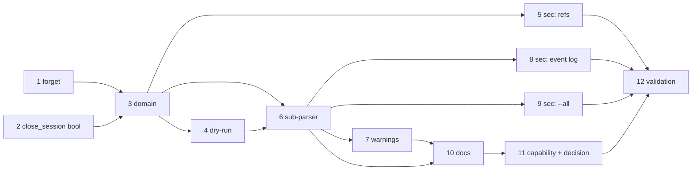

# Tasks: reset the-loop CLI's state for a work item

> Phase 3 of 3 (requirements → design → tasks). A DAG of implementation tasks derived
> from the approved design. MUST be reviewed/approved before implementation begins.

## Task list

- [x] 1. `SessionRegistry.forget` — delete a session record
  - The one primitive reset needs that the registry never had: remove
    `<registryDir>/<slug>.json` rather than transition it. `False` when absent, and an
    `OSError` propagates for the caller to collect.
  - _Depends on:_ none
  - _Requirements:_ R1.3
  - _Test:_ `pytest cli/tests/test_reset.py -k forget` (red→green)

- [x] 2. `Dispatcher.close_session` reports whether a workspace was removed
  - `_cleanup_workspace` already computes it and discards it; return it, and return it
    from `close_session`. Existing callers ignore the value.
  - _Depends on:_ none
  - _Requirements:_ R1.8, R5.4
  - _Test:_ `pytest cli/tests/test_reset.py -k workspace_removal_is_reported` (red→green)

- [x] 3. `the_loop.reset` — the domain
  - `ResetOutcome`, `reset_work_item`, `work_items_with_state`. Close (when live) →
    forget the record → clear `control` → clear `poll`, every step wrapped so an
    `OSError` lands in `errors` instead of raising. Clearing goes through
    `WorkItemStore.write_section(..., None)` so the seal-vs-delete rule holds.
  - _Depends on:_ 1, 2
  - _Requirements:_ R1.1, R1.2, R1.4, R1.5, R1.6, R1.7, R2.5, R3.1, R3.2, R3.3, R3.4
  - _Test:_ `pytest cli/tests/test_reset.py` (red→green)

- [x] 4. `--dry-run` semantics in the domain
  - Report the same list without closing, deleting or emitting.
  - _Depends on:_ 3
  - _Requirements:_ R4.4
  - _Test:_ `pytest cli/tests/test_reset.py -k dry_run` (red→green)

- [x] 5. **Security:** the removal target can only come from a parsed ref
  - No path concatenation in the module; refs reach the stores as a sanitised slug.
  - _Depends on:_ 3
  - _Requirements:_ R2.6, abuse cases 1, 2
  - _Test:_ `pytest cli/tests/test_reset_integration.py -k hostile_ref` — **negative**:
    `/`, `..`, a leading `-` and a null byte are all rejected with nothing removed
    (red→green)

- [x] 6. The `reset` sub-parser and its output
  - Selector rules (R2.3/R2.4), all-or-nothing ref validation, per-item reporting, the
    lazily-built dispatcher-backed `close`, exit codes 0/1/2.
  - _Depends on:_ 3, 4
  - _Requirements:_ R1.8, R2.1, R2.2, R2.3, R2.4, R2.6
  - _Test:_ `pytest cli/tests/test_reset_integration.py` (red→green)

- [x] 7. The two warnings
  - A live receiver pidfile (R5.1) and a config that can re-spawn a first-sight item
    (R5.2), printed once per invocation.
  - _Depends on:_ 6
  - _Requirements:_ R5.1, R5.2, R5.3
  - _Test:_ `pytest cli/tests/test_reset_integration.py -k warns` (red→green)

- [x] 8. **Security:** `session.reset` in the event catalog, and the log stays append-only
  - New `EVENT_TYPES` entry; a test asserting the log's earlier bytes are untouched by a
    reset.
  - _Depends on:_ 6
  - _Requirements:_ R4.1, R4.2, R4.3
  - _Test:_ `pytest cli/tests/test_reset_integration.py -k event_log` — **negative**:
    the log cannot be rewritten by the command that could most want to (red→green)

- [x] 9. **Security:** `--all` touches only records the stores wrote
  - _Depends on:_ 6
  - _Requirements:_ R2.2, abuse case 3
  - _Test:_ `pytest cli/tests/test_reset_integration.py -k stranger` — **negative**
    (red→green)

- [x] 10. Docs: the command page and the state page
  - `docs/cli/commands/sessions.md` gains `reset`; `docs/cli/state.md` gains how each
    classified path is erased.
  - _Depends on:_ 6, 7
  - _Requirements:_ R6.1, R6.2
  - _Test:_ `pytest cli/tests/test_docs_parity.py`, `markdownlint-cli2 "**/*.md"`

- [x] 11. Capability docs + decision record
  - `docs/capabilities/cli.md` and `interactive-sessions.md` (behaviour + history rows),
    `docs/decisions/decision-050.md` + index row.
  - _Depends on:_ 10
  - _Requirements:_ R6.3
  - _Test:_ `markdownlint-cli2 "**/*.md"`

- [x] 12. Full validation
  - `make check` equivalent: pytest, ruff check/format, pyright, markdownlint, config
    validation. Record red→green evidence in the execution log.
  - _Depends on:_ all
  - _Requirements:_ R6.4
  - _Test:_ `uv run --project cli python -m pytest -q cli` and the gates

## Dependency graph (DAG)

## Checkpoints

- After task 3: the domain suite is green with no CLI wiring — the erasure rules are
  provable before anything can be typed at them.
- After task 6: argv-in/exit-code-out works end to end.
- After task 9: every negative test from § Security design passes.
- After task 12: the full suite and all gates, recorded in `execution-log.md`, followed by
  the self-review rounds and the security-review gate.

## Review comments

> Appended by the-loop's `record-feedback` hook when a human gate approves with
> comments (issue-109). Append-only and attributed: an approval never silently
> discards a reviewer's suggestions, and the feedback travels with the document
> it concerns rather than living in a side-channel tracker.
