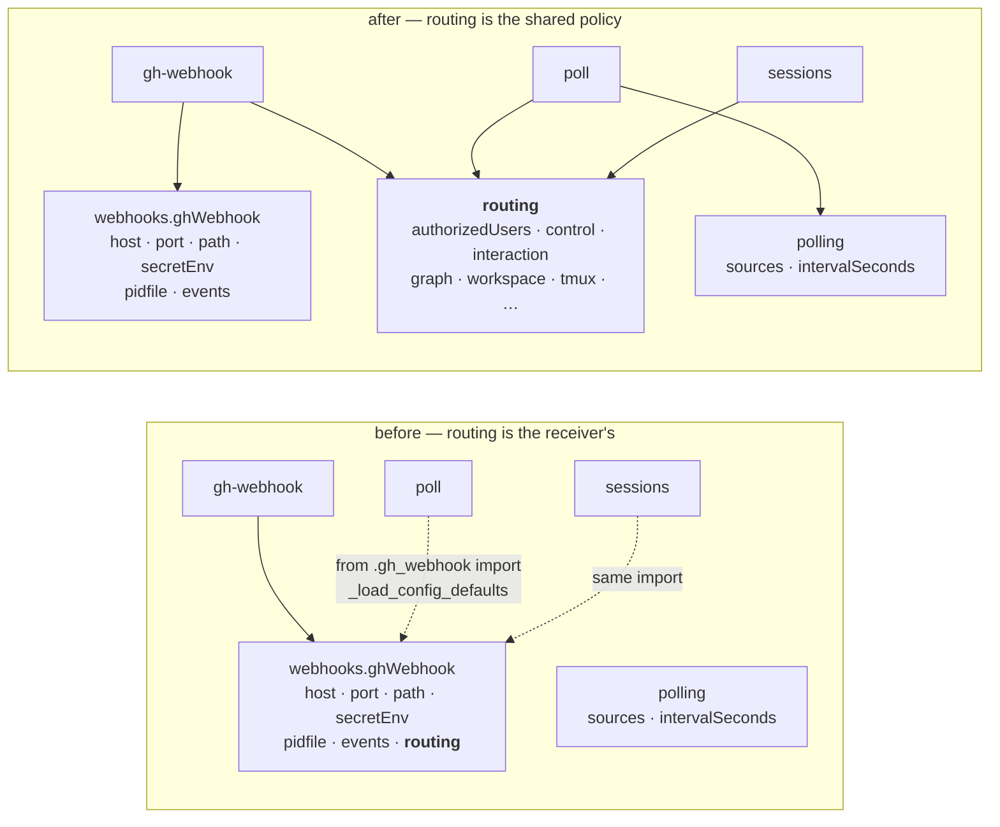

# Design: `routing` is a top-level concern, not a property of the webhook receiver

> Phase 2 of 3 (requirements → design → tasks). Derives from the approved requirements.
> MUST be reviewed and approved before moving to tasks breakdown.

## Overview

One key moves, and three things follow it: the schema, the readers, and every document
that names the path. The move itself is mechanical; the design work is in the three
decisions the move forces — where the shared read lives now (D2), what the migration does
with a config that declares both blocks (D4), and what the hot-reload reads once the
receiver's event filter and the routing policy no longer sit in the same subtree (D3).

Nothing about what a routing option *does* changes, which is what makes the whole change
verifiable by existing tests: the routing/poller/control/interaction suites prove
behaviour (R4.4), and `test_docs_parity` P3/P4 proves the schema and the docs moved
together (R5.2).

## Architecture

### Before → after



The dotted edges on the left are the defect, drawn: two commands reach the block they need
by importing the module of a third. On the right every reader takes the same route to it,
`cli_config.load_routing_config()`.

### Read sites, and what each becomes

| Site | Reads today | Becomes |
|---|---|---|
| `commands/gh_webhook.py::_build_routing` | `gh_webhook_config.get("routing")` | takes the routing mapping as its argument |
| `commands/gh_webhook.py` (`--route` default) | `_load_config_defaults().get("routing")` | `cli_config.load_routing_config()` |
| `commands/gh_webhook.py::apply` (hot reload) | `gh_cfg.get("routing")` + `resolve_events(gh_cfg)` | one whole-config read, split two ways (D3) |
| `commands/poll.py` | `_load_config_defaults().get("routing")` | `cli_config.load_routing_config()` |
| `commands/sessions_cmd.py` ×5 | `_load_config_defaults().get("routing")` | `cli_config.load_routing_config()` |
| `cli_config.apply_integrations` | `webhooks.ghWebhook.routing` subtree | `config.get("routing")` |

## Components & interfaces

### C1 — `cli_config.load_routing_config()` (new)

```python
def load_routing_config(path: Optional[Path] = None) -> dict:
    """The top-level ``routing`` block — the policy BOTH ingresses run on."""
    return load_cli_config(path or default_cli_config_path(), strict=False).get("routing") or {}
```

Responsibility: the single accessor for routing policy (R4.2). It lives in `cli_config`
because that module already owns *"where the CLI config is and how it is read"* — the
resolution order, the lenient/strict split, the migration gate and `apply_integrations`
are all here. Adding one more reader of the same file to the module that owns the file is
the minimum move that removes the cross-command import; the alternative (a new module for
one function) buys nothing.

Resolving the path per call, rather than caching it at import like `_CONFIG_PATH`, is a
small correctness win that comes free: `cli.py::_refresh_cli_config_paths()` exists
precisely because the command modules cache the path before `--config` is parsed, and it
has to reach in and reassign each module global. A function that calls
`default_cli_config_path()` when invoked is never stale. The optional `path` argument
keeps it injectable for tests and for the receiver's start-time read, which already holds
a resolved path.

### C2 — `commands/gh_webhook.py`

- `_read_gh_webhook_config` / `_load_config_defaults` keep their meaning, narrowed to
  what they now honestly describe: `webhooks.ghWebhook` only. Their docstrings already
  say that; after this change it is true.
- `_build_routing(routing_config: dict, gh_webhook_config: dict)` takes the two blocks
  explicitly instead of digging one out of the other. The event filter
  (`resolve_events`, `warn_on_missing_lifecycle_events`) reads the receiver block; the
  `RoutingConfig` reads the routing block.
- The `--route` flag's default and its help text name `routing.enabled`.

### C3 — `commands/poll.py` and `commands/sessions_cmd.py`

`from .gh_webhook import _load_config_defaults` goes. `poll.py` keeps its own
`_load_polling_config()` (already local) and adds `cli_config.load_routing_config()`;
`sessions_cmd.py` replaces its five `_load_config_defaults().get("routing")` calls with
the same accessor. `sessions_cmd.py` still imports `_state_layout` from `gh_webhook` —
out of scope here, and unlike routing it is at least a genuinely shared path helper.

### C4 — `migrations.py`

```python
CURRENT_CONFIG_VERSION = "0.4.0"

_ROUTING_SITE: Tuple[str, ...] = ("webhooks", "ghWebhook")
_ROUTING_KEY = "routing"
_ROUTING_REPLACEMENT = "routing"          # now top-level
```

Three additions, each mirroring what `ghBinary` and `polling.stateFile` already do:

- `needs_migration` — true when `webhooks.ghWebhook.routing` is present.
- `assert_current` — raises `ConfigTooOld` naming the old key, `routing`, why the value is
  not being ignored, and `/the-loop:upgrade-the-loop`.
- `migrate_cli_config` — the move (D4), then the existing version bump.

## Data models

`.the-loop/cli-config.schema.json`: the `routing` object definition moves verbatim from
`properties.webhooks.properties.ghWebhook.properties.routing` to `properties.routing`.
Not a line of its inner definition changes — same keys, same defaults, same descriptions,
same `additionalProperties: false`. `webhooks.ghWebhook` already declares
`additionalProperties: false`, so removing the property is itself the enforcement of
R1.2: a config that still carries the old key fails schema validation as well as the
runtime gate.

The schema's `properties` order puts `routing` between `polling` and `eventLog`, matching
the reading order the requirements describe (`state · webhooks · polling · routing ·
eventLog · integrations`).

## Error handling

| Condition | Response | Where |
|---|---|---|
| Config declares `webhooks.ghWebhook.routing` | `ConfigTooOld`, naming old key → `routing` → `/the-loop:upgrade-the-loop` | `migrations.assert_current`, reached from `load_cli_config` |
| Config declares `version < 0.4.0` | `ConfigTooOld`, naming the required version | same |
| Config declares both blocks | Migration proceeds; top-level wins; every overridden key named in the report | `migrations.migrate_cli_config` |
| Config missing/unparseable | `{}` → built-in defaults, unchanged; `authorizedUsers` empty → fail closed with a warning naming `routing.authorizedUsers` | `cli_config._load_cli_config_raw`, `authz` |

The refusal reaches the operator through the same path as today's two: `load_cli_config`
calls `assert_current` before anything else, so every command that reads the config
refuses uniformly. `migrate-config` is the deliberate exception — it reads with the raw
loader, because refusing to load the file you are trying to migrate is a locked door with
the key inside (its module docstring's phrasing, unchanged).

## Security design

- **AuthN/AuthZ.** Untouched. `routing.authorizedUsers` is still the only list of logins
  the-loop acts on, still resolved by `authz.resolve_authorized_users`, still checked in
  `webhook/router.py` and the poller before dispatch. This work item changes the key's
  *address*, not its authority.
- **Input validation & injection surfaces.** No new ingress. The prompt-injection guard's
  position in the pipeline (self-comment marker → `authorizedUsers` → control parsing) is
  not touched.
- **Secrets handling.** Nothing moves. `secretEnv` names an env var and stays under
  `webhooks.ghWebhook`, where it belongs — the secret is the receiver's, not the
  dispatcher's.
- **Least privilege.** Unchanged; `harnessTrust` moves with its block.
- **Fail-closed behaviour.** Two layers, and the design's whole security argument:
  1. A config carrying the old key does not load at all (R2.1). The daemon stops with an
     explanation instead of starting with a guard it cannot find.
  2. If it somehow did start with no `routing` block, `resolve_authorized_users([])`
     returns empty and both ingresses act on **no** human-authored event, warning as they
     do. The warning strings are updated to name `routing.authorizedUsers`, so an operator
     reading them is told the key that actually exists (R5.3).
- **Abuse-case coverage.**

  | Abuse case (requirements) | Mechanism | Negative test |
  |---|---|---|
  | Old key silently ignored → daemon runs with no guard | `assert_current` refuses, reached from `load_cli_config` | `test_migrations.py::test_load_cli_config_refuses_old_routing_key` |
  | Upgrade re-admits a stale login by unioning both `authorizedUsers` lists | D4: top-level wins **whole**, per key; no list merging anywhere in the migration | `test_migrations.py::test_migration_prefers_new_block_and_reports_overrides` |

## Trade-offs & decisions

### D1 — No compatibility read of the old location

Rejected: a fallback that reads `webhooks.ghWebhook.routing` when `routing` is absent.
It would make the misfiled key a supported spelling indefinitely, which is exactly what
this work item removes, and it would defeat the migration module's property 2 — the
operator would never learn their config was stale. The refusal is the feature.

### D2 — The shared accessor lives in `cli_config`, not in a new module

Covered in C1. Recorded here because the alternative — leaving `poll.py` importing from
`gh_webhook.py` and only moving the key — is the version of this change that looks
complete and isn't: the config would say `routing` is shared while the code still said it
belonged to the receiver.

### D3 — The hot-reloader reads the whole config

Today `Reloader(_CONFIG_PATH, lambda: _read_gh_webhook_config(strict=True))` returns the
receiver block, and `apply()` pulls both the event filter and the routing policy out of
it. Those now live in different subtrees, so the reloader's read becomes
`cli_config.load_cli_config(_CONFIG_PATH, strict=True)` (the whole document) and `apply()`
takes the whole config, digging out `routing` and `webhooks.ghWebhook` separately.

Two properties are preserved deliberately: `strict=True` still means a broken save raises
and the `Reloader` keeps the previously-loaded config rather than resetting to defaults;
and the *reload trigger* is unchanged — it has always been the file's mtime/content, never
a subtree, so widening what is read cannot make the receiver reload more or less often
than before. One side effect is a small gain: an edit to `routing` made through the
top-level key now reloads, which under the old shape it also did — the block simply lived
elsewhere in the same file.

### D4 — A config declaring both blocks: new wins, old is reported

`migrate_cli_config` is not allowed to guess, and it is also not allowed to leave the old
key in place (that would leave the config permanently refused by `assert_current`). So:

1. The old block is popped.
2. Its keys are written into the top-level `routing` block **only where absent** —
   `setdefault`, key by key, never a deep merge and never a list union.
3. Every key the old block declared that the new one already had is named in
   `report.notes`, with both values, so the operator can see exactly what was dropped.

This is the same shape the `ghBinary` migration already uses when the three removed keys
disagreed (*"kept `X` — please confirm this is the one you want"*), which is the precedent
worth matching rather than inventing a second convention. `authorizedUsers` is the reason
step 2 is per key and not a merge: a union of two lists would silently re-admit a login
the operator had removed from the block they were actually maintaining.

### D5 — Empty containers are removed

After popping `routing`, a `ghWebhook` (and then a `webhooks`) left with no keys is
deleted. `yaml.safe_dump` would otherwise write `webhooks:\n  ghWebhook: {}` into the
operator's file — a husk that says nothing and invites the question of what used to be
there. Only *empty* containers are removed, so a receiver that declares `port` keeps its
block.

### D6 — Historical records are left as written

`docs/decisions/*` and `docs/specs/*` keep their references to the old path (R5.4). This
follows the precedent already in the repository: decision-022 still names `ghBinary`, a
key removed in issue-109. A decision record is a statement about a moment; rewriting it to
match today's config would make the log less true, not more useful. Live documentation —
the config reference, the CLI README, the skill's reference files, the capability docs —
is updated in full, and that is where a reader looking for the current key goes.

## Testing strategy

| Requirement | Test | Kind |
|---|---|---|
| R1.1, R1.2 | `test_docs_parity.py` P3/P4 (schema ↔ docs, both directions) | existing, must stay green |
| R1.3 | `test_poll_integration.py`, `test_gh_webhook*.py` fixtures built on the new key | existing, updated |
| R1.4 | `test_gh_webhook_reload*` — an edit to top-level `routing` hot-swaps policy; the event filter still comes from `webhooks.ghWebhook.events` | existing + new case |
| R1.5 | new: the shipped template and this repo's own `cli-config.yaml` parse and declare top-level `routing` | new |
| R2.1–R2.4 | `test_migrations.py` — refusal on the old key, message content, version refusal, unversioned config still allowed | new + existing |
| R2.5 | `test_migrations.py::test_current_version` | new |
| R3.1–R3.3 | `test_migrations.py` — the move, empty-container removal, idempotence (byte-identical second run) | new |
| R3.4 | `test_migrations.py::test_migration_prefers_new_block_and_reports_overrides` | new (negative) |
| R3.5 | `test_migrate_cmd.py` `--dry-run` | existing |
| R4.1–R4.3 | the routing/poller/control/reactions/announce/interaction suites | existing, updated fixtures |
| R4.2 | new: `poll` and `sessions_cmd` do not import `_load_config_defaults` from `gh_webhook` | new (import assertion) |
| R5.1, R5.2 | `test_docs_parity.py` | existing |
| R5.3 | grep-style assertion is not added; covered by review — the strings are asserted where tests already match on them | review item |

Integration scenarios keep their Gherkin docstrings (`config.testing`); the new migration
cases are unit tests, matching how `ghBinary` and `polling.stateFile` are covered today.

## Open questions

None.

## Review comments

> Appended by the-loop's `record-feedback` hook when a human gate approves with comments.
