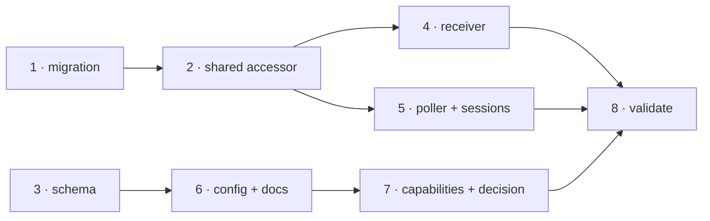

# Tasks: `routing` is a top-level concern, not a property of the webhook receiver

> Phase 3 of 3 (requirements → design → tasks). A DAG of implementation tasks derived from
> the approved design.

## Task list

- [x] 1. Migration: refuse the old key and move it (`migrations.py`)
  - `CURRENT_CONFIG_VERSION` → `0.4.0`; `_ROUTING_SITE`/`_ROUTING_KEY` constants.
  - `needs_migration` detects `webhooks.ghWebhook.routing`; `assert_current` raises
    `ConfigTooOld` naming the old key, `routing`, the reason and
    `/the-loop:upgrade-the-loop`.
  - `migrate_cli_config` pops the block, writes it into top-level `routing` key by key
    (`setdefault`, no list union), reports every override, removes emptied containers.
  - _Depends on:_ none
  - _Requirements:_ R2.1–R2.5, R3.1–R3.4
  - _Test:_ `pytest cli/tests/test_migrations.py` — refusal, message content, the move,
    empty-container removal, idempotence, both-blocks precedence (red→green)
- [x] 2. One shared accessor (`cli_config.load_routing_config`)
  - New function reading top-level `routing`, resolving the path per call.
  - `apply_integrations` fans `integrations.github.cli.binary` out to the block's new
    location.
  - _Depends on:_ 1
  - _Requirements:_ R4.2, R4.3
  - _Test:_ `pytest cli/tests/test_cli_config.py` (red→green)
- [x] 3. Schema: promote the `routing` definition
  - Move the object verbatim to `properties.routing`, between `polling` and `eventLog`;
    delete `properties.webhooks.properties.ghWebhook.properties.routing`.
  - _Depends on:_ none
  - _Requirements:_ R1.1, R1.2
  - _Test:_ `pytest cli/tests/test_docs_parity.py` (red until task 6, then green)
- [x] 4. Receiver reads the promoted key (`commands/gh_webhook.py`)
  - `_build_routing(routing_config, gh_webhook_config)`; `--route` default and help from
    `routing.enabled`; the `authorizedUsers` warning names `routing.authorizedUsers`.
  - Hot reload reads the whole config strictly and splits it two ways (design D3).
  - _Depends on:_ 2
  - _Requirements:_ R1.3, R1.4, R5.3
  - _Test:_ `pytest cli/tests/ -k "gh_webhook or reload or routing"` (red→green)
- [x] 5. Poller and sessions drop the cross-command import
  - `poll.py` and `sessions_cmd.py` use `cli_config.load_routing_config()`; the
    `from .gh_webhook import _load_config_defaults` import goes.
  - Operator-facing strings in `poll.py` name `routing.*`.
  - _Depends on:_ 2
  - _Requirements:_ R4.2, R5.3
  - _Test:_ `pytest cli/tests/ -k "poll or sessions or reset or interaction"` + a new
    assertion that neither module imports the helper (red→green)
- [x] 6. Config files and documentation
  - Both `cli-config.yaml` files (this repo's and the shipped template): top-level
    `routing`, `version: "0.4.0"`, the "NOT webhook-only" note replaced by the block's own
    scope statement.
  - `docs/config/cli/routing-options.md` `configBase: routing` and its prose; `index.md`;
    `docs/cli/commands/migrate-config.md`; `docs/cli/commands/poll.md`; `cli/README.md`;
    `commands/upgrade-the-loop.md`; `commands/work-on.md`; `docs/reports/gh-queries.md`;
    the skill's `reference/automation.md` and `reference/collaboration.md`.
  - Module docstrings: `dispatcher.py`, `control.py`, `authz.py`, `announce.py`,
    `reactions.py`, `trust.py`, `graphlink.py`, `interaction.py`, `poller/poller.py`,
    `graph/bootstrap.py`, `commands/poll.py`.
  - _Depends on:_ 3
  - _Requirements:_ R1.5, R5.1, R5.2, R5.3
  - _Test:_ `pytest cli/tests/test_docs_parity.py` (P3/P4 green)
- [x] 7. Capability docs, decision record and changelog
  - `docs/capabilities/webhook-triggers.md` and `docs/capabilities/cli.md`: current key +
    a history row for issue-142.
  - `docs/decisions/decision-053.md` recording the promotion, listed in `decisions.md`.
  - _Depends on:_ 6
  - _Requirements:_ R5.5
  - _Test:_ `pytest cli/tests/` (full suite green)
- [x] 8. Full validation and evidence
  - `make lint typecheck test` (or the configured equivalents), old→new migration proven
    end-to-end with `the-loop migrate-config --dry-run`.
  - _Depends on:_ 1, 2, 3, 4, 5, 6, 7
  - _Requirements:_ all
  - _Test:_ full suite + `ruff` + `pyright` + `markdownlint`

## Dependency graph (DAG)

Tasks 1 and 3 are independent roots and were executed together; 4 and 5 are independent of
each other.

## Checkpoints

After tasks 1–2 (the runtime contract), after 5 (all readers moved), after 6 (docs parity)
and after 8 (full validation). Each records its command and result in
`execution-log.md`. The review phase then runs the self/critic rounds and the security
review gate — tier 4, so a **named human security sign-off** is requested on the PR.

## Review comments

> Appended by the-loop's `record-feedback` hook when a human gate approves with comments.
