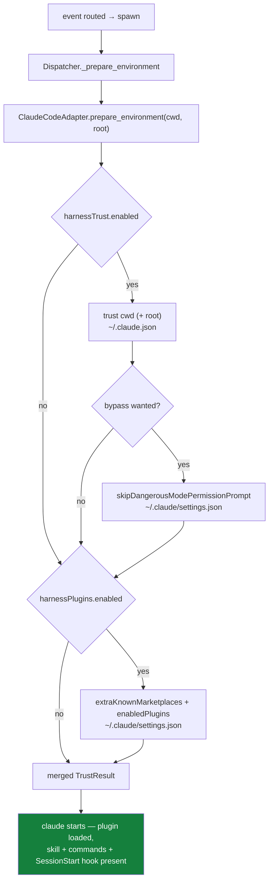

# Design: the CLI installs the-loop's own plugin before a spawned session starts

> Phase 2 of 3 (requirements → design → tasks). Derived from the locked
> [`requirements.md`](./requirements.md).

## Overview

One new step joins the pre-spawn preparation the dispatcher already runs. Today
`ClaudeCodeAdapter.prepare_environment()` writes workspace trust (and, when configured,
the bypass-permissions acceptance) into the harness's own config; after this change it
also ensures the harness's **user settings file** carries the-loop's marketplace and
plugin enablement:

```json
{
  "extraKnownMarketplaces": {
    "the-loop": { "source": { "source": "github", "repo": "MadaraUchiha-314/the-loop" } }
  },
  "enabledPlugins": { "the-loop@the-loop": true }
}
```

Everything else already exists and is reused unchanged: the atomic non-destructive JSON
merge, the config-dir resolution (`$CLAUDE_CONFIG_DIR` → `~/.claude`), the per-file lock,
the `TrustResult` reporting shape, the dispatcher's best-effort call site, and the
`workspace.trusted` / `workspace.trust_failed` events.



## Which settings file (the one real decision)

Claude Code merges `enabledPlugins` from several sources. Three were considered:

| Option | Effect | Verdict |
|---|---|---|
| **User settings** (`<config dir>/settings.json`) | machine-global; exactly what `/plugin install` writes | **chosen** |
| Checkout's `.claude/settings.json` | per-repo, but it is a **tracked file in the operator's clone** | rejected |
| Checkout's `.claude/settings.local.json` | per-checkout and conventionally untracked | rejected |

The two project-scoped options put a file the daemon authored inside a working tree the
spawned agent is about to `git add` and open a PR from. `settings.json` is tracked — the
write would show up as a modified file in every PR the loop produces. `settings.local.json`
is untracked *by convention*: Claude Code adds it to `.gitignore` when it creates it, but
in a repository that neither ignores nor expects it, the daemon would leave an untracked
file sitting in the agent's path. the-loop's workspace machinery otherwise never writes
into a checkout — clones and worktrees are made with `git` and touched only by the session
itself — and this change is not worth being the exception.

The user settings file is where the harness's own install flow writes, where the-loop
already writes `skipDangerousModePermissionPrompt`, and it is outside every repository. Its
cost is honest and stated: it is **machine-global**, so the-loop's SessionStart hook will
also greet interactive sessions the operator starts by hand. That is the same asymmetry
`acceptBypassPermissions` documents, it is what installing a plugin means, and
`harnessPlugins.enabled: false` is the opt-out. Recorded as `decision-054`.

## Components

### `cli/the_loop/harness_plugins.py` (new)

```python
MARKETPLACE_NAME = "the-loop"          # marketplace.json → name
PLUGIN_NAME = "the-loop"               # plugin.json      → name
DEFAULT_MARKETPLACE_REPO = "MadaraUchiha-314/the-loop"
PLUGIN_KEY = f"{PLUGIN_NAME}@{MARKETPLACE_NAME}"

@dataclass
class PluginConfig:                    # mirror of routing.harnessPlugins
    enabled: bool = True
    marketplace_repo: str = DEFAULT_MARKETPLACE_REPO
    @classmethod
    def from_mapping(cls, data: dict) -> "PluginConfig": ...

class ClaudePluginStore:               # where Claude Code records plugins, and how to set it
    def __init__(self, store: Optional[ClaudeTrustStore] = None): ...
    def settings_path(self) -> Path: ...          # delegates to ClaudeTrustStore
    def enable(self, marketplace_repo: str) -> TrustResult: ...
```

`enable()` is a single `update_json()` call whose mutator adds **only absent** keys:

- `extraKnownMarketplaces[MARKETPLACE_NAME]` when the key is absent *and* the repo is a
  valid `owner/repo` (empty repo → skip the marketplace, enable the plugin anyway);
- `enabledPlugins[PLUGIN_KEY] = True` when that key is absent — an existing `false` is an
  operator's decision and stays (AC R2.2).

A container that exists but is not a JSON object (`"enabledPlugins": []`) is reported
through `TrustResult(ok=False, …)` and nothing is written — the mutator records the reason
and returns "unchanged", so the existing writer's untouched-file guarantee holds.

`ClaudeTrustStore` gains nothing but a rename: its module-private `_update_json` becomes
public `update_json` so the new module can reuse it rather than copy an atomic writer.
Path resolution is *delegated*, not duplicated — `ClaudePluginStore` holds a
`ClaudeTrustStore` for `settings_path()`, so `$CLAUDE_CONFIG_DIR` keeps one implementation.

### `cli/the_loop/harness/claude_code.py`

`prepare_environment()` gains an independent third step:

```python
result = TrustResult()
if self.trust.enabled:
    store = ClaudeTrustStore()
    result = store.trust(cwd, root if self.trust.roots_allowed else None)
    if self._wants_bypass():
        result = result.merge(store.accept_bypass_permissions())
if self.plugins.enabled:
    result = result.merge(ClaudePluginStore().enable(self.plugins.marketplace_repo))
return result
```

Independent by design (AC R3.5): an operator who turns trust off (their harness is already
trusted, or they answer the dialog themselves) still wants the plugin, and vice versa.
`TrustResult.merge` already carries "all notes, first error wins", so one failed write
neither hides nor blocks the other.

### Config plumbing

`HarnessAdapter.__init__` takes `plugins: Optional[PluginConfig]` alongside `trust`;
`build_adapters(harness_args, trust, plugins)` passes it (the default keeps every existing
caller working); `RoutingConfig` gains `harness_plugins: PluginConfig` parsed from
`routing.harnessPlugins`; the three `build_adapters` call sites (dispatcher, `gh-webhook`,
`poll`) pass `config.harness_plugins`. `CursorAgentAdapter` inherits the base no-op
`prepare_environment`, so it stays silent (AC R1.3).

### Events

No new event type. The plugin write lands in the same `applied` list the dispatcher already
logs and emits as `workspace.trusted` (AC R3.3), and a failure takes the existing
`workspace.trust_failed` path (AC R3.4). Both event descriptions in `eventlog.py` are
widened to say "pre-spawn preparation" rather than trust alone — a new event name would
split one pre-spawn step's audit trail across two types for no reader's benefit.

### This repository's own `.claude/settings.json`

The two entries are added to this repo's checked-in settings (AC R4.1) — the literal diff
in the issue. That is what makes a cloud/web session in *this* repository load the plugin
without the daemon being involved at all, which is the gap `CLAUDE.md` describes.

## Data model — the config block

```yaml
routing:
  harnessPlugins:
    enabled: true                                # opt-out
    marketplaceRepo: "MadaraUchiha-314/the-loop"  # "" → enable only, register nothing
```

Two keys, no list of arbitrary plugins: the issue asks for the-loop to add *itself*, and a
general plugin-installer is an option nobody has asked to set
(`reference/minimalism.md`). `marketplaceRepo` exists for the case that is real — running a
fork — and doubles as the escape hatch for anyone whose marketplace is registered some
other way (set it to `""`).

## Error handling

| Situation | Behaviour |
|---|---|
| settings file missing | created `0600` with both keys |
| settings file unparseable | reported, untouched (existing `update_json` guarantee) |
| `extraKnownMarketplaces` / `enabledPlugins` not an object | reported, nothing written |
| `marketplaceRepo` malformed | reported, nothing written |
| `marketplaceRepo` empty | plugin enabled, marketplace untouched |
| either key already present | left as-is; when both are, nothing is written at all |
| write fails (permissions, disk) | warning + `workspace.trust_failed`; the spawn proceeds |

## Security design

The requirements name one boundary: *what code a spawned harness session loads*. It is
enforced by keeping every input to the write **operator-owned and constant-shaped**:

- The marketplace and plugin names are constants in the-loop's source; only the repository
  is configurable, and only from the operator's own `cli-config.yaml`. No webhook payload,
  no cloned repository file, and no session output reaches this code — so a hostile work
  item cannot point a spawned session at a marketplace of its choosing (abuse case 1).
- `marketplaceRepo` is validated against `^[A-Za-z0-9._-]+/[A-Za-z0-9._-]+$` before it is
  written (abuse case 2). No subprocess or URL is constructed here — the guard is about not
  planting junk in the operator's settings file, and it fails closed by writing nothing.
- Existing values are never overwritten, so the write cannot re-enable a plugin an operator
  disabled or repoint a marketplace they registered (abuse case 3, AC R2.1/R2.2).
- Least privilege on the file itself is inherited: `0600` when created, mode preserved when
  it exists, symlinks resolved rather than replaced, atomic rename, one lock per file.
- Fail-closed everywhere: unreadable/unparseable/odd-shaped file → untouched and reported;
  malformed repo → nothing written; any failure → the spawn still happens with the plugin
  simply absent, which is exactly today's behaviour.

The residual risk is the deliberate one: a machine-global `enabledPlugins` entry means
the-loop's skill, commands and SessionStart hook load in the operator's *own* Claude Code
sessions too, and a `marketplaceRepo` pointed at a fork means running whatever that fork
ships. Both are stated in the schema, the config docs and the capability doc rather than
being left for a reader to discover. Risk tier 4 (the change touches
`.the-loop/cli-config.schema.json`, an `autonomy.sensitivePaths` match) → human approval at
the PR plus a named security sign-off (`security.review.humanSignOffMinTier: 4`).

## Testing strategy

| Level | What it proves | Where |
|---|---|---|
| unit | a fresh settings file gets both entries with the exact shape from the issue | `cli/tests/test_harness_plugins.py` |
| unit | an existing marketplace entry and an existing `false` enablement are both left alone | `cli/tests/test_harness_plugins.py` |
| unit | second call writes nothing (idempotence); mtime unchanged | `cli/tests/test_harness_plugins.py` |
| unit | non-object containers, malformed repo → `ok=False`, file untouched | `cli/tests/test_harness_plugins.py` |
| unit | empty repo → plugin enabled, no marketplace entry | `cli/tests/test_harness_plugins.py` |
| unit | `$CLAUDE_CONFIG_DIR` is honoured (path delegation) | `cli/tests/test_harness_plugins.py` |
| unit | adapter: plugins on with trust off (and the reverse) each write their own file | `cli/tests/test_harness_plugins.py` |
| unit | `PluginConfig.from_mapping` defaults + overrides | `cli/tests/test_harness_plugins.py` |
| integration | the dispatcher's pre-spawn step lands the plugin keys **before** the harness starts, and names them in `workspace.trusted` | `cli/tests/test_trust_integration.py` (Gherkin docstring, per `testing.gherkinDocstrings`) |
| contract | schema ↔ config docs parity for the new block | `cli/tests/test_docs_parity.py` (existing) |

## Docs to update in the same PR

- `.the-loop/cli-config.schema.json` — the `harnessPlugins` block (user-facing docs here).
- `.the-loop/cli-config.yaml` and `skills/the-loop/templates/cli-config.yaml` — the mirrored
  operator config, both validated by `scripts/validate_config.py`.
- `docs/config/cli/routing-options.md` — one section per new option (Type + Default, per
  the parity gate).
- `docs/capabilities/interactive-sessions.md` — living behaviour + a history row.
- `docs/decisions/decision-054.md` + the `decisions.md` index — the settings-file choice.
- `.claude/settings.json` — this repository dogfooding the entries.
