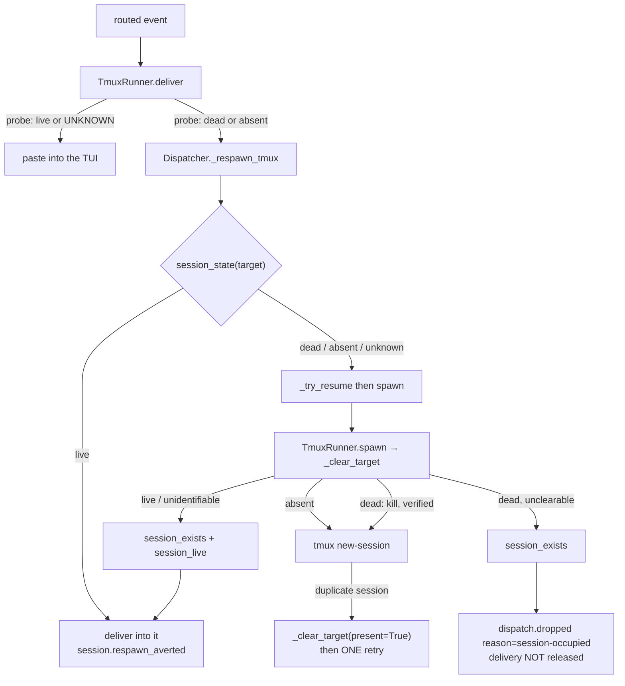

# Design: a tri-state tmux probe, a protective pre-flight, and a respawn that routes into a live session

> Phase 2 of 3. Derived from the locked [`bugfix.md`](bugfix.md). No UI artifacts
> (`design.uiArtifacts` — the-loop ships a CLI).

## 1. Shape of the fix

Three seams, in the order a dispatch meets them:



The invariant the whole design turns on: **`loop-<slug>` is owned by the work
item, so an occupant is always *this* work item's own agent.** Therefore an
occupant that is alive is never something to destroy — it is something to talk
to. That single rule collapses the crash-loop *and* the silent-kill defect.

## 2. `the_loop/runner.py`

### 2.1 A tri-state probe (C1 → AC1)

`_run` gains one field so callers can tell "tmux said no" from "tmux never
answered":

```python
@dataclass
class TmuxResult:
    ...
    # tmux's own exit status, or None when tmux never answered (probe timeout,
    # OSError, binary missing) — the distinction `session_state` is built on.
    exit_code: Optional[int] = None
```

Classifying by exit status rather than by parsing stderr is deliberate: tmux
exits non-zero for *both* "can't find session" and "no server running", and both
mean absent, while a timeout produces no exit status at all. Nothing depends on
tmux's wording.

```python
SESSION_LIVE = "live"        # exists, ≥1 pane still running
SESSION_DEAD = "dead"        # exists, every pane dead (retained, issue-86)
SESSION_ABSENT = "absent"    # tmux answered: no such session
SESSION_UNKNOWN = "unknown"  # tmux did not answer

def session_state(self, target: str) -> str: ...
```

`has_session` / `has_live_session` are re-expressed over it, and the change is
confined to the previously-conflated case:

| `session_state` | `has_session` | `has_live_session` |
|---|---|---|
| live | True | True |
| dead | True | False |
| absent | False | False |
| unknown | False (unchanged) | **True** (was False) |

`has_session` stays a **single** tmux call (existence only — its callers,
`terminate_harness` and `sessions attach`, do not need a pane read and are
best-effort readers for which "assume it is gone" is the safe answer).
`has_live_session` treating unknown as live is not a new bias — it is the one its
docstring already claims ("anything unreadable … is treated as **live** …
rather than declaring healthy sessions dead"), now applied to the `has-session`
call as well as the pane read. The consequence at the call site (AC2): `deliver`
proceeds to paste, and if the session really is gone the paste fails as an
ordinary error — `dispatch.failed`, released, retried — instead of a respawn that
can only collide.

### 2.2 A protective, verified pre-flight (C2/C3/C4 → AC3–AC5)

Two more result fields describe a collision, so callers need no second probe:

```python
    # An operation could not proceed because a session already holds the target
    # name — the collision `duplicate session` names. `session_live` says whether
    # that occupant still has a running harness, i.e. whether the pending event
    # can simply be delivered into it.
    session_exists: bool = False
    session_live: bool = False
```

`spawn` delegates the name to `_clear_target(target, timeout, present=False)`,
which returns `None` for "go ahead" or the `TmuxResult` the caller must return:

| occupant state | `present=False` (pre-flight) | `present=True` (after `duplicate session`) |
|---|---|---|
| absent | proceed | proceed (it vanished in between — spawn again) |
| live | **refuse**: `session_exists` + `session_live` | same |
| dead | `kill-session`, verify, proceed | same |
| dead, kill unverified | **refuse**: `session_exists` (not live) | same |
| unknown | proceed — let `new-session` decide | **refuse**: `session_exists` + `session_live` |

The asymmetry on `unknown` is the self-heal. Pre-flight cannot know, so it does
not guess: it lets `new-session` be the authority. If `new-session` returns
`duplicate session`, tmux has now *proved* the name is taken, so the same helper
re-runs with `present=True` and, if the occupant was clearable, the spawn is
retried **exactly once** — a straight-line `if`, no loop, so a persistent
collision costs one extra attempt and then reports itself.

An occupant tmux confirms but will not describe (`unknown` under `present=True`)
is reported as **live**, not killed. Only a definite "every pane is dead" ever
licenses `kill-session` — never destroy what you cannot see. The caller then
*tries delivering* into it, which is harmless if it turns out to be a dead pane
(the paste fails and is retried) and exactly right if there is an agent in there.

"Verify the clear" means: `kill-session` succeeded, **or** a re-probe says the
session is now absent. A `kill-session` that reports failure against a session
that is nonetheless gone is a success in the only sense that matters here.

Matching `duplicate session` *is* string matching, unavoidably — it is how tmux
reports it. It is used only to decide whether to **re-probe** (a read), never to
decide a destructive action: the kill that may follow is authorised by
`session_state`, not by the string. A tmux that words it differently loses the
one-shot recovery and falls back to the pre-existing behaviour (an error the
delivery retries), which is why the pre-flight is kept as the primary guard.

## 3. `the_loop/webhook/dispatcher.py`

### 3.1 Ask before replacing (C5 → AC6)

`_respawn_tmux` opens with the check the issue asks for:

```python
target = self.tmux.target_for(work_item)
if self.tmux.session_state(target) == SESSION_LIVE:
    return self._deliver_into_occupant(session, routed, prompt, target)
```

One extra tmux round-trip on the *recovery* path only (never on the happy path),
in exchange for never replacing a live agent. Placed before `_try_resume` so the
event log tells the truth: a live occupant is not a resume failure, and
`session.resume_failed` is not emitted for it.

### 3.2 Route into the occupant (AC6/AC7)

`_deliver_into_occupant` pastes the pending event into the existing session and,
on success, marks the delivery processed, drives the graph link and emits
`session.respawn_averted` — the same tail a successful delivery has, minus the
re-registration a respawn needs (the registry already points at this target). If
that paste fails it is an ordinary transient fault: `dispatch.failed`, released
for retry (AC9). It deliberately does **not** fall back into a respawn — that is
the loop this issue exists to remove.

The same helper serves the `session_exists && session_live` branch of a spawn
result (AC7), so the race between the opening probe and `new-session` lands in
the same place as the probe itself.

### 3.3 Skip, don't loop (C6 → AC8)

`session_exists && not session_live` — an occupant that is dead and could not be
cleared — is the one case where nothing can be done with the event. It becomes
`dispatch.dropped` with `reason: session-occupied`: logged at error level,
returned as a failed dispatch (so the 😕 reaction still lands), and — the point —
**the delivery id is not discarded**, so no redelivery or poll cycle re-attempts
a collision that can only recur. Every other respawn failure keeps issue-80's
release-and-retry (AC9).

`_spawn_tmux` (first spawn, no registry session) has no session to deliver into,
so a `session_exists` result there becomes `session.spawn_failed` carrying the
operator's remedy (`tmux kill-session -t loop-<slug>`) — a loud refusal instead
of today's silent kill. See `bugfix.md` § Out of scope for why adopting an
orphaned live session is not attempted here.

## 4. Event-log vocabulary (AC10)

| Type / reason | Meaning |
|---|---|
| `session.respawn_averted` *(new)* | The target tmux session was alive after all; the pending event was delivered into it and no respawn happened (`work_item`, `harness`, `tmux_target`, `gh_event`, `delivery_id`). |
| `dispatch.dropped` · `reason: session-occupied` *(new reason)* | A dead session held `loop-<slug>` and could not be cleared, so nothing was spawned and the delivery was **not** released for retry. |
| `poll.rearmed` *(new)* | Comments abandoned by a spent retry budget under an older CLI version were un-resolved for one more full budget (`work_item`, `comments`, `recorded_version`) — AC11. |

Both are added to `EVENT_TYPES` in `the_loop/eventlog.py` (adding an
instrumentation point means adding its description there).

## 4b. Picking up already-stranded items (AC11) — `the_loop/poller/poller.py`

The collision fix repairs the *mechanism*; it does not revisit events the old
mechanism already abandoned. `_process_comment` spends the budget, emits
`poll.comment_failed`, then calls `resolve_comment(...)` — which writes the id
into `seenComments`, exactly as a **successful** delivery does. Delivered and
given-up are therefore indistinguishable in the ledger, and no later cycle can
tell that an item is stuck rather than done.

So a give-up is recorded as one:

```python
def resolve_comment(self, ref, comment_id, gave_up: bool = False) -> None:
    ...  # unchanged baseline + attempt-counter drop
    if gave_up:
        item["gaveUp"] = {"comments": [...], "version": __version__}
```

and the re-arm is a lazy, once-per-run, **version-gated** step inside
`_process_item` (before the candidate scan), so nothing has to enumerate the
store and only items the poller actually sees are touched:

```python
if ref not in self._rearmed:          # once per poller run, per item
    self._rearmed.add(ref)
    for cid in self.state.rearm_gave_up_comments(ref):   # [] unless the
        ...                                              # recorded version differs
```

**This is forward-looking, and deliberately so.** A comment abandoned *before*
this change carries no `gaveUp` record — the field did not exist — and the ledger
cannot tell it from a delivered one, so it is not re-armed. Replaying every seen
comment on an upgrade to catch it would re-forward whole threads, which is worse
than the disease. What actually un-sticks an item stranded by the pre-fix code is
the collision fix itself: the next event on it lands, and the human looking at a
stuck ticket produces one. The ledger record exists so this class of bug is
recoverable *next* time.

`rearm_gave_up_comments` removes those ids from `seenComments` and clears the
record, returning what it re-armed; their attempt counters were already dropped
by `resolve_comment`, so they come back with a **full** budget and flow through
the ordinary candidate path. One `poll.rearmed` record per item names the count.

Gating on `__version__` rather than on "poller started" is what makes this safe
under `poll --once` from cron: an unchanged version re-arms nothing, so an event
that is genuinely undeliverable is abandoned once, not once a minute. And it
matches the trigger the owner asked for — anyone who has this fix has upgraded,
so the upgrade *is* the signal. `finalize`'s pruning to live comment ids applies
to the new record too, so a re-armable id cannot outlive the comment.

## 4c. A killed tmux session keeps its conversation (AC12)

No new mechanism: this is the issue-89 path, and issue-146 is what was breaking
it. With `session_state` in place it becomes reliable end to end —

| step | before | after |
|---|---|---|
| `deliver` probes a killed session | absent → respawn ✔ (but a *busy* live one also read absent → collision) | absent → respawn; unknown → paste/retry, never a respawn |
| `_try_resume` spawns `claude --resume <id>` | pre-flight could kill a live occupant, or walk into `duplicate session` | occupant classified; live → routed into, dead → cleared and verified |
| `survived()` probes the resumed pane | a slow probe read as dead → good resume discarded for a blank conversation | unknown reads live → the resume is kept |

so the guarantee "the tmux session is gone, the *conversation* is not" holds
under a loaded tmux server rather than only an idle one. Covered by a regression
test (T12b) asserting the respawn argv is `--resume <recorded id>` and that the
registry keeps that id. Unchanged: cursor-agent has no interactive resume, so it
still falls back to a fresh conversation with `session.resume_failed`.

## 5. Error handling

| Situation | Outcome |
|---|---|
| Probe times out on delivery | Treated as live → paste attempted → transient failure if it really is gone (retried) |
| Live occupant on the respawn path | Event pasted into it; `session.respawn_averted`; delivery marked processed |
| Dead occupant | Cleared (verified), respawn proceeds as issue-80/89 |
| Dead occupant, unclearable | `dispatch.dropped` / `session-occupied`; **not** retried |
| `duplicate session` from `new-session` | Re-decide once from tmux's answer; one retry at most |
| Live occupant on the **first**-spawn path | `session.spawn_failed` with the manual remedy; nothing killed |
| Anything else | Unchanged (issue-80/89 paths) |

## 6. Testing strategy

Unit (`cli/tests/test_tmux_runner.py`) — `session_state` over all four states
including a `subprocess.TimeoutExpired` probe; `has_session` / `has_live_session`
truth table; `spawn` refusing a live occupant without calling `kill-session` or
`new-session`; `spawn` clearing a dead one; `spawn` refusing when the clear is
unverified; the `duplicate session` re-probe and its single retry.

Integration (`cli/tests/test_tmux_runner_integration.py`, Gherkin docstring +
`Requirement:` link, per `config.testing`) — the issue's own repro end to end
over the stub tmux: an event whose delivery finds the pane dead but whose target
is alive by respawn time is **pasted, not respawned**, and `new-session` is never
invoked; and a stub whose `new-session` reports `duplicate session` against a
live occupant ends as `session-occupied` with the delivery **not** released.

One existing stub knob has to become semantic rather than positional:
`STUB_TMUX_PANE_DEAD_ONCE` currently means "the first `list-panes` call reports
dead", which silently assumes exactly how many times the code probes. It is
replaced by `STUB_TMUX_PANE_DEAD_UNTIL_SPAWN` — dead until a `new-session` is
recorded, live after — which is what the issue-89 test's own Gherkin says
("dead when the event is delivered, alive once respawned") and is independent of
probe count.

## 7. Alternatives considered

- **Keep killing the occupant, just check the kill.** Fixes the crash-loop and
  keeps the data-loss bug: an idle detached agent reads identically to a busy
  one, so this trades a visible stall for silent destruction of work in progress.
  Rejected.
- **Retry `new-session` with a suffixed name (`loop-<slug>-2`).** Abandons the
  deterministic name every other part of the system relies on (registry
  `tmuxTarget`, the announced attach command, `sessions attach`,
  `_LOOP_TARGET_RE`), and leaves the original session orphaned. Rejected.
- **Exponential backoff on the failing dispatch.** The issue mentions it, but the
  collision is deterministic — backoff makes an unhealable failure slower, not
  healable. Rejected in favour of removing the recurrence (see `bugfix.md`
  § Out of scope).
- **Make the probe timeout configurable.** Treats a symptom; a longer timeout
  still eventually mis-reads a busy server. Rejected — the fix is to stop
  reading "no answer" as "no session".
- **Adopt an orphaned live session on the first-spawn path.** Genuinely useful,
  but it means registering a session whose harness id the-loop does not know, so
  a later resume is a fresh conversation anyway. Out of scope; refusing to kill
  it is the safe half and it is loud.

## Security design

The `bugfix.md` threat model requires that the collision decision be derived only
from already-trusted state and that the destructive branch narrow rather than
widen. Enforced concretely:

- **Every tmux target is `target_for(work_item)`** — minted from the registry's
  work-item ref, never from a payload or a registry-supplied `tmuxTarget` string.
  `_clear_target` takes the name from its caller in `spawn`, which derives it
  itself, so no new path can aim `kill-session` at an arbitrary session.
- **`kill-session` is now gated on `session_state == dead`** (or a
  tmux-confirmed collision), where it was unconditional. This is the only
  destructive operation in the change and it is strictly more constrained than
  before; `terminate_harness`'s `_LOOP_TARGET_RE` guard on signalling pane pids
  is untouched.
- **Ambiguity fails closed.** `unknown` never authorises a kill or a replacement
  spawn; it authorises at most an attempted paste (harmless) or one `new-session`
  whose refusal is then respected.
- **Bounded recovery.** The post-`duplicate session` retry is a single
  straight-line attempt, and the `session-occupied` outcome withholds the
  delivery id — so this change removes an existing way to induce repeated spawn
  attempts and adds none.
- **No new external input, config key, file, or network call**, and no change to
  authorization, the prompt template, or the payload framing.
