# Tasks: stop the respawn colliding with the session it replaces (issue-146)

> Phase 3 of 3. Derived from the locked [`design.md`](design.md). TDD
> (`tdd.mode: standard`): the failing test comes first for every behavioural task.

## DAG

```mermaid
flowchart LR
    T1[T1 probe tests] --> T2[T2 exit_code + session_state]
    T2 --> T3[T3 has_session/has_live_session]
    T3 --> T4[T4 spawn pre-flight tests]
    T4 --> T5[T5 _clear_target + duplicate-session retry]
    T5 --> T6[T6 eventlog vocabulary]
    T6 --> T7[T7 _respawn_tmux routes into a live occupant]
    T7 --> T8[T8 session-occupied is skipped, not retried]
    T8 --> T9[T9 _spawn_tmux refuses instead of killing]
    T5 --> T10[T10 stub knob: dead-until-spawn]
    T10 --> T11[T11 integration: respawn averted]
    T9 --> T11
    T11 --> T12[T12 integration: duplicate session skipped]
    T12 --> T12b[T12b regression: killed tmux keeps the conversation]
    T6 --> T12c[T12c poll ledger records give-ups]
    T12c --> T12d[T12d version-gated re-arm]
    T12b --> T13[T13 lint + typecheck + full test run]
    T12d --> T13
    T13 --> T14[T14 capability + config docs, decision-055]
    T14 --> T15[T15 PR + reviewer briefing]
```

## Tasks

- [x] **T1 — Failing probe unit tests.** In `cli/tests/test_tmux_runner.py`:
  `session_state` returns `live` / `dead` / `absent` / `unknown`, with `unknown`
  driven by a `subprocess.TimeoutExpired` probe and by a missing binary; the
  `has_session` / `has_live_session` truth table of design §2.1. *(AC1, AC2)*
- [x] **T2 — `TmuxResult.exit_code` + `session_state`** in
  `cli/the_loop/runner.py`: `_run` records tmux's exit status and leaves it
  `None` when tmux never answered; `session_state` classifies from it plus the
  pane read. *(AC1)*
- [x] **T3 — Re-express `has_live_session`** over `session_state`, treating
  `unknown` as live (its documented contract). `has_session` keeps its
  unknown→False reading **and** stays a single existence-only call — its callers
  (`terminate_harness`, `sessions attach`) need no pane read. *(AC2)*
- [x] **T4 — Failing spawn pre-flight tests.** `spawn` against a live occupant
  issues neither `kill-session` nor `new-session` and returns
  `session_exists`/`session_live`; against a dead occupant it clears and spawns;
  when the clear is unverified it refuses; a `duplicate session` from
  `new-session` re-probes and retries **once**. *(AC3, AC4, AC5)*
- [x] **T5 — `session_exists` / `session_live` + `_clear_target`** in
  `runner.py`, and the single-retry `duplicate session` handler in `spawn`.
  *(AC3, AC4, AC5)*
- [x] **T6 — Event-log vocabulary.** `session.respawn_averted` and the
  `session-occupied` reason on `dispatch.dropped` in
  `cli/the_loop/eventlog.py`. *(AC10)*
- [x] **T7 — `_respawn_tmux` asks first, then routes.** The opening
  `session_state == live` check and `_deliver_into_occupant` (paste, mark
  processed, graph link, `session.respawn_averted`; transient failure →
  `dispatch.failed` + released), plus the `session_exists && session_live`
  branch of both spawn call sites. Unit tests in `cli/tests/test_tmux_runner.py`
  / the dispatcher tests first. *(AC6, AC7, AC9)*
- [x] **T8 — `session-occupied` is skipped, not retried.** `session_exists &&
  not session_live` → `dispatch.dropped` at error level with the delivery id
  **kept**; assert the deduper still holds it. *(AC8)*
- [x] **T9 — `_spawn_tmux` refuses a live occupant** with
  `session.spawn_failed` naming the manual remedy, instead of killing it.
  *(AC3)*
- [x] **T10 — The stub tmux tracks which sessions exist.** Rather than renaming
  the pane knob (the original plan), `cli/tests/test_tmux_runner_integration.py`'s
  stub now models session lifetime — `$STUB_TMUX_EXISTING` plus every recorded
  `new-session`, minus every *successful* `kill-session` — and answers
  `has-session` truthfully, refusing a `new-session` on a held name with tmux's own
  `duplicate session`. That makes absence the default (so the resume tests need no
  pane knob at all) and makes the collision expressible, which the old
  always-succeeds stub could not do. Adds `$STUB_TMUX_SLOW` for a probe timeout.
- [x] **T11 — Integration: the respawn is averted.** Gherkin +
  `Requirement: docs/specs/issue-146/bugfix.md#AC6`: delivery finds the pane
  dead, the target is live by respawn time → the event is pasted into it, no
  `new-session` is invoked, `session.respawn_averted` is logged, the delivery is
  marked processed. *(AC6)*
- [x] **T12 — Integration: `duplicate session` is skipped, not looped.** Stub
  `new-session` reports `duplicate session` for a dead, unclearable occupant →
  `dispatch.dropped` / `session-occupied`, the delivery id is **not** released,
  and no second spawn is attempted. *(AC5, AC8)*
- [x] **T12b — Regression: a killed tmux session keeps its conversation.**
  Gherkin + `Requirement: docs/specs/issue-146/bugfix.md#AC12`: the registry
  holds an active tmux-mode session, its tmux session is gone, an event arrives →
  the respawn argv is `claude --resume <recorded id>` and the registry keeps that
  id. Also assert the resume survives an **unanswered** liveness probe (the
  `survived()` half of the same fix). *(AC12)*
- [x] **T12c — The poll ledger records a give-up as a give-up.**
  `PollState.resolve_comment(..., gave_up=True)` writes
  `gaveUp: {comments, version}`; `_process_comment` passes it at the budget
  boundary; `finalize` prunes the record to live comment ids. Unit tests in
  `cli/tests/test_poller.py` first. *(AC11)*
- [x] **T12d — Version-gated, once-per-run re-arm.**
  `PollState.rearm_gave_up_comments(ref)` (no-op when the recorded version equals
  `the_loop.__version__`), called once per item per run from `_process_item`,
  emitting `poll.rearmed`. Tests: an older version re-arms and the comment is
  re-forwarded with a fresh budget; the **same** version re-arms nothing across
  repeated `poll --once` runs. *(AC11)*
- [x] **T13 — `make lint typecheck test`** (ruff + pyright + pytest, plus
  markdownlint on the docs) — same commands the hooks and CI run.
- [x] **T14 — Docs.** `docs/capabilities/interactive-sessions.md` (current
  behaviour + history row), the `tmux.keepSessionOnClose` /
  `tmux.resumeOnRespawn` paragraphs in `docs/config/cli/routing-options.md` that
  still promise a reclaimed name, and `docs/decisions/decision-055.md` +
  `decisions.md` for "never spawn over a live `loop-<slug>`; route into it".
- [ ] **T15 — PR + reviewer briefing** from the bundled template, phase label
  → `loop:needs-review`, execution log updated.
