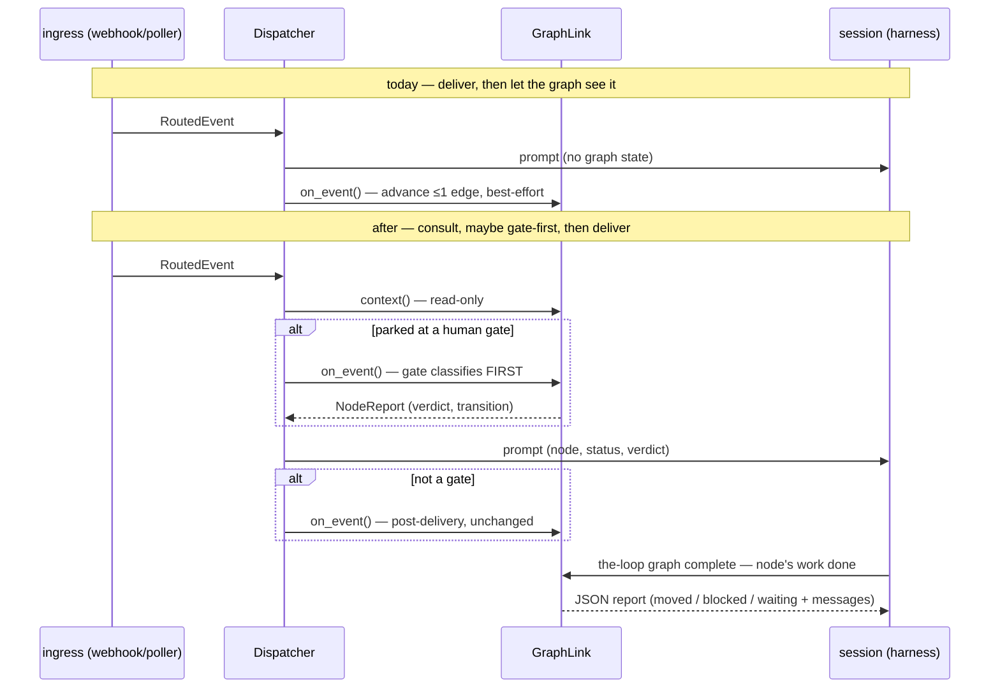

# Design: the graph runs the PDLC

> Phase 2 of 3 (requirements → design → tasks). Derives from the approved requirements.
> MUST be reviewed and approved before moving to tasks breakdown.

## Overview

The requirements name one missing primitive — a node-completion signal (R1) — and six
consequences of having it. The design work is seven decisions:

| # | Decision | Requirement |
|---|----------|-------------|
| D1 | The completion signal is a CLI verb: `the-loop graph complete` | R1 |
| D2 | A read-only `GraphContext`, resolved by a new `GraphLink.context()` | R3 |
| D3 | Context rides into prompts as one template variable, empty when absent | R3, R6.3 |
| D4 | Consult-first ordering only for items parked at a human gate | R4 |
| D5 | Spawn reads context before rendering; enters the graph after success | R3.2, R7.2 |
| D6 | Session binding recorded in graph state; `resolve_session()` gains its caller | R5 |
| D7 | Phase parity is a test; prose defers to `pdlc.yaml` | R6 |

Two properties hold everywhere: **advancement fails closed** (no evaluation → no move)
and **delivery fails open** (no consultation → deliver with context unknown). Every
decision below is shaped so that the second can never erode the first.

## Architecture

### The seam today, and after



### D1 — the completion signal is `the-loop graph complete <id>`

A new verb in `cli/the_loop/commands/graph_cmd.py`, beside `show`/`force`. Chosen over a
watched file (no daemon on the CLI path to watch it; a file is a state mutation
pretending not to be one) and over a dispatcher endpoint (the dispatcher may not be
running — `the-loop check` deliberately works with no daemon; R1.6 demands the same seam
for a human at a terminal).

- **Semantics:** load the runtime rooted at the invoking checkout (same bootstrap as
  `check`), then run `Runtime.advance(item)` — the *existing* evaluation path, no new
  chain-execution code (R1.1). No `event` payload is passed: a completion claim carries
  no text for a gate to read, which is what makes it a claim and not a verdict (R1.2).
- **Output:** one JSON envelope on stdout — `{node, status, outcome, moved,
  currentNode, messages[]}` — so an agent parses the gate's answer instead of scraping
  prose (R1.3). Exit 0 whether or not the pointer moved; a refusal or block is a
  *result*, not a CLI error.
- **Idempotency (R1.4):** the claim names the node it is about — `--node <id>`,
  defaulting to the current node at invocation. A replayed claim for a node the pointer
  has already left is a recorded no-op (`{moved: false, reason: "already-past"}`).
  A claim for a node that is not current and not past is refused naming the current node
  (R1.5). Within one node, `advance` is naturally idempotent: a chain that passed once
  passes again from the same artifacts; a chain that blocks leaves the pointer alone.
- **Who runs it:** the working session, prompted to (D3 tells it how); or a human at a
  terminal — identical verb, identical checkout-rooted state (R1.6). Under
  `routing.workspace` the session's cwd *is* the worktree carrying
  `graph-state.json`, so the verb needs no daemon coordination.

### D2 — `GraphContext`, a read-only resolve

`GraphLink` gains `context(work_item, cwd) -> Optional[GraphContext]` next to
`on_spawn`/`on_event`:

```python
@dataclass(frozen=True)
class GraphContext:
    current_node: str      # "" = not started
    phase: str             # the node's phase label, "" for gate nodes
    status: str            # in-progress | waiting | blocked | parked | complete | escalated
    reason: str            # parked/blocked reason, "" otherwise
    messages: tuple        # last unmet-gate messages, for the prompt
    next_command: str      # the node's `command:` from pdlc.yaml, "" if none
    actor: str             # agent | human — who the current node waits on
```

- **Pure read.** Loads `graph-state.json` and the shipped graph; runs **no** hook, no
  chain, no subprocess beyond the existing ownership proof. The full `_guarded` gate
  order is preserved (`_checkout_belongs_to` before any checkout read — decision-044),
  and every skip returns `None`.
- **Never raises**; `None` on any failure. `None` is the "context unknown / not
  applicable" signal R3.3 and R3.4 key off.

### D3 — one template variable, empty when absent

Both prompt templates gain `$graph_context`. When `context()` returns `None` it renders
as the empty string and the surrounding template text is unchanged — out-of-graph
repositories get byte-identical prompts modulo the empty substitution (R3.4). When
present it renders a fenced block:

```text
the-loop process state for $work_item:
  node: implementation (phase: implementation) — status: in-progress
  gate messages: (none)
  when this node's work is done, run: `the-loop graph complete issue-148`
  (this block is the-loop's own state, not part of the event payload)
```

The "run `the-loop graph complete`" line closes the loop that makes D1 fire at all, and
`next_command` (the node's existing `command:` field) is what R6.3 asks for: the
instruction is generated from the graph, not restated in prose. The spawn template's
hard-coded "requirements → design → tasks → implement → PR" line is deleted in the same
change.

### D4 — consult-first, only for human gates

In the dispatcher's delivery path (`_dispatch_to_session` and
`_deliver_into_occupant`):

1. `ctx = graphlink.context(...)` — before prompt render, always (R3.1).
2. **If** `ctx` shows the item parked at a node whose `actor` is `human`:
   `report = graphlink.on_event(...)` runs **before** delivery, `ctx` is re-resolved,
   and the rendered `$graph_context` carries the gate's verdict and any transition
   (R4.1). `on_event`'s return type widens from `None` to `Optional[NodeReport]` — its
   never-raise contract is untouched.
3. Deliver. A gate that failed to classify (unauthorized author, indecisive text, hook
   fault) changed nothing; the event is delivered with the gate still waiting (R4.2).
4. **Else** (not a human gate): deliver, then `on_event` — today's order, verbatim
   (R4.3).

Requirements open question 2 is hereby answered **no**: there is no consume-only route.
Every event is delivered; a gate only ever gets to speak *first*, never *instead*
(R4.4 stays dormant — nothing in `pdlc.yaml` declares consumption, and no event-loss
mode exists to test).

### D5 — spawn: read before render, enter after success

`_spawn_for` calls `context()` before rendering the spawn prompt. A fresh item yields
`None` → the prompt says "start the loop" exactly as today. A mid-graph item (respawn
after crash/close — the pointer survives in the checkout) yields its node → the prompt
says *resume at `<node>`: run `/the-loop:<next_command>`* (R3.2). Both load-bearing
orderings survive untouched (R7.2): the start is still recorded before the spawn
(`_apply_control`), and `on_spawn` — the only *write* — still runs last, after success.
Reads before the spawn, writes after it.

### D6 — the session binding lives in graph state

- `on_spawn` additionally records `{"session": {"id": <harness_session_id>, "runner":
  <runner>, "alive": true}}` into the item's graph state.
- `Dispatcher.close_session` calls a new best-effort `graphlink.on_close(work_item,
  cwd)` that flips `alive: false`. Same never-raise envelope as the other entry points.
- When a **gate node** is entered, the runtime calls `Runtime.resolve_session(node,
  state)` — the method's first caller — and records the resolution (`inherited` /
  `fresh-with-artifacts`) in the event log (R5.1, R5.2). The registry stays the
  authority: if it has no live session matching the binding, the binding is marked dead
  and the fallback applies (R5.3). This work item *records and honours* the binding; it
  does not re-route dispatch through it — dispatch routing stays with the registry.

### D7 — parity is a test; prose defers

- `cli/tests/test_graph_parity.py` gains: the ordered `phase:` values of `pdlc.yaml`
  nodes must appear, in order, within `workflow.phases` of
  `skills/the-loop/templates/harness-config.yaml` **and** of this repo's own
  `.the-loop/harness-config.yaml` (R6.2). `not-started` (pre-graph) and phases only a
  label knows are asserted as the allowed complement, so the test states the whole
  relationship rather than a subset.
- `SKILL.md` and `reference/workflow.md` keep their phase table but each gains the one
  authoritative sentence — the sequence is **defined** by `cli/the_loop/graph/pdlc.yaml`;
  the prose is a rendering of it (R6.1).

### Concurrency: two writers, one file

`graph-state.json` gains a second writer (the session's D1 verb, beside the daemon's
GraphLink). Both go through `GraphState.load → mutate → save`. The load–save window is
wrapped in an advisory `fcntl.flock` on a `graph-state.lock` sibling (stdlib; no-op
fallback where `fcntl` is unavailable). The collision window is one node evaluation;
because claims are idempotent and evaluation re-derives from artifacts, a lost update
costs a re-run, never a wrong pointer. No new dependency (minimalism ladder: stdlib).

## Data models

- `GraphContext` (D2) — new, frozen, in `graphlink.py`.
- Graph state (`graph-state.json`) gains two optional keys, both ignored by older
  readers: `session` (D6) and `completions: {node: {at, by}}` (D1's replay ledger).
- `NodeReport` — unchanged; `on_event` now surfaces it (D4).

## Error handling

Enumerated per call site (R7.3), all recorded as today's `graph.link_failed` /
`graph.skipped` event-log entries:

| Failure | Where | Behaviour |
|---|---|---|
| `context()` fault or skip | delivery, spawn | deliver/spawn with `$graph_context` empty — fail open |
| gate-first `on_event` fault | D4 step 2 | deliver anyway, gate unchanged — fail open |
| `graph complete` on a blocked node | D1 | JSON report with the block's messages; pointer unmoved — fail closed |
| `graph complete` chain raises | D1 | `block` with `retriable=False` (existing hook contract); pointer unmoved |
| lock contention timeout | D1 vs daemon | claim retries once, then reports `{moved: false, reason: "busy"}` |
| `on_close` fault | close path | session close proceeds; binding goes stale, R5.3 reconciles |

## Security design

The requirements' trust boundaries, each enforced here. (Terms used verbatim so the
`enforces-boundaries-from` gate can hold this document to them: every **trust boundary**
and **abuse case** raised upstream is answered below.)

1. **Event text → pointer** (trust boundary, unchanged). D4 moves *when*
   `classify-feedback` runs, not *what it accepts*: authorization stays inside the hook,
   the link still passes author+body together and filters nothing itself (issue-113's
   single-authorization-point rule). Abuse case 1 (unauthorized "lgtm" at a gate) is
   re-asserted as a negative test **on the consult-first path** — the gate waits, the
   pointer holds, the event is still delivered.
2. **Session → graph** (the new trust boundary). The session may only *claim*; D1
   passes no event text into the chain, so there is nothing for a prompt-injected
   session to smuggle past a gate — the chain reads checked-in artifacts and nothing
   else. Abuse case 2 (a "declare everything done" injection) therefore degrades to
   running `validate-artifacts` early, which blocks on the artifacts it would block on
   anyway. Abuse case 3 (replay/flood): the `completions` ledger makes replays no-ops,
   `max_attempts` escalation bounds repeated blocks, and the flock bounds concurrent
   claims to sequential evaluations.
3. **Graph → prompt** (new flow, same trust class). `$graph_context` renders only
   the-loop's own derivations (node ids from the shipped graph, hook messages, a command
   name from `pdlc.yaml`) — no comment body, no payload text — and is framed in the
   template as state, not instructions. Hook messages can quote artifact content;
   artifacts are committer-trusted per the ownership proof, which `context()` still runs
   before any checkout read.
4. **Checkout → daemon** (existing boundary, decision-044). `context()` and `on_close`
   adopt `_guarded`'s gate order wholesale; no new path reads a checkout before
   `_checkout_belongs_to` proves whose it is, and spec-dir containment still applies.

Fail-posture summary: advancement fail-closed, delivery fail-open, refusals and faults
event-logged — unchanged from the requirements' Security considerations, now pinned to
call sites in the table above.

## Testing strategy

- **Unit** (pytest, `cli/tests/`): `test_graphlink.py` grows `context()` cases (each
  skip → `None`; message/actor extraction); `test_graph_runtime.py` grows completion
  claims (idempotent replay, wrong-node refusal, already-past no-op) and the
  `resolve_session` caller; dispatcher tests for D4's two orderings and D5's
  read-before-render; template tests for the empty-`$graph_context` byte-identity claim.
- **Integration** (Gherkin docstrings, `testing.gherkinDocstrings: required`, linked to
  requirements): *"completion signal advances a satisfied node"* (R1); *"a session run
  with no inbound events tracks phase via claims"* (R2.2); *"comment at a human gate is
  classified before delivery"* (R4.1); *"unauthorized comment neither resolves the gate
  nor is lost"* (abuse case 1); *"graph fault never costs a delivery"* (R3.3/R7.3);
  *"respawn resumes at the current node"* (R3.2).
- **Parity**: D7's phase-order assertions in `test_graph_parity.py` (R6.2).
- **CI**: the existing `gate` job needs no change — `check --recompute` semantics are
  untouched by design (R2.3), which is itself asserted by leaving its tests untouched.

## Out of scope (unchanged from requirements)

User-authored graphs; schedulers/queues/async; hook verification logic; ingress
surfaces; retiring the granular commands.

## Review comments

> Appended by the-loop's `record-feedback` hook when a human gate approves with
> comments (issue-109).
