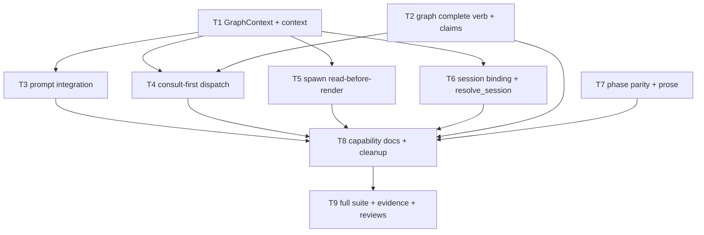

# Tasks: the graph runs the PDLC

> Phase 3 of 3. DAG of small, verifiable tasks; each references the design decision and
> requirements it delivers. Owner directives recorded with the approval: **no
> backwards-compatibility shims** (no shadow reads, no dual formats), and **remove
> unused baggage** encountered in the touched code.

## DAG

## Tasks

- [x] **T1 — `GraphContext` and `GraphLink.context()`** *(D2; R3.1, R3.3, R3.4)*
  Frozen dataclass in `graphlink.py`; read-only resolve behind `_guarded`'s gate order;
  every skip → `None`; never raises. Unit tests: each skip path, field extraction
  (node/phase/status/reason/messages/next_command/actor).
- [x] **T2 — `the-loop graph complete` + completion claims** *(D1; R1.1–R1.6, abuse
  cases 2–3)*
  `completions` ledger + advisory flock in `graph/state.py`; `Runtime.complete(item,
  node)` wrapping `advance` with claim semantics (already-past no-op, wrong-node
  refusal); CLI verb with one JSON envelope, exit 0 for refusals/blocks. Tests:
  idempotent replay, wrong-node, block leaves pointer, lock busy path.
- [x] **T3 — `$graph_context` in both prompts** *(D3; R3.1, R3.2, R3.4, R6.3)*
  `_render_prompt` gains the variable; template files updated; the spawn template's
  hard-coded phase-flow line removed (owner: no compat baggage). Test: absent context ⇒
  byte-identical prompt modulo empty substitution.
- [x] **T4 — consult-first at human gates** *(D4; R4.1–R4.4)*
  `on_event` returns `Optional[NodeReport]`; dispatcher: resolve → (gate? advance
  first, re-resolve) → deliver → (else advance after). Tests: both orderings; gate
  fault still delivers; unauthorized comment neither resolves nor is lost.
- [x] **T5 — spawn reads context before render** *(D5; R3.2, R7.2)*
  Fresh item ⇒ start prompt; mid-graph respawn ⇒ resume-at-node directive from
  `next_command`. Orderings asserted: start recorded before spawn; `on_spawn` after
  success only.
- [x] **T6 — session binding + `resolve_session`'s caller** *(D6; R5.1–R5.3)*
  `on_spawn` writes `state.session`; new best-effort `on_close` flips `alive`;
  gate-node entry calls `resolve_session` and event-logs the resolution; registry
  wins on disagreement.
- [x] **T7 — phase parity test + prose deferral** *(D7; R6.1, R6.2)*
  `test_graph_parity.py`: pdlc phase order ⊂ `workflow.phases` (template + this repo),
  complement pinned. One authoritative sentence in `SKILL.md` + `reference/workflow.md`.
- [x] **T8 — capability docs + baggage removal** *(SKILL rule: same-PR docs)*
  `docs/capabilities/process-graph.md` behaviour + history row; `webhook-triggers.md`
  prompt-variable note. Remove dead code encountered in touched files. (Found and
  fixed in passing: **tmux spawns never entered the graph** — `on_spawn` was only on
  the process-runner tail.)
- [x] **T9 — full suite, evidence, self/critic reviews** *(ready-to-ship gate)*
  `uv run pytest`, ruff, pyright, markdownlint; evidence in execution log; 3 self-reviews
  (critic list is empty in config — noted); PR briefing before human review.
