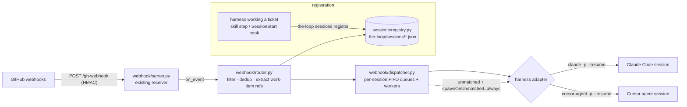

# Design: GitHub events trigger a harness session programmatically

> Phase 2 of 3. Derives from the requirements in `requirements.md`.

## Overview

The issue's preferred approach — subscribing to events through the GitHub MCP server —
is **not viable today** (R1). MCP does define in-session notifications
(`resources/subscribe`, `listChanged`), but they only flow to a *connected* client:
they cannot wake an idle harness, the official `github/github-mcp-server` declares no
event-subscription surface, and an event-pushing MCP server would still need its own
webhook receiver from GitHub — the receiver moves, it doesn't disappear.
Claude.ai/code's `subscribe_pr_activity` is Anthropic-hosted webhook infrastructure,
not something a locally-run harness can use. Recorded (with the re-evaluation
trigger) in `docs/decisions/decision-016.md`.

So we build approach 2 on the receiver the CLI already ships: **webhook receiver →
router → session registry → dispatcher → harness adapter**. Everything stays in the
zero-dependency Python CLI (`cli/the_loop`); harnesses are triggered as subprocesses
through their official CLIs (`claude -p --resume`, `cursor-agent -p --resume`), which is
the only official programmatic surface both vendors share (Cursor has no Python SDK —
its official SDK is TypeScript; Claude's Python Agent SDK can become an optional adapter
later).

The linkage problem the issue calls out ("the right event goes to the right session")
is solved by a **session registry**: when a harness starts working a ticket it registers
`work-item ↔ (harness, harness-session-id, cwd)`; the router extracts work-item
references from each webhook payload and looks them up there.

## Architecture



Event lifecycle: receive (verify HMAC — exists) → filter (event type enabled?) → dedup
(`X-GitHub-Delivery`) → extract work-item refs → registry lookup → enqueue on the
matched session's queue → worker renders the prompt → adapter resumes the harness →
registry `lastEventAt` updated. Unmatched events follow the configured policy.

## Components & interfaces

### 1. Session registry — `cli/the_loop/sessions/registry.py` (new)

Responsibility: durable, concurrency-safe `work item ↔ session` linkage (R2).

- Storage: **one JSON file per session** under `webhooks.ghWebhook.routing.registryDir`
  (default `.the-loop/sessions/`, git-ignored). Human-inspectable, no lock contention
  across sessions; writes are atomic (`tempfile` + `os.replace`). Chosen over a single
  file (cross-process locking) and sqlite3 (opaque to users; overkill for tens of rows).
- API: `register(session, force=False)`, `close(key)`, `find_by_work_item(ref)`,
  `list_sessions(status=None)`, `touch(key, delivery_id)`. `register` enforces
  one-active-session-per-work-item (R2.3).

### 2. Event router — `cli/the_loop/webhook/router.py` (new)

Responsibility: pure functions from `(event_name, payload)` to routing decisions (R3).

- `extract_work_items(event, payload) -> list[WorkItemRef]`:
  - `issues` / `issue_comment` → `issue.number` (an `issue.pull_request` key means the
    "issue" is a PR).
  - `pull_request`, `pull_request_review`, `pull_request_review_comment` →
    `pull_request.number`, plus the issue referenced by the head-branch convention
    (`…issue-<n>-…`) and closing keywords in the PR body — so a session registered
    against the *issue* still receives its PR's events.
  - `workflow_run` / `check_run` / `check_suite` / `status` → head branch / attached
    PR numbers.
- `Deduper` — bounded in-memory LRU of delivery ids (R3.4; GitHub redelivery is the
  at-least-once mechanism, so at-most-once here is deliberate).
- Event-type filter driven by the existing `webhooks.ghWebhook.events` list (R3.5).

### 3. Harness adapters — `cli/the_loop/harness/` (new)

Responsibility: one contract, per-harness subprocess invocation (R4).

```python
class HarnessAdapter:
    name: str                                   # "claude" | "cursor"
    def is_available(self) -> bool              # shutil.which on the CLI binary
    def resume(self, session, prompt, timeout=None) -> DispatchResult
    # DispatchResult.session_id carries the new id; the dispatcher registers it
    def spawn(self, work_item, prompt, cwd, timeout=None) -> DispatchResult
```

- **`claude_code.py`** — `claude -p <prompt> --resume <session_id> --output-format json`,
  run with `cwd=session.cwd` (Claude scopes resume lookup to the project directory /
  its worktrees). `spawn` runs `claude -p … --output-format json` and reads
  `.session_id` from stdout. Extra args (e.g. `--permission-mode`, `--allowedTools`)
  come from config `routing.harnessArgs.claude` — the dispatcher never widens
  permissions itself.
- **`cursor_agent.py`** — `cursor-agent -p <prompt> --resume <chat_id>
  --output-format json`, `cwd=session.cwd`; `spawn` parses the chat id from the JSON
  output. Non-interactive `cursor-agent ls` is unreliable for id discovery, so the chat
  id is required at registration time. `--force` is only added when configured
  (`routing.harnessArgs.cursor`).
- Timeouts (`routing.dispatchTimeoutSeconds`, default 1800) and captured
  stdout/stderr on failure; `DispatchResult {ok, session_id, output, error}`.
- Both adapters are **CLI-only by decision** (owner, PR #16): no `claude-agent-sdk`
  (runtime deps; drives the same CLI over stdio anyway) and no `@cursor/sdk` (TypeScript
  — would need a Node sidecar). The `HarnessAdapter` contract still leaves room for SDK
  implementations if interrupt/trace control is ever needed (R4.5).

### 4. Dispatcher — `cli/the_loop/webhook/dispatcher.py` (new)

Responsibility: ordering and concurrency (R5), unmatched policy (R3.3).

- One `queue.Queue` + one worker thread **per active session** — events for a session
  are strictly serialized (a harness session can only run one resume at a time); events
  for different sessions run in parallel, capped by
  `routing.maxConcurrentDispatches` (a semaphore, default 4). Stdlib `threading` only —
  matches the existing `ThreadingHTTPServer`.
- Prompt rendering from `.the-loop/templates/webhook-event-prompt.md`
  (`string.Template`): states the event type/action, repo, work item, actor and links,
  embeds the relevant payload excerpt in a fenced block **as untrusted data**, and asks
  the session to react per the-loop's rules (reply-first-then-fix for review comments,
  diagnose-then-fix for failed `workflow_run`s).
- Unmatched events: `spawnOnUnmatched: never` (default) logs and drops; `always` spawns
  via the `routing.defaultHarness` adapter in `routing.spawnWorkdir` and registers the
  new session.
- **Session lifecycle — auto-close on PR close.** A `pull_request` event with action
  `closed` (merged or not) ends the work item: the dispatcher closes the matched
  session(s) in the registry instead of resuming them, and never spawns a session to
  handle a close. This is the receiver-side complement to the prompt template's
  self-close guidance, so a merged PR never leaves a dangling `active` session.

### 5. CLI command — `cli/the_loop/commands/sessions_cmd.py` (new)

`the-loop sessions register|list|close` (mirrors the `gh-webhook start|stop` action
style):

```text
the-loop sessions register --work-item github:OWNER/REPO#N --harness claude \
    --harness-session-id <id> [--cwd .] [--force]
the-loop sessions list [--status active] [--format table|json]
the-loop sessions close --work-item github:OWNER/REPO#N
```

### 6. Wiring — `cli/the_loop/commands/gh_webhook.py` (modify)

`gh-webhook start` gains `--route/--no-route` (default from
`routing.enabled`, false until the feature ships). When routing is on, it builds
`Router` + `Dispatcher` and passes the composition as the existing `on_event` callback —
`webhook/server.py` needs **no changes**.

### 7. Registration automation (plugin side)

- The skill's workflow (execute-tasks step) registers the session when work on a ticket
  starts and closes it in `finish-tasks`. Claude Code: the `SessionStart` hook input
  carries `session_id`, and `$CLAUDE_SESSION_ID` is available to commands — the workflow
  step uses it. Cursor: `rules/the-loop.mdc` instructs the agent to run
  `cursor-agent ls`-independent registration using the chat id it was launched with.
- Documented in `skills/the-loop/reference/automation.md`; registration is best-effort —
  routing degrades to "log + drop/spawn", never blocks the session itself.

### 8. Config contract — `.the-loop/config.schema.json` (modify)

New `webhooks.ghWebhook.routing` object (mirrored in `templates/config.yaml` and this
repo's `config.yaml`):

```yaml
webhooks:
  ghWebhook:
    # …existing keys…
    routing:
      enabled: false
      registryDir: .the-loop/sessions
      defaultHarness: claude          # claude | cursor
      spawnOnUnmatched: never         # never | always
      spawnWorkdir: "."
      maxConcurrentDispatches: 4
      dedupCacheSize: 1024
      dispatchTimeoutSeconds: 1800
      promptTemplate: .the-loop/templates/webhook-event-prompt.md
      harnessArgs: { claude: [], cursor: [] }
```

## Data models

```jsonc
// .the-loop/sessions/github-OWNER-REPO-15.json
{
  "workItem": { "ref": "github:OWNER/REPO#15", "provider": "github",
                "owner": "OWNER", "repo": "REPO", "number": 15 },
  "harness": "claude",                // claude | cursor
  "harnessSessionId": "3f9a…",        // claude session_id | cursor chat id
  "cwd": "/home/user/the-loop",       // where resume must run (worktree-aware)
  "status": "active",                 // active | closed
  "createdAt": "2026-07-02T10:00:00Z",
  "lastEventAt": null,
  "recentDeliveries": ["uuid-1"]      // bounded; survives receiver restarts
}
```

`WorkItemRef` is the string form `github:<owner>/<repo>#<number>`; the `provider`
prefix reserves `jira:<KEY>` for the follow-up.

## Error handling

- **Adapter failure / timeout** → log with captured stderr, mark the dispatch failed,
  continue with the next queued event. GitHub redelivery (manual or automatic) is the
  retry path; the deduper only records *processed* deliveries so a failed one can be
  redelivered.
- **Harness CLI missing** → `is_available()` checked at `sessions register` and at
  dispatch; clear, actionable error naming the binary.
- **Corrupt registry file** → skipped with a warning naming the file; never crashes the
  receiver.
- **Unknown / disabled event types, unparsable payloads** → logged at debug/info and
  dropped (the server already 400s invalid JSON).
- Receiver behaviour is unchanged: `on_event` exceptions are caught and logged
  (`server.py` already guarantees this), and the HTTP 202 is returned before dispatch
  work completes — GitHub's 10s delivery timeout must never depend on a harness run.

## Security

- HMAC verification (existing) stays in front of everything; routing runs only on
  verified deliveries when a secret is configured.
- Webhook payload content (comment bodies, branch names) is **untrusted input**: the
  prompt template fences it as data and defers all permission decisions to the harness's
  own configured permission mode; the dispatcher never passes permission-widening flags
  unless the user configured them in `harnessArgs`.
- Receiver binds loopback by default (existing); public exposure is via the user's
  tunnel (smee.io / cloudflared), documented, not automated.

## Testing strategy

Unit tests (pytest, `cli/tests/`): registry round-trip/atomicity/one-active-per-item;
router extraction per event type + deduper; dispatcher ordering (same-session FIFO,
cross-session parallelism) against a fake in-process adapter; adapters against **stub
`claude` / `cursor-agent` executables** (shell scripts on `PATH` emitting canned JSON) so
no real harness or network is needed.

Integration tests (`cli/tests/test_webhook_routing_integration.py`) each drive a **real
signed HTTP POST** into a live receiver and assert on what the **stub harness CLI was
actually invoked with** (argv, cwd, start/end timing) — proving the harness is triggered,
not just that routing functions return the right value. Each carries a Gherkin docstring
(per `reference/testing.md`), so all are queryable via `the-loop scenarios`. The suite
covers the reviewer's lifecycle questions (PR #16):

- **Idle session resumed** — registered session, no work in flight → `--resume <id>` in
  the session's cwd, comment embedded as untrusted data, delivery recorded (R3.2/R4.2).
- **Unmatched event** — no work item → dropped under `never`; **spawned + registered**
  under `always`, invoked *without* `--resume` (R3.3/R4.4).
- **Busy session** — harness mid-run when a second same-item event arrives → second run
  starts only after the first ends (per-session FIFO, R5.2).
- **Multiple sessions** — events for two different items overlap in time (R5.1/R5.3).
- **Error handling** — harness exits non-zero → failure isolated, delivery *not*
  recorded, receiver stays up, and a redelivery of the same id retries.
- **Security / filtering** — bad HMAC → 401, harness never invoked; disabled event type
  → ignored; duplicate delivery → dispatched once (R3.4/R3.5).

Evidence: red→green per task (`tdd.mode: standard`), `make check` green.

## Trade-offs & decisions

- **Webhook receiver over GitHub MCP** (R1) — MCP has in-session notifications, but
  they can't wake a disconnected harness, the GitHub MCP server doesn't emit them for
  repo events, and something still has to receive GitHub's webhooks; recorded with the
  re-evaluation trigger in `decision-016`.
- **Official CLIs only, for both harnesses** (owner decision, PR #16) — `claude -p
  --resume` and `cursor-agent -p --resume` are the vendor surfaces reachable from a
  zero-dependency Python process. SDKs were evaluated and set aside: `claude-agent-sdk`
  carries runtime deps (`anyio`, `mcp`, `sniffio`) and drives the same CLI over stdio,
  so per-event resume costs the same — its extra control (interrupt-in-flight,
  message-level trace, hooks) isn't needed for v1; Cursor's only official SDK is
  TypeScript and would need a Node sidecar. Event queueing lives in the dispatcher
  regardless — no SDK provides it. The adapter contract keeps SDK implementations
  possible later (R4.5).
- **Resume over fresh sessions** — resuming preserves the session's context (the whole
  point of routing to the *right* session); a fresh `-p` run would re-derive it.
- **Registry as JSON files** — inspectable, atomic-per-session, no locking; sqlite3
  rejected as opaque for a user-debuggable feature of this size.
- **Threads over asyncio** — matches the existing `ThreadingHTTPServer`; the workload is
  a handful of subprocess waits, not thousands of sockets.
- **At-most-once dispatch + GitHub redelivery as retry** — simpler than a durable local
  queue, and the failure data (webhook delivery log) lives where the user already looks.

## Open questions

- Label-gating for `spawnOnUnmatched: always` (see `requirements.md`) — raised on the
  ticket.

## Resolved

- **Auto-close on PR merge/close** — resolved yes (owner, PR #16): the receiver closes
  the matched session on a `pull_request` `closed` event (see Dispatcher §4), in
  addition to the prompt template's self-close guidance.
