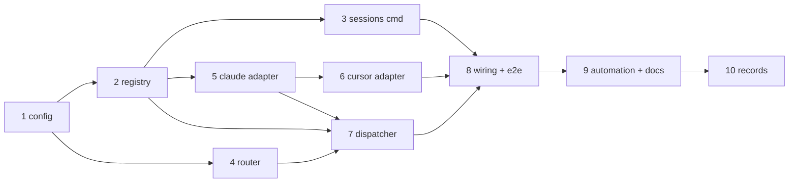

# Tasks: GitHub events trigger a harness session programmatically

> Phase 3 of 3. DAG of implementation tasks derived from the design. Issue #15 asks for
> the design + this breakdown; implementation starts once this spec is approved.
> TDD invariant (`tdd.mode: standard`): write/adjust the failing test first, record
> red→green.

## Task list

- [x] 1. Config contract: `webhooks.ghWebhook.routing`
  - Extend `.the-loop/config.schema.json` with the `routing` object (design §8); mirror
    in `.the-loop/templates/config.yaml` and this repo's `.the-loop/config.yaml`
    (`enabled: false`); git-ignore `.the-loop/sessions/`; track the new template in
    `.the-loop/manifest.yaml`.
  - _Depends on:_ none
  - _Requirements:_ R2, R3, R5
  - _Test:_ `uv run python scripts/validate_config.py` (red→green)
- [x] 2. Session registry library (`the_loop/sessions/registry.py`)
  - `Session` / `WorkItemRef` dataclasses, ref parsing (`github:owner/repo#n`), JSON
    file-per-session storage with atomic writes, `register` (one-active-per-item,
    `--force` semantics), `close`, `find_by_work_item`, `list_sessions`, `touch`.
  - _Depends on:_ 1
  - _Requirements:_ R2.1, R2.3, R2.4
  - _Test:_ `uv run --project cli python -m pytest -q cli -k registry` (red→green)
- [x] 3. `the-loop sessions` command (register/list/close)
  - Registered `Command` with the three actions (design §5); table/json output for
    `list`; availability check (`shutil.which`) with an actionable error.
  - _Depends on:_ 2
  - _Requirements:_ R2.2
  - _Test:_ `uv run --project cli python -m pytest -q cli -k sessions_command` (red→green)
- [x] 4. Event router (`the_loop/webhook/router.py`)
  - `extract_work_items(event, payload)` for `issues`, `issue_comment`,
    `pull_request*`, `workflow_run`/`check_run`/`check_suite`/`status` (branch-name and
    closing-keyword issue linkage); event-type filter from `webhooks.ghWebhook.events`;
    bounded `Deduper` on delivery ids.
  - _Depends on:_ 1
  - _Requirements:_ R3.1, R3.4, R3.5
  - _Test:_ `uv run --project cli python -m pytest -q cli -k router` (red→green)
- [x] 5. Harness adapter contract + Claude Code adapter (`the_loop/harness/`)
  - `HarnessAdapter` protocol, `DispatchResult`; `claude_code.py` resume/spawn via
    `claude -p … --output-format json` run in `session.cwd`, timeout + stderr capture;
    tests use a stub `claude` executable emitting canned JSON.
  - _Depends on:_ 2
  - _Requirements:_ R4.1, R4.2, R4.4, R4.5
  - _Test:_ `uv run --project cli python -m pytest -q cli -k claude_adapter` (red→green)
- [x] 6. Cursor adapter (`the_loop/harness/cursor_agent.py`)
  - Resume/spawn via `cursor-agent -p … --resume <chat-id> --output-format json`;
    configured extra args only (`harnessArgs.cursor`); stub `cursor-agent` executable in
    tests; document the chat-id-at-registration requirement.
  - _Depends on:_ 5
  - _Requirements:_ R4.1, R4.3, R4.4, R4.5
  - _Test:_ `uv run --project cli python -m pytest -q cli -k cursor_adapter` (red→green)
- [x] 7. Dispatcher (`the_loop/webhook/dispatcher.py`) + prompt template
  - Per-session FIFO queues + worker threads, global dispatch semaphore
    (`maxConcurrentDispatches`); unmatched policy (`never`/`always` + spawn);
    `.the-loop/templates/webhook-event-prompt.md` rendering with fenced untrusted
    payload; registry `touch` on dispatch.
  - _Depends on:_ 2, 4, 5
  - _Requirements:_ R3.2, R3.3, R5.1, R5.2, R5.3
  - _Test:_ `uv run --project cli python -m pytest -q cli -k dispatcher` (red→green)
- [x] 8. Wire routing into `gh-webhook start` + end-to-end integration test
  - `--route/--no-route` (default `routing.enabled`); compose router+dispatcher as the
    server's `on_event`; integration test with Gherkin docstrings (design §Testing):
    signed POST → stub harness invoked with `--resume`; unmatched-drop and
    duplicate-delivery scenarios; verify they appear in `the-loop scenarios`.
  - _Depends on:_ 3, 6, 7
  - _Requirements:_ R3, R4, R5
  - _Test:_ `uv run --project cli python -m pytest -q cli -k webhook_routing` (red→green)
- [ ] 9. Registration automation + docs
  - Workflow step registering/closing sessions (Claude: `$CLAUDE_SESSION_ID` /
    SessionStart hook input; Cursor: rule instruction with the chat id); update
    `skills/the-loop/reference/automation.md`, `SKILL.md`, `docs/architecture/`
    (Triggers section), CLI README.
  - _Depends on:_ 8
  - _Requirements:_ R2.2, R4.3
  - _Test:_ `npx markdownlint-cli2 "**/*.md"`
- [ ] 10. Records & evidence
  - Finalize `decision-016` status, update `docs/roadmap.md` (webhook-routing item →
    shipped), execution log, PR briefing with evidence (`make check` green, scenario
    table).
  - _Depends on:_ 9
  - _Requirements:_ R1.2
  - _Test:_ `make check`

## Dependency graph (DAG)

Parallelizable fronts: after 1 → {2, 4}; after 2 → {3, 5}; 6 alongside 7.

## Checkpoints

After tasks 3, 7, 8 and 10: `make check` (ruff · pyright · schema validation · pytest ·
markdownlint) — the same command CI runs. Record each task's red→green transition in
`execution-log.md`.
