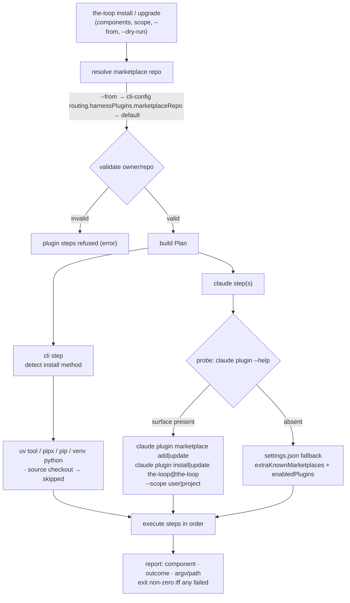

# Design: a plan of steps, executed by the harness's own installer

> Phase 2 of 3 (requirements → design → tasks). Derives from the approved requirements.
> MUST be reviewed and approved before moving to tasks breakdown.

## Overview

`install` and `upgrade` are **the same code with one boolean difference**. Both build a
`Plan` — an ordered list of `Step`s, one per thing that has to happen — and then execute
it, recording an outcome per step. That shape is what makes R4 (preview), R5 (idempotent,
honest verdicts) and R1.4 (one component failing does not take the others down) fall out
of the structure rather than out of care:

- `--dry-run` is "build the plan, print it, stop" — there is no second code path that
  could drift from the real one.
- every outcome is one of `applied | already | skipped | failed`, and the exit code is a
  fold over them.
- the plan is printed with the exact argv of every step, because the plan *is* the argv.

The other governing decision is **the-loop never re-implements a harness's installer**.
Where `claude` exposes a plugin surface, the-loop shells out to it and lets the harness own
fetching, versioning and scope. Only when the binary is absent or has no such surface does
the-loop fall back — and only to a route this repository already documents (decision-057).

> **Amended on review (PR #153):** Cursor is descoped to
> [issue #157](https://github.com/MadaraUchiha-314/the-loop/issues/157); `cli` and
> `claude` are the components. The harness-shaped structure below is unchanged — Cursor
> returns as a `BINARIES` entry plus a planner. Sections describing the Cursor planner and
> its local-clone fallback are struck.

## Architecture



## Components & interfaces

### `the_loop/install.py` — the plan, and how it is built and run

Pure-ish module: it takes the environment as arguments (binary lookups, home directory,
`sys.executable`, project dir) so tests drive it without touching the machine.

```python
COMPONENTS = ("cli", "claude")

@dataclass
class Step:
    component: str              # cli | claude
    summary: str                # human-readable intent, e.g. "install the the-loop plugin"
    argv: List[str] = ()        # the exact command; empty for a file-writing step
    writer: Optional[Callable[[], TrustResult]] = None   # the file-writing alternative
    state: str = ""             # pre-decided outcome for a step that cannot run
    detail: str = ""            # why (skipped/failed), or what changed

@dataclass
class StepResult:
    component: str
    summary: str
    outcome: str                # applied | already | skipped | failed
    command: str                # rendered argv, or the path written
    detail: str

def plan(components, *, scope, upgrade, project_dir, marketplace_repo, env) -> List[Step]
def execute(steps, *, dry_run) -> List[StepResult]
def exit_code(results) -> int   # 1 iff any outcome == "failed"
```

Sub-planners, one per component, each returning zero or more `Step`s:

| Function | Responsibility |
|----------|----------------|
| `plan_cli(...)` | Detect the installation method of the *running* CLI and emit its install/upgrade command. |
| `plan_claude(...)` | Probe `claude`; emit either its plugin commands or the settings-file fallback. One planner per harness — Cursor's is issue-157. |

`Step.state` is how a planner says "this cannot run, and here is why" **at plan time** —
so `--dry-run` shows the skip too, instead of the operator discovering it only on a real
run.

### CLI installation-method detection (R2.2, R2.3)

Derived from where the running package actually lives, not from a flag:

| Signal on the package/prefix path | Method | Install | Upgrade |
|---|---|---|---|
| a `the-loopy-one`-owning checkout (`cli/pyproject.toml` next to the package) | `source` | — skipped, naming the checkout | — skipped |
| `…/uv/tools/…` | `uv-tool` | `uv tool install the-loopy-one` | `uv tool upgrade the-loopy-one` |
| `…/pipx/venvs/…` | `pipx` | `pipx install the-loopy-one` | `pipx upgrade the-loopy-one` |
| anything else | `pip` | `<python> -m pip install the-loopy-one` | `… install --upgrade …` |

`<python>` is `sys.executable` at user scope. At **project scope** it is the project's own
interpreter — `<project-dir>/.venv/bin/python` (`Scripts/python.exe` on Windows), or the
active `$VIRTUAL_ENV` when that is the project's; if the project has no virtualenv the step
is **skipped** with "no virtualenv at …; create one, or use `--scope user`". Deliberately
*not* `uv add` / editing `pyproject.toml`: installing a tool must not rewrite the
operator's dependency manifest (R3.4's "never silently do something else" applied to the
CLI half).

### Harness probing (R6.1)

```python
def probe(binary, env) -> HarnessSurface   # has_plugin_cli, supports_scope
```

Two captures with a short timeout: `<binary> plugin --help` must succeed and name
`marketplace`, **and** `<binary> plugin install --help` must succeed — because `install`
is the command actually driven, and the two do not always ship together. `supports_scope`
is "the install help names `--scope`".

Asking the binary is the whole point, and the second capture is what the descoped Cursor
work left behind: Cursor 2.5 is the live example of a harness that reportedly has
`plugin marketplace add` and no documented CLI install. A marketplace-only probe would run
an `install` that cannot work and report `failed`; requiring the install surface makes the
honest answer "no surface", which routes to the fallback. Claude Code exposes
`plugin marketplace add|update`, `plugin install|update` and `--scope user|project|local`
— verified against a real binary — so the-loop follows that surface wherever it goes
rather than pinning a version it cannot check.

### Steps per harness

**Claude Code, surface present** (scope passed through, R3.3):

```
claude plugin marketplace add <owner/repo> --scope <scope>      # install
claude plugin install the-loop@the-loop --scope <scope>
claude plugin marketplace update the-loop                       # upgrade
claude plugin update the-loop@the-loop --scope <scope>
```

Project-scoped invocations run with `cwd=<project-dir>`, since that is what "project"
means to the harness.

**Claude Code, no surface** — the documented settings-file route, i.e. exactly what
`routing.harnessPlugins` already writes before a spawn:
`extraKnownMarketplaces["the-loop"]` plus `enabledPlugins["the-loop@the-loop"] = true`.
Reuses `ClaudePluginStore`, extended with
an explicit settings-path so project scope can target `<project-dir>/.claude/settings.json`
while user scope keeps resolving `<config dir>/settings.json`. One writer, two paths — not
a second writer.

### `the_loop/commands/install_cmd.py` — the two verbs

```python
@register
class InstallCommand(Command):  name = "install"
@register
class UpgradeCommand(Command):  name = "upgrade"
```

Both share one `add_arguments` and one `run`, differing only in `upgrade: bool`:

| Flag | Default | Meaning |
|------|---------|---------|
| *(positional)* `components` | `cli` + detected harnesses | any of `cli`, `claude`, `all` |
| `--scope` | `user` | `user` or `project` |
| `--project-dir` | `.` | the project for `--scope project` |
| `--from` | config → `MadaraUchiha-314/the-loop` | marketplace `owner/repo` |
| `--dry-run` | off | print the plan, change nothing |
| `--format` | `table` | `table` or `json` |

## Data models

No new configuration and no new schema: the marketplace source is read from the existing
`routing.harnessPlugins.marketplaceRepo` (`PluginConfig.from_mapping`), which keeps the
daemon and this command pointing at one repository (R7.1). Nothing is persisted — the
command's whole state is the machine it just changed.

## Error handling

| Failure | Surfaced as |
|---|---|
| harness binary missing | `skipped` — "claude not found on PATH", plus the fallback that was used or why none applies |
| subprocess non-zero | `failed` — command, exit code, and the last line of its stderr |
| subprocess timeout / `OSError` | `failed` with the exception text |
| settings file unparseable | `failed` — the existing writer's message; the file is left untouched |
| invalid `owner/repo` | plugin steps refused before the plan runs, exit 1 |
| unsupported scope for a component | `skipped` with the manual instruction |

Logging follows the CLI's convention (`logging.getLogger("the-loop.install")`) — identical
at dev-time and runtime.

## Security design

Each boundary from the requirements' **Security considerations**, and the mechanism that
enforces it:

| Boundary / abuse case | Mechanism |
|---|---|
| Marketplace value becomes code execution (§1) | `harness_plugins._REPO_RE` validates `owner/repo` **before** the plan is built; an invalid value refuses every plugin step with an error and never reaches a subprocess, a URL or a settings file. The resolved repo is printed in the plan, so the operator sees what is about to be trusted (including in `--dry-run`). |
| Shell injection (§2) | Every step is an argv `List[str]` run through `subprocess.run(..., shell=False)`. No `shell=True`, no string interpolation into a command, anywhere in the module. The clone URL is built from the *validated* repo. |
| Writing the operator's config (§3) | The fallback writes through `the_loop.trust.update_json` only — merge, temp file + atomic replace, no write when the state already holds, never overwrite an unparseable file, never change an existing value. |
| Scope confusion (§4) | Scope is passed to the harness when it accepts one, and a scope that cannot be expressed is `skipped` — there is no branch that widens a project request to the user account. |
| Privilege (§5) | No `sudo`, no elevation, no `--user`-outside-home writes; targets are `<config dir>` or the named project directory. |
| Unbounded child process | Each subprocess runs with a timeout and captured output; a hang becomes a `failed` step, not a wedged terminal. |

Negative tests are named in `tasks.md` for the first four rows.

## Testing strategy

- **Unit** (`cli/tests/test_install.py`) — planning is pure, so most of this is asserting
  the argv a given (component, scope, upgrade, probe result) produces, plus method
  detection, repo validation, outcome folding and the exit code.
- **Integration** (`cli/tests/test_install_integration.py`, Gherkin docstrings per
  `testing.gherkinDocstrings`) — end-to-end through `the_loop.cli.main` with a fake
  `claude` binary on a temp `PATH` and a fake HOME: install →
  re-install is `already`, upgrade runs the update commands, `--dry-run` leaves the
  filesystem untouched, a failing binary exits non-zero.
- **Parity** — `test_docs_parity.py` P1 requires a docs page per registered command, so
  `docs/cli/commands/{install,upgrade}.md` ship in this PR.

## Alternatives considered

1. **Write the harness's config files directly, always.** Simpler and already exists, but
   it registers the plugin without fetching it and pins the-loop to today's file format.
   Demoted to the fallback.
2. **A shell installer (`curl … | sh`).** Rejected: a second distribution channel to keep
   correct, and it cannot run for a CLI that is already installed — which is the upgrade
   case that motivated the issue.
3. **`uv add the-loopy-one` for project scope.** Rejected: rewrites the operator's
   `pyproject.toml`. Installing into the project's existing virtualenv gets the same
   result without editing their manifest.
