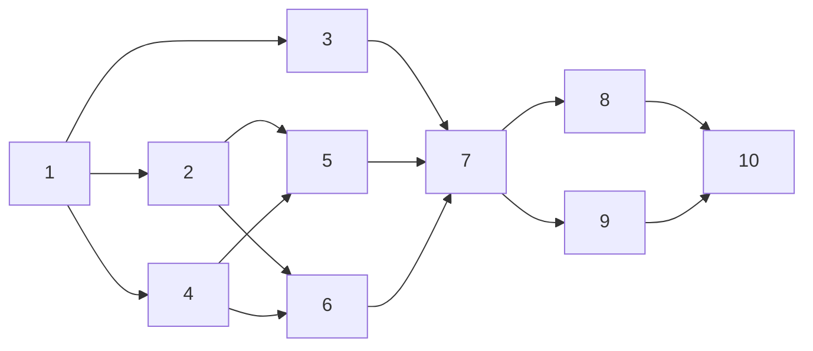

# Tasks: `the-loop install` / `the-loop upgrade`

> Phase 3 of 3 (requirements → design → tasks). A DAG of implementation tasks derived
> from the approved design.

## Task list

- [x] 1. Plan/step model and outcome folding
  - `Step`, `StepResult`, `execute()`, `exit_code()` in `the_loop/install.py`
  - `--dry-run` returns the same records without running anything
  - _Depends on:_ none
  - _Requirements:_ R4.1, R4.2, R5.1–R5.4
  - _Test:_ `pytest cli/tests/test_install.py -k "outcome or dry_run or exit_code"` (red→green)
- [x] 2. Marketplace-repo resolution and validation
  - `--from` → `routing.harnessPlugins.marketplaceRepo` → shipped default; reuse
    `harness_plugins._REPO_RE`
  - **Negative test:** an invalid value refuses the plugin steps and never reaches an argv,
    a URL or a settings file
  - _Depends on:_ 1
  - _Requirements:_ R7.1–R7.3, Security §1
  - _Test:_ `pytest cli/tests/test_install.py -k marketplace` (red→green)
- [x] 3. CLI installation-method detection and steps
  - `uv-tool` / `pipx` / `pip` / `source`; project scope resolves the project's venv python
  - source checkout and missing project venv are `skipped`, not attempted
  - _Depends on:_ 1
  - _Requirements:_ R2.1–R2.3, R3.2, R3.4
  - _Test:_ `pytest cli/tests/test_install.py -k method` (red→green)
- [x] 4. Harness probe
  - `<binary> plugin --help` / `<binary> plugin install --help`, captured output, timeout
  - _Depends on:_ 1
  - _Requirements:_ R6.1
  - _Test:_ `pytest cli/tests/test_install.py -k probe` (red→green)
- [x] 5. Claude steps (CLI surface + settings fallback)
  - `marketplace add|update` + `install|update`, scope passed through, project cwd
  - fallback through `ClaudePluginStore` with an explicit settings path for project scope
  - **Negative test:** no `shell=True` anywhere; argv is a list; project scope never writes
    the user settings file
  - _Depends on:_ 2, 4
  - _Requirements:_ R1.1, R2.4, R3.1–R3.3, R6.2, Security §2–§4
  - _Test:_ `pytest cli/tests/test_install.py -k claude` (red→green)
- [x] 6. ~~Cursor steps (CLI surface + local-clone fallback)~~ — **descoped on review**
  - Built, then removed when the owner parked Cursor on PR #153; tracked as
    [issue #157](https://github.com/MadaraUchiha-314/the-loop/issues/157), which inherits
    the research and can lift the implementation from this PR's history
  - What survived: the probe requires a working `plugin install`, not merely a
    `marketplace` command, so a harness that splits the two takes the fallback
  - _Requirements:_ R1.2 (retired), R6.2
  - _Test:_ `pytest cli/tests/test_install.py -k "probe or component"`
- [x] 7. `install` / `upgrade` commands + component defaults
  - one implementation, two registered verbs; default components = `cli` + detected harnesses
  - `--format table|json`
  - _Depends on:_ 3, 5, 6
  - _Requirements:_ R1.3, R1.4, R4.1–R4.3
  - _Test:_ `pytest cli/tests/test_install.py -k command` (red→green)
- [x] 8. Integration tests with Gherkin docstrings
  - a fake `claude` on a temp `PATH`, fake HOME; install → re-install →
    upgrade → dry-run → failure exit code
  - _Depends on:_ 7
  - _Requirements:_ R1–R7
  - _Test:_ `pytest cli/tests/test_install_integration.py`
- [x] 9. Documentation and capability docs
  - `docs/cli/commands/{install,upgrade}.md` (+ sidebar, commands index), installation
    guides (`docs/cli/installation.md`, `docs/guide/installation.md`), READMEs
  - `docs/capabilities/{cli,distribution}.md` behaviour rows + history; `decision-057`
  - _Depends on:_ 7
  - _Requirements:_ R1–R7 (documented surface); docs↔code parity P1
  - _Test:_ `pytest cli/tests/test_docs_parity.py`
- [x] 10. Full gate
  - `make check` (ruff · pyright · schema validation · pytest · markdownlint)
  - _Depends on:_ 8, 9
  - _Requirements:_ all
  - _Test:_ `make check`

## Dependency graph (DAG)

## Checkpoints

After tasks 7, 8 and 9: run the affected tests and record the red→green transition in
`execution-log.md`. After task 10: self-review rounds, the security-review gate, then the
reviewer briefing on the PR.

## Review comments

> Appended by the-loop's `record-feedback` hook when a human gate approves with comments.
