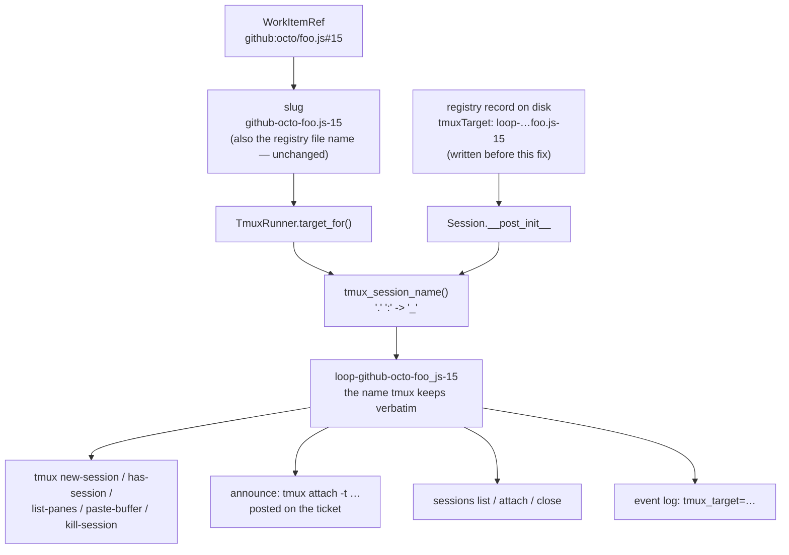

# Design: the tmux session name the-loop records and posts is the name tmux gave the session

> Phase 2 of 3 (requirements → design → tasks). Derives from the approved
> `bugfix.md`. Human approval for this tier-3 change happens at the PR.

## Overview

One rule, applied at two points: **the-loop never holds a tmux session name that
tmux would rewrite.**

`tmux_session_name()` is a pure function mirroring tmux's own
`session_check_name()` — `.` and `:` become `_`. It is applied

1. where names are **minted** — `TmuxRunner.target_for` (AC1, AC2), and
2. where a name is **admitted into the process** — `Session.__post_init__`, so a
   registry record written before this fix (or by hand) addresses the session
   tmux actually created (AC3).

Every consumer already reads one of those two — `announce`, `sessions attach`,
`sessions list`, `deliver`, `kill`, `terminate_harness`, the dispatcher's spawn
and respawn paths, the event log — so both the published attach command (AC4)
and every tmux argv (AC5) become correct without touching any of them. The
`_LOOP_TARGET_RE` guard is tightened to reject the ambiguous characters outright
(AC6), which is now provable rather than merely likely.

## Architecture

Before this change the two producer edges (`target_for`, the registry record)
fed `tmux` and `announce` **unnormalised**, so tmux silently created a different
session than the one the-loop went on to address and publish.

### Where the normalisation is *not* applied, and why

- **`WorkItemRef.slug`** keeps its dots. It is the registry **file name** and is
  contractually backwards compatible (issue-130); rewriting it would rename every
  session file on a GitHub Enterprise install. The tmux name is one *rendering*
  of the slug, and that is where the rewrite belongs (`bugfix.md` § Out of scope).
- **No migration, no `rename-session`.** A session created under a dotted
  spelling was already named with underscores *by tmux*; normalising the stored
  value is what makes the record agree with reality. Rewriting the file is left to
  the next ordinary registry write.

## Components & interfaces

| Component | Responsibility | Interface / contract |
|---|---|---|
| `the_loop.sessions.registry.tmux_session_name(name)` | Mirror tmux's `session_check_name()`: the single definition of "a name tmux keeps verbatim". Pure, total, idempotent, no I/O. | `str -> str`; `.`/`:` → `_`, everything else untouched. Exported from `the_loop.sessions`. |
| `Session.__post_init__` | Normalise `tmux_target` on **every** construction — `from_dict` (legacy records), the dispatcher's direct construction, and tests. | Post-condition: `session.tmux_target == tmux_session_name(session.tmux_target)`. `""` stays `""` (process-runner sessions). |
| `TmuxRunner.target_for(work_item)` | Mint the session name for a work item. | Returns `tmux_session_name(f"loop-{work_item.slug}")`. Unchanged for every slug without `.`/`:` (AC2). |
| `runner._LOOP_TARGET_RE` | Authorise `terminate_harness` to signal the pids inside a target. | Tightened `^loop-[A-Za-z0-9_-]+$` — `.`/`:` rejected. |
| `announce.announcement_body` | Publish the attach command. | Unchanged code; correct by construction now that `session.tmux_target` is normalised. |

Why the function lives in `sessions/registry.py` rather than `runner.py`:
`runner` imports `sessions`, so the reverse would be a cycle, and
`Session.__post_init__` is one of the two call sites. `runner` imports it from
`sessions` and re-exports nothing.

## UI/UX design

N/A — CLI/daemon work item; no user-facing visual surface. The one human-facing
artifact is the markdown announcement comment, whose content is covered by AC4
and unchanged apart from carrying a name that resolves.

## Data models

No schema change. `Session.tmuxTarget` (the registry JSON field, documented in
`state.py`) keeps its type and meaning; only the *invariant* on it strengthens:

> `tmuxTarget` is the name **tmux uses**, not a name the-loop asked for.

Records written before this fix are read unchanged from disk and normalised in
memory, so downgrading to an older CLI keeps working (it would simply resume
mis-addressing them, exactly as it does today).

## Error handling

Nothing new can fail: the normalisation is a string substitution with no failure
mode, so no error path, log line or event type is added.

Two *existing* failure paths stop firing spuriously and are the observable proof
of the fix:

| Path | Before (dotted slug) | After |
|---|---|---|
| `TmuxRunner.deliver` → `has_live_session` | `has-session -t loop-a.b-15` → `can't find pane: b-15`, exit 1 → `SESSION_ABSENT` → `session_missing: true` on a live session → respawn | probe names the real session → live → paste |
| `TmuxRunner.spawn` → `new-session` | `duplicate session: loop-a_b-15` against the session it is replacing (the issue-146 path, reached deterministically) | no collision; the pre-flight sees the session it means |
| `terminate_harness` | `_LOOP_TARGET_RE` admits the dotted target; `has_session` then fails and it returns "already gone" — the right answer for the wrong reason | the target never carries `.`; the guard rejects one that does, with the existing warning + `TmuxResult(ok=False)` |

## Security design

The trust boundary this work touches is the **tmux target boundary**: the set of
strings the-loop is willing to hand tmux as a target, and (narrower still) the
set it will signal OS processes inside. `bugfix.md` § Security considerations
names it, plus one abuse case; both are enforced here as mechanisms.

- **AuthN/AuthZ:** unchanged. tmux is addressed over the operator's own session;
  the-loop holds no credential of its own on this path. The authorized-actor
  guard upstream of dispatch is untouched.
- **Input validation & injection surfaces:** the surface is **tmux target
  injection** — `.` and `:` are tmux's own target grammar (`session:window.pane`),
  so a name carrying them is re-parsed into a target the-loop did not mean
  (proved in `bugfix.md`: `has-session -t loop-a.b-15` becomes a *pane* lookup).
  Mechanism: `tmux_session_name()` removes both characters at the only two points
  a name enters the process (minting, and loading a record), so every tmux argv
  the-loop builds names exactly one session. There is no third ingress: `deliver`,
  `kill` and `terminate_harness` all read `session.tmux_target`, and the
  dispatcher reads `target_for()`. Nothing from an event payload, a comment body
  or a ticket ever reaches a target.
- **Least privilege:** unchanged — and the one privileged operation, signalling
  pane pids in `terminate_harness`, gets a **narrower** gate: `_LOOP_TARGET_RE`
  drops `.` and `:` from its charset, so the re-parseable shape is rejected by
  construction rather than being merely unreachable because an earlier call
  happens to fail first. `kill-session` remains conditional on issue-146's
  dead-pane rule.
- **Secrets handling:** none involved; no new file, env var or network call.
- **Fail-closed behaviour:** a target the guard rejects is refused with the
  existing warning and `TmuxResult(ok=False, error=…)` — no signal is sent and
  the caller (`sessions close`) reports it. Normalisation itself cannot fail, so
  there is no "cannot decide" state to fall closed from.
- **Abuse-case coverage:** the abuse case from `bugfix.md` is *colliding on
  another work item's session* via the `.`/`_` alias (`octo/foo.bar#15` and
  `octo/foo_bar#15` map to one tmux name). Defeating mechanism: none is possible
  — tmux itself cannot host both names simultaneously — so it is **bounded**
  instead: the issue-146 pre-flight (`_clear_target`) never kills a live
  occupant, so the alias can at worst route an event into the aliased work item's
  session, never destroy one. That pre-flight's docstring reasoning ("an occupant
  is always this work item's own agent") is amended to state the exception, so
  the next reader is not misled. Negative test: `test_target_for_aliases_dot_and_underscore`
  pins the aliasing as *known and intentional*, so a future change that quietly
  makes it destructive fails a test rather than shipping.

## Testing strategy

`tdd.mode: standard` — every task below writes its test first and records the
red→green transition.

| AC | Level | Test |
|---|---|---|
| AC1 | unit | `test_target_for_strips_tmux_target_syntax` — a dotted/colon'd slug yields a name with neither character. |
| AC2 | unit | `test_target_for_unchanged_for_plain_slugs` — `github:octo/repo#15` still yields `loop-github-octo-repo-15`. |
| AC3 | unit | `test_normalises_a_legacy_tmux_target` — `Session.from_dict` on a record holding `loop-…foo.js-15` yields the underscore name, as does a direct construction; `test_a_process_session_keeps_its_empty_target` pins `""`. |
| AC4 | unit | `test_body_names_the_real_tmux_session` — the comment body's `tmux attach -t` argument is the name tmux created, and the dotted spelling appears nowhere in it. |
| AC5 | unit | `test_deliver_and_kill_address_the_normalised_target` — the argv `TmuxRunner` builds for a legacy dotted record names the underscore session. |
| AC6 | unit | `test_only_the_loops_own_sessions_are_ever_signalled[loop-other.session]` / `[loop-other:0.1]` — a hand-edited target carrying tmux target syntax is refused, no signal sent. |
| AC8 | integration | `Scenario: a work item whose repo name contains a dot gets a session it can attach to` — the real Router + Dispatcher against the stub tmux, which now performs tmux's rename. Asserts: the stub was asked for a name it kept verbatim, the registry record matches the created session, the announcement's attach command resolves, and a second event **pastes** into that session instead of reporting `session_missing` and respawning. |

The stub tmux gains tmux's rename (AC8): `new-session -s <name>` records and
creates `name.replace('.', '_').replace(':', '_')`, and `has-session`/`list-panes`
answer about *that* name. Without it the integration suite cannot express this
defect at all — the same reason issue-146 taught the stub about session lifetime.

## Trade-offs & decisions

- **Normalise on load (`__post_init__`) rather than ship a migration.** A
  migration would have to rewrite every registry file to fix a value that is
  wrong only as *text* — the sessions themselves were always named with
  underscores by tmux. Normalising at construction heals reads immediately, needs
  no versioned migration step, and lets the corrected value be persisted by the
  next ordinary write. Cost: a record on disk can briefly disagree with the same
  record in memory. Accepted — that disagreement is precisely the bug, and it
  resolves in the direction of reality.
- **`__post_init__` over normalising inside `from_dict`.** Both cover the legacy
  path, but only `__post_init__` also covers `Session(...)` built directly (the
  dispatcher, and every test), making the invariant total instead of
  path-dependent.
- **Mirror tmux, do not invent an escaping scheme.** Making the mapping injective
  (escaping `_`, or appending a hash of the pre-rewrite slug) would change the
  name of every work item whose slug contains an underscore, to distinguish a
  pair of work items tmux cannot host at the same time regardless. Minimalism
  ladder: reuse the platform's own rule; document the residual aliasing
  (`bugfix.md` § Out of scope, § Security considerations) instead of engineering
  around it.
- **Tighten `_LOOP_TARGET_RE` in the same change.** It could have been left
  alone — after normalisation nothing reaches it with a dot. It is tightened
  because the guard exists precisely for values that did *not* come through the
  normal path (corrupted or hand-edited records), and `.`/`:` are the characters
  that make such a value dangerous. No durable decision record: this is the
  application of an existing decision (issue-94's guard), not a new one.
- **No new dependency, module, config key, event type or log line.** The whole
  change is one exported function, two call sites, one regex charset, and
  docstrings.

## Open questions

None.

## Review comments

> Appended by the-loop's `record-feedback` hook when a human gate approves with
> comments (issue-109).
