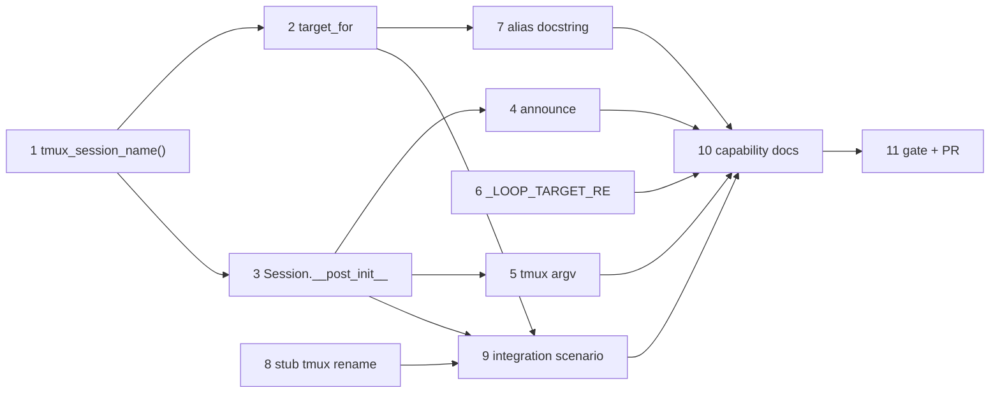

# Tasks: the tmux session name the-loop records and posts is the name tmux gave the session

> Phase 3 of 3 (requirements → design → tasks). Derived from the approved
> `design.md`. TDD per task (`tdd.mode: standard`): the test is written first and
> watched red before the production change.

## Task list

- [x] 1. `tmux_session_name()` — mirror tmux's `session_check_name()`
  - Add the pure helper to `cli/the_loop/sessions/registry.py` (`.`/`:` → `_`),
    export it from `the_loop.sessions`.
  - _Depends on:_ none
  - _Requirements:_ R1 (AC1, AC2)
  - _Test:_ `pytest cli/tests/test_tmux_runner.py -k TestTmuxSessionName` — plain
    names pass through, dotted/colon'd names are rewritten, idempotent (red→green)

- [x] 2. `TmuxRunner.target_for` mints only names tmux keeps
  - Apply the helper; update the docstring to say _why_ (tmux rewrites them, and
    re-parses them as `session:window.pane` on the way back).
  - _Depends on:_ 1
  - _Requirements:_ R1 (AC1, AC2)
  - _Test:_ `pytest cli/tests/test_tmux_runner.py -k "target_for"` —
    `test_target_for_strips_tmux_target_syntax` and
    `test_target_for_unchanged_for_plain_slugs` (red→green)

- [x] 3. `Session.__post_init__` normalises `tmux_target`
  - Every construction path (`from_dict` on a legacy record, the dispatcher's
    direct construction, tests) lands on the name tmux uses; `""` stays `""`.
  - _Depends on:_ 1
  - _Requirements:_ R2 (AC3)
  - _Test:_ `pytest cli/tests/test_tmux_runner.py -k legacy_tmux_target` (red→green)

- [x] 4. The announced attach command names a session tmux can find
  - No code change expected in `announce.py` — the test proves the fix reaches
    the human-facing surface the issue is about.
  - _Depends on:_ 3
  - _Requirements:_ R2 (AC4)
  - _Test:_ `pytest cli/tests/test_announce.py -k real_tmux_session` (red→green)

- [x] 5. Every tmux argv addresses the normalised target
  - `deliver` / `kill` / probes built from a legacy dotted record name the
    underscore session.
  - _Depends on:_ 3
  - _Requirements:_ R2 (AC5)
  - _Test:_ `pytest cli/tests/test_tmux_runner.py -k normalised_target` (red→green)

- [x] 6. **Security:** `_LOOP_TARGET_RE` rejects tmux target syntax
  - Drop `.` from the charset (`:` was never in it) so the guard authorising
    `terminate_harness` to signal pane pids cannot admit a string tmux re-parses
    as `session:window.pane`.
  - _Depends on:_ none
  - _Requirements:_ R3 (AC6)
  - _Test (negative, abuse case):_
    `pytest cli/tests/test_tmux_runner.py -k only_the_loops_own_sessions` — a
    hand-edited `loop-other.session` / `loop-other:0.1` is refused and **no**
    signal is sent (red→green)

- [x] 7. **Security:** pin the `.`/`_` aliasing as known and non-destructive
  - Amend `_clear_target`'s docstring so its "an occupant is always this work
    item's own agent" reasoning states the alias exception instead of misleading
    the next reader.
  - _Depends on:_ 2
  - _Requirements:_ R3 (AC6), `design.md` § Security design (abuse-case coverage)
  - _Test:_ `pytest cli/tests/test_tmux_runner.py -k aliases_dot_and_underscore`
    (documents the alias; fails if a future change makes it destructive)

- [x] 8. Teach the stub tmux tmux's own rename
  - `cli/tests/test_tmux_runner_integration.py`: `new-session` creates
    `name.replace('.','_').replace(':','_')`; `has-session`/`list-panes`/
    `kill-session` answer about that name.
  - _Depends on:_ none
  - _Requirements:_ R4 (AC8)
  - _Test:_ the existing integration suite stays green with the stub change alone

- [x] 9. Integration test — the reporter's scenario, end to end
  - Gherkin scenario: a work item whose repo name contains a dot is spawned; the
    name recorded, logged and announced is the name the stub tmux created, and a
    second event **pastes** into it instead of respawning.
  - _Depends on:_ 2, 3, 8
  - _Requirements:_ R4 (AC7, AC8)
  - _Test:_ `pytest cli/tests/test_tmux_runner_integration.py -k dotted` (red→green)

- [x] 10. Capability docs + execution log
  - `docs/capabilities/interactive-sessions.md`: the session-naming behaviour and
    its history row.
  - _Depends on:_ 1–9
  - _Requirements:_ all
  - _Test:_ `markdownlint` clean; `the-loop check issue-154 --recompute --fail-on block`

- [x] 11. Full gate + PR with the reviewer briefing
  - ruff (check + format), pyright, pytest, markdownlint — the same commands the
    pre-commit hooks and CI run — then the PR and its briefing.
  - _Depends on:_ 10
  - _Requirements:_ all
  - _Test:_ the full suite, plus `the-loop check issue-154 --recompute --fail-on block`

## Dependency graph (DAG)

`1 → 2 → 7`, `1 → 3 → {4, 5}`, `8 → 9`, `6`, all → `10 → 11`.

## Checkpoints

- After tasks 1–3: `pytest cli/tests/test_tmux_runner.py` — the naming unit tests
  are green and nothing else in the runner regressed.
- After tasks 4–7: full `pytest`, plus ruff/pyright on the touched files.
- After task 9: full `pytest` — the stub's new rename must not have broken any
  existing integration scenario.
- After task 10: `markdownlint` + `the-loop check issue-154 --recompute
  --fail-on block`.
- After task 11: the self/critic review rounds and the **security review gate**
  (`security.review`), recorded in `execution-log.md`, before the work item is
  marked ready.

## Review comments

> Appended by the-loop's `record-feedback` hook when a human gate approves with
> comments (issue-109).
