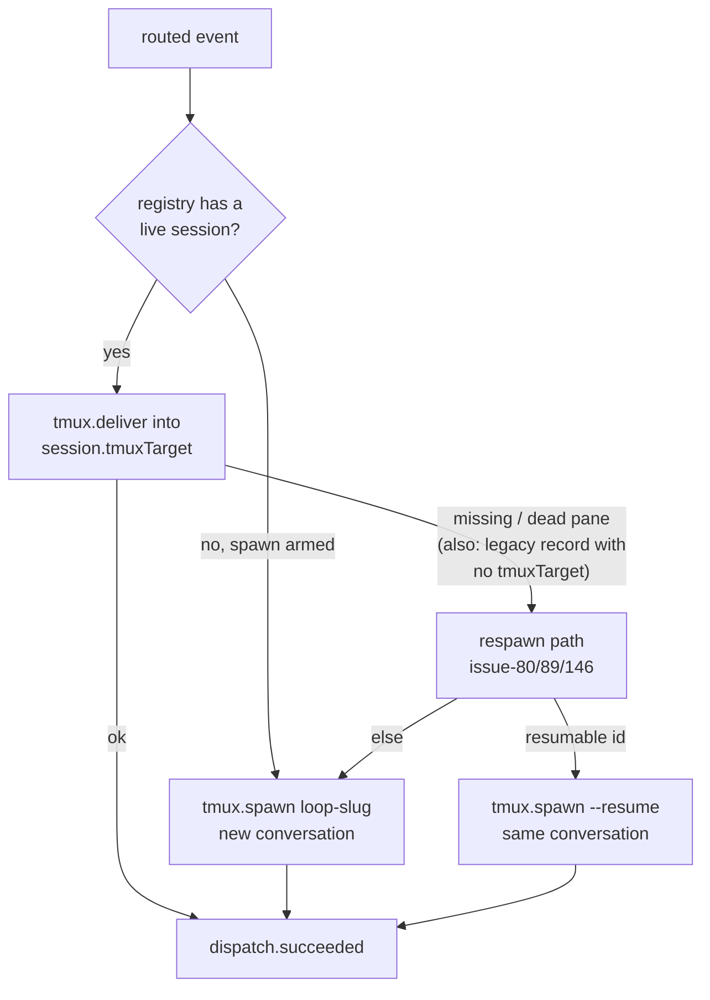

# Design: one runner — every dispatch is a tmux delivery or a tmux (re)spawn

> Phase 2 of 3. Derived from `bugfix.md` (locked). Human approval for this
> tier-3 change happens at the PR.

## Architecture

Today the dispatcher is a two-runner switchyard: `RoutingConfig.runner` picks
the runner at first spawn, and `Session.runner` — a per-record copy of that
choice — picks it on every later dispatch. The bug lives in the copy: a record
whose `runner` says `"process"` (the silent dataclass default) reroutes
deliveries to a headless subprocess forever.

The design deletes the switchyard. After this change the dispatch plane has
exactly one shape:



Everything on that graph already exists (issues 32, 80, 86, 89, 146); the
change removes the second, invisible plane beside it. Legacy `"process"`
records need no migration: they have no `tmuxTarget`, so their next event
reads as "no live tmux session" and heals through the respawn path — resuming
the recorded conversation id when Claude Code can, exactly as a crashed tmux
session would.

## Components & interfaces

### `the_loop/webhook/dispatcher.py`

- `RoutingConfig`: the `runner` field is removed. `from_mapping` warns once per
  load when the mapping still carries a `runner` key with any value other than
  `"tmux"`: `routing.runner was removed; sessions are always hosted in tmux`.
  (`"tmux"` is accepted silently — it states the only behaviour there is.)
- `Dispatcher._dispatch_one`: the `session.runner == "tmux"` branch becomes
  the only body. The `adapter.resume(...)` else-branch, the `no-adapter` drop
  for it, and `_log_usage` (headless-only telemetry — tmux TUIs report no
  JSON usage) are removed. A session with an empty `tmux_target` is handled by
  `TmuxRunner.deliver` reporting `session_missing`, which routes into the
  existing `_respawn_tmux`.
- `Dispatcher._spawn_for`: the `config.runner == "tmux"` guard and the whole
  headless `adapter.spawn(...)` tail are removed; `_spawn_tmux` is the only
  spawn. `graphlink.on_spawn(..., runner="tmux")` call sites are unchanged.
- The constructor comment about "a registry may hold tmux-mode sessions even
  when config.runner is process" is rewritten: the tmux runner is simply the
  dispatcher's runner.
- `InteractionConfig.from_mapping` loses its `runner` parameter and the
  cli-under-process warning: the combination it warned about no longer exists.

### `the_loop/harness/base.py` (+ `claude_code.py`, `cursor_agent.py`)

- Removed: `HarnessAdapter.resume`, `HarnessAdapter.spawn`, `_run`,
  `_resume_argv` (base and both adapters), `DispatchResult`,
  `_session_id_from_output`, `_SESSION_ID_KEYS`.
- Kept, renamed for honesty: `_spawn_argv` → `_oneshot_argv`, still the
  implementation behind `oneshot_argv` — the critic-review invocation surface
  (issue-108) is explicitly out of the removal's scope (AC2.1), as are
  `Usage`, `usage_from_output` and `parse_json_object`, which critics import.
- Kept: `interactive_argv` / `interactive_resume_argv` (the tmux surface) and
  `prepare_environment` (issue-90/143).
- `harness/__init__.py` stops exporting `DispatchResult`.

### `the_loop/sessions/registry.py`

- `Session.runner` is removed from the dataclass, `to_dict` and `from_dict`
  (an old record's stored value is ignored on read — `from_dict` simply stops
  looking at the key). `tmux_target` stays; `""` now means "no tmux session
  has been spawned for this record yet" (legacy records, and
  `sessions register` self-registrations, which get their tmux session on
  first dispatch via the respawn path).
- The `session.registered` event stops carrying a `runner` field.

### `the_loop/runner.py`

- `check_dependencies(runner, web_enabled)` → `check_dependencies(web_enabled)`:
  tmux is always required; ttyd additionally when the web terminal is enabled.
- `TmuxRunner.deliver` treats an empty target as `session_missing` (today an
  empty string would be handed to `tmux has-session -t ''`) — the seam that
  makes AC2.4's lazy healing work.

### Commands (`gh_webhook.py`, `poll.py`, `sessions_cmd.py`)

- Startup/hot-reload log lines stop printing `runner=…`.
- `sessions attach`: the `runner != "tmux"` refusal becomes an
  empty-`tmux_target` message ("no tmux session recorded yet for this work
  item; one is spawned on its next dispatched event").
- `sessions list`: the `Runner` column is dropped (the `Tmux` column already
  carries the target); JSON output loses the `runner` key with the record
  field.
- `sessions start`'s success line prints the tmux target instead of
  `runner=…`.
- `announce.SessionAnnouncer.announce`: the `session.runner != "tmux"` guard
  reduces to `not session.tmux_target`.

### Config schema + templates

- `.the-loop/cli-config.schema.json`: the `routing.runner` property is
  removed; prose in neighbouring descriptions that referenced the process
  runner is updated.
- `.the-loop/cli-config.yaml` (this repo's own config) and
  `skills/the-loop/templates/cli-config.yaml` (the template `/the-loop:init`
  scaffolds): the `runner:` key and process-runner commentary are removed.

## Data models

Session record, after:

```json
{
  "workItem": {"ref": "github:owner/repo#15", "...": "..."},
  "harness": "claude",
  "harnessSessionId": "<uuid4>",
  "cwd": "/path/to/checkout",
  "status": "active",
  "createdAt": "…", "lastEventAt": "…",
  "tmuxTarget": "loop-owner-repo-15",
  "recentDeliveries": ["…"]
}
```

The only removal is `runner`. Old records that still carry it (any value)
parse identically; the key is simply not read.

## Error handling

- **tmux missing at daemon start:** `check_dependencies` now always names
  tmux; `gh-webhook start` / `poll start` refuse to start, with install hints
  — previously only when `runner: tmux` was configured.
- **tmux missing at dispatch:** unchanged — `TmuxRunner._run` reports it, the
  dispatch fails loudly and the delivery is released for retry.
- **Legacy record, no `tmuxTarget`:** `deliver` reports `session_missing`;
  `_respawn_tmux` re-derives `loop-<slug>` via `target_for`, tries an
  interactive resume of the recorded conversation, falls back to fresh — all
  pre-existing, tested behaviour (issues 80/89/146).
- **`routing.runner` still configured:** ignored with a warning naming the
  removal; never an error, so an un-edited config cannot brick a daemon.
- **cursor as `defaultHarness`:** `_spawn_tmux` surfaces
  `UnsupportedRunnerError` from `interactive_argv` as a failed spawn — the
  same behaviour tmux mode has today; it is now the only behaviour, and the
  schema description for `defaultHarness` says so.

## Security design

- The trust boundary from the requirements is enforced unchanged: untrusted
  payload data reaches prompts only (rendered under the "UNTRUSTED" banner),
  never argv/paths/targets. `_SESSION_ID_RE` still gates recorded session ids
  before they enter a resume argv; `_LOOP_TARGET_RE` still gates what
  `terminate_harness` may signal.
- The abuse case from the requirements (a doctored record's `cwd` steering a
  silent headless resume) is closed structurally: the silent execution path no
  longer exists, and the loud path announces itself (named tmux session,
  events, first-spawn ticket comment).
- Fail-closed posture: no tmux → no daemon / failed dispatch; never a fallback
  to invisible execution.

## Testing strategy

TDD per task (red → green recorded in the execution log). The stub/fake
adapters and stateful stub tmux from `cli/tests` are reused.

- **Unit:** `RoutingConfig.from_mapping` ignore-and-warn; `Session`
  round-trip without `runner` (and reading a legacy record that has it);
  `check_dependencies` always requiring tmux; adapter surface — `oneshot_argv`
  intact, no `resume`/`spawn`/`DispatchResult`; `deliver` on an empty target
  reporting `session_missing`.
- **Integration (Gherkin docstrings, linked to AC):** an event for a legacy
  `runner: "process"` record (no `tmuxTarget`) is delivered by respawning a
  tmux session that resumes the recorded conversation (AC2.4 — the reported
  bug's scenario, now loud); an unmatched armed event spawns a tmux session
  with no `routing.runner` configured (AC1.1); existing tmux delivery/respawn
  suites keep passing unmodified in behaviour.
- **Removed tests:** process-runner dispatch/spawn suites (headless
  `adapter.resume`/`adapter.spawn` paths, runner-selection config tests, the
  cli-mode-under-process interaction warning) go with the code they pinned.
- **Full gate:** pytest, ruff (check + format), pyright, markdownlint,
  `validate_config.py` — the same commands the hooks and CI run.

## Trade-offs & decisions

- **Remove, don't reconcile.** The issue offered a warning/doctor/docs fix;
  the owner chose removal. One runner means the class of config/record
  disagreement cannot recur — smaller surface beats better diagnostics on a
  surface nobody wants.
- **Rename `_spawn_argv` → `_oneshot_argv` rather than delete.** Critic
  reviews (issue-108) run harnesses one-shot by design; that is an explicit
  non-goal of this removal. The rename keeps the method from advertising a
  spawn path that no longer exists.
- **Lazy healing over migration.** No eager registry rewrite: records heal on
  their next event through code that already exists and is already tested
  (issue-146 hardened it). A migration tool would be new code to review for a
  one-time effect.
- **Warn, never fail, on a leftover `routing.runner`.** A daemon that refuses
  to start over a removed key punishes the upgrade; a warning names the new
  reality and moves on.
- **Keep the `session.registered`/`session.spawned` event shape otherwise
  intact** (`runner`/`via` fields dropped or fixed to `"tmux"` where consumers
  expect a value) — the event log is observability, not API; the docs list the
  field change.

## Open questions

- None for the reviewer beyond the PR itself; the scope decision is the
  owner's ticket comment.
