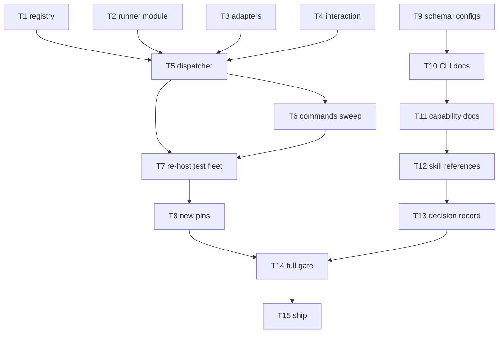

# Tasks: remove the process runner — tmux-only dispatch (issue-156)

> Phase 3 of 3. Derived from `bugfix.md` + `design.md` (both locked). TDD per
> task; each task names the ACs it delivers.

## Task list

- [x] **T1 — registry: drop `Session.runner`** (AC2.2). Remove the field from
  the dataclass, `to_dict`, `from_dict` (legacy key ignored on read) and the
  `session.registered` event. Update `test_tmux_runner.py::TestSessionRunnerFields`
  (round-trip without the field; a legacy record carrying `"runner": "process"`
  still parses and is not branched on).
- [x] **T2 — runner module: tmux always required, empty target is missing**
  (AC1.3, AC2.4). `check_dependencies(web_enabled)` — tmux unconditional, ttyd
  when the web terminal is on; `TmuxRunner.deliver` reports `session_missing`
  for an empty target. Update `TestCheckDependencies`.
- [x] **T3 — harness adapters: remove the headless dispatch surface** (AC2.1).
  Delete `HarnessAdapter.resume`/`spawn`/`_run`/`_resume_argv`,
  `DispatchResult`, `_session_id_from_output`; rename `_spawn_argv` →
  `_oneshot_argv` (base + claude + cursor); trim `harness/__init__` exports.
  Keep `Usage`/`usage_from_output`/`parse_json_object`/`oneshot_argv`
  (critics) and the `interactive_*` surface. Update `test_routing.py` adapter
  tests; keep `test_critics.py` green.
- [x] **T4 — interaction config: drop the runner coupling**. Remove the
  `runner` parameter and the cli-under-process warning from
  `InteractionConfig.from_mapping`; update `test_interaction.py`.
- [x] **T5 — dispatcher: one dispatch plane** (AC1.1, AC1.2, AC2.3).
  `RoutingConfig` loses `runner` (leftover key ⇒ warning); `_dispatch_one` is
  tmux-only (headless else-branch, `no-adapter` drop and `_log_usage`
  removed); `_spawn_for` always `_spawn_tmux`; constructor/reload comments
  updated.
- [x] **T6 — commands + announcer sweep**. `gh_webhook`/`poll` startup and
  reload log lines; `sessions attach` empty-target message; `sessions list`
  drops the Runner column; `sessions start` prints the tmux target;
  `SessionAnnouncer.announce` guard becomes `not session.tmux_target`;
  poller comment updated.
- [x] **T7 — re-host the dispatcher test fleet on the tmux contract**. The
  `FakeAdapter` dispatch block in `test_routing.py` and the end-to-end suites
  (`test_webhook_routing_integration.py`, `test_poller_integration.py`,
  `test_control_cli.py`, `test_announce.py`, `test_graph_drive*.py`) run on
  the tmux path with the stateful stub tmux; delete tests that pinned the
  removed behaviour (process defaults, attach-refusal, cli-under-process
  warning, `check_dependencies("process")`).
- [x] **T8 — new pins** (AC2.3, AC2.4, AC4.1). Integration test (Gherkin,
  linked to AC2.4): an event for a legacy record without `tmuxTarget`
  respawns a tmux session resuming the recorded conversation. Unit tests:
  `routing.runner` leftover warns and is ignored; spawn needs no runner
  config to be tmux.
- [x] **T9 — config schema + shipped configs** (AC2.3, AC3.1). Delete
  `routing.runner` from `cli-config.schema.json`; scrub process-runner prose
  from neighbouring descriptions (`interaction`, `tmux`, `webTerminal`,
  `announce`, `defaultHarness`); update `.the-loop/cli-config.yaml` and
  `skills/the-loop/templates/cli-config.yaml`.
- [x] **T10 — CLI docs** (AC3.1). `docs/config/cli/routing-options.md`
  (delete `### runner`, fix interaction/webTerminal/announce prose — in the
  same commit as T9: `test_docs_parity` P3/P4 pin schema↔docs),
  `docs/cli/concepts.md`, `getting-started.md`, `installation.md` (tmux is
  now required), `index.md`, `commands/{poll,gh-webhook,sessions}.md`,
  `docs/config/cli/{index,polling-options}.md`, `docs/config/index.md`,
  `docs/cli/state.md` (registry schema drops `runner`).
- [x] **T11 — capability docs** (AC3.2). `interactive-sessions.md` (tmux is
  the capability, not an option; mixed-fleet requirement removed),
  `webhook-triggers.md` (cli-under-process requirement removed),
  `token-economy.md` (cost model no longer a runner tradeoff),
  `process-graph.md`, `cli.md`; history rows added, existing rows untouched.
- [x] **T12 — skill references** (AC3.1). `skills/the-loop/reference/`
  `token-economy.md` (rewrite the runner-tradeoff framing), `automation.md`,
  `context.md`.
- [x] **T13 — decision record**. `decision-056` (tmux is the only runner;
  supersedes the runner choice of 021 and the headless dispatch of 016);
  index row added; 021's index status flipped to `superseded (by 056)`.
- [x] **T14 — full gate + evidence** (AC4.2). pytest, ruff check+format,
  pyright, markdownlint, `validate_config.py`; evidence in the execution log.
- [x] **T15 — ship**. Self-reviews, push `claude/github-issue-156-w0x1bz`,
  PR with reviewer briefing, phase label → `loop:needs-review`, paper-trail
  comment on the ticket (with the agent marker).

## Dependency graph (DAG)

## Checkpoints

- After T6: package imports clean; unit suites for the touched modules green.
- After T8: full pytest green.
- After T13: markdownlint + `validate_config.py` + docs-parity tests green.
- After T14: evidence recorded in `execution-log.md`.

## Review comments

- (populated via PR review)
