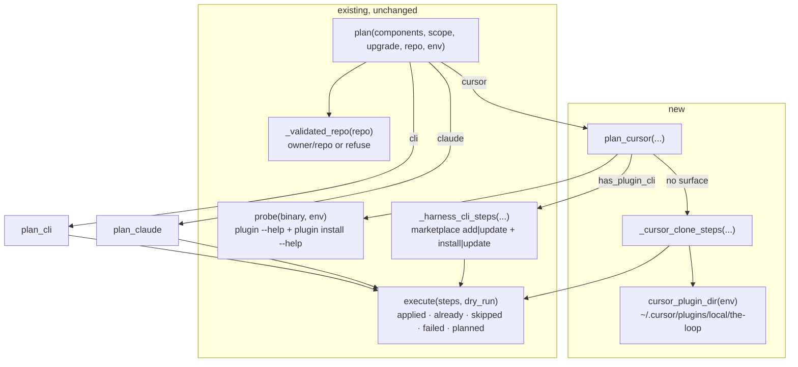

<!-- Written per the `the-loop:writing` skill: front-load each section's
     conclusion, draw it rather than describe it (3+ named parts -> a mermaid
     diagram), and keep the formal registers formal (EARS, abuse cases,
     RFC-2119, API contracts, schema descriptions). No length limit — length
     follows the change; the test is whether a sentence can come out without
     losing information. A gated section stays even when it is empty. -->

# Design: `the-loop install`/`upgrade` supports the Cursor plugin

> Phase 2 of 3. Derived from [`requirements.md`](requirements.md).

## Conclusion first

**Cursor becomes a `BINARIES` entry plus one planner — exactly the extension point
decision-057 promised — and nothing else in the command changes.** No new flag, no new
command, no new report shape, no new dependency. The planner probes `cursor-agent`; if it
has a real plugin surface it reuses the *same* `_harness_cli_steps` Claude already drives,
and if it does not, it falls back to the local clone the installation guide documents.

That is the whole design. The rest of this document is why each of the three interesting
decisions inside it is the way it is: **why the clone is acceptable now when review parked
it in February**, **how `already` is decided without asking Cursor**, and **why project
scope is still a skip**.

## Architecture

Three functions are touched and one is added. `plan()` already dispatches per component;
today its else-branch is hard-wired to `plan_claude`.



### The dispatch change

`plan()`'s `else: plan_claude(...)` becomes an explicit mapping from component name to
planner. Both planners take the same keyword arguments, so the loop body stays one call.
A third harness later is a `BINARIES` entry, a planner and a mapping row.

```python
PLANNERS = {"claude": plan_claude, "cursor": plan_cursor}
```

`COMPONENTS` becomes `("cli", "claude", "cursor")` and `BINARIES` gains
`{"cursor": "cursor-agent"}`. Those two constants alone satisfy R2 in full: default
selection already iterates `BINARIES` against `PATH`, `all` already returns `COMPONENTS`,
and the "unknown component" error already names `COMPONENTS`. R2.4 is satisfied by
deletion — the explicit rejection of `cursor` goes away.

### `plan_cursor` — probe, then one of two routes

```python
def plan_cursor(*, scope, upgrade, project_dir, repo, env) -> List[Step]:
    surface = probe(BINARIES["cursor"], env)
    if surface.has_plugin_cli and surface.path:
        return _harness_cli_steps("cursor", surface, scope=scope, upgrade=upgrade,
                                  project_dir=project_dir, repo=repo)
    return _cursor_clone_steps(scope=scope, upgrade=upgrade, repo=repo, env=env,
                               reason=...)
```

The first branch is **literally the Claude path** — the same helper, the same two steps,
the same `--scope` pass-through, the same project-scope skip when the binary does not take
`--scope`. That is what makes R5.1 more than a slogan: if `cursor-agent` grows
`plugin install` next month, the-loop drives it with no release of ours, and the
"reported to exist" `plugin marketplace add` from the ticket is already handled by the
existing two-part probe (a marketplace command without a working `install` is *no
surface*, per R5.2 — a rule #152 added *because* of Cursor).

### `_cursor_clone_steps` — the fallback, as a decision table

One step, never two. Its state is decided at **plan** time, so `--dry-run` shows the skip.

| `git` on PATH | `~/.cursor/plugins/local/the-loop` | verb | Step |
|---|---|---|---|
| — | any | either | `skipped` — "git not found on PATH", plus the manual command |
| yes | absent | install | `git clone -- https://github.com/<repo>.git <dir>` |
| yes | absent | upgrade | `skipped` — nothing to upgrade; run `the-loop install cursor` |
| yes | a git checkout | install | `already` — nothing run, nothing written |
| yes | a git checkout | upgrade | `git -C <dir> pull --ff-only` |
| yes | exists, not a checkout | either | `skipped` — naming the path; nothing touched |

Any scope other than `user` short-circuits to `skipped` before this table is consulted
(R3.2), because the clone route is user-level by construction.

**Why `--ff-only`.** An operator may have committed on top of their clone (this is the
route the guide calls *"locally, for development"*). `--ff-only` makes that case a
reported `failed` carrying git's own message instead of a merge commit the-loop invented
in someone's working tree.

**Why plain `git clone`, no `--depth 1`.** The route's value is that it is the one already
in [`docs/guide/installation.md`](../../guide/installation.md). Matching the documented
command exactly is the point; a shallow clone would be a small optimisation bought with a
divergence between what the docs say and what the command runs.

**Why `--`.** The URL is built as `https://github.com/{repo}.git` from an already-validated
`owner/repo`, so it cannot be read as a git option. `--` costs one argv element and closes
the question for a reviewer permanently.

### Where the clone goes

```python
def cursor_plugin_dir(env: Env) -> Path:
    return Path(env.home) / ".cursor" / "plugins" / "local" / PLUGIN_NAME
```

`env.home` (not `Path.home()`) because every test drives a fake HOME — the file under test
would otherwise be the developer's own Cursor installation. `PLUGIN_NAME` is `the-loop`
from `harness_plugins`, and both shipped manifests (`.claude-plugin/plugin.json` and
`.cursor-plugin/plugin.json`) carry that same name, so the existing `MARKETPLACE_NAME` /
`PLUGIN_KEY` constants are correct for Cursor too. Their docstring says "the shipped
manifests" and is updated to name both.

### Why the clone is acceptable now, when review parked it in February

The objection recorded in decision-057 was precise: *"a Cursor component would have been a
clone-and-hope with a permanently skipped project scope."* Three things about this design
answer it, and none of them is new evidence about Cursor:

| The objection | What changed |
|---|---|
| *clone-and-hope* — the clone was the design | The clone is now the **fallback**, reached only after the binary says it has no surface. On a Cursor that grows a plugin CLI, it is never reached. |
| an **undocumented** route | It is documented — in this repository, in the installation guide, as the local development route, and it stays a documented route because this work item keeps the two in sync. |
| a **permanently** skipped project scope | Still skipped, but no longer permanently: R3.1 routes through `--scope` the moment `cursor-agent` reports one. The skip now carries the reason and the manual instruction, which is the #152 rule rather than a shortfall. |

The remaining honest cost is stated in the decision record: the clone route works when the
resolved marketplace repository *is* the-loop (or a fork of it), because Cursor loads the
checkout as a plugin from its root manifest. That is the only shape `--from` is meant to
take — "point it at your fork" — and the plan header prints the resolved repository before
anything is fetched.

## Components and interfaces

| Symbol | Kind | Change |
|---|---|---|
| `COMPONENTS` | constant | `+ "cursor"` |
| `BINARIES` | constant | `+ {"cursor": "cursor-agent"}` |
| `CURSOR_PLUGIN_PARENT` | constant (new) | `.cursor/plugins/local` — the path fragment, so the docs and the code cannot drift |
| `cursor_plugin_dir(env)` | function (new) | the clone destination, exported for the tests and the docs |
| `plan_cursor(...)` | function (new) | probe → harness CLI, else clone |
| `_cursor_clone_steps(...)` | function (new) | the decision table above |
| `plan()` | function | `else: plan_claude` → a `PLANNERS` mapping |
| `probe`, `_harness_cli_steps`, `execute`, `exit_code`, `Step`, `StepResult` | — | **unchanged** |
| `InstallCommand.help` / `UpgradeCommand.help` | strings | already say "Claude Code / Cursor plugin" — now true |

No change to the CLI's arguments, the JSON records, the table columns or the exit codes.

## Data models

None added. A Cursor step is a `Step` like any other: `argv` for the two git commands,
and a pre-decided `state` (`already` / `skipped`) with a `detail` for the rest.

The one shape worth naming is the **`already` step**, which is new in kind: until now
`already` was only ever produced at execution time by the settings writer. `Step.state`
already carries any pre-decided outcome through `execute()` verbatim, so this needs no
mechanism — but it does mean `--dry-run` reports `already` rather than `planned` for a
clone that exists, which is more honest than the alternative and worth a test (T1).

## Error handling

| Failure | Handling | Requirement |
|---|---|---|
| `cursor-agent` absent | no surface → fallback | R4.1 |
| probe times out / hangs / errors | `_capture` already swallows it → no surface → fallback | R5.3 |
| `plugin marketplace` present, `plugin install` missing | no surface → fallback | R5.2 |
| `git` absent | `skipped` with the manual command | R4.5 |
| destination exists, not a checkout | `skipped`, nothing touched | R4.4 |
| `git clone` / `git pull` exits non-zero | `failed` with git's last output line, exit 1 | R1 / #152 R5.3 |
| `--scope project` with no expressible mechanism | `skipped` with the manual instruction | R3.2 |
| invalid `--from` | `InvalidMarketplace` at plan time, exit 2, nothing runs | Security §1 |

A Cursor failure never stops the other components: `execute()` already runs steps
independently (R1.4).

## Testing strategy

Unit-first, because planning is pure: it takes the machine as an `Env` argument, so every
route above is asserted as *the argv a given (probe result, scope, verb, filesystem state)
produces* with no subprocess and no real home directory. The full matrix and the evidence
plan are in [`testing-plan.md`](testing-plan.md).

Two properties get explicit negative tests rather than being implied:

1. `--dry-run` with a Cursor component creates no directory and runs no `git`.
2. A destination that exists but is not a checkout is left byte-identical.

## Security design

> Enforces every trust boundary named in [`requirements.md`](requirements.md)
> § Security considerations (`security.design.required`).

| Boundary (requirements) | Enforcement in this design | Test |
|---|---|---|
| §1 marketplace value → a **URL** | `plan()` calls `_validated_repo` for any component in `BINARIES`; `cursor` is in `BINARIES`, so the value is validated *before* `_cursor_clone_steps` can interpolate it. The URL is built only from the validated value. | T8 |
| §2 subprocess construction | `git` resolved via `env.which("git")`, invoked as an argv list, no shell (`_run` is the module's only process start). `--` separates options from the URL. | T1, T8 |
| §3 confined writes | Exactly one path is ever written: `cursor_plugin_dir(env)`. No delete, no overwrite, no write into a directory the command did not create as a checkout. | T8 |
| §4 scope confusion | `--scope project` short-circuits to `skipped` before any step is built; there is no code path from a project-scoped request to a user-level clone. | T1, T8 |
| §5 privilege | Nothing here elevates; the only paths touched are under `env.home`. | review |

**Abuse cases → negative tests.** Each of the four in `requirements.md` becomes an
assertion: the invalid-`--from` set (already parameterised in `test_install.py`) extends to
the cursor component including a `--upload-pack=`-shaped value; the occupied-path case
asserts the directory is unchanged; the dry-run case asserts no filesystem effect; and the
plan header already prints the resolved repository.

**No new attack surface beyond the clone itself.** The command gains the ability to run
`git` — a binary the operator already has and the documented route already uses — against
one URL derived from a validated value, into one path in their home directory. It reads no
credentials, writes none, and adds no network endpoint, no parser and no input the operator
did not type.

## Alternatives considered

- **Wait for `cursor-agent plugin --help` before designing anything.** The ticket's own
  first step, and the reason it has sat open: the output is unobtainable from here, and
  the parked state costs an operator the whole Cursor half of the command every day it
  lasts. A probe-first design is *the* answer to not knowing — it is what #152 built the
  probe for — and it stays correct under either answer. The question is not dropped; it is
  recorded on the ticket and in the open questions.
- **Write Cursor's plugin config file directly**, mirroring the Claude fallback. Rejected:
  the Claude fallback writes two keys this repository has *documented and exercised* since
  decision-054. The equivalent Cursor file is not documented anywhere we can read, so
  writing it would be exactly the invention R4 forbids — and it would be a guess about a
  file format rather than about a command line, which fails silently instead of loudly.
- **Ship `cursor` as a component that only ever skips**, with instructions. Honest, and
  strictly worse than the clone: the operator still does the work by hand, and the
  documented route we would print is the very command we declined to run.
- **`git clone --depth 1`.** Faster, and a divergence from the documented command for no
  benefit an operator would notice on a repository this size.
- **A `--cursor-plugin-dir` flag.** YAGNI, and it would be a second way to say something
  Cursor does not let us configure anyway.
