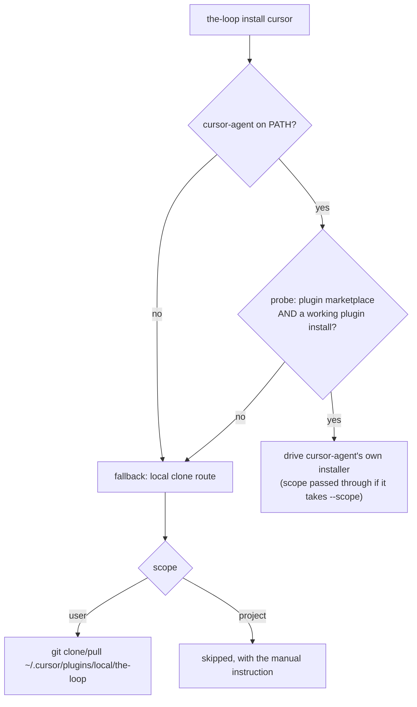

<!-- Written per the `the-loop:writing` skill: front-load each section's
     conclusion, draw it rather than describe it (3+ named parts -> a mermaid
     diagram), and keep the formal registers formal (EARS, abuse cases,
     RFC-2119, API contracts, schema descriptions). No length limit — length
     follows the change; the test is whether a sentence can come out without
     losing information. A gated section stays even when it is empty. -->

# Requirements: `the-loop install`/`upgrade` supports the Cursor plugin

> Phase 1 of 3 (requirements → design → tasks). Following the Kiro spec approach
> (<https://kiro.dev/docs/specs/>). This phase MUST be reviewed and approved by the
> required collaborators before moving to design.

## Introduction

[Issue #157](https://github.com/MadaraUchiha-314/the-loop/issues/157): `the-loop install`
and `the-loop upgrade` (#152, [decision-057](../../decisions/decision-057.md)) cover the
CLI and the **Claude Code** plugin. the-loop also ships as a **Cursor** plugin
([decision-015](../../decisions/decision-015.md)), and that half has no terminal
installer at all — `the-loop install cursor` is rejected as an unknown component today.

The gap is asymmetric in a way an operator feels immediately. On a machine with both
harnesses, `the-loop install` sets one of them up and silently leaves the other to the
docs:

| | Install | Upgrade |
|---|---|---|
| Claude Code plugin | `the-loop install claude` | `the-loop upgrade claude` |
| Cursor plugin | `/add-plugin` in the editor, the marketplace site, or a clone under `~/.cursor/plugins/local/` | `git pull` in that clone — if that is the route the operator took |

Cursor was in the first cut of #152 and was **parked on review**, not rejected on merit:
*"Let's park cursor for now. For now let's only support claude. We will track the cursor
installation as a separate issue."* The reason given in decision-057 § *Cursor, parked*
was evidential — the first cut hard-coded a local clone, and as of Cursor 2.5 (Feb 2026)
no CLI install command was documented, so the component would have been "clone-and-hope
with a permanently skipped project scope".

**What has changed is the shape of the answer, not the evidence.** This work item does not
assume a Cursor CLI surface. It reuses the mechanism #152 already built for exactly this
uncertainty: the-loop **asks the binary** what it supports (`probe()`), drives the
harness's own installer when there is one, and otherwise falls back to a route this
repository already documents — with a scope it cannot express reported as `skipped`, never
widened. The local clone stops being the design and becomes the fallback.

### The unverified question, stated up front

The ticket's *first step* is to run `cursor-agent plugin --help` on a machine with Cursor
installed. **That could not be done for this work item** — Cursor's docs and forum return
HTTP 403 from the agent environment (the same wall the ticket recorded in February), and
no `cursor-agent` binary exists on any machine this session can reach.

So the requirements below are written to be **correct whatever that output turns out to
be**: R5 makes the surface a runtime question rather than a design-time assumption, which
is what R6 of #152 already demanded of every harness. Confirming the output remains
valuable — it tells us which branch operators will actually take — and is raised as an
open question, not a blocker. Nothing here is invalidated by either answer.

## Requirements

### Requirement 1 — install and upgrade the Cursor plugin from a terminal

**User story:** As an operator who uses Cursor, I want the same one command that sets up
Claude Code to set up Cursor, so that a machine with both harnesses does not need two
different rituals and a docs page.

#### Acceptance criteria (EARS)

1. WHEN `the-loop install cursor` runs at `--scope user` THEN the system SHALL install
   the-loop's Cursor plugin, and SHALL report the exact command or path that did it.
2. WHEN `the-loop upgrade cursor` runs at `--scope user` THEN the system SHALL move an
   already-installed Cursor plugin to the current version of the resolved marketplace
   repository.
3. IF `the-loop upgrade cursor` runs and no installation the system owns is present THEN
   it SHALL report `skipped` naming what is missing and the command that would install
   it, and SHALL NOT install it as a side effect of an upgrade.
4. WHEN `cursor` is named alongside other components THEN a failure or skip of the Cursor
   component SHALL NOT stop the other components (the R1.4 rule of #152 holds unchanged).

### Requirement 2 — Cursor joins the default component set

**User story:** As an operator running `the-loop install` with no arguments, I want every
harness I actually have to be set up, so that the default does the obvious thing on my
machine.

#### Acceptance criteria (EARS)

1. WHEN no component is named THEN the system SHALL act on `cli` plus every harness whose
   binary is found on `PATH`, and `cursor` (binary `cursor-agent`) SHALL be one of the
   harnesses considered.
2. WHEN `cursor-agent` is not on `PATH` and no component is named THEN `cursor` SHALL NOT
   be in the selected set.
3. WHEN `all` is named THEN the selected set SHALL include `cursor` whether or not
   `cursor-agent` is present, so an absent harness is reported rather than dropped.
4. WHEN `cursor` is named explicitly THEN it SHALL be accepted, and SHALL NOT be rejected
   as an unknown component.

### Requirement 3 — project scope is honoured or reported, never invented

**User story:** As an operator trying the-loop out on one repository, I want a
project-scoped Cursor install to either work or tell me it cannot, so that a request
scoped to one repo never quietly changes every session on my machine.

#### Acceptance criteria (EARS)

1. WHERE `cursor-agent`'s own plugin surface expresses scope THEN the system SHALL pass
   the requested scope through to it rather than emulating it.
2. IF `--scope project` is requested and no Cursor mechanism can express it THEN the
   system SHALL report the component as `skipped`, SHALL state why, and SHALL print the
   manual instruction.
3. The system SHALL NOT install at user scope in response to a project-scoped request,
   under any condition.

### Requirement 4 — the fallback is a documented route, and it is auditable

**User story:** As an operator whose Cursor has no plugin CLI, I want the-loop to fall back
only to something this project already documents, so that a command that installs software
never improvises against my machine.

#### Acceptance criteria (EARS)

1. IF `cursor-agent` is absent, or exposes no usable plugin surface, THEN the system SHALL
   fall back only to the local-clone route the installation guide already documents —
   a checkout of the resolved marketplace repository at
   `~/.cursor/plugins/local/the-loop`.
2. WHEN the fallback runs at install and that path does not exist THEN the system SHALL
   clone into it and report `applied`.
3. WHEN the fallback runs at install and that path already contains a git checkout THEN
   the system SHALL report `already` and SHALL NOT run or write anything (R5.1 of #152:
   a checkout the system owns is a state it can determine itself).
4. IF that path exists but is **not** a git checkout THEN the system SHALL report
   `skipped` naming the path, and SHALL NOT delete, overwrite or write inside it.
5. IF `git` is not available on `PATH` THEN the fallback SHALL report `skipped` naming
   the missing binary and printing the manual command.
6. WHEN either verb runs THEN every Cursor step SHALL appear in the printed plan with its
   exact argv or path, SHALL be executable under `--dry-run` without touching the machine,
   and SHALL be emitted by `--format json` like every other step.

### Requirement 5 — never guess Cursor's interface

**User story:** As the maintainer, I want the Cursor component to work off what the binary
reports rather than what a docs page said in February, so that Cursor shipping a plugin
CLI improves the-loop with no release of ours, and Cursor not shipping one costs nothing.

#### Acceptance criteria (EARS)

1. WHEN `cursor-agent` is present THEN the system SHALL determine whether it exposes a
   plugin-management surface — and whether that surface accepts a scope flag — by asking
   the binary itself, and SHALL NOT infer it from a version number or a documentation
   claim.
2. IF `cursor-agent` exposes a `plugin marketplace` command but no working
   `plugin install` THEN the system SHALL treat that as **no surface** and take the
   fallback, rather than running a command that cannot succeed.
3. WHEN `cursor-agent`'s probe times out, errors, or the binary hangs THEN the system
   SHALL treat it as no surface and continue, and SHALL NOT propagate the failure.

## Non-functional requirements

- **No new dependency.** The fallback uses `git`, already a documented prerequisite of
  this repository's workflow and of the route the installation guide describes.
- **Probe cost is bounded.** The Cursor probe reuses the existing 20-second `PROBE_TIMEOUT`
  and runs at most twice per run (`plugin --help`, `plugin install --help`), so the default
  no-argument install pays at most that on a machine where `cursor-agent` hangs.
- **The report shape does not change.** `applied` · `already` · `skipped` · `failed` ·
  `planned`, one row per step, the same table and the same JSON records. A setup script
  written against #152 keeps working.

## Security considerations

> Threat-model-lite (`security.threatModel.required`). See `reference/security.md`.

**Actors & trust.** Unchanged from #152: no untrusted actor reaches this command. It runs
only when a human types it in their own terminal — it is not reachable from a webhook
payload, a ticket comment, or any other event input. The risk is not *who calls it* but
**what it makes the operator's machine execute on their behalf**, and this work item adds
one new such thing: a `git clone` of a repository, whose contents Cursor then loads into
every session at user scope.

**Trust boundaries & data.**

1. **The marketplace value is the sharp input, and it now also becomes a URL.** #152
   already validates `--from`/`routing.harnessPlugins.marketplaceRepo` as `owner/repo`
   (`^[A-Za-z0-9._-]+/[A-Za-z0-9._-]+$`) before it reaches an argv or a settings file, and
   prints it in the plan header. The clone fallback interpolates that same value into
   `https://github.com/<owner>/<repo>.git`, so the validation MUST happen before the URL
   is built — which it does, at plan time, for every component in `BINARIES`.
2. **Subprocess construction.** `git` is resolved from `PATH` by name and invoked as an
   argv list with no shell, like every other step.
3. **Writes are confined.** The fallback writes exactly one path,
   `~/.cursor/plugins/local/the-loop`, inside the operator's home directory. It creates
   parents and clones; it never deletes, never overwrites and never writes into a
   directory it did not create as a checkout (R4.4).
4. **Scope confusion.** Installing wider than asked is the abuse case for `--scope`: the
   clone route is user-level by construction, so a project-scoped request takes R3.2's
   skip.
5. **Privilege.** No elevation, no `sudo`, nothing written outside the home directory or
   the named project directory.

**Abuse cases (EARS).**

1. WHEN the resolved marketplace value is not `owner/repo` — a URL, a path, a value
   carrying shell or git-option syntax such as `--upload-pack=…` — THEN the system SHALL
   refuse every plugin step with an error naming the value, and SHALL NOT pass it to
   `git`, build a URL from it, or write it anywhere.
2. WHEN `~/.cursor/plugins/local/the-loop` already exists and is not a checkout this
   command created THEN the system SHALL leave it exactly as it is and report `skipped`.
3. WHEN `--dry-run` is in effect THEN the system SHALL create no directory, run no `git`
   command and modify nothing, while printing the same plan the real run would execute.
4. WHEN an operator points `--from` at a repository that is not a the-loop plugin THEN the
   system SHALL still not execute its contents itself — the clone is inert on disk, and it
   is Cursor that loads it — and the resolved value SHALL be printed in the plan header
   before anything is fetched, so what is about to be trusted is visible first.

**Fail closed.** An unvalidated marketplace value stops the plan (exit 2) before any step
exists. A missing `git`, an occupied non-checkout path, or a probe that cannot establish
Cursor's surface stops *that component* with a reported reason — never a best guess, and
never a wider scope.

## Out of scope

- **Uninstalling.** Unchanged from #152: `rm -rf` of a clone, or Cursor's own uninstall,
  is one command and carries no ambiguity worth wrapping.
- **Making Cursor host daemon-driven sessions.** `cursor-agent` cannot pre-assign an
  interactive session id, so it remains a critic harness
  ([decision-056](../../decisions/decision-056.md)). This work item installs a plugin; it
  changes nothing about which harness runs the loop.
- **Publishing to Cursor's marketplace site.** the-loop is installable from this
  repository by every route Cursor documents; listing it is a distribution decision, not
  an installer one.
- **A project-local Cursor plugin directory.** If Cursor documents one later, R3.1 already
  routes to it through the probe; inventing one now is precisely what R4 forbids.

## Open questions

1. **What does `cursor-agent plugin --help` actually print?** Raised on the ticket
   ([issue #157](https://github.com/MadaraUchiha-314/the-loop/issues/157)) as the paper
   trail for this gap. It cannot be answered from this environment: `cursor.com/docs` and
   `forum.cursor.com` both return HTTP 403, and no `cursor-agent` binary is reachable. The
   design is deliberately independent of the answer (R5.1) — the probe decides at runtime
   — so this is a *confirmation* that tells us which branch operators take, not a
   precondition. If the answer shows a plugin CLI that takes `--scope`, R3.2's skip
   becomes rare; if it shows none, the fallback is the only path and the docs should say
   so plainly.
2. **Does a plugin installed by clone load in Cursor CLI mode?** The ticket flags this as
   "separately reported and worth checking". It is a property of Cursor, not of this
   command, and it does not change any acceptance criterion here — but it belongs in the
   installation guide if confirmed.

## Review comments

> Appended by the-loop's `record-feedback` hook when a human gate approves with
> comments (issue-109). Append-only and attributed: an approval never silently
> discards a reviewer's suggestions, and the feedback travels with the document
> it concerns rather than living in a side-channel tracker.

*None yet.*
