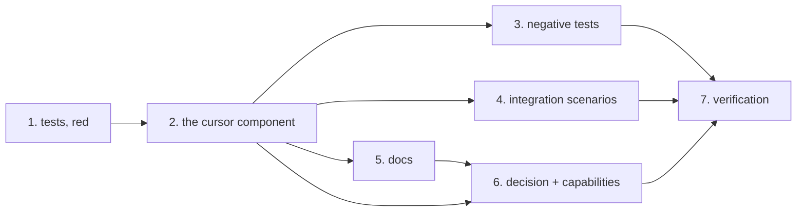

<!-- Written per the `the-loop:writing` skill. -->

# Tasks: `the-loop install`/`upgrade` supports the Cursor plugin

> The last spec artifact (requirements → design → testing plan → tasks). A DAG of
> implementation tasks derived from the approved design and testing plan.

## Task list

Each task is a checkbox, references the requirement(s) it satisfies, declares its
dependencies so the-loop can build the execution DAG, and names the **test(s) that will
prove it** — a row of [`testing-plan.md`](testing-plan.md)'s matrix. TDD invariant
(`tdd.mode: standard`): **no production code without a failing test that motivates it**.

- [x] 1. Land the Cursor unit tests, red
  - Extend `cli/tests/test_install.py`: the harness-CLI route, the four clone-route
    outcomes, the three skips, component resolution with and without `cursor-agent`,
    dry-run inertness, and the abuse cases (invalid `--from` for `cursor`, occupied
    non-checkout path left byte-identical, project scope never cloning).
  - Retire `test_cursor_is_not_a_component_yet` — it asserts the state this work item
    removes — and replace it with the R2.4 acceptance case.
  - _Depends on:_ none
  - _Requirements:_ R1, R2, R3, R4, R5
  - _Test:_ `T1 — uv run --project cli python -m pytest -q cli/tests/test_install.py`
    (red: `cursor` is rejected by `resolve_components`)
- [x] 2. Add the Cursor component to `the_loop.install`
  - `COMPONENTS += "cursor"`, `BINARIES["cursor"] = "cursor-agent"`, the
    `CURSOR_PLUGIN_PARENT` constant and `cursor_plugin_dir(env)`.
  - `plan_cursor` (probe → `_harness_cli_steps`, else `_cursor_clone_steps`) and
    `_cursor_clone_steps` implementing the design's decision table.
  - Replace `plan()`'s hard-wired `else: plan_claude` with the `PLANNERS` mapping.
  - Update the module docstring: Cursor is no longer parked, and why the clone is the
    fallback rather than the design.
  - _Depends on:_ 1
  - _Requirements:_ R1, R2, R3, R4, R5
  - _Test:_ `T1` — the same command, now green
- [x] 3. Prove the security boundaries hold (negative tests)
  - The abuse cases as assertions: an invalid marketplace value (including a
    `--upload-pack=`-shaped one) raises `InvalidMarketplace` for `cursor` before any step
    exists and never reaches an argv; a destination that exists without `.git` is
    unchanged after `execute`; `--dry-run` creates no directory and runs no `git`; a
    project-scoped request produces no clone step.
  - _Depends on:_ 2
  - _Requirements:_ R3.3, R4.4, R4.6, security §1–§4
  - _Test:_ `T8 — uv run --project cli python -m pytest -q cli/tests/test_install.py -k "abuse or dry_run or project"`
- [x] 4. Add the two integration scenarios
  - `cli/tests/test_install_integration.py`: a default no-argument run on a machine with
    both harnesses, and a `--format json` run — each with a Gherkin docstring naming the
    scenario and its requirement, per `config.testing.gherkinDocstrings`.
  - _Depends on:_ 2
  - _Requirements:_ R1.4, R2.1, R4.6
  - _Test:_ `T2 — uv run --project cli python -m pytest -q cli/tests/test_install_integration.py`
- [x] 5. Rewrite the docs that say Cursor is not supported
  - `docs/cli/commands/install.md` and `upgrade.md` (the "not a component yet" callouts →
    the Cursor section and its decision table), `docs/guide/installation.md`,
    `docs/cli/installation.md` if it repeats the claim, and the `install`/`upgrade`
    command help strings if they need it.
  - _Depends on:_ 2
  - _Requirements:_ R1, R3, R4
  - _Test:_ `make lint` (markdownlint over all docs) + T11's read-through
- [x] 6. Record the decision and update the capability docs
  - `docs/decisions/decision-064.md` — amends decision-057 § _Cursor, parked_ — plus its
    row in `docs/decisions/decisions.md`, and the "Deferred" line in decision-057 itself.
  - `docs/capabilities/cli.md` and `docs/capabilities/distribution.md`: current behaviour
    plus a history row each (the ready-to-ship gate item).
  - _Depends on:_ 2, 5
  - _Requirements:_ R1, R4 (issue acceptance sketch item 4)
  - _Test:_ `make lint`; the capability-doc gate is a review item, not a command
- [x] 7. Execute the testing plan and record the evidence
  - Run every in-scope activity of `testing-plan.md`, tick only what actually ran, fill
    the results table, and commit the evidence under `evidence/`.
  - _Depends on:_ 3, 4, 5, 6
  - _Requirements:_ all
  - _Test:_ the plan itself — `make test`, `make validate`, `make lint`,
    `make format-check`, `make typecheck`

## Dependency graph (DAG)

## Checkpoints

After task 2 (the unit suite goes green), after task 4 (the whole install surface is
covered), and after task 6 (`make check` over the repository). Task 7 is the
`verification` node: it executes the plan, records results and evidence, and only then do
the review phases run the self/critic rounds and the **security review gate**
(`security.review`; risk tier 3, so no named human security sign-off is required —
`security.review.humanSignOffMinTier` is 4).

## Review comments

> Appended by the-loop's `record-feedback` hook when a human gate approves with comments.

_None yet._
