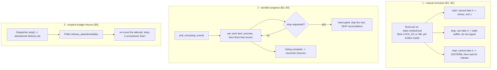
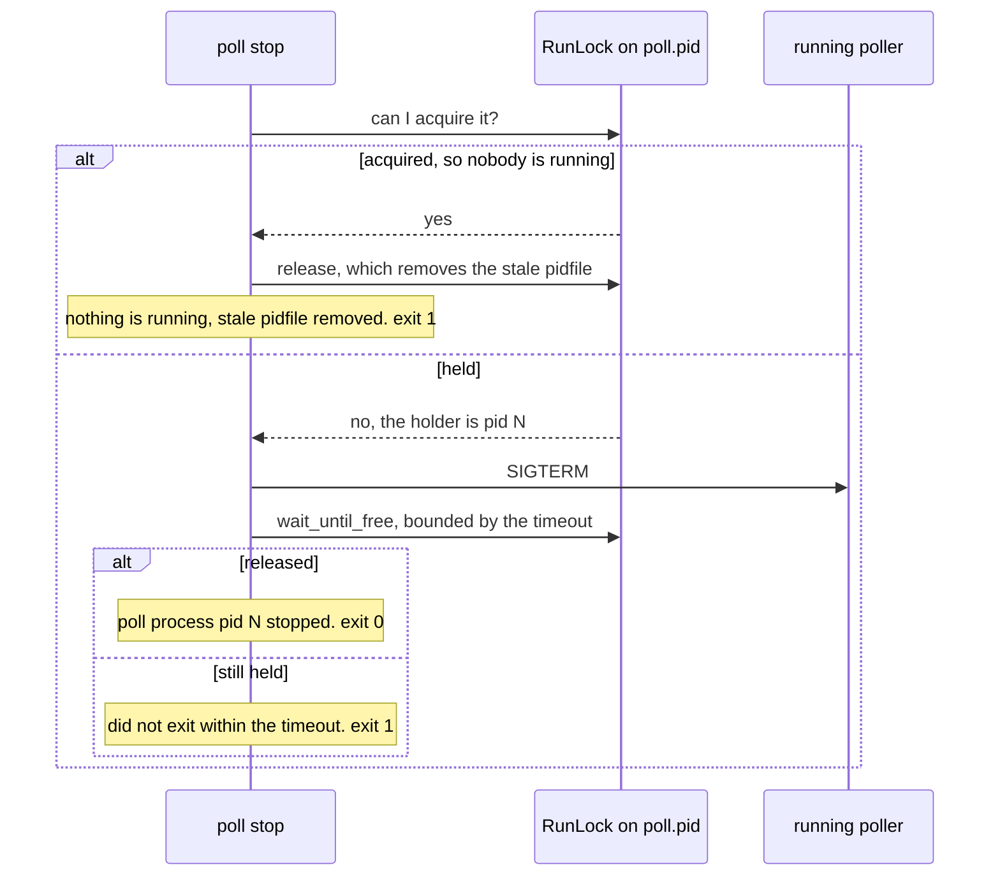

# Design: the poller's process lifecycle becomes as idempotent as its ledger

> Phase 2 of 3. Derived from `bugfix.md` (locked). Human approval for this
> tier-3 change happens at the PR.

## Architecture

The ledger is already restart-safe. What is missing is the *lifecycle* around
it, and the five defects fall into three mechanisms:



Nothing about *what* the poller decides changes. Discovery, the authorization
guards, the first-sight baseline, the control-command path, the retry policy and
the closure rules are all untouched. Only when state is written, when the loop
may stop, and who is allowed to run at all.

## Components

### 1. `the_loop.runlock.RunLock` — a new, small module

An advisory exclusive lock on a **pidfile**, rather than a lock file beside one.
Reusing the pidfile is deliberate:

- it is already a declared, already-gitignored (`.the-loop/*.pid`) local path, so
  the change adds no generated file to classify (`GENERATED_PATHS`,
  issue-128/decision-046) and no `.gitignore` line;
- "who is running" and "how do I signal them" become **one** fact instead of two
  that can disagree — which is exactly the disagreement B2 is made of.

```python
class RunLock:
    def __init__(self, path: Path, name: str = "poller") -> None: ...
    def acquire(self) -> bool:      # False when another process holds it
    def release(self) -> None:      # close the fd, remove the file
    def holder(self) -> int:        # pid recorded inside, or 0
    def is_held(self) -> bool:      # True when someone else holds it
    def wait_until_free(self, timeout: float, interval: float = 0.1) -> bool
    def __enter__ / __exit__
```

`acquire()` opens the path `O_RDWR | O_CREAT`, takes `fcntl.flock(LOCK_EX |
LOCK_NB)`, then truncates and writes the pid. The order matters: the pid is
written **after** the lock is held, so a reader never sees a pid from a process
that lost the race.

Three properties come free from `flock` and are why it was chosen over a
pid-liveness heuristic:

- **the kernel releases it** when the fd closes — on exit, on `SIGKILL`, on OOM,
  on a host reboot. R1.5, and R1.4 falls out of it: a leftover pidfile is
  *unlocked*, so the next start simply takes it.
- **it is per inode**, so it is scoped to the state root exactly as required
  (R1.3) with no naming scheme to invent.
- **it composes with `stop`**: "can I take this lock?" is a total, race-free
  answer to "is a poller running?", which is what R2.1 needs and what a
  `os.kill(pid, 0)` probe can never be (pid reuse).

`is_held()` is implemented as *try to take it, and release it again if I
could* — the only honest formulation on POSIX.

**Fallback.** `fcntl` is POSIX-only. On a platform without it the module falls
back to a pid-liveness check (`os.kill(pid, 0)`), which is weaker (pid reuse can
produce a false "running") but never *less* safe than today's unconditional
trust. the-loop's runner requires tmux, so the fallback is a courtesy, not a
supported configuration; it is logged once at debug.

### 2. `poll start` takes the lock (R1)

`_start` acquires the lock before it builds anything, and holds it for the whole
run — `--once` included, which is what closes the cron-overlap hole (R1.2). The
pidfile is now written by the lock rather than by the command, so the two cannot
drift, and it is removed on release exactly where it is removed today.

Refusal is loud and actionable: the pid holding it, the pidfile path, and the
remedy (`the-loop poll stop`). Exit code 1, no ledger touched, `poller.blocked`
emitted to the event log so a supervisor's restart storm is visible in
`the-loop events --source poll`.

Ordering note: the lock is taken *before* the config is read and providers are
built, so a second poller cannot do half a startup — including `check_dependencies`
and the ttyd web terminal, which would otherwise fight over port 7681.

### 3. `poll stop` verifies, then waits (R2)



`--timeout` (default 30s) is a new flag on `stop`; it bounds R2.2 and gives
R2.3 its message. The wait is what makes `poll stop && poll start` correct
rather than lucky.

The `SIGTERM` is sent only in the `held` branch, so R2.1 holds by construction:
the pid is signalled only when the lock proves it is a live poller.

### 4. Per-item flush (R3)

`PollState.save()` is kept (it flushes anything still dirty and stays the
end-of-cycle backstop), and gains a sibling:

```python
def flush(self, ref: str) -> None:   # write just this record, if dirty
```

`_poll_provider` calls it in a `finally` around `_process_item`, so an item that
raised `ProviderError` still persists the attempt it already spent (R3.2) —
today that attempt is lost, which is precisely how a failing item can retry
forever. `WorkItemStore.write_section` is already atomic and already one file per
work item, so this is a scheduling change, not a storage change: same bytes, same
records, written sooner (R3.3).

### 5. Cooperative shutdown (R4)

`poll_once` and `_poll_provider` take an optional `stop_event`. The check sits at
one place per loop — between work items, and between providers — never inside
one. An item in flight always finishes and is flushed (R4.1): stopping
mid-item would leave the very half-written state B3 is about.

The load-bearing subtlety is R4.2. `_reconcile_closures` walks the *registry* and
closes any active session whose work item is absent from `open_refs`; that is
sound only because `open_refs` came from a complete, successful listing — issue-94
returns early on `ProviderError` for exactly this reason. An interrupted cycle
produces a partial `open_refs` for the same reason a failed listing produces
none, so it takes the same exit: **skip reconciliation entirely**. Getting this
wrong would close every live session below the interruption point, so it is
pinned by its own test.

`PollSummary` gains `interrupted: bool`; the cycle log line and the `poll.cycle`
event carry it (R4.3).

### 6. Returning unused retry budget (R5)

```python
# dispatcher
def stop(self, timeout: float = 10.0) -> List[str]:
    """... returns the delivery ids of events abandoned undelivered."""
```

After signalling and joining the workers, `stop()` drains what is left in each
queue (`get_nowait`) and returns those delivery ids. Existing callers ignore the
return value, so this is additive.

The poller keeps an in-memory `{delivery_id: (ref, comment_id)}` of the attempts
it has recorded but not yet seen resolved — populated in `_process_comment` /
`_try_spawn` at the moment the attempt is noted, and dropped when a later cycle
observes the delivery as `done`. `Poller.release_abandoned(ids)` then walks the
intersection and un-counts each attempt:

```python
PollState.release_comment_attempt(ref, comment_id)  # decrement, drop at zero
PollState.release_spawn_attempt(ref)                # decrement, clear deliveryId
```

Neither touches `seenComments` (R5.3): the event stays *unresolved*, so the next
start rediscovers it as an ordinary candidate with the budget it started with.
`poll.py` calls `poller.release_abandoned(dispatcher.stop())` in its `finally`.

In-memory is the right lifetime here. The map only ever answers "did this
process abandon that event?", which no other process can answer, and a `SIGKILL`
— where there is no shutdown to roll back — must leave the ledger exactly as R3
left it.

## Data model

No new file, no schema change, no config option. Two existing shapes gain
meaning:

| Path | Before | After |
|---|---|---|
| `<state.root>/poll.pid` | written after startup; deleted on clean exit; never read except by `stop` | additionally the poller's `flock` inode: holding it *is* running |
| `portable/<slug>.json` → `poll` | written at end of cycle | written when the item is done; `commentAttempts` / `spawn.attempts` may be decremented by a graceful stop |

`polling.*` and `routing.*` are untouched, so `cli-config.schema.json` and the
docs-parity gate (P3/P4) are untouched. `StateLayout` is untouched, so the
portability classification (S1–S5) is untouched.

## Error handling

| Situation | Behaviour |
|---|---|
| Lock held at `start` | refuse, name the holder pid + pidfile + remedy, `poller.blocked`, exit 1 |
| Lock cannot be created (permissions, missing dir) | log the path and the OS error, exit 1 — a poller that cannot prove exclusivity does not run |
| `fcntl` unavailable | fall back to a pid-liveness check, debug-logged once |
| Stale pidfile at `stop` | remove it, say so, exit 1 (nothing was stopped) |
| Corrupt pidfile at `stop` | unchanged message, exit 1 |
| Holder does not exit within `--timeout` | report it, exit 1 — never a success that has not happened |
| Flush fails mid-cycle | propagates as it does today; the surrounding item loop already logs and continues |
| Interrupted cycle | reconciliation skipped for that source, `interrupted=true` in the summary and the event |

## Testing strategy

Unit (`test_runlock.py`, `test_poller.py`, `test_poll_command.py`):

- lock: acquire/refuse/release, pid recorded, stale file re-acquired, released on
  process death (a real `fork`), `wait_until_free` timing out and succeeding;
- `poll start` refuses when held and starts when stale; `--once` takes the lock;
- `poll stop`: stale ⇒ no signal, file removed, exit 1; held ⇒ signal + wait;
  timeout ⇒ exit 1;
- per-item flush: the record on disk is complete after item *n*, before item
  *n+1* is processed;
- `stop_event` set mid-cycle ⇒ later items untouched, `interrupted=True`;
- **reconciliation is skipped on an interrupted cycle** (the dangerous case);
- `release_abandoned` decrements the attempt and leaves the comment unresolved.

Integration (`test_poller_integration.py`, Gherkin docstrings per
`testing.gherkinDocstrings: required`, linked to the ACs):

- **R1/R2**: a second `poll start` against a held lock refuses and leaves the
  ledger byte-identical.
- **R3**: a cycle abandoned after item 1 leaves item 1's record complete, and the
  next cycle does not re-forward its comment.
- **R5**: a comment enqueued and then abandoned by `stop()` is retried on the
  next start with a full budget, and is not baselined.

## Alternatives considered

- **A lock file separate from the pidfile.** Rejected: two files that can
  disagree about one fact, plus a new entry in `GENERATED_PATHS`, the state page
  and `.gitignore` — all to avoid reusing a file that already means "the poller
  is here".
- **A liveness check (`os.kill(pid, 0)`) instead of `flock`.** Rejected as the
  primary mechanism: it is racy (two starts can both observe "not running") and
  wrong under pid reuse, which is the failure B2 reports. Kept only as the
  non-POSIX fallback.
- **Flushing after every mutation.** Rejected: an item's ledger is mutated
  several times while it is processed (resolve, attempt, finalize), and writing
  after each would multiply the writes without shrinking the blast radius below
  one item.
- **Making `Deduper` durable so "inflight" survives a restart.** Rejected: after
  a process death *nothing* is in flight, so a durable "inflight" would be a lie
  that delays every retry by a cycle. R5 solves the real problem (a spent
  attempt) directly.
- **Rolling the attempt back at enqueue time instead** (count an attempt only
  once its failure is observed). Rejected: it re-opens the unbounded-retry hole
  issue-80 closed — an event that never resolves would never spend budget.
