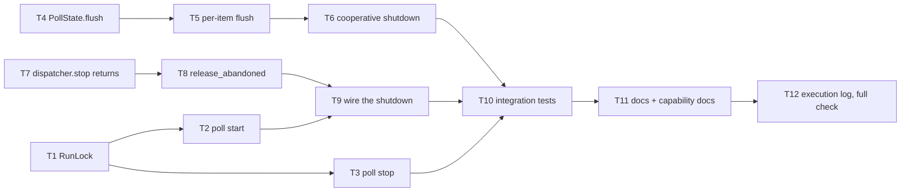

# Tasks: the poller's process lifecycle becomes as idempotent as its ledger (issue-159)

> Phase 3 of 3. Derived from `bugfix.md` + `design.md` (both locked). TDD per
> task; each task names the ACs it delivers.

## DAG

## Task list

- [x] **T1 — `the_loop/runlock.py`: the lock primitive** (AC1.3, AC1.4, AC1.5).
  `RunLock` over a pidfile: `acquire`/`release`/`holder`/`is_held`/
  `wait_until_free`, context manager, `flock` with a documented pid-liveness
  fallback. New `cli/tests/test_runlock.py`: acquire/refuse, pid recorded, stale
  file re-acquired, released on process death (real `fork`), `wait_until_free`
  both ways, corrupt/empty file.

- [x] **T2 — `poll start` takes the lock** (AC1.1, AC1.2). Acquire before
  building anything (config, providers, dependency checks, ttyd); refuse with
  holder pid + pidfile + remedy and `poller.blocked`; hold for `--once` too;
  release in `finally` (which is now what removes the pidfile).

- [x] **T3 — `poll stop` verifies and waits** (AC2.1, AC2.2, AC2.3). Stale ⇒ do
  not signal, remove the pidfile, exit 1. Held ⇒ `SIGTERM`, then
  `wait_until_free(--timeout)`; new `--timeout` flag (default 30s); a holder that
  outlives it exits 1.

- [x] **T4 — `PollState.flush(ref)`** (AC3.1). Write one dirty record and clear
  its dirty flag; `save()` keeps flushing whatever is left.

- [x] **T5 — flush per work item** (AC3.1, AC3.2, AC3.3). `_poll_provider`
  flushes in a `finally` around `_process_item`, so a raising item persists the
  attempt it spent. Unit test: the record on disk is complete before the next
  item is processed.

- [x] **T6 — cooperative shutdown inside a cycle** (AC4.1, AC4.2, AC4.3).
  `poll_once(stop_event=None)` / `_poll_provider(..., stop_event)`; check between
  items and between providers, never inside one; **skip `_reconcile_closures`
  when the listing loop was cut short**; `PollSummary.interrupted`; the cycle log
  line and `poll.cycle` carry it; `run()` passes its own stop event down.

- [x] **T7 — `Dispatcher.stop()` reports what it abandoned** (AC5.1). Drain the
  queues after the join and return the undelivered delivery ids; existing callers
  ignore the return.

- [x] **T8 — `Poller.release_abandoned` + `PollState` releases** (AC5.2, AC5.3).
  `release_comment_attempt` / `release_spawn_attempt` (decrement, drop at zero,
  never touch `seenComments`); the poller's `{delivery_id: (ref, comment_id)}`
  map, populated when an attempt is noted and dropped when a delivery resolves.

- [x] **T9 — wire the shutdown** (AC5.2). `poll.py` `finally`:
  `poller.release_abandoned(dispatcher.stop())`.

- [x] **T10 — integration tests** (Gherkin, `testing.gherkinDocstrings`):
  second `start` refuses and leaves the ledger byte-identical; an abandoned cycle
  leaves the finished item's record complete and does not re-forward it; an
  abandoned comment is retried next start with a full budget and is not
  baselined; an interrupted cycle closes no session.

- [x] **T11 — documentation** (docs-parity P1/P2 stay green). `docs/cli/commands/poll.md`:
  the stale `--state-file` in the synopsis, the single-instance rule, `stop
  --timeout`, the restart contract. `docs/capabilities/webhook-triggers.md`:
  behaviour + history row. `docs/cli/state.md`: what `poll.pid` now means.

- [x] **T12 — execution log + `make check`**. Append the progress entries, then
  lint / format / typecheck / validate / test all green.
