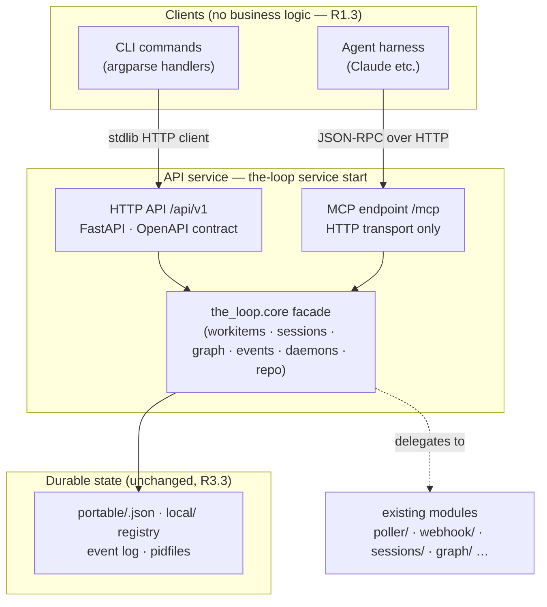

# Design: control plane and API layer for the-loop

> Phase 2 of 3, derived from the locked `requirements.md` (all five open questions
> answered by the owner on PR #162). Delivery is a single PR.

## Overview

the-loop's executable functionality is re-layered into **core → API → clients**
without changing what any capability does. The existing modules (`poller/`,
`webhook/`, `sessions/`, `graph/`, `eventlog`, `workitem`, …) already carry the
behaviour; what is missing is one **explicit, transport-agnostic core surface** over
them, one **HTTP service** exposing that surface, and clients (CLI, MCP) that
consume it. The re-architecture is therefore an *extraction and rewiring*, not a
rewrite (R1.5).

## Architecture



### Package layout

| Path | Layer | Contents |
|------|-------|----------|
| `cli/the_loop/core/` | core | The facade: one module per capability (`workitems`, `sessions`, `graphs`, `events`, `daemons`, `repo`), each a set of plain functions/dataclasses delegating to the existing modules. Importable with no CLI/HTTP context (R1.1). |
| `cli/the_loop/api/` | API | FastAPI `app.py` + one router per capability, `serve.py` (uvicorn entry + exposure guard), `mcp.py` (MCP endpoint). Transport/serialization only — **no in-app auth** (the gateway owns it, owner decision PR #162). |
| `cli/the_loop/client/` | client | Stdlib (`urllib.request`) HTTP client the CLI commands call; reads the same config. No new base-install dependency. |
| `cli/the_loop/commands/service_cmd.py` | client | `the-loop service start\|stop\|status`. |
| `docs/api-specs/openapi/the-loop.v1.yaml` | contract | The authored OpenAPI source of truth (R3.2); a parity test asserts the served schema matches it. |

## Key decisions (recorded in decision-058)

1. **FastAPI, and no extras at all.** Owner-sanctioned (PR #162) for the framework,
   and then superseded on packaging: *"No extras pls. It creates a nightmare when
   installing. All deps get installed when one installs the-loopy-one."* `fastapi`,
   `uvicorn` and the official `mcp` SDK are **required** dependencies, so one
   `pip install the-loopy-one` can always host a service. The previously published
   extra names (`[service]`, `[slack]`, `[config]`) survive as empty no-ops so
   pinned install lines keep resolving. The SDK's floor raises the package to
   Python 3.10+ (3.9 is EOL).
2. **Service-only CLI with auto-start.** Every core-capability command routes
   through the HTTP API (R2.2) — no in-process fallback (R2.3). To preserve the
   one-command UX (R2.1), the CLI auto-starts a local service (same discipline as
   `service start`: pidfile + flock, issue-159's `RunLock`) when none is reachable;
   `service.autoStart: false` disables it. There is nothing to install first.
3. **Local-by-nature exclusions.** Four kinds of command stay local, none of them
   transitional:
   - **Bootstrap** — `install`, `upgrade`, `migrate-config`, `service *`,
     `--version` manage the installation or the service process itself, so they
     must work when no service can exist yet.
   - **`sessions attach`** replaces the caller's terminal with tmux via `execvp`.
     There is nothing to send over HTTP: the deliverable *is* the local process.
   - **`sessions reset`** is the destructive recovery action, and recovery must
     work when the thing being recovered is what is broken.
   - **`poll start` / `gh-webhook start`** run a daemon in the **foreground**,
     which is exactly what cron units and systemd `Type=simple` services depend
     on. The same daemons start and stop *detached* through `/api/v1/daemons` —
     `the_loop.daemon_entry` is the core-owned entry point that path spawns, so
     there is still one daemon startup sequence.

   Everything else routes: work items, sessions (register/list/close and the four
   control verbs), graph (show/status/advance/complete/force/run), check, events,
   scenarios, instructions and critic (list/run).
4. **MCP on the official Python SDK**, mounted on the same app at `/mcp`. The
   hand-rolled JSON-RPC subset this design originally chose was rejected on owner
   review: *"I hope we are using the official python SDK for MCP… Don't want to
   maintain custom implementation. Follow official SDKs."* The protocol is entirely
   `mcp.server.MCPServer`'s; `mcp.py` is only the binding — one thin function per
   tool, registered with `add_tool`, whose input schema the SDK derives from the
   annotations. Transport stays streamable HTTP only, no stdio (owner decision),
   and the SDK's DNS-rebinding protection is left on, pinned to the configured
   bind host. The SDK app is mounted at the app **root** with its own path set to
   `/mcp`, so `/mcp` answers directly rather than 307-ing to `/mcp/` — a redirect
   some MCP clients will not follow on a POST.
5. **UI: descoped from this work item** (owner decision on PR #162 — services,
   CLI and MCP only). The Vite + vanilla-TypeScript design that was built here is
   recorded in this file's history for the follow-up UI work item; nothing under
   `ui/` ships in this PR, and the service sends no CORS headers (no browser
   client to serve — same-origin default denies cross-origin access).
6. **Repo-scoped operations take an explicit `repo` path parameter.** `check`,
   `scenarios`, `instructions`, `critic` are repo-scoped; the CLI passes its cwd.
   The service validates the path exists and is a directory before any core call.
   The purity property of `check` (no network/subprocess/mutation) now holds of the
   **core function**; the CLI↔service hop is transport.

## Components & interfaces

### Core facade (`the_loop/core/`)

Plain functions, typed payloads in/out (dicts/dataclasses), no I/O other than the
stores they already use. Each function is the single implementation its CLI command,
REST route and MCP tool all call (R1.1–R1.4). Surface (v1):

| Module | Operations (delegating to) |
|--------|---------------------------|
| `workitems` | `list()`, `get(ref)` (`WorkItemStore`, portable index) |
| `graphs` | `check(repo, item, recompute)`, `show/status/advance/run/force/complete` (`graph.runtime`) |
| `sessions` | `list()`, `register/attach/close`, `start/pause/resume/stop` (`sessions.registry`, dispatcher), `reset` (**not exposed** over HTTP/MCP — see Security) |
| `events` | `query(filters)` (`eventlog.read_events`) |
| `daemons` | `poller_status/start/stop`, `webhook_status/start/stop` (poll/webhook run paths + `RunLock`) |
| `repo` | `scenarios(repo)`, `instructions(repo)`, `critics(repo)`, `critic_run(repo, name, prompt_file)` |
| `attention` | `list()` — derives "needs attention" (waiting human gates, failed dispatches) from graph state + event log, for R6.3 |

### HTTP API (`/api/v1`)

Contract-first: `docs/api-specs/openapi/the-loop.v1.yaml` is authored; a pytest asserts the
FastAPI-generated schema's paths/methods/operationIds match it (drift fails CI). API
docs are the contract (served at `/api/docs`), never hand-written (R3.2).
Mutations are idempotent per R3.4: lifecycle starts/stops report `already` outcomes
(the `RunLock` discipline), session control verbs re-apply safely (issue-106 path),
and every operation lands in the event log as `api.<op>` (R3.5).

### Service lifecycle (`service_cmd.py`)

`service start` acquires `RunLock` on `<state.root>/local/service.pid`, binds
loopback by default (the exposure guard refuses a non-loopback bind without
`service.exposed`), spawns uvicorn (argv, no shell). `service stop` signals and
waits (issue-159 semantics); `service status` reports. Both are idempotent
(R4.1/R4.3).

### CLI client (`the_loop/client/`)

Resolves base URL from CLI config (`service.host`/`service.port`), performs the
call, maps HTTP errors to today's exit codes/messages. When the service is
unreachable: auto-start if permitted, else fail closed naming
`the-loop service start` (R2.3). No credential is attached — the service carries
no in-app auth.

### MCP (`/mcp`)

Tools mirror the read + manage surface: `list_work_items`, `get_work_item`,
`check_work_item`, `graph_status`, `graph_advance`, `list_sessions`,
`control_session` (start/pause/resume/stop), `query_events`, `daemon_status`.
Excluded: `sessions reset` (destructive, R5.3), `graph force` (operator escape
hatch; requires a human-attributed reason — exposing it to a prompt-injectable
agent would forge that attribution). No in-app auth; same event log
(`mcp.call` events) (R5.2).

### UI — descoped

Removed from this work item on owner review (services, CLI and MCP only). The
`attention` core/API surface it would consume stays; the follow-up UI work item
picks up from the recorded R6 scope.

## Error handling (fail closed)

| Condition | Behaviour |
|-----------|-----------|
| Non-loopback bind without `service.exposed: true` | `service start` refuses to boot |
| Malformed ref / repo path | 400/422 from validation, core never invoked |
| Service unreachable from CLI, auto-start off/impossible | exit 2, message names `the-loop service start` — never an in-process fallback |
| Core rejects a routed call (bad ref, duplicate registration) | 400 → the CLI's exit 2, rendering core's own words |
| Unknown MCP method/tool | JSON-RPC error, no side effect |
| Config schema violation | refused with the replacement named (existing migration discipline) |

## Security design

> Enforces every trust boundary and abuse case from `requirements.md`
> §Security considerations.

- **No in-app authentication** (owner decision, PR #162): a gateway terminates auth
  for any exposed deployment. The service's own boundary is **network scoping** —
  default bind `127.0.0.1`, and `service.exposed: true` required (plus a fronting
  gateway) for any other bind (abuse case 2). No credential is minted, stored, or
  sent, so there is none to leak.
- **Input validation** at the transport edge: refs via the existing
  `workitem` ref parser, repo paths must resolve to existing directories, critic
  invocations remain argv-no-shell through the existing critic runner (abuse case 3).
- **No CORS headers at all** (the UI was descoped, so no browser client is
  served): the browser's same-origin default denies cross-origin access — stricter
  than the pinned allowlist originally specified (abuse case 4, superseded).
- **MCP exclusions** as above (abuse case 5). No API response ever includes webhook
  secrets or any credential; responses are built from the stores, which hold none.
- **Existing ingress boundaries unchanged**: webhook HMAC verification and
  authorized-user gating are untouched by the re-layering (R1.5).

## Data models & config

No new durable stores (R3.3). New CLI-config block (schema-validated, documented
under `docs/config/cli/`):

```yaml
service:
  host: 127.0.0.1        # non-loopback requires exposed: true
  port: 4114
  exposed: false
  autoStart: true        # CLI may boot a local service on demand
```

## Testing strategy

- **TDD per task** (`tdd.mode: standard`); red→green recorded in the execution log.
- **API**: FastAPI `TestClient` (httpx as dev-only dep) per router; the
  exposure-guard and validation-rejection negative tests are the abuse-case tests;
  contract-parity test against `docs/api-specs/openapi/the-loop.v1.yaml`.
- **CLI-as-client**: command tests run against an in-process test service; the
  no-service failure path is a unit test.
- **Lifecycle**: reuse issue-159's lock/idempotency test patterns for
  `service start|stop`.
- **Integration tests** carry Gherkin docstrings with `Requirement:` links.

## UI/UX design artifacts

None ship with this work item — the UI was descoped on owner review (this work
item is backend/CLI/MCP shaped, which per `design.uiArtifacts` produces no visual
artifacts). The prototype built during the design phase lives in this branch's
history for the follow-up UI work item to resurrect.

## Dependency justification (minimalism ladder)

| Dependency | Where | Why not less |
|------------|-------|--------------|
| `fastapi`, `uvicorn` | required | Owner-sanctioned; contract generation, validation, ASGI lifecycle vs. re-implementing on `http.server` |
| `mcp` (official SDK) | required | Owner-directed: follow official SDKs rather than maintain a protocol implementation |
| `slack-sdk` | required | Was the `[slack]` extra; extras are gone, and it has no dependencies of its own |
| `httpx` | dev/test only | required by Starlette's TestClient |

Nothing is optional: extras were removed on owner review, so the ladder's rungs are
"required" or "not present at all".

## Review comments

> Appended by the-loop's `record-feedback` hook when a human gate approves with
> comments. Append-only and attributed.
