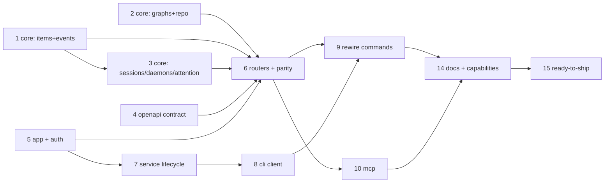

# Tasks: control plane and API layer for the-loop

> Phase 3 of 3, derived from the approved requirements + design. Owner decision on
> PR #162: the whole DAG executes within this **single PR** (no sub-issues). TDD
> invariant: no production code without a failing test that motivates it.

## Task list

- [x] 1. Core facade — `the_loop/core/` (workitems, events)
  - `core/workitems.py` (`list`/`get` over `WorkItemStore` + index),
    `core/events.py` (`query` over `eventlog.read_events`). Typed dict payloads.
  - _Depends on:_ none
  - _Requirements:_ R1.1
  - _Test:_ `cli/tests/test_core_workitems.py`, `test_core_events.py` (red→green)
- [x] 2. Core facade — graphs + repo-scoped ops
  - `core/graphs.py` (`check`, `show/status/advance/run/force/complete`),
    `core/repo.py` (`scenarios`, `instructions`, `critics`, `critic_run`); repo
    path validation helper (exists + is dir → else `ValueError`).
  - _Depends on:_ none
  - _Requirements:_ R1.1
  - _Test:_ `cli/tests/test_core_graphs.py`, `test_core_repo.py`
- [x] 3. Core facade — sessions + daemons + attention
  - `core/sessions.py` (list/register/attach/close/start/pause/resume/stop;
    `reset` deliberately absent from the exposed surface), `core/daemons.py`
    (poller/webhook status·start·stop over `RunLock` paths), `core/attention.py`
    (waiting human gates + failed dispatches from graph state + event log).
  - _Depends on:_ 1
  - _Requirements:_ R1.1, R6.3
  - _Test:_ `cli/tests/test_core_sessions.py`, `test_core_daemons.py`,
    `test_core_attention.py`
- [x] 4. OpenAPI contract — `docs/api-specs/openapi/the-loop.v1.yaml`
  - Author the v1 contract for every endpoint in design §HTTP API.
  - _Depends on:_ none
  - _Requirements:_ R3.2
  - _Test:_ contract file validates (schema-checked in task 6's parity test)
- [x] 5. API app skeleton + auth boundary — `the_loop/api/`
  - FastAPI `app.py`; bearer-token auth dependency (per-boot token file, 0600);
    `[service]` extra in `cli/pyproject.toml` (fastapi, uvicorn; httpx dev-only);
    loopback/exposure guard in `serve.py`; CORS pinned to `service.ui.origins`;
    `service` block in the CLI-config schema + defaults.
  - _Depends on:_ none
  - _Requirements:_ R1.2, R3.1; abuse cases 1, 2, 4
  - _Test:_ `cli/tests/test_api_auth.py` — **negative first**: no/bad token → 401
    before any core call; non-loopback without `exposed` refuses to boot
  - _Note:_ the token auth and CORS built here were later removed — the gateway
    owns auth (decision-059) and the UI descope took CORS with it; the exposure
    guard remains, and the test file now pins that boundary.
- [x] 6. API routers over the core + contract parity
  - Routers: work-items, graph/check, sessions, events, daemons, repo, attention;
    every operation emits `api.<op>` to the event log; parity test: served schema
    paths/methods/operationIds == authored contract.
  - _Depends on:_ 1, 2, 3, 4, 5
  - _Requirements:_ R1.2, R3.1, R3.3, R3.5; abuse case 3
  - _Test:_ `cli/tests/test_api_routers_integration.py` (Gherkin docstrings,
    `Requirement:` links), `test_api_contract_parity.py`
- [x] 7. Service lifecycle — `the-loop service start|stop|status`
  - `RunLock` on `local/service.pid`; token minted per boot; uvicorn spawned as
    argv (no shell); idempotent start/stop/status (issue-159 semantics).
  - _Depends on:_ 5
  - _Requirements:_ R4.1, R4.3
  - _Test:_ `cli/tests/test_service_lifecycle.py` — second start reports
    `already`; stop waits; stale lock recovered
- [x] 8. CLI client seam — `the_loop/client/`
  - Stdlib urllib client: base URL + token resolution, error→exit-code mapping,
    auto-start (config-gated) when unreachable, fail-closed message naming
    `service start` / the `[service]` extra otherwise.
  - _Depends on:_ 7
  - _Requirements:_ R2.2, R2.3
  - _Test:_ `cli/tests/test_client.py` — unreachable + autoStart off → clear
    error, non-zero exit; unreachable + autoStart on → boots then succeeds
- [ ] 9. Rewire core-capability commands through the client
  - `sessions` (register/list/attach/close/start/pause/resume/stop), `check`,
    `graph`, `events`, `scenarios`, `instructions`, `critic`, `poll`,
    `gh-webhook` → client calls; flags/output/exit codes unchanged (R2.1);
    bootstrap commands (`install`, `upgrade`, `migrate-config`, `service`,
    `--version`) stay local; `sessions reset` stays local-only (R5.3 rationale).
  - **Progress:** `check` and `events` route through the service (the pattern:
    routing seam + fail-closed + auto-start + `--file` local escape). Remaining
    commands are the same mechanical seam; every one already _serves_ through
    the API/MCP (the service-side surface is complete) — the outstanding half
    is only their CLI entry points switching transport.
  - _Depends on:_ 6, 8
  - _Requirements:_ R2.1, R2.2, R1.3
  - _Test:_ existing command tests adapted to run against an in-process test
    service; coverage preserved (R2.4)
- [x] 10. MCP endpoint — `/mcp` (HTTP only)
  - Minimal JSON-RPC subset (initialize, tools/list, tools/call) on the same
    app; tool registry generated from the core surface; exclusions per design
    (`sessions reset`, `graph force`); same auth + `mcp.*` event-log records.
  - _Depends on:_ 6
  - _Requirements:_ R5.1, R5.2, R5.3; abuse case 5
  - _Test:_ `cli/tests/test_mcp_integration.py` — tools/list matches registry;
    tools/call round-trips; excluded tools absent; unauth → JSON-RPC error
- [x] 11. ~~UI scaffold — `ui/` (Vite + TypeScript)~~ **DESCOPED** (owner
  decision on PR #162: services, CLI and MCP only). Built, then removed from
  this PR; deferred with R6 to the follow-up UI work item.
- [x] 12. ~~UI views — work items, detail (graph + controls), attention~~
  **DESCOPED** (same decision). The `attention` API surface (T3/T6) ships.
- [x] 13. ~~`the-loop ui dev|build` + CI~~ **DESCOPED** (same decision; the CI
  `ui` job and the command were removed with the frontend).
- [x] 14. Docs + capability folds
  - `docs/cli/commands/service.md` page; `docs/config/cli/service-options.md`;
    capability docs: update `cli.md`, mint `control-plane.md`, update index;
    parity tests stay green. (The `ui.md` page was removed with the UI descope.)
  - _Depends on:_ 9, 10, 13
  - _Requirements:_ NFR Docs
  - _Test:_ existing docs/config parity tests
- [x] 15. Ready-to-ship — reviews, security gate, evidence, briefing
  - Self-review ×3 + critic rounds (config: none runnable → recorded), security
    review vs the abuse-case tests, validation evidence in the execution log,
    PR #162 briefing refreshed. Tier 4: named human security sign-off requested.
  - _Depends on:_ 14, 12
  - _Requirements:_ all (gate)
  - _Test:_ `make check` green (lint, format, typecheck, validate, pytest)

## Dependency graph (DAG)

## Checkpoints

After each task: run its named tests (red→green recorded in the execution log),
tick the checkbox, commit. After T6 and T9: run `make check` (full CI parity).
After T15: the review phase (self/critic + security gate) precedes requesting the
consolidated human review on PR #162.
