# Design: test and verification as nodes in the PDLC

> Phase 2. Derives from the locked [`requirements.md`](requirements.md).
> **D1/D2 revised on [PR #166](https://github.com/MadaraUchiha-314/the-loop/pull/166)**
> at the owner's request: `test-planning` moved before `design-approval` so one human
> gate approves the design and the testing plan together.

## Overview

Two nodes, one new artifact, no new runtime code paths.

```mermaid
flowchart LR
  RD[requirements-definition] --> RA{{requirements-approval}}
  RA --> D[design]
  D --> TPN[["test-planning<br/>produces testing-plan.md"]]
  TPN --> DA
  DA --> TB[tasks-breakdown]
  TB --> IMPL[implementation]
  IMPL --> V[["verification<br/>re-gates testing-plan.md"]]
  V --> SR[self-review]
  SR --> CR[critic-review] --> SEC[security-review] --> EV[evidence]
  EV --> CD[capability-docs] --> RB[reviewer-briefing] --> HA{{human-approval}} --> C[complete]

  style TPN fill:#e8f4ff,stroke:#3b82f6
  style V fill:#e8f4ff,stroke:#3b82f6
```



`testing-plan.md` is authored at `test-planning` and *completed* at `verification` — one
artifact with two gates, exactly the shape `tasks.md` already has (`tasks-breakdown`
writes it, `implementation` re-gates it with `checkmarks: complete`). That symmetry is
the whole design: it needs no new hook, no new resolver, and it inherits the
produce-then-re-gate semantics the runtime, the parity tests and `the-loop check` already
implement.

## Architecture

### D1 — `test-planning` sits between `design` and `design-approval`

The plan is derived from *what must be true* (requirements) and *how it is built*
(design), and `tasks.md` is derived from all three: each task's `_Test:_` names a matrix
row (R1.3). Putting planning after the task DAG would invert that — the plan would be
reverse-engineered from the tasks it is supposed to constrain.

**Revised on PR #166 (owner's call):** the node originally sat *after* `design-approval`.
It now sits before it, so the single human gate approves `design.md` and the plan
together — see D2.

`design.md`'s **Testing strategy** section stays and keeps its gate; its role narrows to
the *strategy in a paragraph* (how requirements map to test levels, which contracts are
involved), while `testing-plan.md` owns the executable detail. The alternative — folding
the plan into `design.md` — was rejected: the artifact has a second life at
`verification`, and an artifact that is edited after implementation cannot also be a
design artifact locked before it.

### D2 — no approval node of its own; the `design-approval` gate covers the plan

**Revised on PR #166.** The original call was "no human gate at all" — the plan would be
locked like every artifact and reviewed on the PR. The owner asked whether the plan could
instead be produced with `design.md` so the design gate covers both, and that is the
better answer: the plan is significant enough to want an explicit human approval, but not
significant enough to earn a sixth stop.

So `test-planning` is ordered **before** `design-approval`, and the gate now:

- reviews **two** artifacts, `design.md` and the `testing-plan.md` derived from it;
- records feedback into **both** (`record-feedback` is declared twice, once per
  artifact) — a reviewer's note about the test matrix belongs in the plan, not filed
  under the design, and travelling-with-the-document is the whole point of the hook;
- routes `changes-requested` back to **`design`**, not to `test-planning`, so a changed
  design re-derives the plan on the way back through. The plan can never be approved
  against a design that moved under it.

The alternative the owner literally proposed — folding the artifact into the `design`
node (`produces: [design.md, testing-plan.md]`, no `test-planning` node) — reaches the
same gate but loses what D4 argues for: the node is what gives the plan a `phase`, a
`loop:test-planning` label, and a `validate-artifacts` call whose `sections:` list is
about *that* artifact. One node producing two artifacts has one sections list for both,
so a missing **Test matrix** and a missing **Architecture** are indistinguishable in the
block message.

### D3 — `verification` re-gates `testing-plan.md`, it does not mint a report

A separate `verification-report.md` would need its own template, its own manifest entry
and its own parity coverage, and would immediately duplicate two things that already
exist: the plan (which says what should run) and the execution log's **Final validation
evidence** (which the later `evidence` node gates). Re-gating the plan keeps plan and
result in one diff — a reviewer reads one file and sees intent beside outcome.

Division of labour with the existing `evidence` node: `verification` **produces** the
raw record (per-activity command, outcome, evidence link); `evidence` **summarises** it
against the acceptance criteria in the execution log (R3.4). `evidence` stops
re-deriving what verification already established.

### D4 — the two nodes carry phases

Both nodes declare a `phase:`, so both appear as `loop:` labels and in the execution
log's front matter. The post-implementation nodes that share the `needs-review` label do
so because they are review *rounds* on the same state; a work item in `test-planning` or
in `verification` is in a materially different state from one in `design` or in
`needs-review`, and the ticket should say so. This is also what makes them *nodes in the
PDLC* in the sense the ticket asks for, rather than hidden sub-steps.

Cost: two new repository labels (`loop:test-planning`, `loop:verification`) that
`/the-loop:init` creates and `/the-loop:upgrade-the-loop` reconciles.

### D5 — the type matrix is a documented catalogue, not a schema enum

The candidate testing types (R2.1) live in the bundled template and in
`reference/testing.md`, not in `harness-config.schema.json`. An enum would have to be
exhaustive to be useful and would make adding "chaos testing" a schema migration; the
matrix is prose an agent fills in, and the gate checks that the *section* exists and is
non-empty, not that a particular row is present. `n/a + reason` (R2.2) is a convention
the template teaches and the reviewer enforces — the same footing as
"no new attack surface is written and justified", which has held since issue-47.

### D6 — the environment is declared, never managed

**Verification environment** is a section of markdown: repositories, services, fixtures,
credentials-by-reference, and the commands. the-loop runs the commands the project
already has; it adds no runner (R5.3). Where an operator has written this down, the plan
links the registered `customInstructions` doc instead of copying it — the loop already
reads those docs at the start of a work item (`reference/instructions.md`), so the
planning stage has them in hand.

## Components & interfaces

| Component | Change | Contract |
|-----------|--------|----------|
| `cli/the_loop/graph/pdlc.yaml` | +2 nodes, edges rerouted, `design-approval` records feedback into both artifacts | `design → test-planning → design-approval → tasks-breakdown`; `implementation → verification → self-review` |
| `skills/the-loop/templates/testing-plan.md` | new | Must satisfy both nodes' required sections (P3) |
| `.the-loop/manifest.yaml` | +2 entries | `testing-plan.md` @ `test-planning`; `evidence/` optional directory |
| `.the-loop/harness-config.schema.json` | phases enum/default; stage defaults | P4 parity |
| `.the-loop/harness-config.yaml`, `templates/harness-config.yaml` | phases; stages | P4 parity |
| `skills/the-loop/templates/{design,tasks,execution-log}.md` | pointers, phase list, transitions row | prose only |
| `SKILL.md`, `reference/{workflow,testing}.md` | render the new sequence | prose only |
| `commands/create-testing-plan.md`, `commands/verify-work.md` | new slash commands | match the nodes' `command:` |
| `commands/{work-on,create-design,create-tasks-plan,execute-tasks}.md` | chain the new steps | prose only |
| `docs/capabilities/*`, `docs/reports/labels-and-dashboards.md`, guide/README | render | prose only |

### Node declarations

```yaml
# ordered between `design` and `design-approval`, so one human gate covers both
- id: test-planning
  phase: test-planning
  actor: agent
  produces: [testing-plan.md]
  command: create-testing-plan
  stage: test-planning
  entry: [set-phase-label, log-entry]
  exit:
    - {hook: validate-artifacts, with: {locked: true, sections: [
        "Test matrix", "Verification environment", "Evidence plan", "Verification results"]}}
    - lint-artifacts

- id: verification
  phase: verification
  actor: agent
  produces: [testing-plan.md]
  command: verify-work
  stage: verification
  entry: [set-phase-label, log-entry]
  exit:
    - {hook: validate-artifacts, with: {checkmarks: complete, sections: ["Verification results"]}}
    - verify-tests
```

Two details are deliberate:

- **`test-planning` gates on `Verification results` too.** The section must *exist* from
  the moment the plan is authored (holding "not yet executed"), because
  `validate-artifacts` treats an empty required section as a finding. Authoring the
  heading up front means `verification` fills a section rather than inventing one, and a
  reader of the locked plan can see the shape of the record it will become.
- **`verification` re-declares `produces`.** `validate-artifacts` returns *skipped* when
  a node declares no artifacts — which is why a node cannot gate on sections it does not
  produce. Declaring the artifact is what makes this gate actually run, rather than
  reporting success without running (the issue-124 failure mode).

`verify-tests` on the verification node is the same no-op-unless-declared hook the
`implementation` node already carries: with no `command` param it records `skipped`. It
is listed so that a future graph revision (or a user-authored graph, once those land) has
the obvious place to bind a project's verification command.

## Data models

`testing-plan.md` front matter mirrors every other spec artifact
(`type`, `phase`, `workItem`, `status`, `approvedBy`, `overrides`), with `phase:
test-planning` — P3 requires the declared phase to be one of the producing nodes'
phases, and `test-planning` is where it is authored.

Body sections (the gated four in bold):

| Section | Written at | Purpose |
|---------|-----------|---------|
| **Test matrix** | test-planning | one row per testing type: applies / `n/a` + reason, scope, where it runs |
| Scenarios & requirement trace | test-planning | matrix rows → requirement ids → Gherkin `Scenario:` titles |
| **Verification environment** | test-planning | repos, services, fixtures, credentials *by reference*, bring-up commands |
| **Evidence plan** | test-planning | what will be captured per activity, and where under `evidence/` |
| Verification activities | test-planning → ticked at verification | the checklist the `checkmarks: complete` gate reads |
| **Verification results** | placeholder at test-planning, filled at verification | per activity: command, outcome, evidence link |
| Review comments | human gates | `record-feedback` |

Evidence lives under `<specDir>/<id>/evidence/`. The manifest tracks it as a directory
pattern, which the parity tests deliberately exclude from the artifact contract (a
`pathPattern` ending in `/` is not a gated file) — the same treatment
`docs/specs/<id>/design/` already gets.

## Error handling

| Situation | Behaviour |
|-----------|-----------|
| `testing-plan.md` absent at `test-planning` | `validate-artifacts` blocks, naming the missing file (existing message) |
| plan not locked | blocks: `status: draft, expected status: approved` |
| a gated section missing **or empty** | blocks per section — this is why the results heading is authored up front |
| an activity left unticked at `verification` | blocks: `n task(s) still unticked` — R3.3's fail-closed |
| an activity that genuinely cannot run | not ticked; the reason goes in **Verification results** and the matrix is edited (with the reason) or the item escalates |
| environment bring-up fails | recorded, activities unexecuted, escalate (R5.4) — the gate stays closed |
| in-flight item with no plan | blocks at `test-planning`; write the plan or use the audited `the-loop graph force` |

## Security design

Enforces the boundaries the requirements raised.

- **AuthN/AuthZ:** unchanged. No node here calls a remote API, and neither new node is a
  human gate, so no approval authority moves.
- **Input validation & injection surfaces:** the only inputs are files inside the
  repository's own spec folder, read through the existing `frontmatter`/`validate-artifacts`
  path. No new parser, no new ingress. The **abuse case** worth naming is the reverse
  direction: a testing plan *names commands an agent will run*, so the plan is
  **executable content** and reviewed as code — the rule `reviews.critics[]` already
  carries (decision-043), restated in `reference/testing.md` and in the template's own
  guidance. the-loop never executes a command from an unreviewed plan: the plan is a
  committed file that arrives through PR review.
- **Secrets handling:** two rules, both stated in the template where the author will
  read them and enforced at review:
  1. **Verification environment** names credentials by **reference** (env var name,
     secret-store key) and never by value.
  2. **Evidence is repository content** — public if the repo is. Redact tokens, cookies,
     personal data and internal hostnames from captured output and screenshots before
     committing; if a capture cannot be redacted, it is not committed and the results
     row says so. A secret that reaches a commit is rotated, not merely edited out.
- **Least privilege:** unchanged; verification runs the project's own commands with the
  permissions the session already has. The plan is where an operator can see, before
  approving, what those commands are.
- **Fail-closed behaviour:** every failure mode in the table above blocks the node. The
  new nodes add no bypass; `security-review` remains `required: true`, and `verification`
  sits *before* the review chain precisely so a failed verification is visible to the
  reviewers rather than discovered after them.
- **Abuse-case coverage:**

  | Abuse case (requirements) | Mechanism | Proving test |
  |---|---|---|
  | secret/PII committed as evidence | redaction rule in the template + review | reviewed, not automated (out of scope) |
  | literal credential in the plan | by-reference rule in the template + review | reviewed |
  | plan smuggles a command | plan is reviewed as executable content on the PR | reviewed |
  | a new node weakens a gate | graph structure | `test_the_verification_gate_is_not_a_skip`, `test_the_shipped_graph_splits_the_needs_review_label`, P1–P4 parity |

## Testing strategy

The change is declarative, so the tests are structural — and the structural tests that
already exist do most of the work, which is the point of adding nodes to a graph that is
already held to its manifest, its templates and its configs:

- **P1–P3 (`test_graph_parity.py`)** cover the new artifact for free: the manifest must
  track `testing-plan.md` at `test-planning`, the graph must accept it, and the bundled
  template must satisfy every gated section of *both* producing nodes.
- **P4** covers the two new phases against both harness configs, in graph order.
- **New unit coverage** in `cli/tests/test_graph_model.py`: both nodes exist, carry
  phases, sit on the expected edges, and — the regression this design specifically
  guards — the `verification` gate is not a silent skip (it declares `produces`).
- **New integration coverage** in `cli/tests/test_graph_verification_integration.py`,
  with Gherkin docstrings per `testing.gherkinDocstrings: required`, driving the real
  hooks over a temporary spec folder: an unticked activity blocks, an empty results
  section blocks, a complete plan passes.

Its own testing plan is [`testing-plan.md`](testing-plan.md) — this work item dogfoods
the artifact it introduces.

## Trade-offs & decisions

| Decision | Alternative rejected | Why |
|---|---|---|
| D1 plan before tasks | after tasks | tasks reference matrix rows; the plan must exist first |
| D2 no approval node | a sixth human gate | `tasks-breakdown` precedent; PR review already covers it |
| D3 re-gate the plan | `verification-report.md` | one artifact, one diff, no new template/manifest/parity surface |
| D4 real phases + labels | reuse `needs-review` | a node the ticket cannot show is not a node in the PDLC |
| D5 catalogue in the template | enum in the schema | adding a testing type must not be a schema migration |
| D6 declare the environment | own a runner | R5.3 — the-loop facilitates verification, it does not own it |

Durable record: [decision-060](../../decisions/decision-060.md).

## Open questions

None outstanding; the three from requirements are resolved as D1–D3.

## Review comments

> Appended by the-loop's `record-feedback` hook when a human gate approves with
> comments (issue-109).
