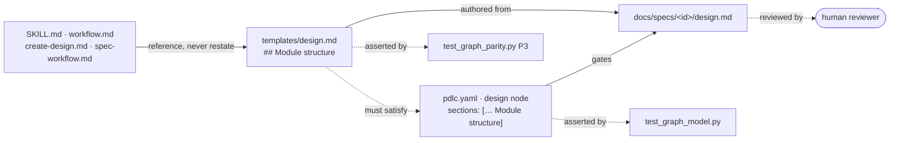

# Design: the module structure a work item will produce

> Phase 2. Derives from [`requirements.md`](requirements.md).

## Overview

Three pieces, and only one of them is code. The **template** gains a `## Module structure`
section carrying the rules for authoring it; the **shipped graph** adds that heading to the
`design` node's existing `validate-artifacts` section list, which is what turns the rule
into a gate; the **operating-model documents** name the section and point at the template
rather than restating it. Two tests pin the pair together.



## Architecture

### The section (R1)

`## Module structure` sits between `Components & interfaces` and `UI/UX design` in
`skills/the-loop/templates/design.md`. The order is the argument: a reader has just learned
*what the components are*, and the next question is *where they live*. Placing it after the
UI block would separate it from the components it maps.

The template asks for three things, in this order:

| Part | Why it is there |
|---|---|
| A **tree** of repository-relative paths, each marked `new` / `changed` / `removed` | Placement is spatial; a tree shows it and a paragraph does not |
| A **table**: path → responsibility (one line) → status → requirement(s) | Makes the tree checkable — a path with no requirement is either scope creep or a missing requirement |
| A **mermaid dependency diagram**, when three or more modules depend on one another | `writingStyle.diagramFirst`. Direction of dependency is the thing a reviewer argues with |

And it states two limits: **scoped to what the work item touches** (the standing view is
`docs/architecture/architecture.md`, and this section is the delta), and **not a second
`Components & interfaces`** — that section carries responsibility and contract, this one
carries placement.

### The gate (R2)

One string appended to a list the hook already iterates:

```yaml
  - id: design
    exit:
      - {hook: validate-artifacts, with: {locked: true, sections: ["Architecture", "Module structure", "Security design", "Testing strategy"]}}
```

`validate-artifacts` already treats a missing required section as a finding **and an empty
one as a separate finding** (`hooks/artifacts.py`), so "TBD" under the heading is the only
way to tick the box, and that is visible to a reviewer. No hook changes.

This is the whole reason the change is not just a template edit. The-loop's own record is
that a rule stated in prose and gated nowhere goes missing: issue-124 (a gate that resolved
to nothing and reported success) and issue-148 (prose and graph drifting apart) are both in
this file's blast radius, and both were fixed by making the graph the authority.

### The documents (R3)

Four documents gain one line each — `skills/the-loop/SKILL.md`, `reference/workflow.md`,
`commands/create-design.md`, `docs/capabilities/spec-workflow.md` — naming the section and
pointing at the template for the rules. Nothing restates the rules; the template is the
single source of truth for how to author it.

## Components & interfaces

**`skills/the-loop/templates/design.md`** — in: an agent authoring a design. Out: the
section scaffold and the rules for filling it. Interface: markdown headings, read by
`validate-artifacts` through `graph.frontmatter.sections`.

**`cli/the_loop/graph/pdlc.yaml`** — in: the graph loader. Out: the `design` node's exit
chain. Interface: the declarative `validate-artifacts` `with.sections` list. No Python
changes anywhere in `cli/`.

**`cli/tests/test_graph_model.py`** — in: the shipped graph. Out: pass/fail on the design
gate's section set, matching the shape already used for the `test-planning` gate.

**`cli/tests/test_graph_parity.py`** (unchanged) — P3 already walks every gated section of
every producing node and asserts the bundled template offers it, using the gate's own
heading parser. Adding a section to the graph without adding it to the template turns this
test red with no edit to the test itself.

## UI/UX design

N/A — no user-facing surface. The change is a markdown template, a YAML list entry and
documentation; `design.uiArtifacts` produces nothing for docs/process work.

## Module structure

The delta this work item adds to the repository. Nothing new is created: every path already
exists, and the change is one section, one list entry, one test class and the documents that
name them.

```text
the-loop/
├── skills/the-loop/
│   ├── templates/design.md              changed   the section + its authoring rules
│   ├── SKILL.md                         changed   one line in the artifact chain
│   └── reference/workflow.md            changed   one line in the design-phase entry
├── commands/create-design.md            changed   the command derives the section
├── cli/the_loop/graph/pdlc.yaml         changed   "Module structure" in the design gate
├── cli/tests/
│   ├── test_graph_model.py              changed   the design gate's section set is asserted
│   └── test_graph_parity.py             unchanged P3 covers template↔gate agreement already
└── docs/
    ├── capabilities/spec-workflow.md    changed   current behaviour + history row
    ├── decisions/decision-064.md        new       why the section is gated, not advisory
    ├── decisions/decisions.md           changed   index row
    └── specs/issue-164/                 new       this work item's spec chain and evidence
```

| Path | Responsibility | Status | Requirement |
|---|---|---|---|
| `skills/the-loop/templates/design.md` | Carries the section and the rules for authoring it — the single source of truth | changed | R1.1–R1.6 |
| `cli/the_loop/graph/pdlc.yaml` | Makes the section a gate condition of the `design` node | changed | R2.1, R2.2 |
| `cli/tests/test_graph_model.py` | Asserts the design gate demands the section, so a future edit that drops it is red | changed | R2.1 |
| `cli/tests/test_graph_parity.py` | Asserts the bundled template can satisfy every gated section (pre-existing, no edit) | unchanged | R2.3 |
| `skills/the-loop/SKILL.md`, `reference/workflow.md`, `commands/create-design.md` | Name the section where an agent looks for the design phase; reference the template for the rules | changed | R3.1, R3.2, R3.4 |
| `docs/capabilities/spec-workflow.md` | Records the section as current behaviour of the spec workflow, with a history row | changed | R3.3 |
| `docs/decisions/decision-064.md` | Records why the section is gated rather than advisory, and why it is not a new artifact | new | R2.1 |

No dependency diagram: the modules above have no runtime dependency on one another — the
YAML is data read by an existing loader, and the rest is prose. The one relationship worth
drawing is template↔gate, and it is in the Overview.

## Data models

None. No schema key, no config option, no persisted state. The section is markdown, and the
gate condition is a string in a list the graph loader already parses.

Adding a config knob (`design.moduleStructure.required`) was considered and rejected under
the minimalism ladder: it would be a switch for turning off a gate nobody has asked to turn
off, and every gated section of every other node is unconditional today.

## Error handling

- **Section missing:** `validate-artifacts` blocks the `design` node with
  `required section is missing: Module structure`, pathed at the spec file. Existing
  behaviour, existing message.
- **Section present but empty:** blocks with `required section is empty: Module structure`.
  This is why R1.6 exists — a work item that changes no code writes one sentence saying so
  rather than leaving the heading bare.
- **Template drifts from the graph:** `test_graph_parity.py` P3 fails with the node id and
  the section name.
- **A pre-existing spec has no such section:** nothing happens. Gates run when a node runs,
  so the twenty-odd designs already in `docs/specs/` are not retro-fitted and no build goes
  red over history.

## Security design

Every boundary from the requirements' threat-model-lite, and the mechanism enforcing it.

- **AuthN/AuthZ:** none. Nothing added here is reachable at runtime by any actor; the gate
  runs in the same local process that already reads the spec directory.
- **Input validation & injection surfaces:** none added. The only ingress is the heading
  match `validate-artifacts` already performs — a string comparison against parsed headings,
  with no path resolution, no shell, no network. Paths listed in the tree are **displayed
  text**: nothing in this change reads, opens, globs or fetches them, so a hostile path
  string in a design document has nowhere to go.
- **Secrets handling:** none touched. The section carries source paths; the existing
  redaction rule for committed artifacts covers what may not appear in one, unchanged.
- **Least privilege:** the added YAML value is data, not an argv — unlike `reviews.critics[]`,
  nothing here becomes a subprocess.
- **Fail-closed behaviour:** a missing or empty section blocks the node. The condition is
  appended to an existing `validate-artifacts` call rather than to any new branch, so there
  is no code path in which the new check can be skipped while the gate still reports
  success — the issue-124 failure mode, avoided by construction.
- **Abuse-case coverage:**
  - *A path listing leaks an internal hostname or credential path* → the tree is
    repository-relative source paths, the redaction rule applies as it does to every
    committed artifact, and no code consumes the value. Negative expectation, proved by
    inspection of the diff: `cli/` gains no statement that touches a listed path.
  - *The section becomes a box to tick* → the empty-section finding makes "TBD" the only
    way through, and it is visible to the reviewer at the gate. Negative test: T8 asserts
    that an empty section blocks.
  - *The gate blocks a legitimate no-code work item* → R1.6, and T8's docs-only case.
- **Effective risk tier 3** — `human-approves-pr`, no named security sign-off
  (`security.review.humanSignOffMinTier: 4`). No `autonomy.sensitivePaths` entry is touched.

## Testing strategy

R1 → the parity test P3, which reads the shipped template through the gate's own heading
parser, plus review for the section's content. R2 → a new assertion in
`test_graph_model.py` for the design gate's section set, and a hook-level case proving a
missing and an empty section each block. R3 → review; a documentation line is not a
mechanical claim, and asserting the wording of four prose files is the kind of gate people
route around. R4 → this design's own `## Module structure` section is the first instance,
and the reviewer's read of it is the evidence.

Evidence: `pytest`, `ruff`, `pyright`, `markdownlint` and `make validate` output committed
under `evidence/`.

Executable detail: [`testing-plan.md`](testing-plan.md).

## Trade-offs & decisions

- **Gated, not advisory** ([decision-064](../../decisions/decision-064.md)). The cost is a
  hard stop on a design that omits the section, including for work items whose structure is
  a single file. The alternative — a template section nothing checks — is the shape that
  produced issue-124 and issue-148, and this repository has paid for it twice.
- **A section of `design.md`, not a new artifact.** A `module-structure.md` would need its
  own node, its own lock and its own gate to say what one heading says. The artifact chain
  is long enough that adding a link needs a stronger reason than tidiness.
- **In the design phase, not the tasks phase.** `tasks.md` describes work, and by then the
  reviewer has already approved the shape. Placement is a design decision, so it is reviewed
  at the design gate.
- **No config knob.** See Data models.
- **Existing specs are not retro-fitted.** Gates run forward. Re-authoring twenty designs to
  satisfy a new heading would edit the historical record for a green build — the same abuse
  case issue-165 wrote a test to prevent.

## Open questions

None. Raised on the PR if the reviewer disagrees with the placement of the section within
the template.

## Review comments

> Appended by the-loop's `record-feedback` hook when a human gate approves with
> comments (issue-109). Append-only and attributed: an approval never silently
> discards a reviewer's suggestions, and the feedback travels with the document
> it concerns rather than living in a side-channel tracker.
