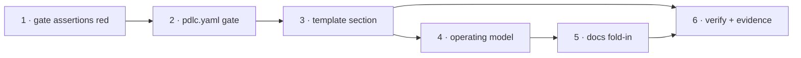

# Tasks: the module structure a work item will produce

> Derived from [`design.md`](design.md) and [`testing-plan.md`](testing-plan.md).
> TDD invariant (`tdd.mode: standard`): the graph assertions land first and red — the gate
> is the change, so the test that names the gate comes before the YAML that satisfies it.

## Task list

- [x] 1. Land the design-gate assertions red
  - `test_graph_model.py`: the `design` node's `validate-artifacts` section set, and a
    hook-level pair proving a missing section and an empty section each block
  - _Depends on:_ none · _Requirements:_ R2.1, R2.2
  - _Test:_ `T1, T3 — pytest test_graph_model.py test_graph_hooks.py` (red: the graph does
    not gate the section yet)
- [x] 2. Gate the section in the shipped graph
  - One string in the `design` node's `validate-artifacts` `with.sections`
  - _Depends on:_ 1 · _Requirements:_ R2.1, R2.2
  - _Test:_ `T1` (green); `T2 — test_graph_parity.py` P3 goes red until task 3 lands
- [x] 3. Add `## Module structure` to the bundled design template
  - The tree, the table, the dependency-diagram rule, the two limits (scoped to the delta;
    not a second `Components & interfaces`), and the no-code-change case
  - _Depends on:_ 2 · _Requirements:_ R1.1–R1.6, R4.2
  - _Test:_ `T2` (green)
- [x] 4. Name the section in the operating model
  - `skills/the-loop/SKILL.md`, `reference/workflow.md`, `commands/create-design.md` —
    one line each, pointing at the template for the rules
  - _Depends on:_ 3 · _Requirements:_ R3.1, R3.2, R3.4
  - _Test:_ `T13 — manual read`; `make lint`
- [x] 5. Fold in the docs
  - `docs/capabilities/spec-workflow.md` (current behaviour + history row),
    `docs/decisions/decision-064.md` + index
  - _Depends on:_ 4 · _Requirements:_ R3.3
  - _Test:_ `make lint`
- [x] 6. Execute `testing-plan.md` and commit the evidence
  - _Depends on:_ 3, 5 · _Requirements:_ all
  - _Test:_ `T1, T2, T3, T8, T12, T13`

## Dependency graph (DAG)

## Checkpoints

After task 1 (red recorded), after task 3 (`make test` green — the graph and the template
agree again), after task 5 (`make check` clean) and after task 6 (evidence committed). Then
the review chain. Risk tier 3 — completion waits for human approval on the PR.

## Review comments

> Appended by the-loop's `record-feedback` hook when a human gate approves with
> comments (issue-109).
