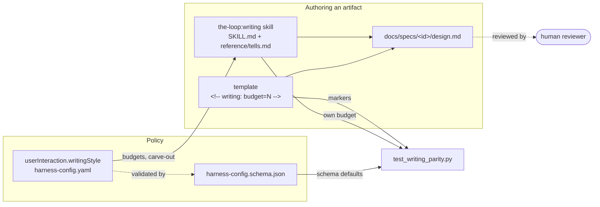

# Design: write the-loop's artifacts for a human reader

> Phase 2. Derives from [`requirements.md`](requirements.md). Prior art and rejected
> options: [`brainstorm.md`](brainstorm.md).

## Overview

Four pieces. A **skill** carries the judgement, a **config block** the policy, **template
markers** put the budget where the author is already looking, and a **parity test** catches
the drift prose cannot.



## Architecture

### The skill (R1)

A second bundled skill beside `skills/the-loop/`. Both harnesses discover every directory
under `skills/` (`.cursor-plugin/plugin.json` declares `"skills": "./skills/"`; Claude Code
auto-discovers), so a new directory is the whole installation step. Namespaced by the
plugin, it resolves as `the-loop:writing`.

Two files, the shape both surveyed skills converged on:

| File | Role | Budget |
|---|---|---|
| `skills/writing/SKILL.md` | The contract: reader, spine, budgets, diagram-first, carve-out, revise pass | 600 words |
| `skills/writing/reference/tells.md` | The catalogue of tells, tiered P0/P1/P2, each with a fix | none (reference) |

`skills/the-loop/SKILL.md` gains one operating-principle bullet pointing here, and no copy
of the rules: single-source-of-truth applies to the-loop's own documents too.

### The config block (R5)

`userInteraction.writingStyle`, beside `prSummary` and `educateUser` — this is what the
human sees, which is what `userInteraction` already means.

```yaml
userInteraction:
  writingStyle:
    enabled: true
    skill: the-loop:writing
    diagramFirst: true
    budgets:                    # prose words; 0 = unbudgeted
      requirements: 500
      design: 900
      testingPlan: 400
      tasks: 400
      brainstorm: 0
      executionLog: 0
      prBriefing: 400
      decision: 400
      capability: 700
      comment: 200
    formalRegisters:            # never relaxed into informal prose
      - ears-acceptance-criteria
      - abuse-cases
      - api-contracts
      - schema-descriptions
      - rfc-2119
```

Both copies change: `.the-loop/harness-config.yaml` (this repo's own) and
`skills/the-loop/templates/harness-config.yaml` (what `/the-loop:init` scaffolds).

**What counts.** Prose words only. Front-matter, headings, tables, fenced code, mermaid
blocks, blockquote callouts and EARS criteria are excluded — including the wrapped
continuation lines of a criterion, so the budget can never pressure an author into
shortening a contract.

**Advisory, not blocking.** `tokenEconomy`'s stance, for `test_docs_parity`'s reason: a
gate that misfires is one people route around. Over budget is a review comment, not a red
build.

### Template markers (R2)

Each budgeted template gains one HTML comment near the top:

```markdown
<!-- writing: budget=500 skill=the-loop:writing -->
```

Invisible when rendered, greppable, and where the author already is. The schema default
and the marker are two statements of one number, so the test holds them together.

### The parity test (R5)

`cli/tests/test_writing_parity.py`, modelled on `test_docs_parity.py` — filesystem reads,
no network, no subprocess, skipped when `skills/` is absent.

| # | Assertion | Defect it catches |
|---|---|---|
| P1 | The writing skill exists with `name` + `description` front-matter | The skill is renamed or dropped and nothing notices |
| P2 | Every budgeted template carries a well-formed `<!-- writing: budget=N -->` marker | A template is added with no budget |
| P3 | Marker values equal the schema's `writingStyle.budgets` defaults | The two numbers drift apart |
| P4 | `SKILL.md`'s own prose is within its declared budget | The contract stops obeying itself |
| P5 | No P0 tell appears in shipped prose (`skills/`, `commands/`, `rules/`, `README.md`, `docs/` minus the historical and generated trees) | Chatbot tics reach a user-facing document |
| P6 | Each template's own prose fits the budget it declares | A budget the empty scaffold already busts |

P3's template→schema-key mapping is an explicit dict, not inferred from filenames:
`testing-plan.md` → `testingPlan` needs a convention nobody else has. The expected skill
name is read from the schema's `writingStyle.skill` default rather than hardcoded, so
renaming the skill is one edit.

P5 is deliberately narrow. The survey's own warning — over 60% false positives on
non-native speakers — is why only unambiguous tells are asserted: chatbot artifacts, the
"delve into" family, cutoff disclaimers, emoji in headings. Word-tier lists stay in
`tells.md` as judgement, not in the test as a rule.

## Components & interfaces

**`skills/writing/SKILL.md`** — in: an artifact being authored or revised. Out: the rules.
Interface: Agent Skills front-matter; the `description` decides whether the skill fires,
so it names the artifacts by filename.

**`skills/writing/reference/tells.md`** — the tiered catalogue, loaded only for a revise
pass so it stays out of the default window (`tokenEconomy.progressiveDisclosure`).

**`test_writing_parity.py`** — in: `skills/`, `commands/`, `rules/`, `docs/` (minus the
historical and generated trees), `README.md`, the schema. Out: pass/fail. No fixtures.

**Word counter** — a module-level helper in the test. Kept private because nothing else
needs it (minimalism ladder: inline over new abstraction).

## Data models

One schema addition under `userInteraction` (`additionalProperties: false`, so the block
must be declared to be accepted):

| Key | Type | Default |
|---|---|---|
| `writingStyle.enabled` | boolean | `true` |
| `writingStyle.skill` | string | `the-loop:writing` |
| `writingStyle.diagramFirst` | boolean | `true` |
| `writingStyle.budgets.<artifact>` | integer ≥ 0 | per the table above |
| `writingStyle.formalRegisters[]` | enum array | the five registers |

## Error handling

- A malformed marker fails P2 rather than being skipped — R5's fail-closed criterion.
  Silent skipping is how issue-124's gate reported success without running.
- A missing budgeted template fails P2; the mapping is the source of truth.
- `writingStyle` absent from a project's config: the schema's defaults are the contract,
  so absence and default are the same state.

## Security design

- **AuthN/AuthZ:** none. Nothing here is reachable at runtime.
- **Input validation & injection surfaces:** the test reads repository files with
  `Path.read_text()` and matches literal regexes. No `eval`, subprocess, network or user
  input.
- **Secrets handling:** none touched. P5 scans for style tells, not credentials — secret
  scanning and the security-review gate keep that job.
- **Least privilege:** the added config keys are declarative. Unlike `reviews.critics[]`,
  no value here becomes an argv.
- **Fail-closed behaviour:** an unparseable marker fails; an unknown budget key is rejected
  by `additionalProperties: false`.
- **Abuse-case coverage:**
  - *A style pass rewrites a record.* Defeated by the skill's protected-content rule
    (quoted material, code, evidence and third-party text are out of scope for a revise
    pass) and by the catalogue being guidance, never an automated rewriter. Negative test:
    P5's scan excludes `docs/specs/` and `evidence/`, so a historical record cannot be
    "fixed" into a green build.
  - *A budget is met by deleting a gated section.* Defeated by the gates, which are
    unchanged: the requirements node still demands `## Security considerations`, and an
    empty one still fails. The skill states the rule explicitly.
- **Effective risk tier: 4** — both `.the-loop/harness-config.yaml` and its schema are in
  `autonomy.sensitivePaths`, so `inferFromChange` raises 3 to 4:
  `human-approves-pr`, plus a named human security sign-off
  (`security.review.humanSignOffMinTier: 4`). Requested in the PR briefing.

## Testing strategy

R1 → P1. R2 → P2, P3. R3 → review, not the test — "should this be a diagram?" is exactly
the judgement R5.3 says not to assert; this design carries one. R4 → the carve-out list is
read from the schema by P3. R5 → the whole file. Evidence: `pytest`, `ruff`, `pyright` and
`markdownlint` output committed under `evidence/`.

Executable detail: [`testing-plan.md`](testing-plan.md).

## Trade-offs & decisions

- **A skill, not a `reference/writing.md`.** The ticket asks for a skill, and a skill is
  separately invocable — an author can run `the-loop:writing` on a README unrelated to a
  work item. Cost: two skills to keep in step, mitigated by the-loop's holding no copy of
  the rules. decision-061.
- **Register the surveyed skills, do not vendor them.** decision-062.
- **Budgets advisory.** Argued above; the reviewer is asked to confirm (open question 1).
- **P5 narrow by construction.** The surveyed ban-lists would flag legitimate technical
  prose across this repository on day one.

## Open questions

Carried from requirements; raised on the PR.

## Review comments

> Appended by the-loop's `record-feedback` hook when a human gate approves with
> comments (issue-109).
