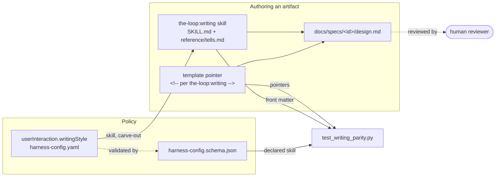

# Design: write the-loop's artifacts for a human reader

> Phase 2. Derives from [`requirements.md`](requirements.md). Prior art and rejected
> options: [`brainstorm.md`](brainstorm.md).
>
> **Revised in review (PR #168):** the budgets this design originally specified were
> rejected by the owner and removed. See [decision-061](../../decisions/decision-061.md)
> §D2.

## Overview

Four pieces. A **skill** carries the judgement, a **config block** the policy, a **pointer
in each template** puts the contract where the author is already looking, and a **parity
test** catches the drift prose cannot. No piece carries a length limit.



## Architecture

### The skill (R1)

A second bundled skill beside `skills/the-loop/`. Both harnesses discover every directory
under `skills/` (`.cursor-plugin/plugin.json` declares `"skills": "./skills/"`; Claude Code
auto-discovers), so a new directory is the whole installation step. Namespaced by the
plugin, it resolves as `the-loop:writing`.

Two files, the shape both surveyed skills converged on:

| File | Role |
|---|---|
| `skills/writing/SKILL.md` | The contract: reader, spine, density test, diagram-first, carve-out, revise pass |
| `skills/writing/reference/tells.md` | The catalogue of tells, tiered P0/P1/P2, each with a fix; loaded only for a revise pass |

`skills/the-loop/SKILL.md` gains one operating-principle bullet pointing here, and no copy
of the rules: single-source-of-truth applies to the-loop's own documents too.

### The config block (R5)

`userInteraction.writingStyle`, beside `prSummary` and `educateUser` — this is what the
human sees, which is what `userInteraction` already means.

```yaml
userInteraction:
  writingStyle:
    enabled: true
    skill: the-loop:writing
    diagramFirst: true
    # No length limits, deliberately (decision-061 §D2).
    formalRegisters:            # never relaxed into informal prose
      - ears-acceptance-criteria
      - abuse-cases
      - api-contracts
      - schema-descriptions
      - rfc-2119
```

Both copies change: `.the-loop/harness-config.yaml` (this repo's own) and
`skills/the-loop/templates/harness-config.yaml` (what `/the-loop:init` scaffolds).

**No numbers, on purpose.** The first draft of this design specified per-artifact word
budgets. They were rejected in review, and the implementation had already made the case:
`tasks: 200` was unreachable from its own empty template, and the PR briefing ran ~530
against 400 while carrying only the education the R10 gate requires. A number renegotiated
by every artifact that meets it is not a policy. What replaces it is the **density test** —
can a sentence come out without losing information — which is scope-independent and is what
a reviewer judges anyway.

### Template pointers (R2)

Each template producing a human-read artifact gains one HTML comment near the top, naming
the skill that governs it and summarising the contract in four lines. Invisible when
rendered, greppable, and where the author already is. An author starting from the template
is governed without having to know the skill exists.

### The parity test (R5)

`cli/tests/test_writing_parity.py`, modelled on `test_docs_parity.py` — filesystem reads,
no network, no subprocess, skipped when `skills/` is absent.

| # | Assertion | Defect it catches |
|---|---|---|
| P1 | The writing skill exists with `name` + `description` front-matter | The skill is renamed or dropped and nothing notices |
| P2 | Every human-read template points at the writing skill | A template is added with no contract |
| P3 | The pointer names the skill the schema declares, and no length limits have returned | The two drift apart; budgets creep back in unremarked |
| P4 | No P0 tell appears in shipped prose (`skills/`, `commands/`, `rules/`, `README.md`, `docs/` minus the historical and generated trees) | Chatbot tics reach a user-facing document |

P3 reads the expected skill name from the schema's `writingStyle.skill` default rather than
hardcoding it, so renaming the skill is one edit. Its second half asserts that
`writingStyle.budgets` is absent: re-adding length limits should be a decision someone
records, not a detail that arrives beside an unrelated schema edit.

P4 is deliberately narrow. The survey's own warning — over 60% false positives on
non-native speakers — is why only unambiguous tells are asserted: chatbot artifacts, the
"delve into" family, cutoff disclaimers, emoji in headings. Word-tier lists stay in
`tells.md` as judgement, not in the test as a rule.

## Components & interfaces

**`skills/writing/SKILL.md`** — in: an artifact being authored or revised. Out: the rules.
Interface: Agent Skills front-matter; the `description` decides whether the skill fires,
so it names the artifacts by filename.

**`skills/writing/reference/tells.md`** — the tiered catalogue, loaded only for a revise
pass so it stays out of the default window (`tokenEconomy.progressiveDisclosure`).

**`test_writing_parity.py`** — in: `skills/`, `commands/`, `rules/`, `docs/` (minus the
historical and generated trees), `README.md`, the schema. Out: pass/fail. No fixtures.

## Data models

One schema addition under `userInteraction` (`additionalProperties: false`, so the block
must be declared to be accepted):

| Key | Type | Default |
|---|---|---|
| `writingStyle.enabled` | boolean | `true` |
| `writingStyle.skill` | string | `the-loop:writing` |
| `writingStyle.diagramFirst` | boolean | `true` |
| `writingStyle.formalRegisters[]` | enum array | the five registers |

## Error handling

- A missing or wrong-skill pointer fails P2/P3 rather than being skipped — R5's
  fail-closed criterion. Silent skipping is how issue-124's gate reported success without
  running.
- A missing human-read template fails P2; the list in the test is the source of truth.
- `writingStyle` absent from a project's config: the schema's defaults are the contract,
  so absence and default are the same state.

## Security design

- **AuthN/AuthZ:** none. Nothing here is reachable at runtime.
- **Input validation & injection surfaces:** the test reads repository files with
  `Path.read_text()` and matches literal regexes. No `eval`, subprocess, network or user
  input.
- **Secrets handling:** none touched. P4 scans for style tells, not credentials — secret
  scanning and the security-review gate keep that job.
- **Least privilege:** the added config keys are declarative. Unlike `reviews.critics[]`,
  no value here becomes an argv.
- **Fail-closed behaviour:** a missing or wrong-skill pointer fails; an unknown key under
  `writingStyle` is rejected by `additionalProperties: false`.
- **Abuse-case coverage:**
  - *A style pass rewrites a record.* Defeated by the skill's protected-content rule
    (quoted material, code, evidence and third-party text are out of scope for a revise
    pass) and by the catalogue being guidance, never an automated rewriter. Negative test:
    P4's scan excludes `docs/specs/` and `evidence/`, so a historical record cannot be
    "fixed" into a green build.
  - *A document is shortened by deleting a gated section.* Defeated by the gates, which are
    unchanged: the requirements node still demands `## Security considerations`, and an
    empty one still fails. The skill states the rule explicitly.
- **Effective risk tier: 4** — both `.the-loop/harness-config.yaml` and its schema are in
  `autonomy.sensitivePaths`, so `inferFromChange` raises 3 to 4:
  `human-approves-pr`, plus a named human security sign-off
  (`security.review.humanSignOffMinTier: 4`). Requested in the PR briefing.

## Testing strategy

R1 → P1. R2 → P2, P3. R3 → review, not the test — "should this be a diagram?" is exactly
the judgement R5.3 says not to assert; this design carries one. R4 → the carve-out list is
read from the schema by P3. R5 → the whole file. Evidence: `pytest`, `ruff`, `pyright` and
`markdownlint` output committed under `evidence/`.

Executable detail: [`testing-plan.md`](testing-plan.md).

## Trade-offs & decisions

- **A skill, not a `reference/writing.md`.** The ticket asks for a skill, and a skill is
  separately invocable — an author can run `the-loop:writing` on a README unrelated to a
  work item. Cost: two skills to keep in step, mitigated by the-loop's holding no copy of
  the rules. decision-061.
- **Register the surveyed skills, do not vendor them.** decision-062.
- **No length limits.** Proposed, implemented, then rejected in review — decision-061 §D2
  carries the reasoning and the evidence.
- **P4 narrow by construction.** The surveyed ban-lists would flag legitimate technical
  prose across this repository on day one.

## Open questions

Carried from requirements; raised on the PR.

## Review comments

> Appended by the-loop's `record-feedback` hook when a human gate approves with
> comments (issue-109).
