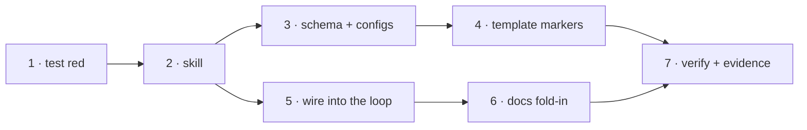

# Tasks: write the-loop's artifacts for a human reader

> Derived from [`design.md`](design.md) and [`testing-plan.md`](testing-plan.md).
> TDD invariant (`tdd.mode: standard`): the parity test lands first and red.

## Task list

- [x] 1. Land `cli/tests/test_writing_parity.py` red
  - P1–P5 plus the private word counter
  - _Depends on:_ none · _Requirements:_ R5.2, R5.3
  - _Test:_ `T1 — pytest cli/tests/test_writing_parity.py` (red: no skill yet)
- [x] 2. Author `skills/writing/SKILL.md` and `reference/tells.md`
  - Spine, budgets, diagram-first, carve-out, protected content, revise pass
  - _Depends on:_ 1 · _Requirements:_ R1.1, R1.2, R1.3, R3.1, R4.1, R4.2
  - _Test:_ `T1 — P1, P4` (green)
- [x] 3. Add `userInteraction.writingStyle` to the schema and both configs
  - _Depends on:_ 2 · _Requirements:_ R5.1
  - _Test:_ `T10 — make validate`; `T1 — P3`
- [x] 4. Mark the eight budgeted templates
  - requirements, bugfix, design, testing-plan, tasks, pr-briefing, decision, capability
  - _Depends on:_ 3 · _Requirements:_ R2.1, R2.2
  - _Test:_ `T1 — P2, P3` (green)
- [x] 5. Wire the skill into the operating model
  - One bullet in `skills/the-loop/SKILL.md`; the three surveyed skills into `externalTools`
  - _Depends on:_ 2 · _Requirements:_ R1.4
  - _Test:_ `T10 — make validate`
- [x] 6. Fold in the docs
  - `docs/capabilities/writing-style.md` + index, decision-061/062 + index,
    `docs/config/harness-config.md`, `README.md`, site nav
  - _Depends on:_ 5 · _Requirements:_ R1.4, R5.1
  - _Test:_ `T1 — P5`; `make lint`
- [x] 7. Execute `testing-plan.md` and commit the evidence
  - _Depends on:_ 4, 6 · _Requirements:_ all
  - _Test:_ `T1, T8, T10, T11`

## Dependency graph (DAG)

## Checkpoints

After task 1 (red recorded), after task 4 (`make test` green), and after task 7
(`make check` clean, evidence committed). Then the review chain and the security-review
gate. Risk tier 4 — completion waits for the named human approval on the PR.

## Review comments

> Appended by the-loop's `record-feedback` hook when a human gate approves with
> comments (issue-109).
