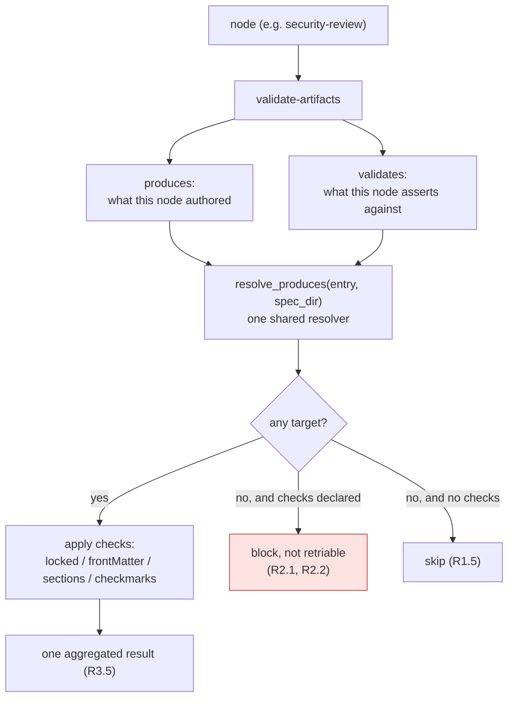

# Design: gating a shared artifact, and failing closed when there is nothing to gate

> Phase 2 of 4. Derived from the locked
> [`requirements.md`](requirements.md). Ticket:
> [issue #167](https://github.com/MadaraUchiha-314/the-loop/issues/167).

## Architecture

**One new hook parameter (`validates:`), one inverted default (checks with no target
block instead of skip), one template section, one parity assertion.** No new hook, no new
node, no schema change, no manifest change.



### The choice: `validates:`, not `produces:`

The ticket enumerates three options. **Option 2 (a new parameter) is taken, with option 3
(fail closed) as its backstop**; option 1 is rejected. The reasoning is recorded in
[decision-063](../../decisions/decision-063.md); the short form:

| Option | Verdict | Why |
|---|---|---|
| 1 — declare `execution-log.md` in `produces:` | rejected | `produces` means *this node authored it*. Six nodes would each claim to author one shared file, and `.the-loop/manifest.yaml` tracks the log with **no `phase`** — which is exactly how P1/P2 decide what is inside the node-artifact contract. It would fail P2, and the repairs on offer are worse than the defect: invent a phase for a six-node artifact, or teach the parity test a special case for a phase-less shared file. It would also drag `lint-artifacts` onto the log, since that hook reads `produces` too. |
| 2 — a `validates:` parameter | **taken** | Keeps `produces` meaning authorship, lets several nodes assert against one shared file, and reuses the existing resolver so alternation and presence semantics cannot drift. New vocabulary in the graph, hence a decision record. |
| 3 — a section gate with no target blocks | **taken, as a backstop** | Fixing the six nodes fixes today. Failing closed is what stops tomorrow's seventh node from shipping inert. It changes `validate-artifacts` semantics, so the sweep below establishes that no shipped node relies on the old behaviour. |

### The sweep option 3 requires

Every `validate-artifacts` in the shipped graph, and what it resolves after this change:

| Node | `produces` | `validates` | Declares checks | Outcome with no files present |
|---|---|---|---|---|
| `brainstorming` | `brainstorm.md` | — | locked, sections | skip (`optional:`, unchanged) |
| `requirements-definition` | `requirements.md\|bugfix.md` | — | locked, sections | block (unchanged) |
| `design` | `design.md` | — | locked, sections | block (unchanged) |
| `test-planning` | `testing-plan.md` | — | locked, sections | block (unchanged) |
| `tasks-breakdown` | `tasks.md` | — | locked, sections | block (unchanged) |
| `implementation` | `tasks.md` | — | checkmarks | block (unchanged) |
| `verification` | `testing-plan.md` | — | checkmarks, sections | block (unchanged) |
| `self-review` … `reviewer-briefing` (6) | — | `execution-log.md` | sections | **block (was: skip)** |

No shipped node reaches the new fail-closed branch — every node either declares
`produces` or gains `validates`. The branch is a floor for future authoring, and the
parity assertion (R4.1) catches the same slip one layer earlier, at test time.

### Components and interfaces

**`cli/the_loop/graph/hooks/artifacts.py`** — the only production file whose behaviour
changes.

```python
#: Params that make `validate-artifacts` an assertion rather than a no-op.
_CHECKS = ("locked", "frontMatter", "sections", "checkmarks")

produced  = resolve_produces(ctx.node.get("produces"), spec_dir)   # authored here
validated = resolve_produces(params.get("validates"), spec_dir)    # asserted against
slots     = produced + validated
```

Three properties follow from routing both through `resolve_produces`, and each is a
reason not to write a second resolver:

- **Alternation for free** — `validates: "a.md|b.md"` means one artifact with two
  accepted names, identical to `produces` (R1.4). The hooks that read `produces` used to
  carry a byte-identical private copy each; that was issue-124 one level down, and the
  shared resolver exists so it cannot recur.
- **Ambiguity fails closed for free** — two files filling one validated slot block with
  the existing "keep one of" finding, for the same reason they do for `produces`.
- **A declared-but-absent target blocks for free** — it takes the existing "required
  artifact is missing" branch (R1.2), naming the file.

Order matters for the message an agent reads: `produced` comes first, so a node with both
reports its own missing artifact before the shared one.

Everything downstream — front-matter, `locked`, `sections`, `checkmarks`, the aggregation
into one result — is untouched and applies uniformly to every resolved path. That is
deliberate: a caller that wanted different checks per target would be describing two
hooks, and can declare two `validate-artifacts` entries in the chain instead.

**`cli/the_loop/graph/pdlc.yaml`** — six nodes gain one line each:

```yaml
  - id: security-review
    actor: agent
    required: true          # never skippable, at any risk tier
    stage: security-review
    entry: [log-entry]
    exit:
      - hook: validate-artifacts
        with:
          validates: execution-log.md
          sections: ["Security review (gate)"]
```

`locked:` is deliberately **not** set on any of them: the execution log is append-only and
in-progress by definition, and its front matter carries `status: in-progress | complete`,
not `approved`.

**`skills/the-loop/templates/execution-log.md`** — gains `## Capability docs`, placed
after `## Final validation evidence` so the template's section order matches the node
order in the chain (`evidence → capability-docs → reviewer-briefing`).

**`cli/tests/test_graph_parity.py`** — gains P5, in the shape of P1–P4.

### Data models

No persisted state changes. `validates` is a hook **parameter**, read from the chain
entry's `with:` mapping — not a node field, so `Node`, `Node.as_mapping()`, the graph
schema, `.the-loop/manifest.yaml` and every serialized run state are untouched. That is
the cheapest place to put it and the one that matches what it means: *this assertion*
reads that file, not *this node* owns it.

`.the-loop/manifest.yaml`'s `execution-log.md` entry keeps no `phase:` (R3.4). P1 and P2
continue to exclude it from the node-artifact contract, and P5 covers it under the new
vocabulary instead.

### Error handling

| Condition | Result | Retriable | Rationale |
|---|---|---|---|
| Validated target absent | `block`, "required artifact is missing" + path | yes | The agent can fix it by writing the file. |
| Two names present for one validated slot | `block`, "keep one of: …" | yes | Unchanged policy; no defined source of truth. |
| Checks declared, no target resolved | `block`, names the misconfiguration | **no** | A graph-authoring fault. Re-running cannot fix it, and a retriable block would burn `maxAttempts` before escalating (R2.2). |
| No checks, no target | `skip` | — | Unchanged (R1.5). |
| Optional node, nothing present | `skip` | — | Unchanged (R2.3) — the node was not entered. |

The misconfiguration finding is addressed to whoever reads it and does not blame the work
item's files:

```text
this node gates on artifact content but names no artifact to read it from —
the graph must declare `produces:` on the node or `validates:` on this hook entry
```

### Testing strategy

Summarised here; the executable plan is [`testing-plan.md`](testing-plan.md).

Three layers, because the defect had to slip past three:

1. **Hook unit tests** (`cli/tests/test_graph_hooks.py`) — the new parameter's behaviour,
   the fail-closed branch, and the unchanged branches pinned so this change cannot move
   them.
2. **Parity assertion** (`cli/tests/test_graph_parity.py` P5) — asserted against the
   **shipped graph**, so it is a test of the real artifact, not of a fixture. It fails
   today, before the graph is edited, which is the check that it tests something.
3. **Integration** (`cli/tests/test_graph_verification_integration.py`) — a Gherkin-
   documented scenario driving `security-review` through a real chain on a temp spec
   directory: blocked without the section, passing with it. That is the acceptance
   criterion of the whole ticket stated as a test.

The regression that matters is a *negative* one: re-running the reproduction script from
the ticket must print nothing.

## Security design

Every boundary the requirements raised, answered.

| Requirement's boundary / abuse case | How the design enforces it |
|---|---|
| **No new trust boundary** | `validates` is read from the shipped graph only. `load_graph` resolves `pdlc.yaml` as package data beside `model.py`, and `_warn_on_repo_graph` ignores a repository-supplied graph with a warning. A work item cannot author the parameter, so it cannot point a gate at a path of its choosing. |
| **Path containment** | Targets are resolved by `resolve_produces`, which joins each name onto `work_item.spec_dir`. The shipped graph declares bare filenames (`execution-log.md`). No traversal is *introduced* by this change; the parameter is exactly as reachable as `produces` already was, and both come from the same non-user-authored file. |
| **Abuse case — a gate that is loud but empty** | Accepted and written down, not silently tolerated: the section check is structural, so placeholder text passes. This is pre-existing and deliberate (`Verification results` is authored up front holding "not yet executed"). The gate proves *the record exists*; the reviewer judges whether the review was any good. Nothing in this change claims otherwise. |
| **Abuse case — a gate reintroduced as inert** | Two independent answers, on purpose: fail-closed at runtime (a section gate with no target blocks) and P5 at test time (a section gate with no target fails CI). Either alone would have caught this defect; both together mean the next one is caught before it ships. |
| **Fail-closed everywhere** | Every new branch blocks. `skip` is returned in strictly fewer situations after this change than before, never more. |
| **Secrets** | Unaffected. No new file is read outside the spec directory, findings carry the-loop's own vocabulary plus repo-relative paths (R3.6), and the execution log is already committed repository content. |

**Human sign-off:** risk tier 3 (`security.review.humanSignOffMinTier: 4`), so no named
security sign-off is required. The change is gated by the PR review.

## Alternatives considered

- **`sections-in:` as the parameter name** — the ticket's own second suggestion. Rejected:
  it names one of the four checks, and the parameter governs all of them (`locked`,
  `frontMatter`, `checkmarks` apply to a validated target too). `validates:` reads as the
  verb the hook performs.
- **A separate hook (`validate-log-sections`)** — rejected by the minimalism ladder
  (`reference/minimalism.md`): it would duplicate front-matter parsing, section
  resolution, aggregation and message vocabulary to gain nothing a parameter does not
  give, and would put the six nodes on a code path the other seven do not exercise.
- **Making `validates` a node field rather than a hook parameter** — rejected: it would
  touch `Node`, `as_mapping()`, run-state serialization and the graph's compile step for a
  value only one hook reads. A hook parameter is where per-assertion configuration already
  lives.
- **Gating the log at every node with one shared entry** — rejected: the sections differ
  per node, and the point of issue-109's split is that each node is separately visible.
- **Fixing only `security-review`** (the `required: true` one) — rejected. The other five
  are the same defect, the fix is one line each, and leaving five inert gates behind would
  make the parity assertion unlandable.
