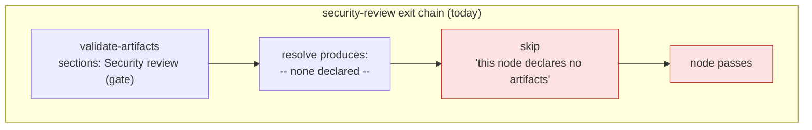

# Bugfix: six graph nodes gate on execution-log sections without declaring an artifact

> Phase 1 of 4 (requirements → design → testing plan → tasks). Ticket:
> [issue #167](https://github.com/MadaraUchiha-314/the-loop/issues/167).

## Introduction

**Six of the-loop's own gates report success without ever running, and one of them is
the `required: true` security review.** `validate-artifacts` resolves what to read from
the node's `produces:`; a node that declares none gets `HookResult.skipped`, and since
[decision-060](../../decisions/decision-060.md) a skip is not a decision — the chain
carries on and the node passes. Six nodes declare `sections:` and no `produces:`, so
their gate never reads anything.

The affected nodes, against the shipped graph (`cli/the_loop/graph/pdlc.yaml`):

| Node | `required` | Gated section | In `templates/execution-log.md`? |
|---|---|---|---|
| `self-review` | false | `Review cycles` | yes |
| `critic-review` | false | `Review cycles` | yes |
| **`security-review`** | **true** | `Security review (gate)` | yes |
| `evidence` | false | `Final validation evidence` | yes |
| `capability-docs` | false | `Capability docs` | **no** |
| `reviewer-briefing` | false | `Pull requests` | yes |

This is the shape [decision-045](../../decisions/decision-045.md) named for issue-124 —
a gate reporting success without ever running — and it is worse here, for two reasons.
First, the graph's own comment on `security-review` says *"never skippable, at any risk
tier"*: it is skippable, and it always skips. Second, these are exactly the six nodes
[issue-109](https://github.com/MadaraUchiha-314/the-loop/issues/109) split out of the
single `needs-review` label **because that is where the measured drift piled up** (23 of
26 execution logs stopped there). Splitting them gave each a name; none of them got a
gate that fires.

The security review itself still happens — the skill, `reference/security.md` and
`execute-tasks` all drive it, and the execution log records it. What is inert is the
*gate* that makes it non-optional. A rule with no working hook drifts; that is
issue-109's thesis, and this is it applied to issue-109's own output.

A latent defect rides along: `capability-docs` gates on a `Capability docs` section that
`skills/the-loop/templates/execution-log.md` does not offer. Today that is invisible
because the node skips. The moment it stops skipping, **every** work item blocks there —
so the template change is not optional follow-up, it has to land in the same change.

### Why this is not a one-line patch

These nodes' output is not a spec artifact. It is *sections of the execution log* — one
file, shared by six nodes, that no node authors alone. `produces:` means "this node
authored it", and `execution-log.md` is tracked in `.the-loop/manifest.yaml` with **no
`phase`**, which is precisely how `cli/tests/test_graph_parity.py`'s P1/P2 decide what is
inside the node-artifact contract. Declaring the log in `produces:` would therefore fail
P2 ("the graph gates an artifact the manifest does not track") and force either a phase
onto a six-node artifact or a special case into the parity test. So the fix is a design
choice; it is taken in `design.md` and recorded as a decision record.

## Requirements

### Requirement 1 — a node can gate a shared artifact it does not author

**User story:** As a graph author, I want a node to assert against a file it did not
produce, so that the six review-chain nodes can gate their own sections of the shared
execution log without claiming to have authored it.

#### Acceptance criteria (EARS)

1. WHEN a `validate-artifacts` exit hook declares a target artifact that is not the
   node's `produces` THEN the hook SHALL resolve that artifact against the work item's
   spec directory and apply every declared check (`sections`, `locked`, `frontMatter`,
   `checkmarks`) to it.
2. WHEN such a target is declared and the named file is absent THEN the hook SHALL
   `block` with a finding naming the missing file — never `skip`.
3. WHEN a node declares both `produces:` and a validation target THEN the hook SHALL
   check **both**, reporting every finding from both in one result (R3.5 aggregation is
   preserved).
4. The target SHALL accept the same alternation as `produces` (`a.md|b.md` = one
   artifact, several accepted names) and SHALL be resolved by the same shared resolver,
   so the two cannot drift apart.
5. WHERE a node declares no `produces:` and no validation target and no content checks,
   the hook SHALL continue to `skip` — an unchanged no-op stays a no-op.

### Requirement 2 — a gate with nothing to read fails closed

**User story:** As a maintainer of the graph, I want a section gate that resolves to no
file to block rather than skip, so that this defect cannot be reintroduced silently by a
future authoring slip.

#### Acceptance criteria (EARS)

1. WHEN `validate-artifacts` declares any content check (`sections`, `locked`,
   `frontMatter` or `checkmarks`) AND resolves **no** artifact to check it against THEN
   the hook SHALL `block`, and the finding SHALL name the misconfiguration rather than
   blame the work item's files.
2. WHEN that block is returned THEN it SHALL be marked **not retriable**: re-running the
   node cannot fix a graph-authoring fault, and a retriable block would burn
   `maxAttempts` before escalating.
3. The existing `optional:` behaviour SHALL be unchanged: an optional node whose
   artifacts are all absent is a node that was not entered, and still skips
   (`brainstorming`).
4. WHEN a node declares `produces:` but the artifact is missing THEN the finding SHALL
   remain byte-identical to today's (`required artifact is missing`) — the message an
   agent reads is a contract.

### Requirement 3 — the six nodes gate the execution log, and the template can satisfy them

**User story:** As an engineer whose work item is in the review chain, I want each of the
six nodes to actually verify that its section of the execution log was written, so that
"the loop says this passed" means the record exists.

#### Acceptance criteria (EARS)

1. Each of `self-review`, `critic-review`, `security-review`, `evidence`,
   `capability-docs` and `reviewer-briefing` SHALL declare `execution-log.md` as its
   validation target, so its gate reads the file its sections live in.
2. WHEN a work item reaches one of those nodes without the gated section present or with
   it empty THEN the node SHALL block with the existing section findings.
3. `skills/the-loop/templates/execution-log.md` SHALL offer a `## Capability docs`
   section, so a log authored from the bundled template can clear the `capability-docs`
   gate. WHEN that section is added THEN it SHALL carry the same guidance the loop's
   capability-docs rule states (which docs were touched, and the history row linking the
   behaviour back to this work item).
4. `.the-loop/manifest.yaml`'s `execution-log.md` entry SHALL keep **no `phase:`** — it
   is shared by six nodes and authored by none, and the parity test's P1/P2 exclusions
   are data-driven from that fact.

### Requirement 4 — the parity test asserts what its absence let through

**User story:** As a maintainer, I want the assertion whose absence allowed this, so the
next authoring slip fails a test rather than a production work item.

#### Acceptance criteria (EARS)

1. `cli/tests/test_graph_parity.py` SHALL assert that **every node whose
   `validate-artifacts` declares content checks resolves a target** — `produces:` or a
   validation target — and SHALL fail naming the node when one does not.
2. It SHALL assert that every validation target named in the graph is **tracked by
   `.the-loop/manifest.yaml`** (at any phase, or none), the mirror of P2 for the new
   vocabulary.
3. It SHALL assert that every section a node demands of a validation target **exists in
   that artifact's bundled template**, read through the gate's own section parser — the
   mirror of P3, and the assertion that would have caught the missing `Capability docs`
   heading.
4. The new assertions SHALL skip, as P1–P4 do, when the plugin tree is absent (a source
   distribution shipping `cli/` alone).

### Requirement 5 — the documentation renders the graph, it does not redefine it

**User story:** As a reader of the capability docs, I want the new vocabulary described
where the graph's behaviour is described, so prose and graph do not become two processes
(issue-148).

#### Acceptance criteria (EARS)

1. `docs/capabilities/process-graph.md` SHALL describe the validation-target parameter
   and the fail-closed rule, in the same PR as the change.
2. A decision record SHALL be added recording the choice between the three options the
   ticket enumerates, and the rejected ones with reasons.
3. `docs/decisions/decisions.md` SHALL index it.

## Security considerations

**Threat model:** this change makes a currently-inert **security gate** fire. There is no
new external input, no new network or filesystem reach, and no new privilege.

| | |
|---|---|
| **Untrusted actors** | None reached by this change. `validate-artifacts` reads files inside the work item's own spec directory, which is already repository content under review. |
| **Trust boundaries** | Unchanged — no new trust boundary is introduced. The new parameter is read from the **shipped graph** (`cli/the_loop/graph/pdlc.yaml`), which a repository cannot define or override (`_warn_on_repo_graph`) — the target is authored by the-loop, never by a work item, so it cannot be pointed at a path a work item chooses. Resolution goes through `resolve_produces`, which joins names onto `spec_dir`; the graph declares bare filenames only. |
| **Abuse case — a gate that is loud but empty** | The section check is structural: a heading with placeholder text passes. That is deliberate and pre-existing (`Verification results` is authored up front holding "not yet executed"), and it is why the reviewer, not the gate, judges content. The gate proves the *record exists*; it does not certify the review was good. This is written down rather than implied. |
| **Abuse case — a gate silently reintroduced as inert** | The failure this ticket fixes. Answered twice: fail-closed at runtime (R2.1) and a parity assertion at test time (R4.1). |
| **Fail-closed** | Every ambiguous case blocks: no resolvable target with checks declared (R2.1), a declared target that is absent (R1.2), two artifacts filling one slot (unchanged). Nothing new returns `skip`. |
| **Secrets** | None read, written or logged. Findings are composed from the-loop's own vocabulary plus repo-relative paths (R3.6), unchanged. |

**Blast radius, stated plainly:** six gates that always passed can now block. That is the
point of the change, and the risk it carries — a work item whose execution log is missing
a section will stop where it previously sailed through. The `Capability docs` template
section (R3.3) is what keeps that from being an immediate block for every work item.
